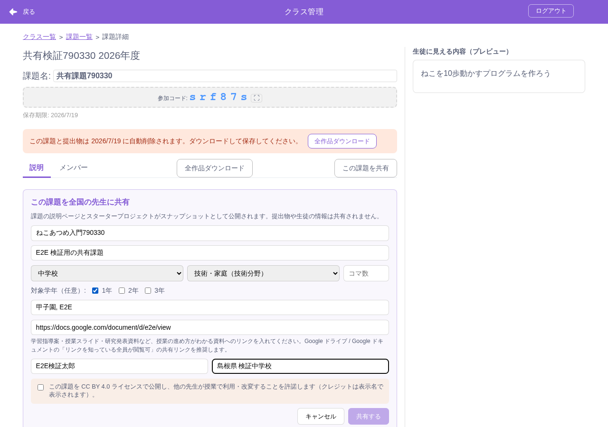
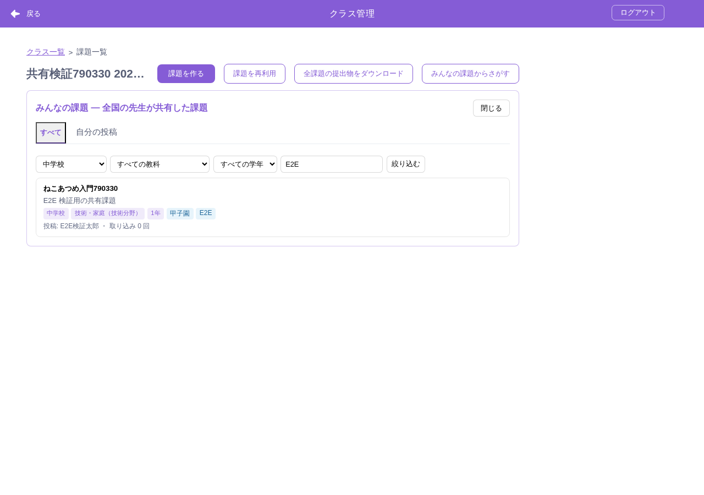
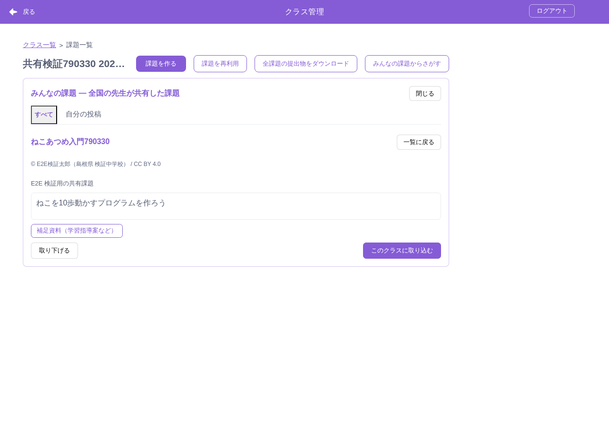
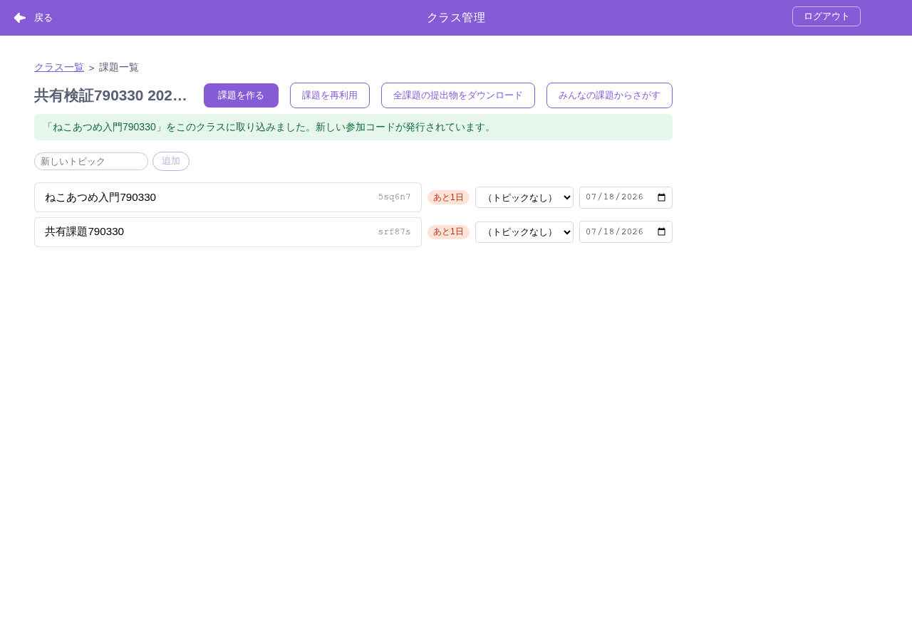
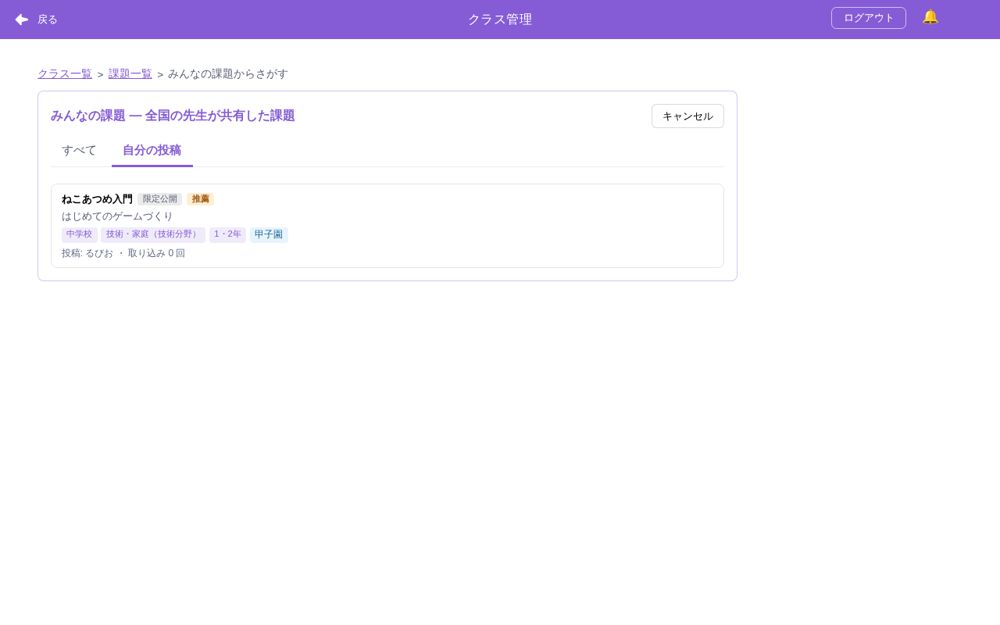
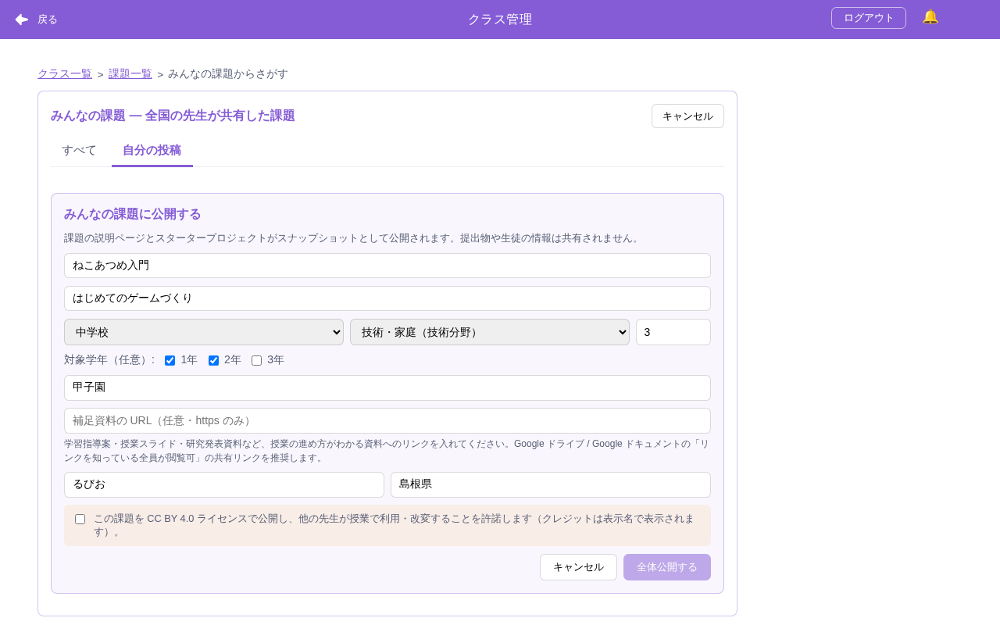

# みんなの課題（共有課題ライブラリ）

> **🆕 Smalruby 独自** — upstream に存在しない、Smalruby のために新規追加された機能

先生が自分で作成した課題（説明ページ + スタータープロジェクト + 補足資料 URL）を**インターネットを通じて全国の先生に共有し、再利用できる**仕組み。他の先生は共有された課題を閲覧・絞り込みし、自分のクラスに取り込むとスタータープロジェクトごと読み込まれ、そのまま授業を進められる。

設計の正典: EPIC #1066 / スパイク #1067 の Decision Log（D1〜D12）。

## 目次

| ドキュメント | 内容 |
|-------------|------|
| 本 README | 機能全体像・主要ファイル・設定 |
| [運用手順書](operations.md) | 通報対応（モデレーション）の運用者向け手順 |
| [../classroom/architecture.md](../classroom/architecture.md) | API ルート・データモデル（「みんなの課題」セクション） |
| [../classroom/testing.md](../classroom/testing.md) | data-testid 一覧（`shared-*`） |

## 全体像

```text
先生A（共有する側）                          先生B（使う側）
課題詳細 →「この課題を共有」                  課題ボード →「みんなの課題からさがす」
  タイトル・属性（学校種×学年×教科×タグ）        カタログ（新着順・絞り込み）
  補足資料URL（指導案など・https のみ）    →     詳細（説明ページ・© 表示名 / CC BY 4.0）
  表示名・所属 / CC BY 4.0 同意                  「このクラスに取り込む」→ 授業開始
```

- **閲覧・投稿とも先生ログイン必須**（D1）
- **ライセンスは CC BY 4.0 に統一**（D2）: 投稿時に同意、クレジットは表示名。取り込み後の改変・授業利用は自由
- **共有はスナップショット**: 投稿後にクラス側の課題を変えても共有側は変わらない（更新は「自分の投稿」から上書き、D10）。取り込みも独立コピー（元の更新に追従しない）
- **共有データは保存期限（TTL）の対象外**（D7・永続）。クラス機能の 90 日 TTL とは分離
- **プロフィールは最小限**（D6）: 表示名（必須）+ 所属表記（任意）のみ。メール・実名は保持しない
- **補足資料 URL**（D4）: https のみ。入力時に「学習指導案・授業スライドなど授業の進め方がわかる資料（Google ドライブ / ドキュメントの閲覧リンク推奨）」と明示し、閲覧側は外部ドメイン名付きの確認を挟む
- **モデレーションは事後対応型**（D3）: 通報 → 運用 CLI で unpublish（[operations.md](operations.md)）。Admin SPA（EPIC #1073）完成後は管理画面に移行

## 画面

### 共有フォーム（課題詳細 →「この課題を共有」）



### カタログ（課題ボード →「みんなの課題からさがす」）



### 詳細プレビュー（クレジット・補足資料リンク・取り込み）



### 取り込み完了（ボードに新しい課題として出現）



## 限定公開と運営の推薦（#1109 / #1110）

共有時に**公開範囲**を選べる: `public`（みんなの課題カタログ）/ `limited`（**合言葉限定公開** — 参加コード同型の合言葉を知っている人だけが取り込める内輪公開。CC BY 同意・属性・著者名は任意）。

```text
限定公開（合言葉・内輪）→ Admin が把握（限定公開タブ）→ 推薦 → 先生が全体公開に広げる
```

- **推薦（Admin）**: 運営が Admin SPA から「推薦する」と、`recommendedAt`/`recommendedBy` が付き、**作成した先生へお知らせセンター（#1111・`link.kind='shared-mine'`）で通知**が届く。取り消しは通知なし（audit のみ）
- **推薦印（先生）**: 「自分の投稿」のカードに「推薦」バッジ（限定公開バッジと並ぶ）。詳細には推薦済みの注記
- **全体公開への発展（先生）**: 自分の限定公開の詳細に「**みんなの課題に公開する**」。共有フォームが**編集モード**（既存メタデータが初期値）で開き、全体公開に必要な属性・著者名・**CC BY 4.0 同意（改めて必須）**を揃えて送信すると `PATCH visibility: 'public'` でカタログに載る
- 推薦通知をクリックすると「自分の投稿」へ直接ジャンプする（クラス未選択ならアクティブな先頭クラスを開いてから表示）

### 自分の投稿の推薦バッジ



### 全体公開フォーム（編集モード）



## 主要ファイル

### バックエンド（infra/smalruby-classroom）

| ファイル | 役割 |
|---------|------|
| `lambda/handler.ts` | `/shared-assignments` 系 7 エンドポイント（共有・一覧・詳細・取り込み・更新・取り下げ・通報）、タクソノミ/URL/プロフィールのバリデータ、`buildSharedSnapshot` |
| `lambda/shared-admin-lib.ts` | 通報対応 CLI の純粋ロジック |
| `bin/shared-assignments-admin.ts` | 通報対応 CLI（dry-run 既定） |
| `lib/classroom-stack.ts` | `SharedAssignments`（TTL なし・prod RETAIN + PITR・GSI×2）/ `SharedAssignmentReports`（TTL 90日）/ 専用バケット（lifecycle なし） |

### フロントエンド（packages/scratch-gui）

| ファイル | 役割 |
|---------|------|
| `src/components/classroom-modal/shared-assignment-form.jsx` | 共有フォーム（属性・URL ガイダンス・CC BY 同意） |
| `src/components/classroom-modal/shared-assignment-catalog.jsx` | カタログ（一覧・絞り込み・詳細・取り込み・自分の投稿・通報） |
| `src/containers/use-shared-assignments.js` | 共有/カタログの状態管理フック |
| `src/lib/shared-assignment-taxonomy.js` | 学校種×教科の語彙（サーバーのミラー）+ parseTags |
| `src/lib/shared-author-profile.js` | プロフィールの localStorage 永続化 |
| `src/lib/classroom-api.js` | API クライアント（shared 系 7 メソッド） |

## 設定・データ永続化

| 種別 | キー / 変数 | 内容 |
|------|------------|------|
| localStorage | `smalruby:sharedAuthorProfile` | 表示名・所属表記の記憶 |
| env（Lambda） | `SHARE_DAILY_LIMIT`（既定 10）/ `REPORT_DAILY_LIMIT`（既定 20） | 1日あたりの共有 / 通報回数制限 |
| env（Lambda） | `SHARED_STARTER_MAX_BYTES`（既定 50MB） | 共有スターターの容量上限 |

## テスト

- unit: `lambda/tests/handler-shared-assignments.test.ts`（API 25件）/ `shared-admin-lib.test.ts`（CLI 6件）/ GUI `shared-assignment-form/catalog/taxonomy/author-profile`（24件）
- E2E: `tools/playwright-verify/verify-assignment-sharing.mjs`（共有 → カタログ → 取り込み → 自分の投稿の通し。`LOCALE=ja-JP` で日本語スクリーンショット）
