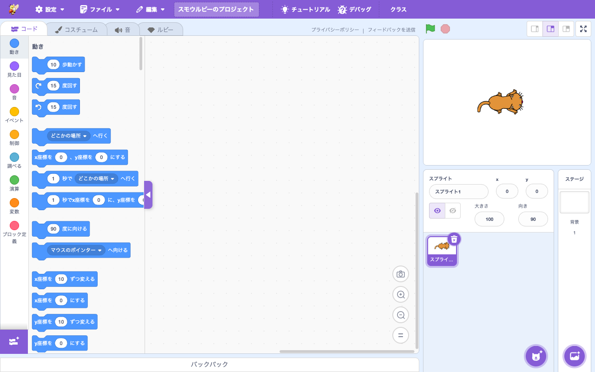

# ブロックエディタ

> **🔧 upstream 改良** — upstream にあるが Smalruby で機能を改良・拡張している
> **改良点**: ① Ruby 対応ブロックを定義 (`define-ruby-blocks.js`)。② スタックブロックのジェスチャー復旧 (`blocks-gesture-recovery.js`)。③ ブロックスクリーンショット (`blocks-screenshot.js`)。④ ブロックパレット表示の Smalruby 独自トグル (palette-toggle)。⑤ ブロック表示モーダル (block-display-modal) で表示モードを切替可能。

## 概要

Smalruby のメインのブロックプログラミング画面。upstream の Scratch Blocks (Blockly fork) を基盤に、Ruby ↔ Blocks 変換のための拡張、Smalruby 独自ブロック、UI 改善（パレット表示切替、ジェスチャー復旧、スクリーンショット）を加えている。

## ユーザーストーリー

- **小学生**として、ブロックを組み合わせてプログラムを作りたい
- **教師**として、生徒のブロックプログラムを画像で記録・共有したい
- **モバイル/iPad ユーザー**として、ブロックパレットの表示を切替えてステージを広く使いたい
- **何度も操作する子**として、ドラッグ中のブロックが固まったり消えたりしないでほしい
- **作品を発表する子**として、変数モニターをステージ上に表示してデータを見せたい

## UI / 操作フロー

### ワークスペース

- 左カラムに **ブロックパレット** (カテゴリ別に整理されたブロック)
- 中央に **ワークスペース** (ブロックを組み立てる領域)
- ステージ上に **変数モニター** が表示される

### カスタムブロック (Custom Procedures)

- 「自分で作る」カテゴリから「ブロックを作る」を選択
- カスタムブロック定義モーダル (`custom-procedures`) で名前・引数・形を定義

### ブロックスクリーンショット

- 右クリック → 「スクリプトの画像を保存」で `.png` ダウンロード

### ブロック表示モーダル

- ブロックの表示形態（コンパクト・通常・拡大）を切替

## 主要ファイル

### scratch-gui

#### コアコンポーネント

| ファイル | 役割 |
|---|---|
| `packages/scratch-gui/src/containers/blocks.jsx` | ブロックワークスペース (Blockly) のコンテナ |
| `packages/scratch-gui/src/lib/blocks.js` | scratch-blocks 設定 + Smalruby マーカー（gesture recovery）|
| `packages/scratch-gui/src/lib/make-toolbox-xml.js` | ツールボックス XML 生成 (Smalruby 改良含む) |
| `packages/scratch-gui/src/containers/custom-procedures.jsx` | カスタムブロック定義 |

#### Smalruby 独自追加

| ファイル | 役割 |
|---|---|
| `packages/scratch-gui/src/lib/define-ruby-blocks.js` | Ruby 対応ブロックの定義 |
| `packages/scratch-gui/src/lib/blocks-gesture-recovery.js` | ドラッグ中のブロックが固まった場合の復旧ロジック |
| `packages/scratch-gui/src/lib/blocks-screenshot.js` | ブロックの画像化 |
| `packages/scratch-gui/src/components/blocks-screenshot-button/` | スクリーンショットボタン UI |
| `packages/scratch-gui/src/components/block-display-modal/` | ブロック表示モード切替モーダル |
| `packages/scratch-gui/src/containers/block-display-modal.jsx` | ブロック表示モーダル コンテナ |
| `packages/scratch-gui/src/components/palette-toggle/` | パレット表示切替ボタン |
| `packages/scratch-gui/src/reducers/palette-visibility.js` | パレット表示 state |
| `packages/scratch-gui/src/reducers/block-display.js` | ブロック表示モード state |

#### モニター (変数表示)

| ファイル | 役割 |
|---|---|
| `packages/scratch-gui/src/containers/monitor.jsx` | 単一モニター |
| `packages/scratch-gui/src/containers/monitor-list.jsx` | モニター一覧 |
| `packages/scratch-gui/src/containers/list-monitor.jsx` | リストモニター |
| `packages/scratch-gui/src/containers/slider-monitor.jsx` | スライダーモニター |
| `packages/scratch-gui/src/lib/monitor-adapter.js` | モニター値変換 |

### scratch-vm

ブロック実行エンジン本体。Smalruby マーカーは少なく、主に `serialization/smalruby-migration.js`（Mesh v1 → v2 マイグレーション）程度。

### infra

なし。

## upstream との差分（マーカー）

主な Smalruby マーカーは `docs/maintenance/smalruby-markers-gui.md` 参照：

- `src/lib/blocks.js` — gesture recovery import + install

## 関連ブロック

ブロックエディタ自体はすべての標準ブロックと拡張機能ブロックを扱う。**カテゴリ**:

- 動き / 見た目 / 音 / イベント / 制御 / 調べる / 演算 / 変数 / リスト / ブロック定義（カスタム）
- 拡張機能 (Mesh v2, Smalrubot S1, micro:bit More など) を追加するとカテゴリが追加される

> 各ブロックの詳細は [`docs/smalruby-language-spec.ja.md`](../smalruby-language-spec.ja.md) を参照。

## 設定・データ永続化

### Redux state

- `block-display` — ブロック表示モード
- `palette-visibility` — パレット表示
- `monitor-layout` / `monitors` — モニターのレイアウトと値
- `toolbox` — ツールボックスの状態
- `workspace-metrics` — ワークスペースのスクロール・ズーム
- `extension-filter` — ブロックパレットでの拡張機能フィルタ

## 関連ドキュメント

- [`docs/ruby-editor/`](../ruby-editor/) — Ruby ↔ Blocks 変換
- [`docs/smalruby-language-spec.ja.md`](../smalruby-language-spec.ja.md) — 言語仕様（ブロック詳細）
- [`docs/mobile-ui/`](../mobile-ui/) — モバイル時のパレット表示
- `docs/maintenance/smalruby-markers-gui.md` — upstream マーカー一覧

## 関連 Issue / PR

主要 PR は履歴を参照（`feat:.*block` で grep）。
