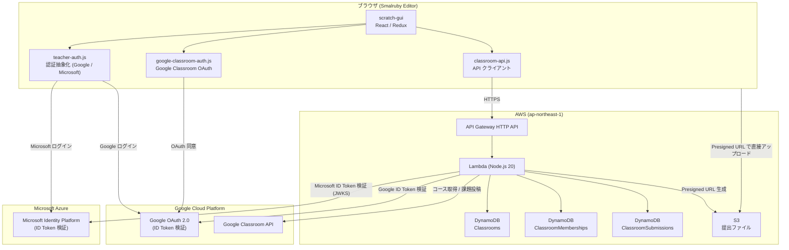
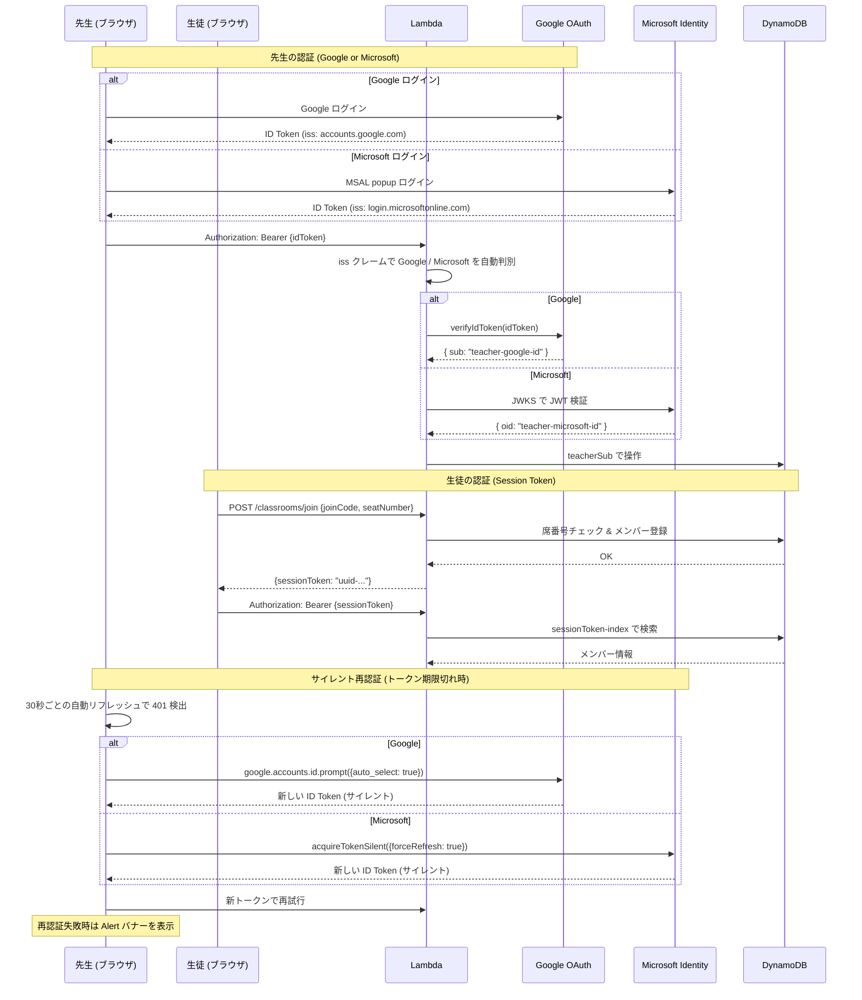
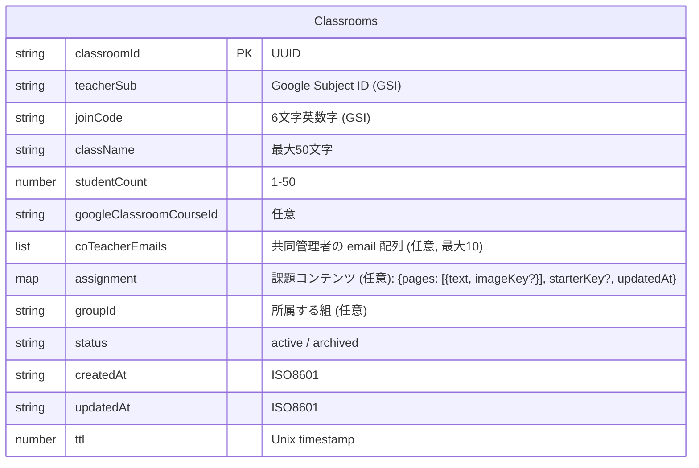
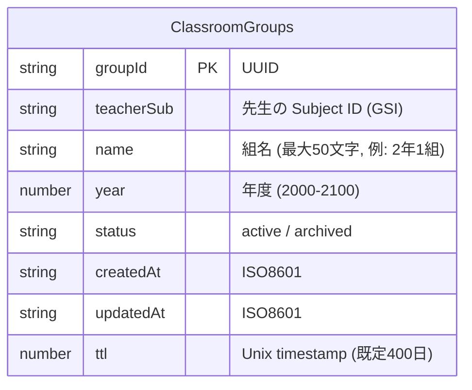

# システム構成

## 全体アーキテクチャ



## 認証フロー



### 先生セッション管理

| 項目 | 内容 |
|------|------|
| 認証方式 | Google ID Token (JWT) または Microsoft ID Token (JWT) |
| 有効期限 | 1時間（Google / Microsoft 共通）。stg は `ID_TOKEN_MAX_AGE_SECONDS` で短縮可 |
| サイレント再認証 | Google: `auto_select: true`（FedCM 10分制限あり）、Microsoft: `acquireTokenSilent({ forceRefresh: true })` |
| 再認証失敗時 | Alert バナー「セッションが無効になりました。」+ 「参加しなおす」ボタン |
| 自動リフレッシュ | 30秒ごとにメンバー情報を更新（`refreshMembersOnly`、詳細パネルの状態は保持） |

### 生徒セッション管理

| 項目 | 内容 |
|------|------|
| 認証方式 | Session Token (UUID)、DynamoDB に保存 |
| 有効期限 | 90日（stg は 1日）。verify-session ごとに TTL を延長 |
| セッション期限切れ時 | Alert バナー + 「参加しなおす」ボタンで参加コード入力画面に戻る |

## AWS サービス

| サービス | リソース名 | 用途 |
|---------|-----------|------|
| **API Gateway** | `ClassroomApi-{stage}` | HTTP API エンドポイント |
| **Lambda** | `ClassroomHandler-{stage}` | ビジネスロジック (Node.js 20, 256MB, 30秒) |
| **DynamoDB** | `Classrooms-{stage}` | クラス情報 |
| **DynamoDB** | `ClassroomMemberships-{stage}` | メンバー (生徒) 情報 |
| **DynamoDB** | `ClassroomSubmissions-{stage}` | 提出情報 |
| **S3** | `smalruby-classroom-submissions-{stage}` | 提出ファイル (.sb3, サムネイル, スクリーンショット) |
| **Route53** | A レコード | カスタムドメイン |
| **ACM** | SSL 証明書 | HTTPS |
| **CloudWatch Logs** | `/aws/lambda/ClassroomHandler-{stage}` | ログ (stg: 1週間, prod: 1ヶ月) |

### カスタムドメイン

| Stage | ドメイン |
|-------|---------|
| stg | `stg.classroom.api.smalruby.app` |
| prod | `classroom.api.smalruby.app` |

## GCP サービス

| サービス | 用途 |
|---------|------|
| **Google OAuth 2.0** | 先生のログイン (ID Token 発行・検証) |
| **Google Classroom API** | コース一覧取得、生徒数取得、課題投稿 |

### Google Classroom API スコープ

| スコープ | 用途 |
|---------|------|
| `classroom.courses.readonly` | コース一覧の取得 |
| `classroom.rosters.readonly` | 生徒名簿の取得 (人数カウントのみ) |
| `classroom.coursework.students` | 課題の作成・投稿 |

## API ルート

### 先生用 (Google ID Token 認証)

| Method | Path | 説明 |
|--------|------|------|
| `POST` | `/classrooms` | クラス作成 |
| `GET` | `/classrooms` | クラス一覧 |
| `GET` | `/classrooms/{id}` | クラス詳細 |
| `PATCH` | `/classrooms/{id}` | クラス更新 |
| `DELETE` | `/classrooms/{id}` | クラス削除 (アーカイブ) |
| `GET` | `/classrooms/{id}/co-teachers` | 共同管理者一覧 (`{ownerSub, coTeacherEmails}`) |
| `POST` | `/classrooms/{id}/co-teachers` | 共同管理者を email で招待 (`{email}`)。冪等・最大10・email 形式検証 |
| `DELETE` | `/classrooms/{id}/co-teachers/{email}` | 共同管理者を解除 |
| `GET` | `/classrooms/{id}/members` | メンバー一覧 (kicked 行は除外) |
| `DELETE` | `/classrooms/{id}/members/{memberId}` | メンバー削除 = ソフト kick (1h tombstone を残し、`kicked: true` をマーク)。verify-session が 410 reason='kicked' を返せるようにするための仕様。lookup の takenSeats も即座に空く |
| `GET` | `/classrooms/{id}/kick-requests` | 退室リクエスト一覧 (Issue #692) |
| `POST` | `/classrooms/{id}/kick-requests/{requestId}/approve` | 承認 = `handleDeleteMember` (= kick) + 同席への全リクエスト削除 |
| `DELETE` | `/classrooms/{id}/kick-requests/{requestId}` | 却下 = リクエストのみ削除、メンバーは残る |
| `GET` | `/classrooms/{id}/submissions` | 提出一覧 (ダウンロード URL 付き) |
| `PATCH` | `/classrooms/{id}/submissions/{subId}` | 提出の返却・コメント |
| `PUT` | `/classrooms/{id}/assignment` | 課題コンテンツの設定・更新（ページ + スターター。画像/スターターの Presigned upload URL を返す。空 body で削除） |
| `POST` | `/classroom-groups` | 組（グループ）の作成（name, year） |
| `GET` | `/classroom-groups` | 自分の組一覧（active + archived） |
| `PATCH` | `/classroom-groups/{groupId}` | 組のリネーム・年度変更・アーカイブ/復帰 |
| `POST` | `/classrooms/{id}/duplicate` | クラス（授業）の複製。課題コンテンツの S3 オブジェクトもコピー。`groupId` / `className` / `assignmentName` を上書き可。メンバー・提出は複製しない |

### 生徒用 (認証不要 / Session Token)

| Method | Path | 認証 | 説明 |
|--------|------|------|------|
| `POST` | `/classrooms/lookup` | 不要 | 参加コードでクラス検索 |
| `POST` | `/classrooms/lookup/kick-request` | 不要 | 「使用中の席」を空けてもらう依頼を先生に送信 (Issue #692) |
| `POST` | `/classrooms/join` | 不要 | クラスに参加 (→ sessionToken 取得) |
| `POST` | `/classrooms/verify-session` | Session Token | セッション検証 + 提出状況取得。kick された生徒には 410 + `{reason: 'kicked', joinCode, className, seatNumber}` を返す |
| `POST` | `/classrooms/{id}/submissions` | Session Token | 提出 (Presigned URL 取得) |
| `DELETE` | `/classrooms/{id}/members/me` | Session Token | 自主退出 |
| `GET` | `/classrooms/{id}/assignment` | Session Token または 先生 ID Token | 課題コンテンツ取得（ページ + 画像/スターターのダウンロード URL）。lookup / join / verify-session は `hasAssignment` フラグを返す |

### Google Classroom 連携 (ID Token + Access Token)

| Method | Path | 説明 |
|--------|------|------|
| `GET` | `/classrooms/google-courses` | Google Classroom のコース一覧 |
| `POST` | `/classrooms/google-import` | コースをインポートしてクラス作成 |
| `POST` | `/classrooms/{id}/google-assignment` | Google Classroom に課題を投稿 |

## データモデル

### Classrooms テーブル



**GSI:**
- `joinCode-index` — 参加コードでの検索
- `teacherSub-index` — 先生のクラス一覧（owner 分）

### 共同管理（co-teacher）

1 つのクラスを作成者（`teacherSub`）に加えて複数の先生で共同管理できる。

- 招待は **email** で行い `coTeacherEmails: string[]`（正規化: 小文字）に保持する。ログイン前の相手も指定でき、Google / Microsoft の混在も可。
- 先生トークン検証 (`verifyTeacherIdToken`) は `{sub, email}` を返す。Google は `email_verified` のときのみ email を採用、Microsoft は `email` / `preferred_username`。
- 所有権判定は `canManageClassroom(classroom, identity)` = 「`teacherSub === sub` または `coTeacherEmails` に自分の email が含まれる」。全ての先生向け操作で使用。co-teacher は owner と**完全同等**（クラス削除・共同管理者の追加/解除も可）。
- 作成者は `teacherSub` で管理され `coTeacherEmails` には含めないため、co-teacher API から作成者を外すことはできない（管理者ゼロを防止）。
- `GET /classrooms` は owner 分（`teacherSub-index`）と co-taught 分（`coTeacherEmails` への Scan + `contains` フィルタ）の和集合。DynamoDB はリスト属性を GSI 化できないため Scan を使用。Classrooms テーブルは小規模（単一組織・90日 TTL）のため許容。各クラスは `role`（owner / co-teacher）を返し、フロントの「共同管理」バッジに使う。

### ClassroomMemberships テーブル

```mermaid
erDiagram
    ClassroomMemberships {
        string classroomId PK "UUID"
        string memberId SK "seat-NN (ゼロ埋め)"
        string displayName "最大20文字"
        string role "student"
        string sessionToken "UUID (GSI)"
        string joinedAt "ISO8601"
        string lastActiveAt "ISO8601"
        number ttl "Unix timestamp"
    }
```

**GSI:**
- `sessionToken-index` — セッショントークンでの認証

### ClassroomKickRequests テーブル (Issue #692)

```mermaid
erDiagram
    ClassroomKickRequests {
        string classroomId PK "UUID"
        string requestId SK "UUID"
        number seatNumber "1-50"
        string reason "任意・最大200文字"
        string sourceIpHash "abuse trace用 (sha256 16桁)"
        string createdAt "ISO8601"
        number ttl "Unix timestamp (1h)"
    }
```

**GSI:**
- `classroomId-seatNumber-index` — 承認時に同席への全リクエストを batch-delete するため

短命 (TTL 1 時間) のレコード。生徒が「使用中の席を空けてください」と先生に依頼するときに作成される。同一席への複数依頼を許容する仕様 (規制なし)。

### Memberships の kick tombstone (Issue #692)

`handleDeleteMember` (= 教師 kick) は **行を物理削除しない**:
- `kicked: true, kickedAt, kickJoinCode, kickClassName, kickSeatNumber, ttl: now+1h` をセット
- これにより、kick された生徒の次回 `verify-session` 呼出で 410 reason='kicked' を返せる
- `listMembers` / `lookup takenSeats` は `FilterExpression: attribute_not_exists(kicked) OR kicked <> :true` で tombstone を除外
- `joinClassroom` の `ConditionExpression: attribute_not_exists(memberId) OR kicked = :true` で新生徒が kicked 行を上書き可能 (tombstone はその時点で消滅)

### ClassroomSubmissions テーブル

```mermaid
erDiagram
    ClassroomSubmissions {
        string classroomId PK "UUID"
        string submissionId SK "UUID"
        string memberId "seat-NN (GSI)"
        string projectName "最大100文字"
        string s3Key "S3 オブジェクトキー"
        string thumbnailS3Key "サムネイル S3 キー"
        number screenshotCount "0-20"
        string status "submitted / returned"
        string submittedAt "ISO8601"
        string updatedAt "ISO8601"
        string teacherComment "最大500文字"
        number ttl "Unix timestamp"
    }
```

**GSI:**
- `classroomId-memberId-index` — 生徒ごとの提出検索

### ClassroomGroups テーブル（組）



**GSI:** `teacherSub-index` — 先生の組一覧

組（グループ）は**先生側の管理概念**で、1つの学級（組）が年間の複数の授業（クラス）を束ねる。生徒には見えない（生徒のモデル = 授業ごとの参加コード + 匿名席番号は不変）。

- 組は生徒の作品を持たないため、90日ではなく**長期 TTL（既定400日 ≈ 年度 + バッファ、`GROUP_TTL_DAYS`）**
- 組のアーカイブは表示上の整理。授業データ自体は 90 日 TTL で自然消滅する
- 所有は作成者のみ（`teacherSub` 一致）。co-teacher は組を共有しない（共同管理はクラス単位のまま）
- **前回コメント再掲**: 組に属するクラスに生徒が join すると、同じ組の直近の授業（最大3回分遡る）で同じ席に返却されたコメントが `previousComment` として join レスポンスに載る（連休明けの個別リキャップ用）

### 課題コンテンツ（assignment）

クラス（= 授業）には任意で**課題コンテンツ**を持たせられる。先生が編集し、参加済みの生徒が読む。プログラム配付を自動化するための仕組み（生徒は参加するだけで課題とスターターが手に入る）。

- `pages`: （数行テキスト + 画像1枚）× 最大10ページ。テキストは1ページ500文字まで
- `starterKey`: スタータープロジェクト（.sb3）の S3 キー。1課題に1つ
- 画像は `image/png` / `image/jpeg` のみ。オブジェクトは `{classroomId}/assignment/` プレフィックスに置かれ、編集で参照されなくなったものは best-effort で削除される
- `PUT` は `pages` の各要素に `newImage`（新規アップロード。MIME 指定）か `imageKey`（既存維持）を指定し、`newStarter` / `keepStarter` でスターターを制御する。レスポンスの Presigned URL にクライアントが直接 PUT する（提出フローと同型）
- `GET` は生徒（Session Token）と先生（ID Token）の両対応。トークンに `.` を含むかで判別する（Session Token は UUID、ID Token は JWT）

### S3 オブジェクト構造

```
smalruby-classroom-submissions-{stage}/
  {classroomId}/
    assignment/
      image-{uuid}.png|.jpg  ← 課題ページの画像
      starter-{uuid}.sb3     ← スタータープロジェクト
    {submissionId}/
      project.sb3           ← Scratch 3 プロジェクトファイル
      thumbnail.png          ← プロジェクトサムネイル
      screenshot-0.png       ← スクリーンショット (0-indexed)
      screenshot-1.png
      ...
```

## TTL (自動削除)

| 項目 | 有効期間 (prod) | 有効期間 (stg) |
|------|----------------|---------------|
| クラス | 90日 | 1日 |
| メンバー | クラスと同じ | クラスと同じ |
| 提出 | クラスと同じ | クラスと同じ |
| S3 ファイル | クラスと同じ (ライフサイクルルール) | クラスと同じ |

## CORS

| Stage | 許可オリジン |
|-------|------------|
| stg | `https://smalruby.app`, `https://smalruby.jp`, `http://localhost:8601` |
| prod | `https://smalruby.app`, `https://smalruby.jp` |

許可ヘッダー: `Content-Type`, `Authorization`, `X-Google-Access-Token`

## レート制限

参加エンドポイント (`/classrooms/lookup`, `/classrooms/join`) にはIPベースのレート制限があります。

| 項目 | prod | stg |
|------|------|-----|
| ウィンドウ | 60秒 | 30秒 |
| 最大リクエスト数 | 50回 | 100回 |
| 実装方式 | Lambda インメモリ Map | 同左 |
