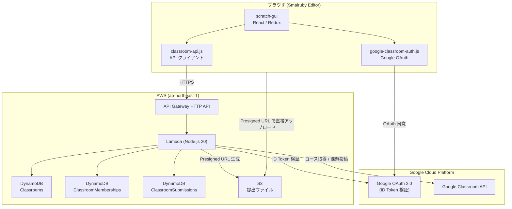
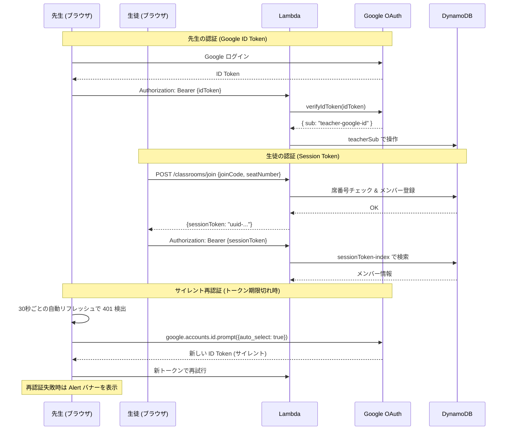
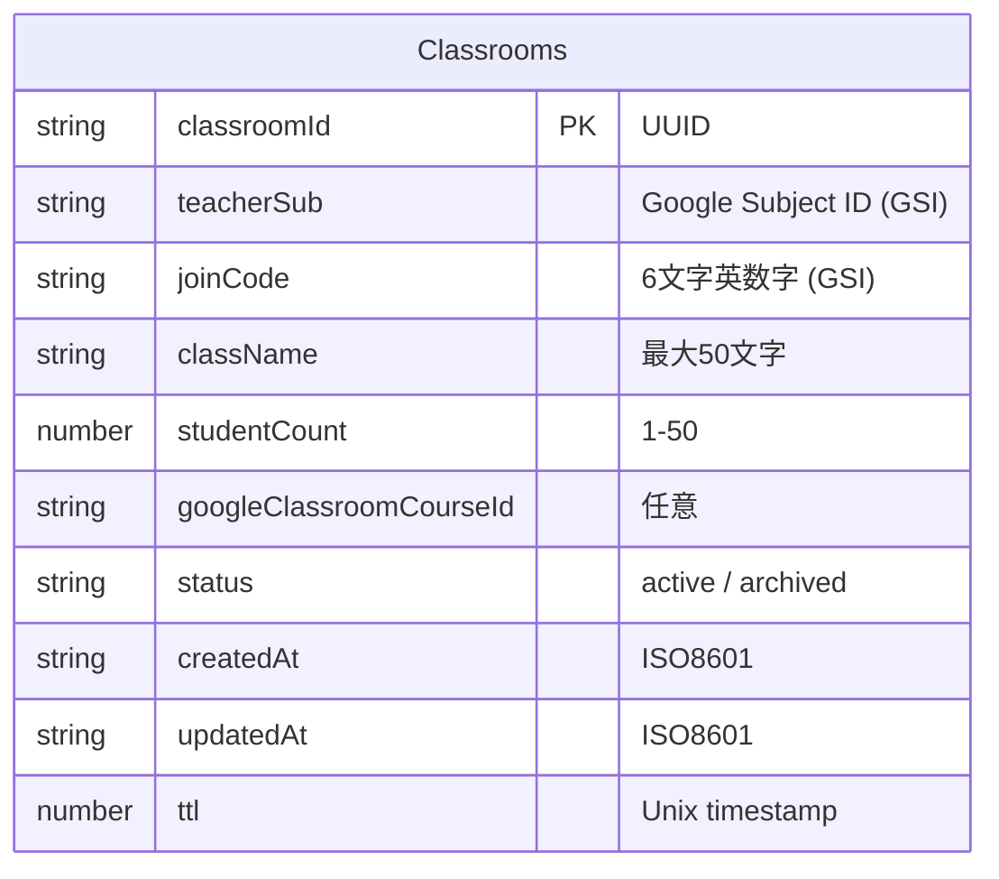

# システム構成

## 全体アーキテクチャ



## 認証フロー



### 先生セッション管理

| 項目 | 内容 |
|------|------|
| 認証方式 | Google ID Token (JWT) |
| 有効期限 | 1時間（Google 標準）。stg は `ID_TOKEN_MAX_AGE_SECONDS` で短縮可 |
| サイレント再認証 | `auto_select: true` で透過的にトークン更新（FedCM 10分制限あり） |
| 再認証失敗時 | Alert バナー「セッションが無効になりました。」+ 「参加しなおす」ボタン |
| 自動リフレッシュ | 30秒ごとにメンバー情報を更新（`refreshMembersOnly`、詳細パネルの状態は保持） |

### 生徒セッション管理

| 項目 | 内容 |
|------|------|
| 認証方式 | Session Token (UUID)、DynamoDB に保存 |
| 有効期限 | 30日（stg は 1日）。verify-session ごとに TTL を延長 |
| セッション期限切れ時 | Alert バナー + 「参加しなおす」ボタンで参加コード入力画面に戻る |

## AWS サービス

| サービス | リソース名 | 用途 |
|---------|-----------|------|
| **API Gateway** | `ClassroomApi-{stage}` | HTTP API エンドポイント |
| **Lambda** | `ClassroomHandler-{stage}` | ビジネスロジック (Node.js 20, 256MB, 30秒) |
| **DynamoDB** | `Classrooms-{stage}` | クラス情報 |
| **DynamoDB** | `ClassroomMemberships-{stage}` | メンバー (生徒) 情報 |
| **DynamoDB** | `ClassroomSubmissions-{stage}` | 提出情報 |
| **S3** | `smalruby-classroom-submissions-{stage}` | 提出ファイル (.sb3, サムネイル, スクリーンショット) |
| **Route53** | A レコード | カスタムドメイン |
| **ACM** | SSL 証明書 | HTTPS |
| **CloudWatch Logs** | `/aws/lambda/ClassroomHandler-{stage}` | ログ (stg: 1週間, prod: 1ヶ月) |

### カスタムドメイン

| Stage | ドメイン |
|-------|---------|
| stg | `stg.classroom.api.smalruby.app` |
| prod | `classroom.api.smalruby.app` |

## GCP サービス

| サービス | 用途 |
|---------|------|
| **Google OAuth 2.0** | 先生のログイン (ID Token 発行・検証) |
| **Google Classroom API** | コース一覧取得、生徒数取得、課題投稿 |

### Google Classroom API スコープ

| スコープ | 用途 |
|---------|------|
| `classroom.courses.readonly` | コース一覧の取得 |
| `classroom.rosters.readonly` | 生徒名簿の取得 (人数カウントのみ) |
| `classroom.coursework.students` | 課題の作成・投稿 |

## API ルート

### 先生用 (Google ID Token 認証)

| Method | Path | 説明 |
|--------|------|------|
| `POST` | `/classrooms` | クラス作成 |
| `GET` | `/classrooms` | クラス一覧 |
| `GET` | `/classrooms/{id}` | クラス詳細 |
| `PATCH` | `/classrooms/{id}` | クラス更新 |
| `DELETE` | `/classrooms/{id}` | クラス削除 (アーカイブ) |
| `GET` | `/classrooms/{id}/members` | メンバー一覧 |
| `DELETE` | `/classrooms/{id}/members/{memberId}` | メンバー削除 |
| `GET` | `/classrooms/{id}/submissions` | 提出一覧 (ダウンロード URL 付き) |
| `PATCH` | `/classrooms/{id}/submissions/{subId}` | 提出の返却・コメント |

### 生徒用 (認証不要 / Session Token)

| Method | Path | 認証 | 説明 |
|--------|------|------|------|
| `POST` | `/classrooms/lookup` | 不要 | 参加コードでクラス検索 |
| `POST` | `/classrooms/join` | 不要 | クラスに参加 (→ sessionToken 取得) |
| `POST` | `/classrooms/verify-session` | Session Token | セッション検証 + 提出状況取得 |
| `POST` | `/classrooms/{id}/submissions` | Session Token | 提出 (Presigned URL 取得) |
| `DELETE` | `/classrooms/{id}/members/me` | Session Token | 自主退出 |

### Google Classroom 連携 (ID Token + Access Token)

| Method | Path | 説明 |
|--------|------|------|
| `GET` | `/classrooms/google-courses` | Google Classroom のコース一覧 |
| `POST` | `/classrooms/google-import` | コースをインポートしてクラス作成 |
| `POST` | `/classrooms/{id}/google-assignment` | Google Classroom に課題を投稿 |

## データモデル

### Classrooms テーブル



**GSI:**
- `joinCode-index` — 参加コードでの検索
- `teacherSub-index` — 先生のクラス一覧

### ClassroomMemberships テーブル

```mermaid
erDiagram
    ClassroomMemberships {
        string classroomId PK "UUID"
        string memberId SK "seat-NN (ゼロ埋め)"
        string displayName "最大20文字"
        string role "student"
        string sessionToken "UUID (GSI)"
        string joinedAt "ISO8601"
        string lastActiveAt "ISO8601"
        number ttl "Unix timestamp"
    }
```

**GSI:**
- `sessionToken-index` — セッショントークンでの認証

### ClassroomSubmissions テーブル

```mermaid
erDiagram
    ClassroomSubmissions {
        string classroomId PK "UUID"
        string submissionId SK "UUID"
        string memberId "seat-NN (GSI)"
        string projectName "最大100文字"
        string s3Key "S3 オブジェクトキー"
        string thumbnailS3Key "サムネイル S3 キー"
        number screenshotCount "0-20"
        string status "submitted / returned"
        string submittedAt "ISO8601"
        string updatedAt "ISO8601"
        string teacherComment "最大500文字"
        number ttl "Unix timestamp"
    }
```

**GSI:**
- `classroomId-memberId-index` — 生徒ごとの提出検索

### S3 オブジェクト構造

```
smalruby-classroom-submissions-{stage}/
  {classroomId}/
    {submissionId}/
      project.sb3           ← Scratch 3 プロジェクトファイル
      thumbnail.png          ← プロジェクトサムネイル
      screenshot-0.png       ← スクリーンショット (0-indexed)
      screenshot-1.png
      ...
```

## TTL (自動削除)

| 項目 | 有効期間 (prod) | 有効期間 (stg) |
|------|----------------|---------------|
| クラス | 30日 | 1日 |
| メンバー | クラスと同じ | クラスと同じ |
| 提出 | クラスと同じ | クラスと同じ |
| S3 ファイル | クラスと同じ (ライフサイクルルール) | クラスと同じ |

## CORS

| Stage | 許可オリジン |
|-------|------------|
| stg | `https://smalruby.app`, `https://smalruby.jp`, `http://localhost:8601` |
| prod | `https://smalruby.app`, `https://smalruby.jp` |

許可ヘッダー: `Content-Type`, `Authorization`, `X-Google-Access-Token`

## レート制限

参加エンドポイント (`/classrooms/lookup`, `/classrooms/join`) にはIPベースのレート制限があります。

| 項目 | prod | stg |
|------|------|-----|
| ウィンドウ | 60秒 | 30秒 |
| 最大リクエスト数 | 50回 | 100回 |
| 実装方式 | Lambda インメモリ Map | 同左 |
