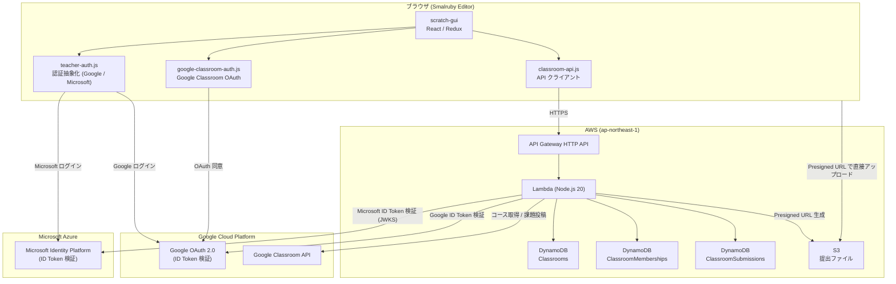
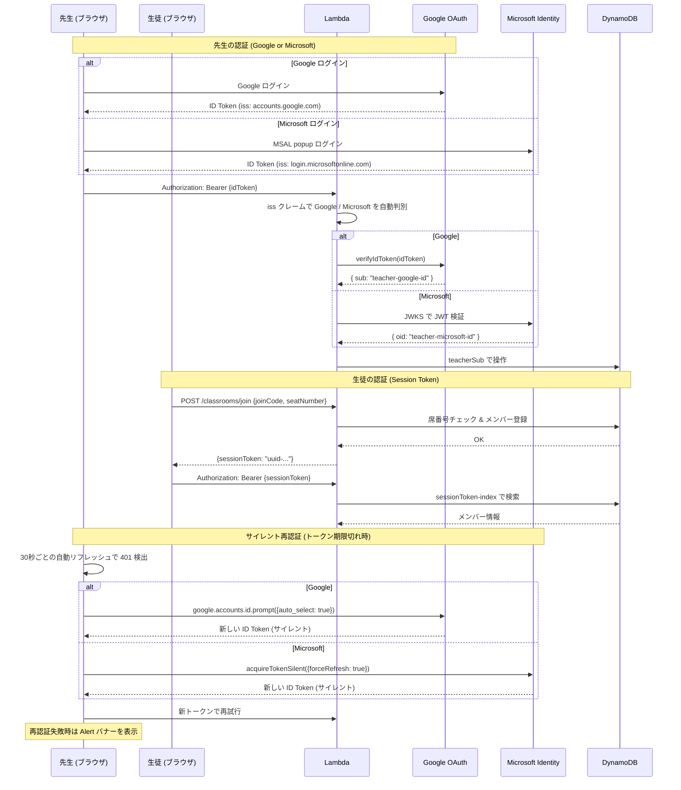
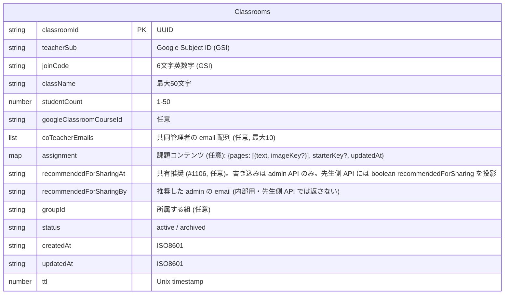
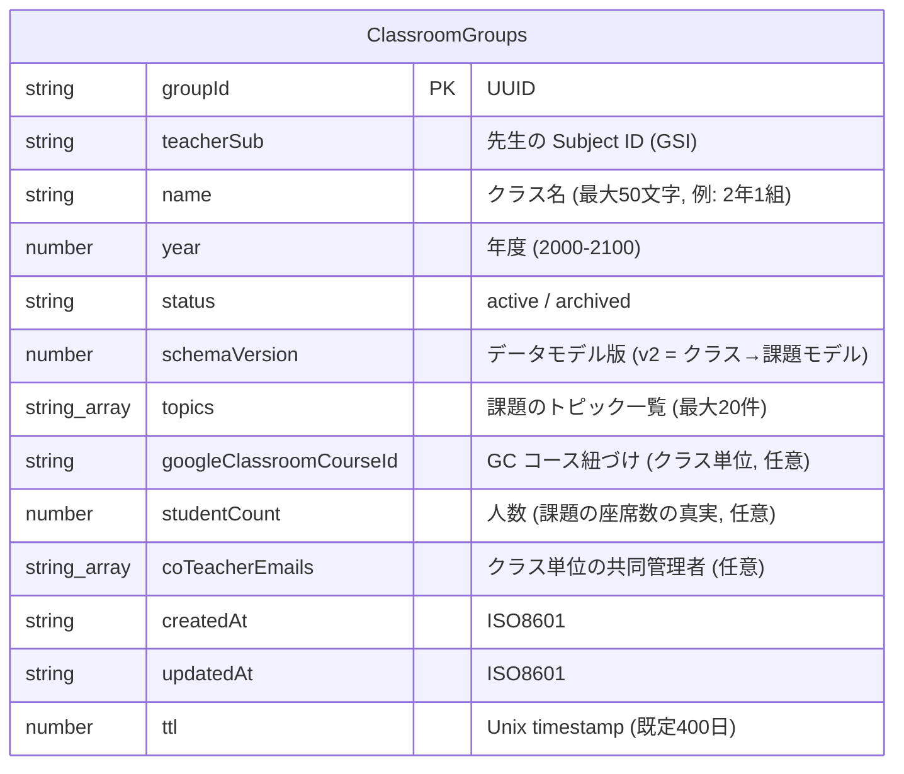

# システム構成

## 全体アーキテクチャ



## 認証フロー



### 先生セッション管理

| 項目 | 内容 |
|------|------|
| 認証方式 | Google ID Token (JWT) または Microsoft ID Token (JWT) |
| 有効期限 | 1時間（Google / Microsoft 共通）。stg は `ID_TOKEN_MAX_AGE_SECONDS` で短縮可 |
| サイレント再認証 | Google: `auto_select: true`（FedCM 10分制限あり）、Microsoft: `acquireTokenSilent({ forceRefresh: true })` |
| 再認証失敗時 | Alert バナー「セッションが無効になりました。」+ 「参加しなおす」ボタン |
| 自動リフレッシュ | 30秒ごとにメンバー情報を更新（`refreshMembersOnly`、詳細パネルの状態は保持） |

### 生徒セッション管理

| 項目 | 内容 |
|------|------|
| 認証方式 | Session Token (UUID)、DynamoDB に保存 |
| 有効期限 | 90日（stg は 1日）。verify-session ごとに TTL を延長 |
| セッション期限切れ時 | Alert バナー + 「参加しなおす」ボタンで参加コード入力画面に戻る |

## AWS サービス

| サービス | リソース名 | 用途 |
|---------|-----------|------|
| **API Gateway** | `ClassroomApi-{stage}` | HTTP API エンドポイント |
| **Lambda** | `ClassroomHandler-{stage}` | ビジネスロジック (Node.js 22, 256MB, 30秒) |
| **Lambda** | `ClassroomArchiver-{stage}` | DynamoDB Streams の REMOVE を S3 へスナップショット（下記「削除スナップショットと長期保持」） |
| **DynamoDB** | `Classrooms-{stage}` | クラス情報（Streams: OLD_IMAGE） |
| **DynamoDB** | `ClassroomMemberships-{stage}` | メンバー (生徒) 情報（Streams: OLD_IMAGE） |
| **DynamoDB** | `ClassroomSubmissions-{stage}` | 提出情報（Streams: OLD_IMAGE） |
| **DynamoDB** | `ClassroomGroups-{stage}` | クラス（学級）情報（Streams: OLD_IMAGE） |
| **DynamoDB** | `SharedAssignments-{stage}` | みんなの課題（TTL なし・prod RETAIN + PITR） |
| **DynamoDB** | `SharedAssignmentReports-{stage}` | みんなの課題の通報（TTL 90日） |
| **DynamoDB** | `ClassroomNotifications-{stage}` | お知らせ（EPIC #1111。TTL は書き手の admin スタックが付与・既定 180 日） |
| **S3** | `smalruby-shared-assignments-{stage}` | 共有課題のスナップショット（lifecycle なし = 永続・prod RETAIN） |
| **S3** | `smalruby-classroom-submissions-{stage}` | 提出ファイル (.sb3, サムネイル, スクリーンショット) + `ddb-archive/` スナップショット。lifecycle = `ARCHIVE_RETENTION_DAYS`（既定 365 日） |
| **Route53** | A レコード | カスタムドメイン |
| **ACM** | SSL 証明書 | HTTPS |
| **CloudWatch Logs** | `/aws/lambda/ClassroomHandler-{stage}` / `/aws/lambda/ClassroomArchiver-{stage}` | ログ (stg: 1週間, prod: 1ヶ月) |

### カスタムドメイン

| Stage | ドメイン |
|-------|---------|
| stg | `stg.classroom.api.smalruby.app` |
| prod | `classroom.api.smalruby.app` |

## GCP サービス

| サービス | 用途 |
|---------|------|
| **Google OAuth 2.0** | 先生のログイン (ID Token 発行・検証) |
| **Google Classroom API** | コース一覧取得、生徒数取得、課題投稿 |

### Google Classroom API スコープ

| スコープ | 用途 |
|---------|------|
| `classroom.courses.readonly` | コース一覧の取得 |
| `classroom.rosters.readonly` | 生徒名簿の取得 (人数カウントのみ) |
| `classroom.coursework.students` | 課題の作成・投稿 |

## API ルート

### 先生用 (Google ID Token 認証)

| Method | Path | 説明 |
|--------|------|------|
| `POST` | `/classrooms` | クラス作成 |
| `GET` | `/classrooms` | クラス一覧（既定は active のみ。`?includeArchived=1` でアーカイブ済みも返す。各要素に `status` を含む） |
| `GET` | `/classrooms/{id}` | クラス詳細 |
| `PATCH` | `/classrooms/{id}` | クラス更新。`{status: 'active'}` でアーカイブ済み課題の復元も行う |
| `DELETE` | `/classrooms/{id}` | クラス削除 (アーカイブ)。soft-delete でメンバー・提出メタ・S3 は保持され、PATCH で復元可能。生徒の遮断は status ガード（join / lookup / verify-session / 提出がすべて非 active を拒否） |
| `GET` | `/classrooms/{id}/co-teachers` | 共同管理者一覧 (`{ownerSub, coTeacherEmails}`) |
| `POST` | `/classrooms/{id}/co-teachers` | 共同管理者を email で招待 (`{email}`)。冪等・最大10・email 形式検証 |
| `DELETE` | `/classrooms/{id}/co-teachers/{email}` | 共同管理者を解除 |
| `GET` | `/classrooms/{id}/members` | メンバー一覧 (kicked 行は除外) |
| `DELETE` | `/classrooms/{id}/members/{memberId}` | メンバー削除 = ソフト kick (1h tombstone を残し、`kicked: true` をマーク)。verify-session が 410 reason='kicked' を返せるようにするための仕様。lookup の takenSeats も即座に空く |
| `GET` | `/classrooms/{id}/kick-requests` | 退室リクエスト一覧 (Issue #692) |
| `POST` | `/classrooms/{id}/kick-requests/{requestId}/approve` | 承認 = `handleDeleteMember` (= kick) + 同席への全リクエスト削除 |
| `DELETE` | `/classrooms/{id}/kick-requests/{requestId}` | 却下 = リクエストのみ削除、メンバーは残る |
| `GET` | `/classrooms/{id}/submissions` | 提出一覧 (ダウンロード URL 付き) |
| `PATCH` | `/classrooms/{id}/submissions/{subId}` | 提出の返却・コメント |
| `PUT` | `/classrooms/{id}/assignment` | 課題コンテンツの設定・更新（ページ + スターター。画像/スターターの Presigned upload URL を返す。空 body で削除） |
| `POST` | `/classroom-groups` | クラス（学級）の作成（name, year, 任意で studentCount / googleClassroomCourseId） |
| `GET` | `/classroom-groups` | 自分のクラス一覧（active + archived、共同管理分は role=co-teacher で合流） |
| `PATCH` | `/classroom-groups/{groupId}` | クラスのリネーム・年度変更・人数・GC 紐づけ・共同管理者・アーカイブ/復帰 |
| `POST` | `/classroom-groups/migrate` | v1→v2 冪等 bulk migration（未所属課題のクラス自動作成・割当 + フィールド引き上げ） |
| `PATCH` | `/classroom-groups/{groupId}/topics` | トピックの add / remove / rename（rename・remove は課題へ一括追従） |
| `POST` | `/classrooms/{id}/duplicate` | クラス（授業）の複製。課題コンテンツの S3 オブジェクトもコピー。`groupId` / `className` / `assignmentName` を上書き可。メンバー・提出は複製しない |
| `POST` | `/classrooms/{id}/evaluate` | AI 評価支援。静的解析結果（シグナル + 擬似コード）を Anthropic API にリレーし、`mode: grade` は S/A/B/C 案 + 根拠 + needsReview、`mode: comment` は生徒向けポジティブコメント下書きを返す。1リクエスト最大10提出（API GW の30秒制限対策、クライアントがチャンク分割）。先生ごとにレート制限（既定 60回/時） |
| `GET` | `/notifications` | お知らせ一覧（EPIC #1111）。自分宛て（teacherSub）の直近 50 件 + `unreadCount` を返す。書き込みは admin スタックのみ（単一ライター） |
| `POST` | `/notifications/mark-read` | お知らせ既読化。`{notificationIds?}` — 省略時は一覧窓（直近 50 件）の未読を全既読化（パネルを開いたらバッジが消える UX） |

### みんなの課題 (共有課題ライブラリ・先生 ID Token 認証)

全国の先生が課題（説明ページ + スターター + 補足資料 URL）を共有・再利用する機能（EPIC #1066。設計の正典は spike #1067）。

| Method | Path | 説明 |
|--------|------|------|
| `POST` | `/shared-assignments` | 課題を共有。`visibility`（省略時 `public`）で公開範囲を選ぶ。`public`=みんなの課題カタログ（CC BY 4.0 同意・属性・著者名 必須）。`limited`=合言葉限定公開（#1109。同意・属性・著者名は任意で、参加コード同型の合言葉を発行）。スターター 50MB 上限・10件/日制限 |
| `GET` | `/shared-assignments` | カタログ一覧（新着順・`schoolLevel`/`subject`/`grade`/`tag` で絞り込み・`cursor` ページネーション・`mine=1` で自分の投稿一覧）。**公開カタログは限定公開を除外**。`mine=1` は自分の合言葉を含む |
| `GET` | `/shared-assignments/{id}` | 詳細（ページ・画像/スターターの presigned URL・投稿者表示名。authorSub は返さない）。**限定公開は sharedId を知っていても非著者には 404**（合言葉ルックアップ経由でのみアクセス） |
| `POST` | `/shared-assignments/lookup` | 合言葉プレビュー（#1109）。`{passcode}` → summary（**sharedId は返さない**） |
| `POST` | `/shared-assignments/import-by-passcode` | 合言葉で取り込み（#1109）。`{passcode, groupId, assignmentName?}` → 自分のクラスに課題として取り込み。sharedId を露出しない内輪取り込み |
| `POST` | `/shared-assignments/{id}/import` | 自分のクラス（groupId）に課題として取り込み（**全体公開のみ**。限定公開は import-by-passcode を使う）。S3 逆コピー + reuseCount 増分 |
| `PATCH` | `/shared-assignments/{id}` | 更新（投稿者本人のみ。メタデータ + `classroomId` 指定で内容の再スナップショット=上書き）。**`visibility` を `limited`→`public` に広げる時は CC BY 同意・属性・著者名を必須化** |
| `DELETE` | `/shared-assignments/{id}` | 取り下げ = `status: 'unlisted'`（物理削除しない。本人のみ） |
| `POST` | `/shared-assignments/{id}/report` | 通報（理由必須・20件/日制限。reporterSub は内部保持のみ） |

- **公開範囲（#1109）**: 項目は `visibility`（`public`/`limited`）を持つ。#1109 以前の項目は属性を持たず `public` とみなす（後方互換）。`limited` は `passcode`（合言葉）を持ち、公開カタログには出ない。「限定公開（合言葉・内輪）→ Admin が把握 → 推薦 → 全体公開」パイプラインの土台
- **Admin 推薦（#1110）**: 項目は `recommendedAt` / `recommendedBy`（admin email）を持ちうる。書き込みは admin API（`POST/DELETE /admin/shared-assignments/{id}/recommend`）のみ。先生側 API には boolean の `recommended` だけを投影（`recommendedBy` は内部情報）。推薦時は著者へお知らせ（#1111・type `shared_recommended`・`link.kind='shared-mine'`）が飛ぶ
- データ: `SharedAssignments{suffix}`（**TTL なし・prod は RETAIN + PITR**。GSI: `status-createdAt-index` / `authorSub-createdAt-index` / `passcode-index`（合言葉ルックアップ・#1109））、`SharedAssignmentReports{suffix}`（TTL 90日）
- ファイル: 専用バケット `smalruby-shared-assignments{suffix}`（**lifecycle なし = 永続**、`shared/{sharedId}/` プレフィックス）。クラス側の保存期限と完全に分離
- 共有/取り込みの実体は既存 duplicate と同じ S3 サーバー側コピー（クロスバケット）

### 生徒用 (認証不要 / Session Token)

| Method | Path | 認証 | 説明 |
|--------|------|------|------|
| `POST` | `/classrooms/lookup` | 不要 | 参加コードでクラス検索 |
| `POST` | `/classrooms/lookup/kick-request` | 不要 | 「使用中の席」を空けてもらう依頼を先生に送信 (Issue #692) |
| `POST` | `/classrooms/join` | 不要 | クラスに参加 (→ sessionToken 取得) |
| `POST` | `/classrooms/verify-session` | Session Token | セッション検証 + 提出状況取得。kick された生徒には 410 + `{reason: 'kicked', joinCode, className, seatNumber}` を返す。クラスが非 active（アーカイブ/期限切れ）なら 401 |
| `POST` | `/classrooms/{id}/submissions` | Session Token | 提出 (Presigned URL 取得)。クラスが非 active なら 404 |
| `DELETE` | `/classrooms/{id}/members/me` | Session Token | 自主退出 |
| `GET` | `/classrooms/{id}/assignment` | Session Token または 先生 ID Token | 課題コンテンツ取得（ページ + 画像/スターターのダウンロード URL）。lookup / join / verify-session は `hasAssignment` フラグを返す |

### Google Classroom 連携 (ID Token + Access Token)

| Method | Path | 説明 |
|--------|------|------|
| `GET` | `/classrooms/google-courses` | Google Classroom のコース一覧 |
| `POST` | `/classrooms/google-import` | コースをインポートしてクラス作成 |
| `POST` | `/classrooms/{id}/google-assignment` | Google Classroom に課題を投稿 |

## データモデル

### Classrooms テーブル



**GSI:**
- `joinCode-index` — 参加コードでの検索
- `teacherSub-index` — 先生のクラス一覧（owner 分）

### 共同管理（co-teacher）

1 つのクラスを作成者（`teacherSub`）に加えて複数の先生で共同管理できる。

- 招待は **email** で行い `coTeacherEmails: string[]`（正規化: 小文字）に保持する。ログイン前の相手も指定でき、Google / Microsoft の混在も可。
- 先生トークン検証 (`verifyTeacherIdToken`) は `{sub, email}` を返す。Google は `email_verified` のときのみ email を採用、Microsoft は `email` / `preferred_username`。
- 所有権判定は `canManageClassroom(classroom, identity)` = 「`teacherSub === sub` または `coTeacherEmails` に自分の email が含まれる」。全ての先生向け操作で使用。co-teacher は owner と**完全同等**（クラス削除・共同管理者の追加/解除も可）。
- 作成者は `teacherSub` で管理され `coTeacherEmails` には含めないため、co-teacher API から作成者を外すことはできない（管理者ゼロを防止）。
- `GET /classrooms` は次の 3 つの和集合: owner 分（`teacherSub-index`）、課題単位の co-taught 分（課題の `coTeacherEmails` への Scan + `contains` フィルタ）、**クラス単位で共同管理しているクラスに属する課題**（共同管理クラスを Scan で引き、各クラスの所有者の `teacherSub-index` を `groupId` でフィルタ）。DynamoDB はリスト属性を GSI 化できないため Scan を使用。Classrooms テーブルは小規模（単一組織・90日 TTL）のため許容。各クラスは `role`（owner / co-teacher）を返し、フロントの「共同管理」バッジに使う。
- **クラス（組）単位の共同管理**の判定は `canManageGroup(group, identity)` = 「`teacherSub === sub` または クラスの `coTeacherEmails` に自分の email が含まれる」。クラス単位の共同管理者は、そのクラスの中では owner と同等に振る舞える（課題の一覧・作成・更新・複製・トピック管理・クラス設定の編集）。**例外はクラスの共同管理者リストそのもの**（`PATCH /classroom-groups/{groupId}` の `coTeacherEmails`）で、これは owner のみ変更できる（共同管理者が勝手に招待・自己解除できないようにするため）。
- email 比較は判定関数間で常に正規化（trim + 小文字）して行うため、大文字小文字が違っても共同管理者として認識される。
- 所有者でも共同管理者でもない先生には、クラスの存在を秘匿して **404 `Group not found`** を返す。

### ClassroomMemberships テーブル

```mermaid
erDiagram
    ClassroomMemberships {
        string classroomId PK "UUID"
        string memberId SK "seat-NN (ゼロ埋め)"
        string displayName "最大20文字"
        string role "student"
        string sessionToken "UUID (GSI)"
        string joinedAt "ISO8601"
        string lastActiveAt "ISO8601"
        number ttl "Unix timestamp"
    }
```

**GSI:**
- `sessionToken-index` — セッショントークンでの認証

### ClassroomKickRequests テーブル (Issue #692)

```mermaid
erDiagram
    ClassroomKickRequests {
        string classroomId PK "UUID"
        string requestId SK "UUID"
        number seatNumber "1-50"
        string reason "任意・最大200文字"
        string sourceIpHash "abuse trace用 (sha256 16桁)"
        string createdAt "ISO8601"
        number ttl "Unix timestamp (1h)"
    }
```

**GSI:**
- `classroomId-seatNumber-index` — 承認時に同席への全リクエストを batch-delete するため

短命 (TTL 1 時間) のレコード。生徒が「使用中の席を空けてください」と先生に依頼するときに作成される。同一席への複数依頼を許容する仕様 (規制なし)。

### Memberships の kick tombstone (Issue #692)

`handleDeleteMember` (= 教師 kick) は **行を物理削除しない**:
- `kicked: true, kickedAt, kickJoinCode, kickClassName, kickSeatNumber, ttl: now+1h` をセット
- これにより、kick された生徒の次回 `verify-session` 呼出で 410 reason='kicked' を返せる
- `listMembers` / `lookup takenSeats` は `FilterExpression: attribute_not_exists(kicked) OR kicked <> :true` で tombstone を除外
- `joinClassroom` の `ConditionExpression: attribute_not_exists(memberId) OR kicked = :true` で新生徒が kicked 行を上書き可能 (tombstone はその時点で消滅)

### ClassroomNotifications テーブル（お知らせ・EPIC #1111）

```mermaid
erDiagram
    ClassroomNotifications {
        string teacherSub PK "宛先の先生 (Google/Microsoft sub)"
        string notificationId SK "createdAt ISO + '#' + UUID (時系列ソート)"
        string type "admin_message など (リンク種別の意味付け)"
        string title "最大100文字"
        string body "最大1000文字"
        map link "任意: {kind: 'classroom', classroomId} — クリック時のジャンプ先"
        string readAt "既読日時 (未読は属性なし)"
        string createdBy "送信した admin の email (内部用・API では返さない)"
        string createdAt "ISO8601"
        number ttl "Unix timestamp (既定180日)"
    }
```

**GSI なし** — 宛先 (PK) への Query だけで受信箱になる。

- **単一ライター**: 書き込みは admin スタック（`POST /admin/notifications`、名前規約 import + write-only grant）のみ。classroom API は一覧と既読化だけを提供するので、エディタ側からお知らせを偽造できない
- 宛先の `teacherSub` は admin SPA に出さず、admin API が classroomId から解決する
- `link.kind` は whitelist（現在 `classroom` のみ）。エディタは未知の kind を無視する（前方互換）
- GUI は先生モーダルのタイトルバー 🔔 から一覧を開く。パネルを開いた時点で mark-read（全件）が走りバッジが消える。60 秒間隔でポーリング

### ClassroomSubmissions テーブル

```mermaid
erDiagram
    ClassroomSubmissions {
        string classroomId PK "UUID"
        string submissionId SK "UUID"
        string memberId "seat-NN (GSI)"
        string projectName "最大100文字"
        string s3Key "S3 オブジェクトキー"
        string thumbnailS3Key "サムネイル S3 キー"
        number screenshotCount "0-20"
        string status "submitted / returned"
        string submittedAt "ISO8601"
        string updatedAt "ISO8601"
        string teacherComment "最大500文字"
        number ttl "Unix timestamp"
    }
```

**GSI:**
- `classroomId-memberId-index` — 生徒ごとの提出検索

### ClassroomGroups テーブル（クラス = 学級。旧称: 組）



**GSI:** `teacherSub-index` — 先生のクラス一覧

クラス（Group）は**先生側の管理概念**で、1つの学級が年間の複数の課題（Classrooms レコード = 1授業）を束ねる。生徒には見えない（生徒のモデル = 課題ごとの参加コード + 匿名席番号は不変）。

- クラスは生徒の作品を持たないため、90日ではなく**長期 TTL（既定400日 ≈ 年度 + バッファ、`GROUP_TTL_DAYS`）**
- クラスのアーカイブは表示上の整理。課題データ自体は 90 日 TTL で自然消滅する
- **前回コメント再掲**: クラスに属する課題に生徒が join すると、同じクラスの直近の授業（最大3回分遡る）で同じ席に返却されたコメントが `previousComment` として join レスポンスに載る（連休明けの個別リキャップ用）

#### データモデル v2（クラス→課題モデル）

`schemaVersion: 2` = すべての課題がクラスに属し、クラス単位の GC 紐づけ・共同管理・人数が真実、という状態。Google Classroom の「クラス → 課題」構造に合わせた再構成で、既存データとは **冪等な bulk migration** で互換を取る:

- **`POST /classroom-groups/migrate`**（クラス一覧の初回表示時にクライアントが呼ぶ）: groupId の無い既存課題を className ごとに自動作成したクラスへ割当（年度は課題作成日の JST 4月区切りから推定、同名クラスがあれば再利用）。課題単位の GC courseId（最古優先・クラス側優先）/ coTeacherEmails（和集合）/ studentCount（最大値）をクラスへ引き上げ、schemaVersion=2 をスタンプ。移行済みデータでは何もしない
- **認可はクラス経由でも成立**（`canManageViaGroup` / `canManageGroup`）: クラスの所有者・クラス単位の共同管理者は、中のすべての課題を**一覧・作成・管理**できる（クラス単位の入口 `getManageableGroup` も同じ判定）。課題単位の旧 `coTeacherEmails` も引き続き有効（後方互換）
- **座席数はクラスの `studentCount` が真実**: 生徒の lookup / join はクラスの人数と課題側スナップショットの **max** を使う（人数を減らしても既存の着席と衝突しない増加方向のみの反映）
- **トピック**（`PATCH /classroom-groups/{groupId}/topics`、body `{action: add|remove|rename, name, to?}`）: クラスの `topics` 配列を管理。**rename / remove はクラス内の課題の `topic` へ一括追従**（rename は付け替え、remove は解除）。課題の作成・更新で新しいトピック名を使うとクラスの一覧へ自動追加される
- **AI 評価の日次上限**: 先生ごとに `EVAL_DAILY_LIMIT`（既定 50 呼び出し/日 ≈ フルクラスの採点+コメントで約 5 回分）を DynamoDB のアトミックカウンタ（`Classrooms` テーブルの予約キー `eval-quota#<teacherSub>#<日付>`、TTL 2 日）で永続的に強制。インスタンス内メモリの時間窓（`EVAL_RATE_LIMIT_*`）は高速な一次ゲートとして併用
- **課題の `topic` / `sortDate`**: `topic` はクラスのトピックへの文字列参照。`sortDate` は並び順キー（既定=作成日・意味なし・生徒非表示・自由変更可）で、課題管理画面はトピックごと・sortDate 降順に表示する

### AI 評価支援（evaluate）

先生の評価作業を支援する。**AI は判定者ではなく提案者**: 全結果に機械シグナルを引用した根拠と needsReview フラグが付き、先生が UI で確認・修正・承認してはじめて記録される。

- 入力: 課題名/課題文 + 評価軸（1〜6、grade モードのみ必須）+ 厳しさ（lenient/standard/strict）+ 較正サンプル（先生が採点した実例、最大5件）+ 提出（席番号・シグナル・擬似コード最大4000字）
- モデル: `CLAUDE_MODEL`（既定 claude-haiku-4-5）。システムプロンプトに prompt caching（ephemeral）を適用し、同一クラスのチャンク分割呼び出しでキャッシュを共有
- `ANTHROPIC_API_KEY` 未設定のステージではエンドポイントは 503（機能無効）
- CloudWatch に `classroom_evaluate` イベント（トークン数・キャッシュヒット）を構造化ログ出力

### 課題コンテンツ（assignment）

クラス（= 授業）には任意で**課題コンテンツ**を持たせられる。先生が編集し、参加済みの生徒が読む。プログラム配付を自動化するための仕組み（生徒は参加するだけで課題とスターターが手に入る）。

- `pages`: （数行テキスト + 画像1枚）× 最大10ページ。テキストは1ページ500文字まで
- `starterKey`: スタータープロジェクト（.sb3）の S3 キー。1課題に1つ
- 画像は `image/png` / `image/jpeg` のみ。オブジェクトは `{classroomId}/assignment/` プレフィックスに置かれ、編集で参照されなくなったものは best-effort で削除される
- `PUT` は `pages` の各要素に `newImage`（新規アップロード。MIME 指定）か `imageKey`（既存維持）を指定し、`newStarter` / `keepStarter` でスターターを制御する。レスポンスの Presigned URL にクライアントが直接 PUT する（提出フローと同型）
- `GET` は生徒（Session Token）と先生（ID Token）の両対応。トークンに `.` を含むかで判別する（Session Token は UUID、ID Token は JWT）

### S3 オブジェクト構造

```
smalruby-classroom-submissions-{stage}/
  {classroomId}/
    assignment/
      image-{uuid}.png|.jpg  ← 課題ページの画像
      starter-{uuid}.sb3     ← スタータープロジェクト
    {submissionId}/
      project.sb3           ← Scratch 3 プロジェクトファイル
      thumbnail.png          ← プロジェクトサムネイル
      screenshot-0.png       ← スクリーンショット (0-indexed)
      screenshot-1.png
      ...
```

## TTL (自動削除)

| 項目 | 有効期間 (prod) | 有効期間 (stg) |
|------|----------------|---------------|
| クラス | 90日 | 1日 |
| メンバー | クラスと同じ | クラスと同じ |
| 提出 | クラスと同じ | クラスと同じ |
| S3 ファイル | `ARCHIVE_RETENTION_DAYS`（365日。ライフサイクルルール） | 同（stg は 30日） |

ユーザーがアクセスできるのは **メタデータ（DynamoDB）が生きている TTL 期間内のみ**（presigned URL はメタデータからのみ発行される）。TTL 後〜`ARCHIVE_RETENTION_DAYS` の間は運用者のみが復元に使える（下記）。

## 削除スナップショットと長期保持（期限切れ復元の最後の砦）

「期限が切れたが、どうしても復元してほしい」という問い合わせに応えるための仕組み（EPIC #1049 D7）。

- `Classrooms` / `ClassroomMemberships` / `ClassroomSubmissions` / `ClassroomGroups` に DynamoDB Streams（OLD_IMAGE）を有効化。`ClassroomKickRequests`（1時間 TTL の一時データ）は対象外
- **`ClassroomArchiver-{stage}`** Lambda が REMOVE イベント（TTL 削除・明示削除の両方）を受け、削除されたアイテムを JSON で S3 に退避:
  - `ddb-archive/classrooms/{classroomId}.json`
  - `ddb-archive/memberships/{classroomId}/{memberId}.json`
  - `ddb-archive/submissions/{classroomId}/{submissionId}.json`
  - `ddb-archive/groups/{groupId}.json`
  - `eval-quota#` プレフィックスのカウンタ行はスキップ
- イベントソースは REMOVE のみのフィルタ + `bisectBatchOnError` + 有限リトライ（不正レコード 1 件で shard が詰まらない設計。S3 書き込み失敗のみ throw して再試行）
- S3 lifecycle は `ARCHIVE_RETENTION_DAYS`（既定 365 日、`CLASSROOM_TTL_DAYS` 以上必須 — スタックがガード）
- 復元手順は `docs/classroom/operations.md`（運用者向け）

## CORS

| Stage | 許可オリジン |
|-------|------------|
| stg | `https://smalruby.app`, `https://smalruby.jp`, `http://localhost:8601` |
| prod | `https://smalruby.app`, `https://smalruby.jp` |

許可ヘッダー: `Content-Type`, `Authorization`, `X-Google-Access-Token`

## レート制限

参加エンドポイント (`/classrooms/lookup`, `/classrooms/join`) にはIPベースのレート制限があります。

| 項目 | prod | stg |
|------|------|-----|
| ウィンドウ | 60秒 | 30秒 |
| 最大リクエスト数 | 50回 | 100回 |
| 実装方式 | Lambda インメモリ Map | 同左 |
