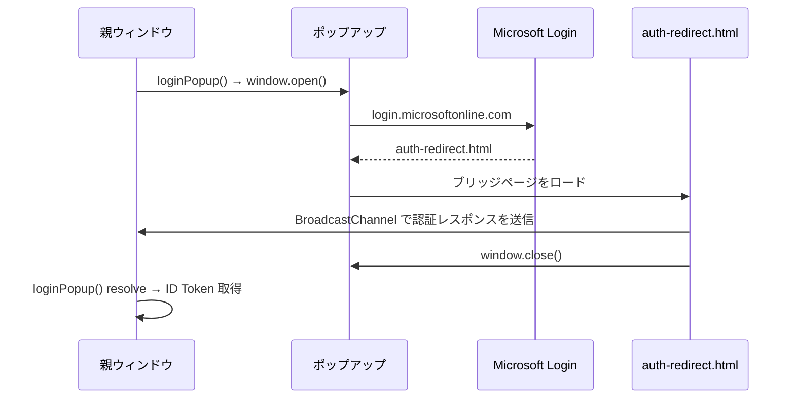

# Microsoft 認証

## 概要

Microsoft アカウントでの先生ログイン。MSAL.js (`@azure/msal-browser`) の popup フローを使用する。

## 認証フロー

### BroadcastChannel を使う理由

Microsoft のログインページは `Cross-Origin-Opener-Policy: same-origin` を送信するため、ポップアップの `window.opener` が `null` になる。`window.opener.postMessage()` が使えないため、MSAL v5 では同一オリジン内の BroadcastChannel API で認証レスポンスを転送する。

## リダイレクトブリッジページ

ポップアップの redirect_uri に指定する軽量ページ。フルアプリをロードせず、`broadcastResponseToMainFrame()` のみ実行する。

| ファイル | 役割 |
|---------|------|
| `legal/auth-redirect.html` | HTML（`<script src="auth-redirect.js">` のみ） |
| `src/playground/auth-redirect.js` | webpack エントリーポイント。`@azure/msal-browser/redirect-bridge` の `broadcastResponseToMainFrame()` を呼び出す |

親ウィンドウと同じ `@azure/msal-browser` パッケージからバンドルすることで、BroadcastChannel 名の一致を保証する。

## サイレント再認証

| プロバイダー | 方式 | 備考 |
|-------------|------|------|
| Google | `google.accounts.id.prompt({ auto_select: true })` | 新しい `iat` のトークンを取得可能 |
| Microsoft | `acquireTokenSilent({ forceRefresh: true })` | `exp`（1時間）まで `iat` は更新されない |

トークンの有効期限チェックは各プロバイダーのライブラリに委任する:
- Google: `google-auth-library` が `exp` を検証
- Microsoft: `jose` の `jwtVerify` が `exp` を検証

## ログアウト

| プロバイダー | 処理 |
|-------------|------|
| Google | ローカル state のクリア |
| Microsoft | MSAL sessionStorage の全エントリー削除 + MSAL インスタンスリセット |

ページリロード時は MSAL sessionStorage をクリアする（`cleanupOnReload()`）。

## バックエンド

`verifyTeacherIdToken()` が JWT の `iss` クレームで Google / Microsoft を自動判別する。

| issuer | 検証方法 | ユーザー識別子 |
|--------|---------|--------------|
| `accounts.google.com` | `google-auth-library` | `payload.sub` |
| `login.microsoftonline.com/*` | `jose` JWKS 検証 | `payload.oid` (fallback: `payload.sub`) |

Google の `sub`（数値文字列）と Microsoft の `oid`（UUID）は自然に衝突しないため、`teacherSub` フィールドをそのまま使用する。

## デバッグ

`window.smalruby.forceTeacher401()` — キャッシュされたトークンを壊して次の API コールで 401 を発生させる。モーダルを閉じて再度開くと silent reauth がトリガーされる。Google / Microsoft 共通。

## ファイル構成

| ファイル | 役割 |
|---------|------|
| `src/lib/teacher-auth.js` | 認証抽象化（login, reauth, logout の統一 API） |
| `src/lib/microsoft-auth.js` | MSAL.js ラッパー |
| `src/lib/google-classroom-auth.js` | Google Classroom API 用アクセストークン管理 |
| `src/playground/auth-redirect.js` | ブリッジページ用 webpack エントリーポイント |
| `legal/auth-redirect.html` | ブリッジページ HTML |
| `infra/smalruby-classroom/lambda/handler.ts` | `verifyTeacherIdToken()` |

## Azure Portal 設定

### リダイレクト URI（SPA タイプ）

| URI | 用途 |
|-----|------|
| `http://localhost:8601/auth-redirect.html` | ローカル開発 |
| `https://smalruby.app/auth-redirect.html` | 本番 |

### アプリケーション設定

| 項目 | 値 |
|------|-----|
| Application ID | `0cf0f36a-2ee8-4904-a31e-68e956197775` |
| サポートされるアカウント | 任意の組織 + 個人 |
| プラットフォーム | SPA |
