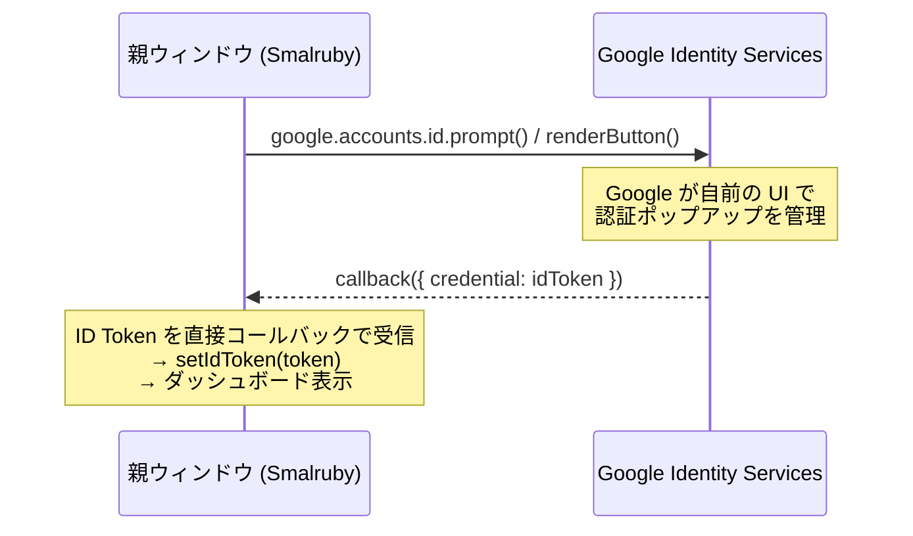
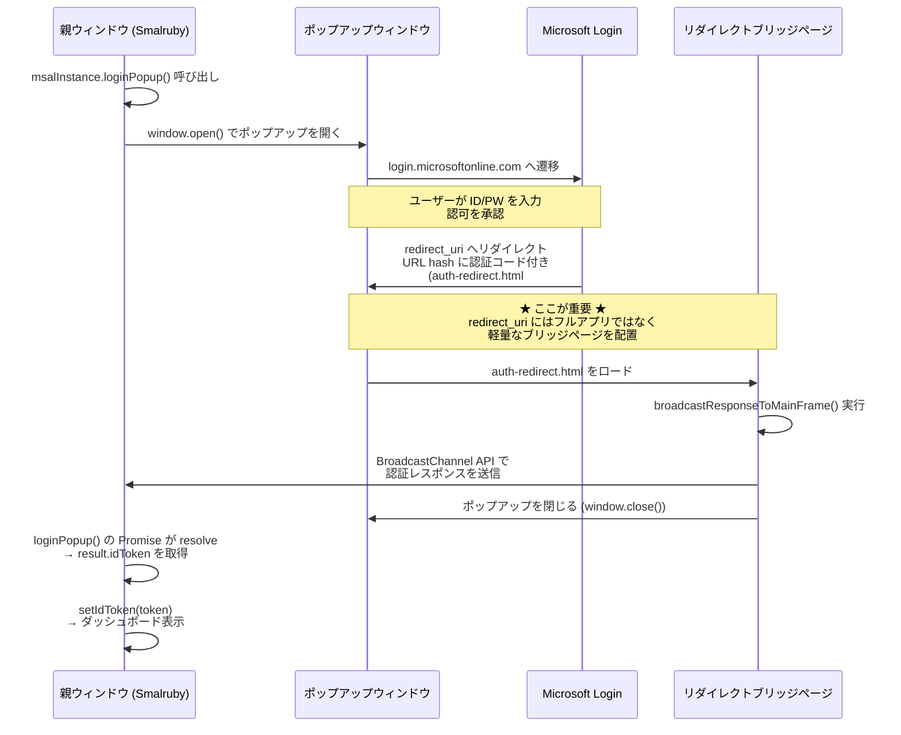
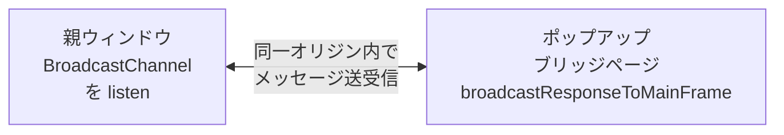

# Microsoft 認証フロー

## 概要

Microsoft アカウントでの先生ログインは、MSAL.js (`@azure/msal-browser`) の **popup フロー** を使用する。
Google ログインと同様にポップアップウィンドウでの認証だが、認証結果の受け渡し方法が異なる。

## Google ログインとの比較

### Google ログイン（現行）



**特徴**: Google Identity Services が認証 UI を完全管理。親ウィンドウの callback に直接 ID Token が渡される。リダイレクトは発生しない。

### Microsoft ログイン（MSAL.js popup フロー）



## 通信メカニズムの詳細

### なぜ BroadcastChannel が必要か

1. **COOP ヘッダー問題**: Microsoft のログインページは `Cross-Origin-Opener-Policy: same-origin` ヘッダーを送信する
2. これにより、ポップアップの `window.opener` が `null` になる（ブラウザのセキュリティ制約）
3. **従来の `window.opener.postMessage()` が使えない**
4. そのため、MSAL v5 では **BroadcastChannel API** を使って同一オリジン間でメッセージを送信する

### BroadcastChannel の仕組み



- `BroadcastChannel` はブラウザ内蔵の API（`window.postMessage` とは別）
- **同一オリジン**のすべてのウィンドウ/タブ間でメッセージをやり取りできる
- `window.opener` が `null` でも動作する

## リダイレクトブリッジページの要件

`auth-redirect.html` は以下の要件を満たす必要がある:

1. **フルアプリをロードしない** — React、webpack バンドルなどの重い JS を一切含まない
2. **MSAL ブリッジスクリプトのみ実行** — `broadcastResponseToMainFrame()` を呼び出す
3. **Azure Portal に SPA リダイレクト URI として登録** — `http://localhost:8601/auth-redirect.html` と `https://smalruby.app/auth-redirect.html`
4. **同一オリジンで配信** — 親ウィンドウと同じオリジン（`localhost:8601` や `smalruby.app`）

### auth-redirect.html の実装パターン

**パターン A: CDN から ESM import**

```html
<script type="module">
  import { broadcastResponseToMainFrame } from "https://esm.sh/@azure/msal-browser@5.6.3/redirect-bridge";
  broadcastResponseToMainFrame();
</script>
```

- メリット: 最もシンプル、バンドル不要
- デメリット: CDN 依存、バージョンの一致が必要

**パターン B: webpack でバンドルしたエントリーポイント**

```html
<script src="auth-redirect.js"></script>
```

- メリット: バージョン不一致がない、CDN 不要
- デメリット: webpack 設定の追加が必要

**パターン C: handleRedirectPromise() を直接呼ぶ**

```javascript
const msalInstance = new PublicClientApplication(config);
await msalInstance.initialize();
await msalInstance.handleRedirectPromise();
```

- メリット: `broadcastResponseToMainFrame` を使わずに MSAL 内部で処理
- デメリット: MSAL の完全な初期化が必要

## 現在の問題と調査事項

### 発生している問題

1. ポップアップが `/auth-redirect.html` にリダイレクトされる (**OK**)
2. ポップアップが閉じる (**OK**)
3. しかし、親ウィンドウの `loginPopup()` Promise が resolve しない (**NG**)
4. 結果として timed_out エラーになる

### 考えられる原因

| # | 原因候補 | 調査方法 |
|---|---------|---------|
| 1 | CDN から読み込んだ `broadcastResponseToMainFrame` のバージョン不一致 | auth-redirect.html のコンソールログを確認 |
| 2 | `broadcastResponseToMainFrame` が実行される前にポップアップが閉じている | auth-redirect.html に console.log を追加 |
| 3 | BroadcastChannel のチャネル名が親と不一致 | MSAL のソースコードでチャネル名を確認 |
| 4 | パターン B (webpack バンドル) に変更すべき | パターン B を実装して比較 |
| 5 | パターン C (handleRedirectPromise) の方が確実 | パターン C を実装して比較 |

### 推奨する調査手順

1. **auth-redirect.html にログを追加** して、ブリッジスクリプトが実行されているか確認
2. **パターン C を試す** — webpack エントリーポイントとして `handleRedirectPromise()` を直接呼ぶ
3. 親ウィンドウ側で **BroadcastChannel のメッセージを手動で listen** してデバッグ

## Azure Portal 設定

### リダイレクト URI（SPA タイプ）

| URI | 用途 |
|-----|------|
| `http://localhost:8601` | ローカル開発（メインアプリ） |
| `http://localhost:8601/auth-redirect.html` | ローカル開発（ポップアップリダイレクト） |
| `https://smalruby.app` | 本番（メインアプリ） |
| `https://smalruby.app/auth-redirect.html` | 本番（ポップアップリダイレクト） |

### アプリケーション設定

| 項目 | 値 |
|------|-----|
| Application ID | `0cf0f36a-2ee8-4904-a31e-68e956197775` |
| サポートされるアカウント | 任意の組織 + 個人 |
| プラットフォーム | SPA |

## 参考リンク

- [MSAL Browser: Set up the redirect bridge page](https://learn.microsoft.com/en-us/entra/msal/javascript/browser/redirect-bridge)
- [MSAL Browser: Sign in users](https://learn.microsoft.com/en-us/entra/msal/javascript/browser/login-user)
- [MSAL Browser: Initialize](https://learn.microsoft.com/en-us/entra/msal/javascript/browser/initialization)
- [Issue #8281: popup flow redirects instead of closing](https://github.com/AzureAD/microsoft-authentication-library-for-js/issues/8281)
- [Issue #6649: popup opens login page inside after auth](https://github.com/AzureAD/microsoft-authentication-library-for-js/issues/6649)
