# UI/UX

## 画面遷移図

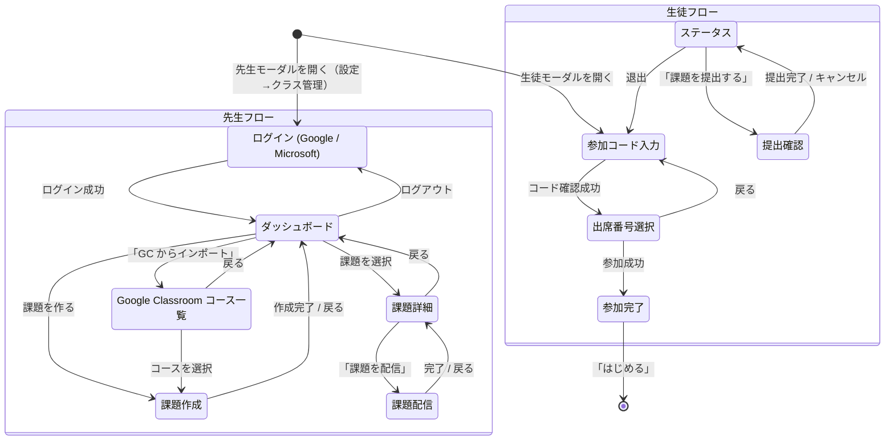
```mermaid
stateDiagram-v2
    state "先生フロー" as teacher {
        state "ログイン (Google / Microsoft)" as teacher_login
        state "ダッシュボード" as teacher_dashboard
        state "課題作成" as teacher_create
        state "課題詳細" as teacher_detail
        state "Google Classroom コース一覧" as teacher_gc
        state "課題配信" as teacher_post
    }
    state "生徒フロー" as student {
        state "参加コード入力" as student_join
        state "出席番号選択" as student_seat
        state "参加完了" as student_joined
        state "ステータス" as student_status
        state "提出確認" as student_confirm
    }

    [*] --> student_join: 生徒モーダルを開く
    [*] --> teacher_login: 先生モーダルを開く（設定→クラス管理）

    teacher_login --> teacher_dashboard: ログイン成功
    teacher_dashboard --> teacher_create: 課題を作る
    teacher_dashboard --> teacher_detail: 課題を選択
    teacher_dashboard --> teacher_gc: 「GC からインポート」
    teacher_dashboard --> teacher_login: ログアウト
    teacher_create --> teacher_dashboard: 作成完了 / 戻る
    teacher_detail --> teacher_dashboard: 戻る
    teacher_detail --> teacher_post: 「課題を配信」
    teacher_post --> teacher_detail: 完了 / 戻る
    teacher_gc --> teacher_create: コースを選択
    teacher_gc --> teacher_dashboard: 戻る

    student_join --> student_seat: コード確認成功
    student_seat --> student_joined: 参加成功
    student_seat --> student_join: 戻る
    student_joined --> [*]: 「はじめる」

    student_status --> student_confirm: 「課題を提出する」
    student_status --> student_join: 退出
    student_confirm --> student_status: 提出完了 / キャンセル
```

---

## メニューバー

メニューバーの右端に「クラス」ボタンが表示されます（`CLASSROOM_API_ENDPOINT` 環境変数が設定されている場合）。

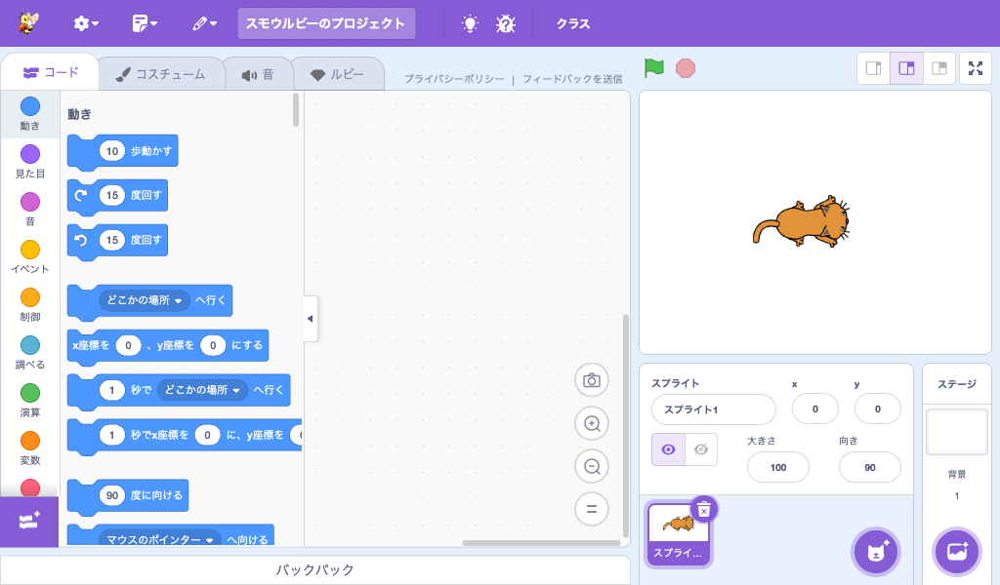

**パーツ:**

| 要素 | テキスト/内容 | data-testid |
|------|-------------|-------------|
| 設定メニュー | ⚙ アイコン | `settings-menu` |
| クラス管理メニュー | 「クラス管理...」（設定メニュー内） | `settings-classroom-management` |
| クラスボタン | 「クラス」（未参加時） | `classroom-menu-button` |
| ラベル | — | `classroom-menu-label` |

生徒が課題に参加中の場合、ボタンのテキストは固定の「クラス:出席番号NN」表記に変わります (NN は 0 埋め 2 桁):

| 要素 | テキスト/内容 | data-testid |
|------|-------------|-------------|
| ラベル全体 | 例: 「クラス:出席番号03」 | `classroom-menu-label` |
| 出席番号 (内側 span) | 例: 「03」 | `classroom-menu-seat-number` |

未参加時はラベルが「クラス」のみになる。 課題名 / クラス（学級）名はメニューに表示せず、モーダル内でのみ確認する設計。なお、生徒が参加するのは課題（1 授業）だが、メニューバーのラベル自体は「クラス」のまま（UI 文言の整理は #1135）。

---

## 共通: モーダル構造

すべてのフェーズは `classroom-modal` モーダル内に表示されます。

| 要素 | data-testid | 備考 |
|------|-------------|------|
| モーダル全体 | `classroom-modal` | |
| ヘッダー | — | 紫色、「クラス」タイトル |
| 閉じるボタン (×) | — | ヘッダー右端 |
| ローディング表示 | `classroom-loading` | API 通信中に表示 |
| エラー表示 | `classroom-error` | エラーメッセージ |
| エラーアクションリンク | `classroom-error-action` | セッション切れ時に「参加画面を表示」等 |
| セッション切れ Alert | — | Alert バナー（オレンジ帯）がモーダルの上に表示。「参加しなおす」ボタン付き |

---

## 1. 先生: ログイン (`teacher-login`)

Google または Microsoft アカウントでサインインする画面。先生は「設定 → クラス管理」メニューからアクセスします。

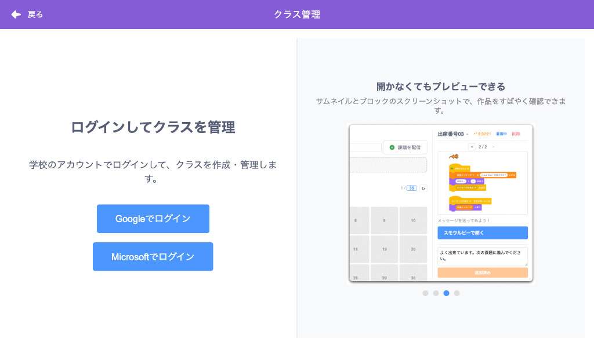

**パーツ:**

| 要素 | テキスト/内容 | data-testid | 操作 |
|------|-------------|-------------|------|
| フェーズルート | — | `classroom-phase-teacher-login` | — |
| 戻るリンク | 「< 戻る」 | `classroom-back` | → teacher-dashboard |
| 見出し | 「ログイン」 | — | — |
| 説明文 | 「アカウントでログインして、クラスを管理します。」 | — | — |
| ヒント | 「学校の Google Workspace for Education のアカウントで…」 | — | — |
| Google ログインボタン | 「Googleでログイン」 | `classroom-google-login` | Google 認証画面を開く |
| Microsoft ログインボタン | 「Microsoftでログイン」 | `classroom-microsoft-login` | Microsoft 認証ポップアップを開く |
| カルーセル | 右ペインに機能紹介画像（4枚、5秒ごと自動切替） | — | ドットクリックで手動切替 |

**レイアウト:** 左右分割レイアウト。左ペイン: ログインフォーム（Google / Microsoft の2つのログインボタン）、右ペイン: 画像カルーセル（薄いグレー背景）。1024x600 の画面でもスクロールなしで表示。

**セッション管理:** Google / Microsoft ID Token（1時間有効）。期限切れ時はプロバイダーに応じたサイレント再認証を試行し、透過的にトークンを更新。失敗時のみ Alert バナーを表示。詳細は [Microsoft 認証](microsoft-authentication.md) を参照。

---

## 1.5 先生: クラス一覧 (`teacher-class-list`) — ログイン後の入口

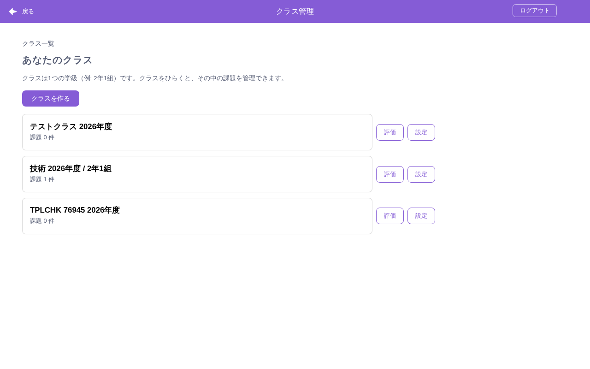

ログイン直後に表示される v2 の入口。Google Classroom の「クラス」に相当するクラス（学級）のカードが並ぶ。初回表示時に v1→v2 の冪等 migration（`POST /classroom-groups/migrate`）を自動実行する。

クラスのプロパティは GC 準拠: **クラス名（必須・例: 技術）/ 年度（必須・現在年度デフォルト）/ セクション（オプション・例: 2年1組）/ 人数**。同時作成フォームの課題名はオプション（空欄=クラスのみ作成）。カードの「設定」でインライン編集（名前・年度・セクション・人数・**クラス単位の共同管理者**・アーカイブ）。表示形式は「%クラス名% %年度%年度 / %セクション%」。**ログアウトはタイトルバー右端に常時表示**。

- カード: クラス名・年度・課題数・GC/共同管理/アーカイブバッジ・「評価」ボタン
- 「クラスを作る」: クラスと最初の課題を **1 画面で同時作成**し、作成後は新しいクラスの中（課題ボード）に着地する
- 「Google Classroom からインポート」（Google ログイン時のみ）: コースを選ぶとクラスを作成（コース名→クラス名・生徒数→人数・courseId をクラスへ）
- クラスをひらくとサイドバーがそのクラスの課題にスコープされる（「‹ クラス一覧」で戻る）
- **アーカイブ済みのクラス**: 一覧の下部に「アーカイブ済みのクラス（{count}）」トグル（1 件以上のとき表示）。展開するとアーカイブ済みカード（アーカイブバッジ + 「元に戻す」ボタン）が並び、ワンクリックで復元できる。設定からのアーカイブは **2 段階確認**（1 回目で警告メッセージ、2 回目で実行）

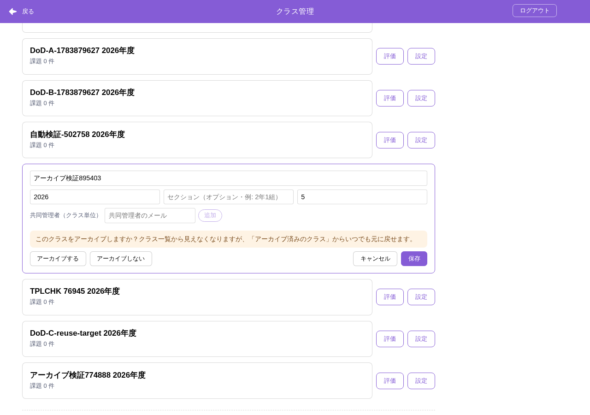

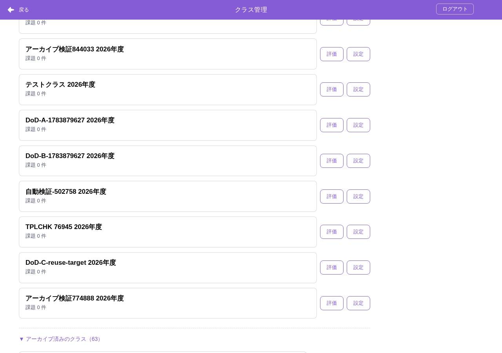
- 主な data-testid: `classroom-phase-teacher-class-list` / `classroom-class-create[-name|-year|-count|-assignment|-submit]` / `classroom-class-card-{groupId}` / `classroom-class-open-{groupId}` / `classroom-class-evaluate-{groupId}` / `classroom-class-import-gc` / `classroom-teacher-logout` / `classroom-show-archived` / `classroom-archived-class-list` / `classroom-class-restore-{groupId}`

## 1.6 先生: 課題管理ボード（クラス内の `teacher-dashboard`）

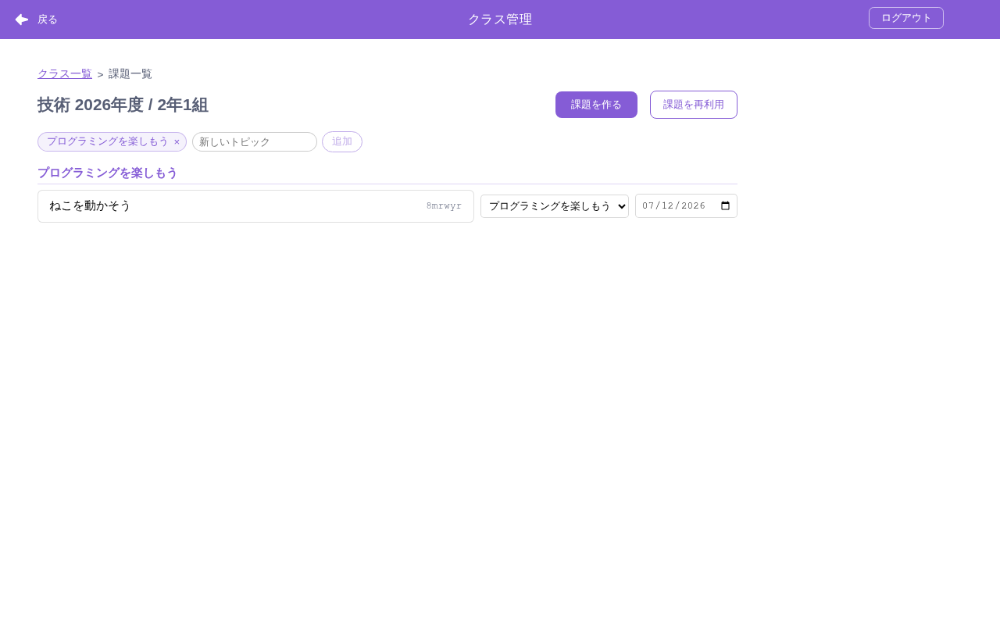

クラスをひらいたときのメイン領域。GC の「授業」タブに相当する。

- トピック未設定の課題を見出しなしで最上部に、以下クラスのトピック順のセクション。各セクションは日付（`sortDate`、既定=作成日・意味を持たない並び順キー・生徒非表示）降順
- トピックチップ: 追加・クリックでリネーム（クラス内の課題へ一括追従）・×で削除（課題はトピックなしへ）
- 課題行: トピック select と日付 input の**その場編集**、行クリックで課題詳細へ
- **サイドバーは無い**。ナビは**パンくず**「クラス一覧 > 課題一覧 (> 課題詳細)」
- 課題作成は課題名のみの**インラインフォーム**（クラス名・人数はクラスから）。「**課題を再利用**」で全クラスの課題を日付降順に表示し、クラスフィルタ → 「このクラスに複製」（説明・スターター・トピックごと複製。同一クラスは「のコピー」付き）
- **アーカイブ済みの課題**: ボード最下部に「アーカイブ済みの課題（{count}）」トグル（1 件以上のとき表示）。展開すると課題名・保存期限（TTL 由来の `expiresAt`）・「元に戻す」ボタンの行が日付降順に並ぶ。アーカイブしても保存期限は延長されない

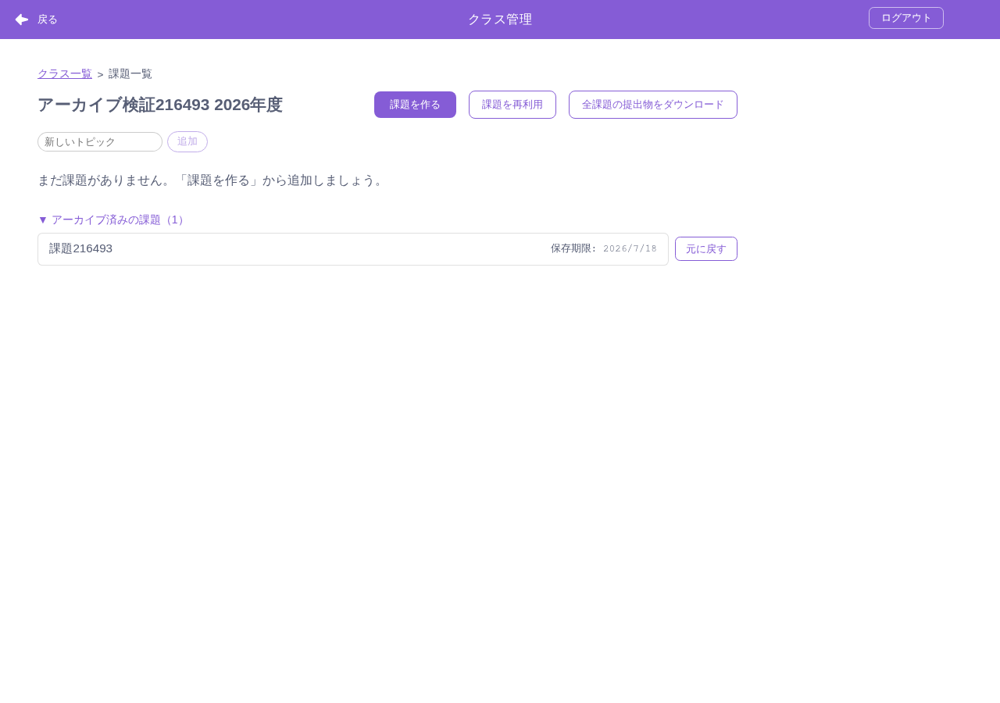
- **残り日数バッジ**: 保存期限（自動削除）まで 30 日以下の課題行に「あと{days}日」バッジを表示（7 日以下は警告色）。閾値の根拠は EPIC #1049 の D8
- **全課題の提出物をダウンロード**（`classroom-board-download-class`）: クラス内の全課題（アーカイブ済み含む — どちらも保存期限で消えるため）の提出物を 1 つの zip（`課題名/席番号_名前/作品.sb3` + サムネ/スクショ + `提出状況.csv`）でダウンロード。進捗は「n/m」表示
- **みんなの課題からさがす**（`classroom-board-shared-catalog`、EPIC #1066）: 全国の先生が共有した課題のカタログをボード内に展開。学校種・教科・学年・タグで絞り込み → 詳細プレビュー（説明ページ・「© 表示名 / CC BY 4.0」クレジット・補足資料リンクは外部ドメイン名付き確認を挟んで新規タブ）→「このクラスに取り込む」でスターターごと課題として複製（新しい参加コードが発行される）。「自分の投稿」タブから取り下げ / 再公開。他人の投稿には通報（理由必須）

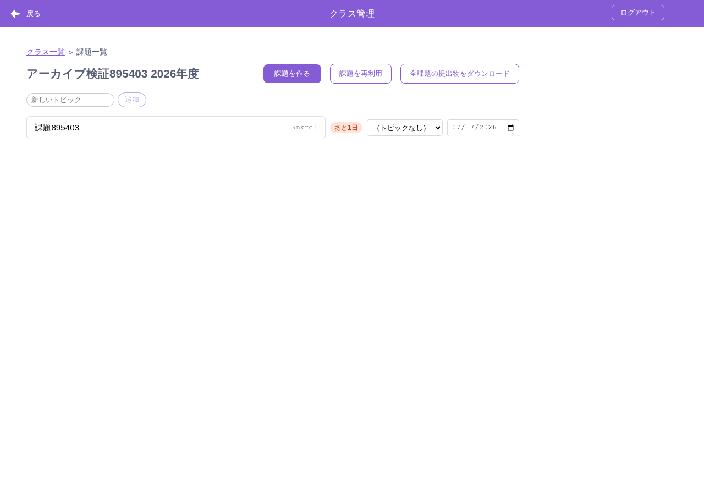
- 主な data-testid: `classroom-board` / `classroom-board-create[-name|-submit]` / `classroom-board-reuse[-view|-filter|-copy-{id}]` / `classroom-board-section-{topic|none}` / `classroom-board-row|open|topic|date-{classroomId}` / `classroom-topic-add[-input]` / `classroom-topic-chip|rename|remove-{topic}` / `classroom-breadcrumbs` / `classroom-board-archived-[section|toggle|list]` / `classroom-board-archived-row-{classroomId}` / `classroom-board-restore-{classroomId}`

## 1.7 先生: 課題詳細の「説明」タブ（デフォルトアクティブ）

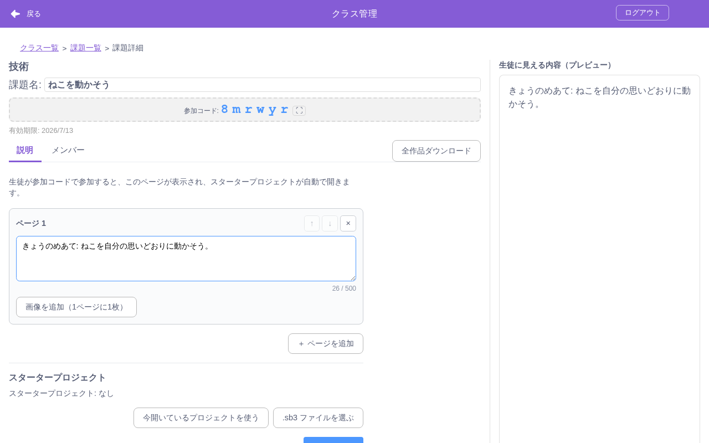

課題をひらくと「説明」タブが最初に表示される。左に生徒へ表示する説明・画像・スターターの編集フォーム、**右ペインに生徒視点プレビュー**（編集内容をライブ表示・ページ送り。生徒への反映は保存時のみ）。

- 出席・提出のポーリング（30秒）は**メンバータブ表示中のみ**（費用抑制）
- **この課題を共有**（`classroom-share-assignment`）: 課題（説明ページ + スターター）を「みんなの課題」（全国の先生の共有ライブラリ、EPIC #1066）に公開するフォームを開く。属性（学校種・学年・教科・タグ・コマ数）、補足資料 URL（https のみ + 期待内容のガイダンス表示）、表示名・所属（localStorage 記憶）、**CC BY 4.0 同意チェック必須**。公開後は「© 表示名 / CC BY 4.0」付きの完了メッセージを表示
- 課題の所属クラス変更・人数編集・課題単位の共同管理者・複製は**できない**（クラス設定 / 課題一覧の再利用へ集約）。フッターのボタンは「**課題をアーカイブ**」（soft-delete。ボードの「アーカイブ済みの課題」からいつでも復元可能。testid は歴史的経緯で `classroom-delete-classroom` のまま）
- 主な data-testid: `classroom-tab-description` / `classroom-description-editor` / `classroom-description-preview[-body|-prev|-next]` / `classroom-tab-members`

## 1.8 先生: お知らせセンター（タイトルバー・EPIC #1111）

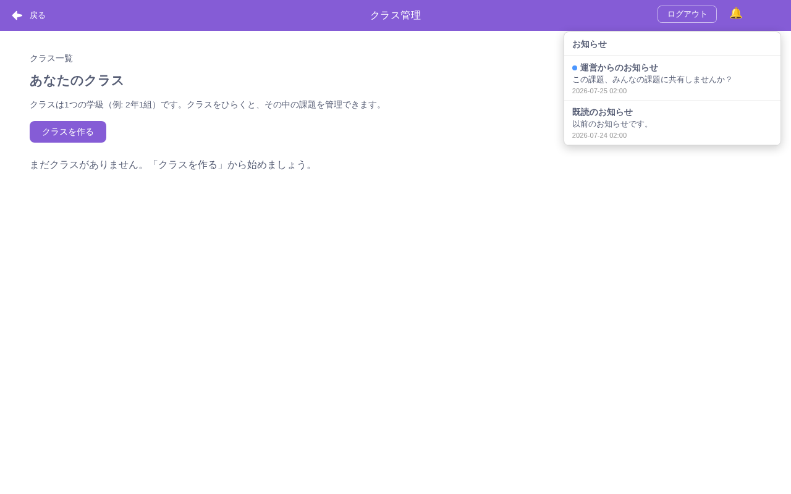

クラス管理のタイトルバー右上（× の左隣）は **アバターメニュー**（メール頭文字 + ▼）に固定。その左に **白一色のベル**（お知らせ）を置く。運営（Admin）からのお知らせが届くと未読数バッジが付く。

- **アバターメニュー**: メール頭文字（`kouji@…`→`K` / `kouji.takao@…`→`KT`）の丸アイコン + ▼。クリックでポップアップ（メール表示 + ログアウト。将来の設定項目もここに集約）。紫背景で視認できる白丸 + 紫文字
- ベルのクリックで一覧パネルを開閉。**開くだけでは既読にしない**（バッジは残る）。既読はパネルヘッダーの **⋯ メニュー**から明示的に行う
- パネルは **先頭 5 件**のみプレビュー表示。ヘッダーの **⋯ メニュー**に「**すべて既読にする**」「**お知らせを開く**（全件一覧ページ・`teacher-notifications` フェーズ・**10 件/ページ**）」。一覧は件数に関係なく開ける
- お知らせ本文をクリックすると、`link` の種類に応じて該当画面へジャンプ（`kind: 'classroom'` → そのクラスを選択して課題詳細へ / `kind: 'shared-mine'` → みんなの課題の自分の投稿へ）。未知の kind は無視（前方互換）
- **全件一覧ページ**は「**クラス管理 > お知らせ**」パンくず（先頭「クラス管理」でトップ=クラス一覧へ戻れる）+ **左下に「戻る」ボタン**（キャンセルが不適切な画面のポリシー）
- **取得は 1 日 1 回**（コスト削減）: その日はじめてクラス管理を開いたときだけ `GET /notifications` を 1 回呼び、localStorage に日付つきでキャッシュ。同じ日の再オープンは API を叩かない（旧 60 秒ポーリングは廃止）。共有 PC 対策として先生メールでキャッシュを識別。取得エラーはクラス管理本体に影響させない（表示しない）。※その日の初回取得後に届いたお知らせは翌日反映（運営連絡は多くて週 1 回程度の前提）
- 送信側は Admin SPA（課題詳細の「先生へのお知らせ」フォーム → `POST /admin/notifications`）。`docs/admin/README.md` を参照

| 要素 | data-testid | 操作 |
|------|-------------|------|
| アバターボタン | `classroom-avatar-button` | クリックでアカウントメニュー開閉 |
| イニシャル丸 | `classroom-avatar-initials` | メール頭文字（1〜2 文字） |
| メニューのメール | `classroom-avatar-email` | ポップアップ内のメール表示 |
| ログアウト | `classroom-teacher-logout` | アカウントメニュー内 |
| ベルボタン | `classroom-notifications-button` | クリックでパネル開閉 |
| 未読バッジ | `classroom-notifications-badge` | 未読数（10 以上は「9+」）。未読 0 で非表示 |
| 一覧パネル | `classroom-notifications-panel` | 先頭 5 件プレビュー |
| ⋯ メニューボタン | `classroom-notifications-menu-button` | パネルヘッダー右の三点 |
| ⋯ メニュー | `classroom-notifications-menu` | — |
| すべて既読にする | `classroom-notifications-mark-all-read` | 全件既読（未読 0 で無効） |
| お知らせを開く | `classroom-notifications-open-all` | 全件一覧ページへ（件数不問） |
| お知らせ 1 件（パネル） | `classroom-notification-item-{notificationId}` | クリックでリンク先へジャンプ + パネルを閉じる |
| 未読ドット | `classroom-notification-unread-dot` | 未読アイテムのみ |
| 空メッセージ | `classroom-notifications-empty` | お知らせ 0 件のとき |
| 全件一覧ページ | `classroom-notifications-page` | `teacher-notifications` フェーズ |
| パンくず先頭 | `classroom-breadcrumb-top` | 「クラス管理」→ トップ（クラス一覧）へ |
| 左下戻る | `classroom-notifications-back` | トップ（クラス一覧）へ戻る |
| ページ内 1 件 | `classroom-notification-page-item-{notificationId}` | クリックでリンク先へジャンプ |
| ページャ | `classroom-notifications-pager` / `-prev` / `-next` | 10 件/ページ |

## 1.9 先生: 共有推奨バナー（#1106）

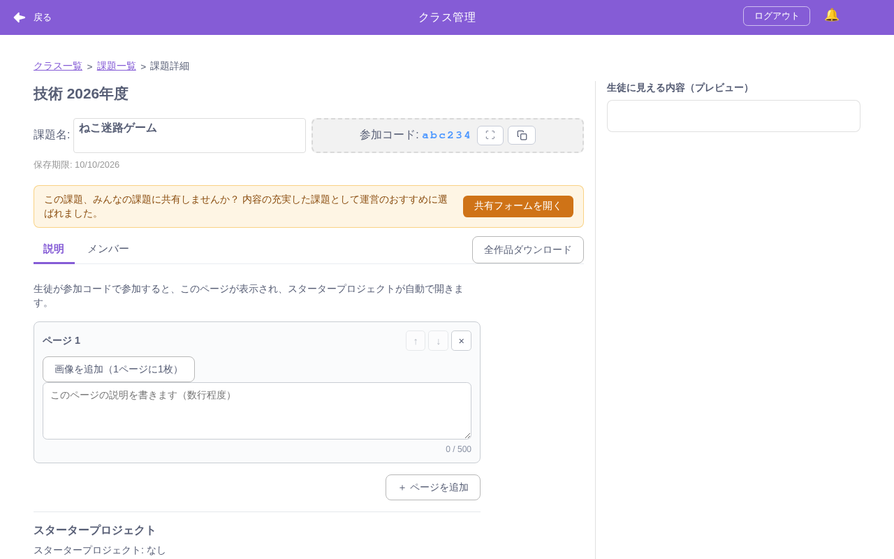

運営（Admin）が「みんなの課題に共有する価値がある」と判断した課題には、課題詳細の上部に「**この課題、みんなの課題に共有しませんか？**」バナーが出る。「共有フォームを開く」でボードの共有ステップ（既存の共有フロー）が開く。公開はあくまで CC BY 同意を伴う**先生本人の共有操作のみ**（運営による代理公開はしない）。

- 推奨と同時に運営からのお知らせ（🔔・`share_suggestion`）も届き、クリックでこの課題の詳細へジャンプする
- 課題一覧（ボード）の該当行には「**共有おすすめ**」マークが付く
- フラグは admin が取り消すまで表示される（先生側から消す操作は無い）

| 要素 | data-testid | 操作 |
|------|-------------|------|
| バナー | `classroom-share-suggestion-banner` | — |
| 共有フォームを開く | `classroom-share-suggestion-open` | ボードへ戻って共有ステップを開く |
| ボード行のマーク | `classroom-board-share-suggested-{classroomId}` | — |

## 4. 先生: 課題詳細のメンバータブ (`teacher-detail`)

1 つの課題（1 授業）の参加状況と提出を管理する画面。画面のタイトルには、その課題が属する**クラス（学級）名**が出る。モーダルが**ワイド表示 (968px)** に広がります。

### 空席のみの状態

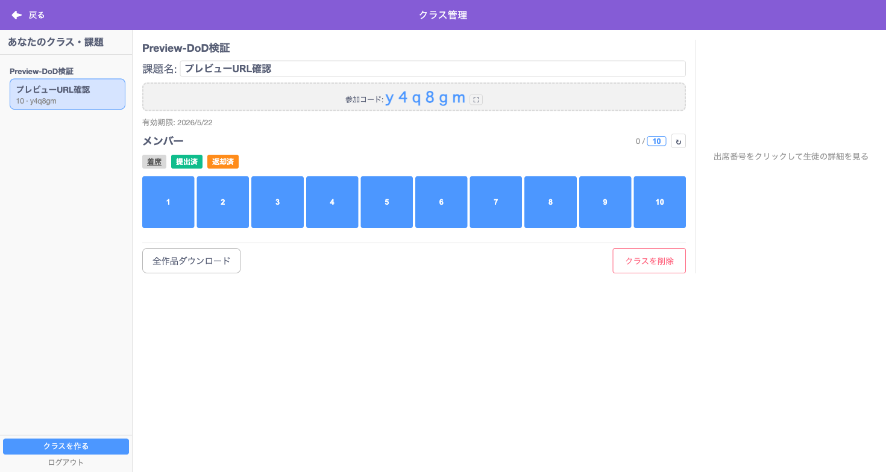

### 提出があった状態（5番が緑 = 提出済み）

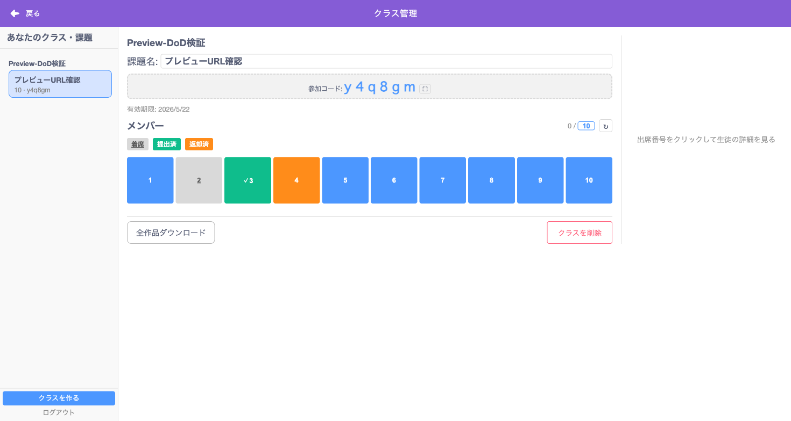

### メンバー詳細パネル（右側）

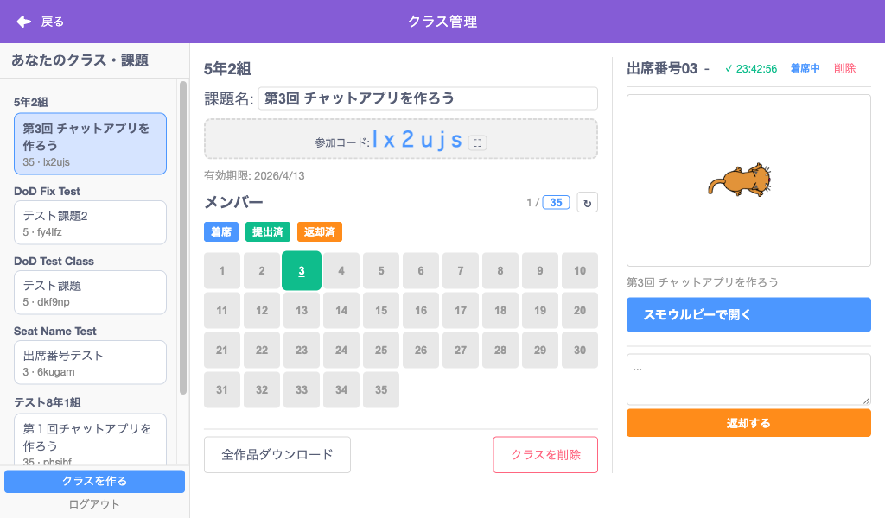

**左カラム パーツ:**

| 要素 | テキスト例 | data-testid | 操作 |
|------|----------|-------------|------|
| フェーズルート | — | `classroom-phase-teacher-detail` | — |
| 戻るリンク | 「< 戻る」 | `classroom-back` | → teacher-dashboard |
| クラス（学級）名 | 「技術 2026年度 / 2年1組」 | `classroom-detail-name` | 課題が属するクラスの表示ラベル（`formatClassLabel(group)`。v2 以前のデータでは `Classrooms.className`） |
| 課題名入力 | 課題名（編集可） | `classroom-detail-assignment-name` | blur で保存 |
| 課題配信ボタン | 「課題を配信」 | `classroom-post-assignment` | → teacher-post-assignment。**未配信のとき**表示 |
| 課題確認リンク | 「課題を確認」 | `classroom-view-assignment` | 配信済みのとき表示（新しいタブ） |
| 参加コード表示 | 「参加コード: 3cexm5」 | `classroom-detail-join-code` | 大きなフォントで中央表示 |
| コード拡大ボタン | ⛶ アイコン（ツールチップ: 「全画面表示」） | `classroom-detail-expand-code` | 全画面コード表示 |
| 保存期限 | 「保存期限: 2026/4/6」 | — | 自動削除の期日（TTL）。30 日以下になると下に警告バナー（`classroom-retention-banner`）が出て「全作品ダウンロード」を促す（下図） |

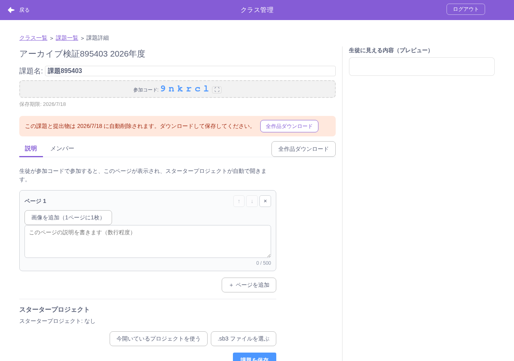
| メンバー見出し | 「メンバー」 | — | — |
| メンバー数 | 「1 / 35」 | `classroom-members-count` | 参加人数 / 最大人数 |
| 更新ボタン | ↻ アイコン | `classroom-refresh` | メンバー・提出を再取得 |
| 座席グリッド | — | `classroom-members-grid` | — |
| 全作品ダウンロード | 「全作品ダウンロード」 | `classroom-download-all` | 左寄せ |
| 課題アーカイブボタン | 「課題をアーカイブ」 | `classroom-delete-classroom` | 赤枠ボタン、右寄せ。soft-delete（復元可能） |

**課題配信ボタンの表示条件:** Google Classroom 連携はクラス（group）単位に移行したため、配信ボタン（`classroom-post-assignment`）は **クラスが GC 連携済み（`group.googleClassroomCourseId`）** であれば、その課題自体に courseId が無くても表示されます（課題の投稿先はクラスのコース）。課題単位の `googleClassroomCourseId`（v2 以前のフォールバック）が有る場合も表示されます。どちらの courseId も無い（非連携クラス）ときは表示されません。配信済み（課題に `googleClassroomAlternateLink` が保存済み）になると「Google Classroom で確認」リンク（`classroom-view-assignment`）に切り替わります。

**座席グリッド:**

座席番号が格子状に並び（1行 10列）、各セルの背景色で状態を表します。

| セルの色 | 状態 | テキスト |
|---------|------|---------|
| 青 (`#4c97ff`) | 空席 | 出席番号のみ (例: 「5」) |
| グレー (`#d9d9d9`) | 着席（未提出） | 出席番号（下線付き） |
| 緑 (`#0fbd8c`) | 提出済み | 「✓」+ 出席番号 (例: 「✓5」) |
| オレンジ (`#ff8c1a`) | 返却済み | 出席番号 |

色は生徒側の出席番号選択画面と統一されている: 青 = 「空き / 選択可能 (生徒視点では選べる席、先生視点では未参加)」、灰色 = 「使用中」。

セルをクリックすると右カラムに詳細パネルが表示されます。

**右カラム — メンバー詳細パネル:**

メンバー未選択時は「出席番号をクリックして生徒の詳細を見る」と表示。

| 要素 | テキスト例 | data-testid | 操作 |
|------|----------|-------------|------|
| パネル全体 | — | `classroom-member-detail` | — |
| 席番号ヘッダー | 「出席番号05」 | `classroom-member-detail-seat` | — |
| ニックネーム | 「- 」(未設定時) | `classroom-member-detail-name` | — |
| 提出時刻 | 「✓ 19:11:54」 | `classroom-member-detail-submitted` | 緑色テキスト |
| 着席状態 | 「着席中」 | `classroom-member-detail-seated` | 青色テキスト |
| 削除リンク | 「削除」 | `classroom-member-remove` | 赤色テキスト |
| サムネイル画像 | — | `classroom-member-detail-thumbnail` | プロジェクトのサムネイル |
| プロジェクト名 | 「第１回チャットアプリを作ろう」 | — | サムネイル下 |
| 「スモウルビーで開く」 | — | `classroom-member-detail-open` | 青色ボタン、全幅 |
| コメント入力 | textarea (placeholder: 「...」) | `classroom-member-detail-comment` | — |
| 返却ボタン | 「返却する」 | `classroom-member-detail-return` | オレンジ色ボタン、全幅 |

スクリーンショットが複数枚ある場合:

| 要素 | data-testid | 操作 |
|------|-------------|------|
| 画像インデックス | `classroom-member-detail-image-index` | 「1/3」等 |
| 前の画像ボタン | `classroom-member-detail-prev` | — |
| 次の画像ボタン | `classroom-member-detail-next` | — |

**説明 / メンバータブ:**

課題詳細はタブ切替（「説明」がデフォルト = 課題編集フォーム + 生徒視点プレビュー、「メンバー」= 出席・提出の座席グリッド）。共同管理者は**クラス設定（クラス一覧）**に移動した。タブ行の右端に「全作品ダウンロード」。

| 要素 | テキスト | data-testid | 操作 |
|------|---------|-------------|------|
| メンバータブ | 「メンバー」 | `classroom-tab-members` | 凡例 + 人数 + 更新 + 座席グリッド（表示中のみ 30 秒ポーリング）|
| 説明タブ | 「説明」 | `classroom-tab-description` | 課題編集フォーム + 右ペインの生徒視点プレビュー（既定）|

課題を切り替えるとメンバータブに戻る。

**共同管理者セクション (課題単位・現在の UI には無い):**

> ⚠️ 画面上の共同管理者の追加・解除は **クラス（学級）設定**（「1.5 先生: クラス一覧」のカードの「設定」）に移動済み。以下は移動前の課題詳細タブの構成で、課題単位の共同管理は API（`/classrooms/{id}/co-teachers`）としてのみ後方互換で残っている。

owner または co-teacher が、別の先生を **email で招待**して共同管理できる（→ [architecture.md の共同管理](architecture.md#共同管理co-teacher)）。

| 要素 | テキスト例 | data-testid | 操作 |
|------|----------|-------------|------|
| セクション全体 | — | `classroom-co-teachers` | co-teachers タブ選択時のみ描画 |
| 未登録表示 | 「まだ共同管理者がいません。」 | `classroom-co-teachers-empty` | co-teacher が0件時 |
| 一覧の各項目 | 「co@example.com」 | `classroom-co-teacher-item-{email}` | — |
| 解除ボタン | 「解除」 | `classroom-co-teacher-remove-{email}` | 共同管理者を解除 |
| 招待入力 | email 入力 (placeholder: teacher@example.com) | `classroom-co-teacher-invite-input` | Enter でも招待 |
| 招待ボタン | 「招待」 | `classroom-co-teacher-invite-submit` | email 未入力時は disabled |

招待された先生は次回ログイン時、**クラス一覧に該当クラス（学級）が「共同管理」バッジ**付きで表示され、その中のすべての課題を管理できる（即時反映・承認不要）。

**コード表示 (全画面):**

コード拡大ボタン (⛶) をクリックすると、参加コードが全画面表示されます (Portal 使用)。タイトルは「参加コード」、フッターにクラス（学級）名・人数・課題名・日付が表示されます。

| 要素 | data-testid | 操作 |
|------|-------------|------|
| 招待リンクコピー | `classroom-code-display-copy-link` | クリップボードにコピー |
| 全画面表示 | `classroom-code-display-expand` | — |
| 全画面解除 | `classroom-code-display-shrink` | — |
| 閉じる | `classroom-code-display-close` | — |

**削除確認ダイアログ:**

「課題をアーカイブ」ボタンを押すと確認ダイアログが表示されます。

| 要素 | テキスト | data-testid | 操作 |
|------|---------|-------------|------|
| 確認ボタン | 「アーカイブする」 | `classroom-delete-confirm` | 課題のアーカイブ（soft-delete）を実行 |
| キャンセルボタン | 「キャンセル」 | `classroom-delete-cancel` | ダイアログを閉じる |

---

## 5. 生徒: 参加コード入力 (`student-join`)

6文字の参加コードを入力する画面。生徒がモーダルを開いたときの初期画面です。

生徒が既に課題に参加している場合（localStorage にセッション情報あり）は、この画面をスキップして**ステータス**画面に直接遷移します。

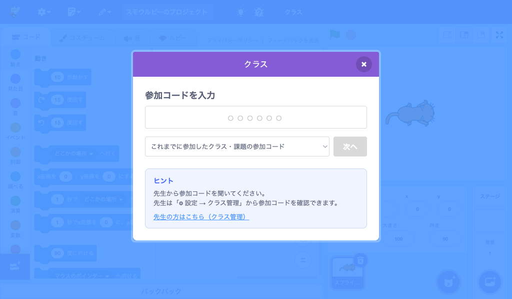

**パーツ:**

| 要素 | テキスト/内容 | data-testid | 操作 |
|------|-------------|-------------|------|
| フェーズルート | — | `classroom-phase-student-join` | — |
| 見出し | 「参加コードを入力」 | — | — |
| コード入力 | 6文字入力欄 (placeholder: ○○○○○○) | `classroom-join-code-input` | 自動大文字変換 |
| 次へボタン | 「次へ」 | `classroom-join-submit` | コード未入力/不正時は disabled |
| ヒントボックス | — | — | 青系背景のボックス |
| ヒントタイトル | 「ヒント」 | — | 青色太字 |
| ヒント1行目 | 「先生から参加コードを聞いてください。」 | — | — |
| ヒント2行目 | 「先生は「⚙ 設定 → クラス管理」から参加コードを確認できます。」 | — | — |

**レイアウト:** 入力欄は中央寄せ、幅広のテキスト入力。「次へ」ボタンは右寄せ。ヒントボックスはフォーム下部に表示。

---

## 6. 生徒: 出席番号選択 (`student-seat`)

課題の座席がグリッド表示され、空いている出席番号を選択します。

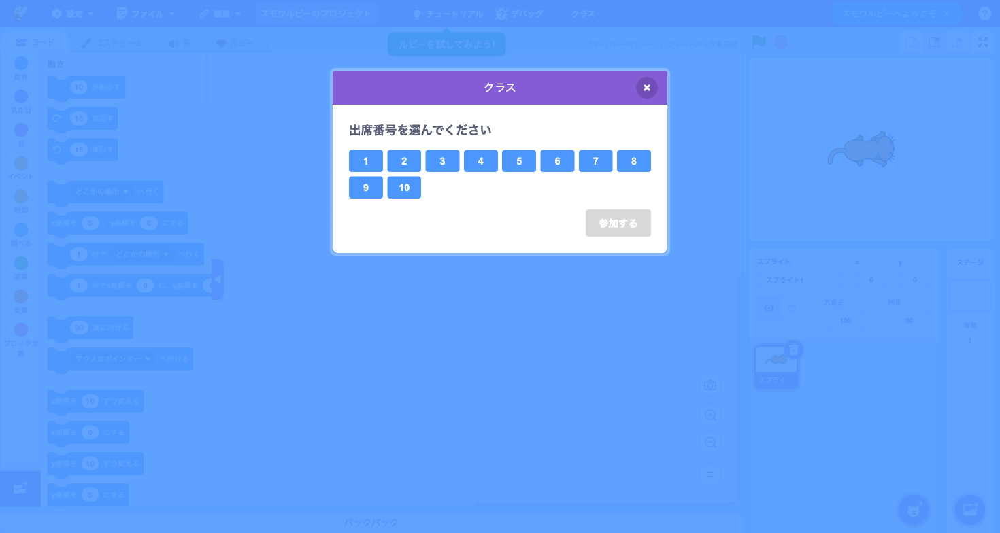

**パーツ:**

| 要素 | テキスト/内容 | data-testid | 操作 |
|------|-------------|-------------|------|
| フェーズルート | — | `classroom-phase-student-seat` | — |
| 見出し | 「出席番号を選んでください」 | — | — |
| 座席グリッド | — | `classroom-seat-grid` | — |
| 各席番号ボタン | 「1」〜「35」等 | `classroom-seat-{n}` | クリックで選択状態に |
| 選択中の席番号 | — | `classroom-selected-seat` | hidden要素、値取得用 |
| 参加ボタン | 「参加する」 | `classroom-confirm-seat` | 席未選択時は disabled |

**座席グリッドの色:**

| ボタンの色 | 状態 |
|----------|------|
| 青 (`#4285f4`) | 空席（選択可能） |
| グレー (disabled) | 使用中（選択不可） |
| 濃い青 (selected) | 選択中 |

**レイアウト:** ボタンは1行8列のグリッド。「参加する」ボタンは右下、灰色 (disabled) or 青色。

---

## 7. 生徒: 参加完了 (`student-joined`)

参加が成功したときの確認画面。メニューバーにも参加中であることが表示されます。
プロジェクト名が課題名に自動変更されます。

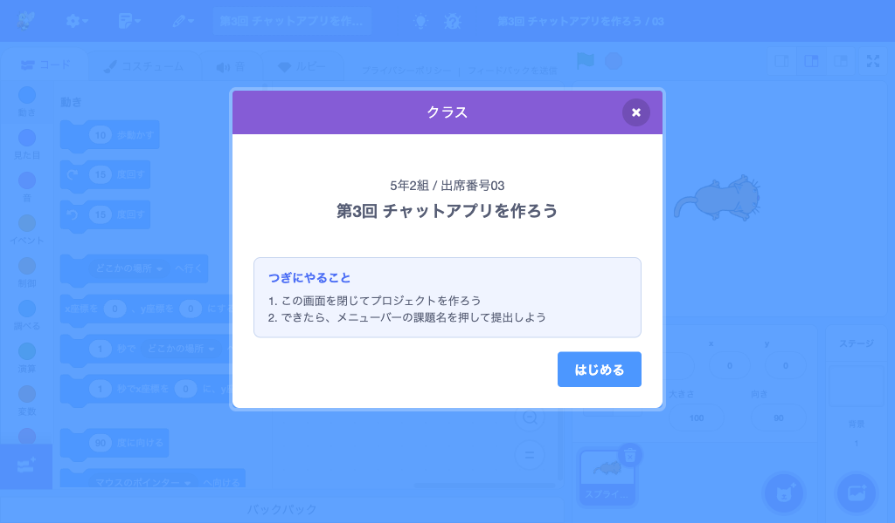

**パーツ:**

| 要素 | テキスト例 | data-testid | 操作 |
|------|----------|-------------|------|
| フェーズルート | — | `classroom-phase-student-joined` | — |
| 詳細 | 「テスト8年1組 / 出席番号03」 | `classroom-joined-details` | — |
| クラス（学級）名 | 「テスト8年1組」 | `classroom-joined-class-name` | — |
| 出席番号 | 「出席番号03」（0埋め2桁） | `classroom-joined-seat-number` | — |
| 課題名 | 「第１回チャットアプリを作ろう」 | `classroom-joined-assignment` | 課題名がある場合のみ表示 |
| つぎにやること（ヒント） | 「1. この画面を閉じてプロジェクトを作ろう / 2. できたら、メニューバーの課題名を押して提出しよう」 | — | 青系背景のヒントボックス |
| はじめるボタン | 「はじめる」 | `classroom-joined-close` | モーダルを閉じる |

**レイアウト:** クラス（学級）名と出席番号は中央表示。課題名はその下にやや小さいフォントで表示。「つぎにやること」ヒントボックスが課題名の下に表示され、参加後の次のアクションを案内する。「はじめる」ボタンは青色、右寄せ。

---

## 8. 生徒: ステータス (`student-status`)

参加中の生徒がモーダルを開いたときに表示される画面。提出状況を確認し、提出/退出ができます。

### 未提出の状態

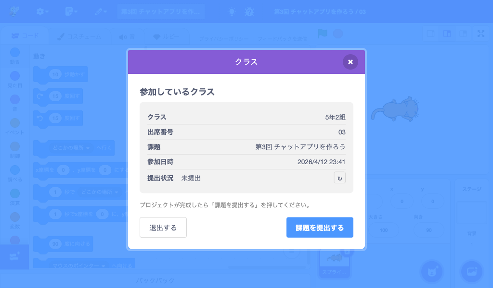

### 提出済みの状態

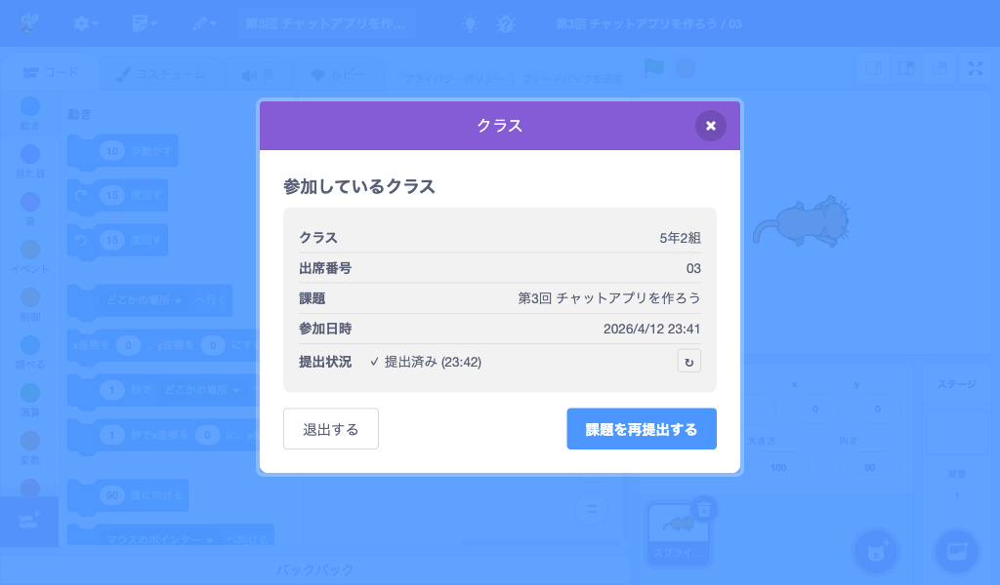

**情報テーブル:**

| 行ラベル | 値の例 | data-testid (値部分) |
|---------|-------|---------------------|
| 「クラス」 | 「テスト8年1組」 | `classroom-status-class-name` |
| 「出席番号」 | 「03」（0埋め2桁） | `classroom-status-seat-number` |
| 「課題」 | 「第１回チャットアプリを作ろう」 | `classroom-status-assignment` |
| 「参加日時」 | 「2026/4/8 00:07」（秒なし） | `classroom-status-joined-at` |
| 「提出状況」 | 「未提出」or「✓ 提出済み (00:08)」 | `classroom-submit-status` |

提出状況行の右端に更新ボタンがあります:

| 要素 | data-testid | 操作 |
|------|-------------|------|
| 更新ボタン (↻) | `classroom-student-refresh` | 最新の提出状況を取得 |

返却済みの場合、先生からのコメントが表示されます:

| 要素 | data-testid |
|------|-------------|
| 先生からのコメント | `classroom-status-teacher-comment` |

**未提出時ヒント:**

未提出の場合、フッターの上に以下のヒントが表示されます:

| 要素 | テキスト | 備考 |
|------|---------|------|
| 提出ヒント | 「プロジェクトが完成したら「課題を提出する」を押してください。」 | 未提出時のみ表示 |

**フッターボタン (左右に配置):**

| 要素 | テキスト (未提出時) | テキスト (提出済み) | data-testid | 操作 |
|------|-------------------|-------------------|-------------|------|
| 退出ボタン | 「退出する」 | 「退出する」 | `classroom-leave` | → student-join |
| 提出ボタン | 「課題を提出する」 | 「課題を再提出する」 | `classroom-submit-button` | → submit-confirm |

**レイアウト:** 情報テーブルは白背景のカード内。フッターは `[退出する]` が左、`[課題を提出する]` が右。

**セッション切れ時:**

セッションが無効になった場合、エラーメッセージと「参加画面を表示」リンクが表示されます。

---

## 9. 生徒: 提出確認 (`submit-confirm`)

提出前の確認画面。プロジェクトのサムネイルがプレビュー表示されます。

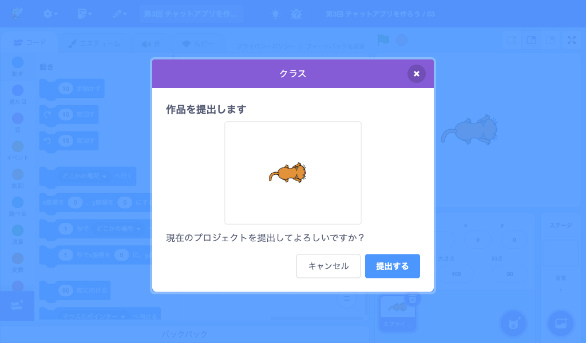

> **提出サムネイルの事前設定** (issue #631): 課題に参加中の生徒は、ステージ右上の
> 「提出サムネイルを設定」ボタン（✓ アイコン）を押すと、その瞬間のステージ画面を
> 提出サムネイルとして事前に決めておけます。設定するとそのフレームが提出時に使われ、
> プレビュー (`classroom-submit-preview`) にも反映されます。未設定のまま提出した場合は
> 従来どおり提出ボタンを押した瞬間のフレームが自動キャプチャされます。ボタンは課題
> 未参加時は表示されません（`state.scratchGui.classroom` の生徒セッション有無で判定）。

**提出サムネイルを設定ボタンの表示ゲート:**

課題に未参加のときはステージ右上に「提出サムネイルを設定」ボタンは表示されません。

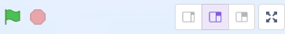

課題に参加中の生徒のときだけ、ステージ右上の左端に ✓ アイコンのボタンが表示されます。

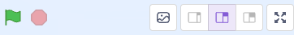

ボタンを押すと確認ポップオーバー「いまの実行画面を提出サムネイルにしますか？」が表示され、「はい」でその瞬間のステージ画面が提出サムネイルとしてキャッシュされます。

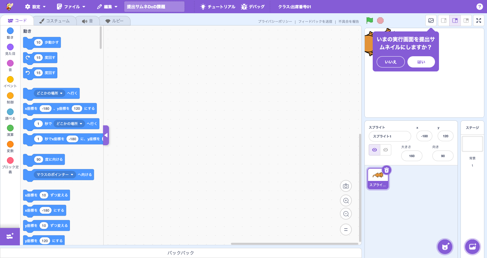

事前に設定したサムネイルは、その後ステージの内容を変えても提出確認のプレビューと実際の提出に使われます（下図は事前設定したフレーム＝左上の大きいネコがプレビューに表示され、背後の現在のステージ＝右下の小さいネコとは異なる様子）。

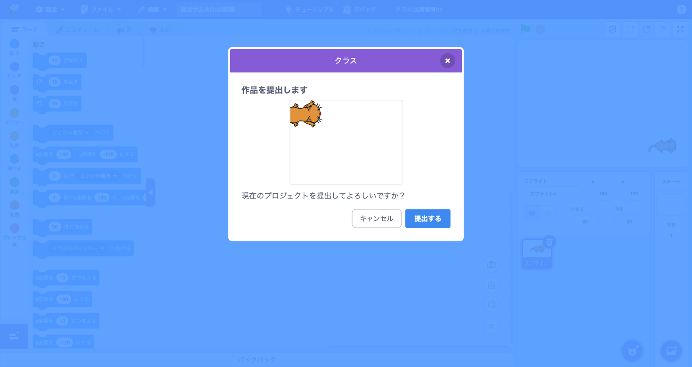

**パーツ:**

| 要素 | テキスト/内容 | data-testid | 操作 |
|------|-------------|-------------|------|
| フェーズルート | — | `classroom-phase-submit-confirm` | — |
| 見出し | 「作品を提出します」 | — | — |
| サムネイルプレビュー | ステージのスクリーンショット画像 | `classroom-submit-preview` | — |
| 確認メッセージ | 「現在のプロジェクトを提出してよろしいですか？」 | — | — |
| キャンセルボタン | 「キャンセル」 | `classroom-submit-cancel` | → student-status |
| 提出ボタン | 「提出する」 | `classroom-submit-confirm` | 送信中は「提出中...」に変化 |

**レイアウト:** サムネイルは中央の白枠内に表示。ボタンは横2列、右に「提出する」(青色)、左に「キャンセル」(白色ボーダー)。

「提出する」を押すと:
1. プロジェクトファイル (.sb3) を保存（ファイル名はプロジェクト名 = 課題名）
2. サムネイルを生成（事前設定済みの提出サムネイルがあればそれを使用、無ければ自動キャプチャ）
3. ステージのスクリーンショットを撮影
4. Presigned URL 経由で S3 にアップロード
5. 完了後 → student-status に遷移

---

## 課題配信（課題エディタ + 生徒の課題パネル）

課題（1 授業）には任意で**課題コンテンツ**（(数行テキスト + 画像1枚) × 最大10ページ + スタータープロジェクト1つ）を持たせられます。生徒は参加コードで参加した瞬間に課題ページが表示され、スタータープロジェクトが自動で開きます（プログラム配付の手作業をなくす機能）。

### 課題の編集（先生: 課題詳細の「説明」タブ）

課題詳細をひらくと「説明」タブがデフォルトで表示され、そこが編集フォームです（旧 teacher-assignment-edit フェーズは廃止）。右ペインに生徒視点プレビュー（sticky・ページャ上部）。

- ページの追加・削除・並べ替え（↑↓）、1ページ500文字 + 画像1枚（png/jpeg・**画像が上、テキストが下**）
- スターターは「今開いているプロジェクトを使う」（保存時に `vm.saveProjectSb3()` で生成）か「.sb3 ファイルを選ぶ」
- 保存すると画像・スターターは Presigned URL で S3 に直接アップロードされる
- data-testid 一覧は [testing.md](testing.md) の「課題エディタ」参照

### 課題パネル（生徒: student-assignment フェーズ）

join 完了直後に自動で開きます（課題コンテンツが設定されている課題のみ）。ステータス画面の「課題を見る」（`classroom-view-assignment-button`）からいつでも開き直せます。

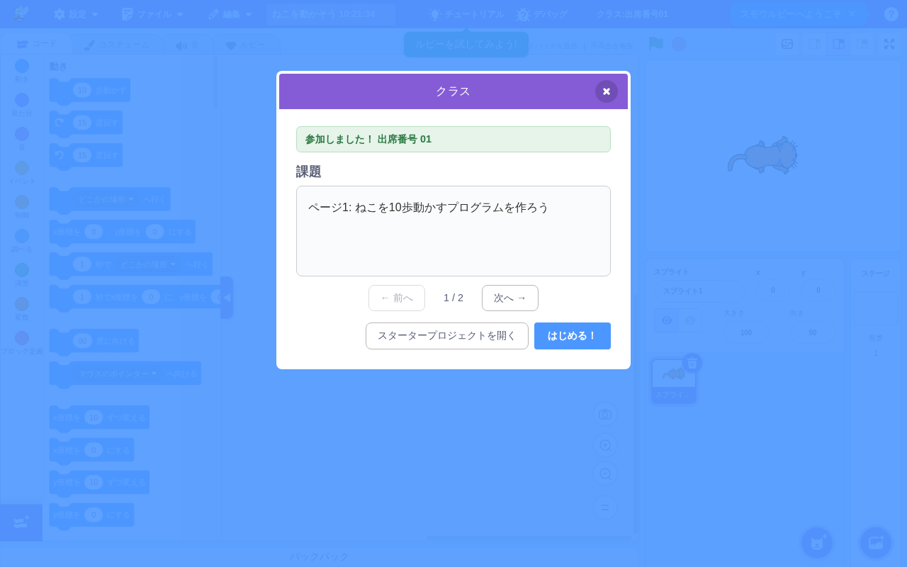

- スターターの自動ロードは**編集中のプロジェクトを勝手に上書きしない**（未編集なら自動、編集ありなら confirm）
- 「スタータープロジェクトを開く」で明示的に開き直せる（同じく confirm あり）
- 「はじめる！」でモーダルを閉じて作業開始
- data-testid 一覧は [testing.md](testing.md) の「課題パネル（生徒）」参照

---

## 10. 先生: Google Classroom コース一覧 (`teacher-google-courses`)

Google Classroom のアクティブなコース一覧を表示し、インポートするコースを選択します。課題作成画面の「Google Classroom からクラス名と人数をインポート」リンクから遷移します。

**パーツ:**

| 要素 | テキスト/内容 | data-testid | 操作 |
|------|-------------|-------------|------|
| フェーズルート | — | `classroom-phase-teacher-google-courses` | — |
| 戻るリンク | 「< 戻る」 | `classroom-back` | → teacher-create |
| 見出し | 「Google Classroom のクラス一覧」 | — | — |
| 説明文 | 「インポートするクラスを選択して「インポート」ボタンを押してください。」 | — | — |
| コースなし表示 | 「クラスが見つかりません」 | — | コースが0件時 |
| ローディング | スピナー | — | 読み込み中に表示 |
| インポートボタン | 「インポート」 | `classroom-google-import-confirm` | 未選択時は disabled。→ teacher-create（コース情報付き） |

**レイアウト:** 各コースは **タイルグリッド** (300×84px) で表示されます。クラス名とセクション名が表示されます。画面幅に応じてタイルの列数が変わります（レスポンシブ）。

**認可ヒント:** 初回インポート時、コース一覧画面上にオーバーレイで「Google Classroom からインポートする前に」チュートリアルが表示されます（チェックボックス確認の見本画像付き）。

---

## 11. 先生: 課題配信 (`teacher-post-assignment`)

Google Classroom にリンクしたクラス（学級）の課題で、課題リンクを投稿する画面。課題詳細の「課題を配信」ボタンから遷移します。

**パーツ:**

| 要素 | テキスト/内容 | data-testid | 操作 |
|------|-------------|-------------|------|
| フェーズルート | — | `classroom-phase-teacher-post-assignment` | — |
| 戻るリンク | 「< 戻る」 | `classroom-back` | → teacher-detail |
| ページタイトル | 「Google Classroom に課題を配信します」 | — | — |
| 対象 | 「対象: {クラス名}」 | — | — |
| タイトル入力 | テキスト入力（デフォルト: 課題名） | `classroom-post-assignment-title` | — |
| 説明入力 | テキストエリア | `classroom-post-assignment-description` | 任意 |
| ヒント | 「配信後、課題の詳細の装飾、割当先、点数などの設定は Google Classroom で行えます。…」 | — | — |
| 配信ボタン | 「Google Classroom に配信する」 | `classroom-post-assignment-submit` | — |

**配信後:** 成功すると「Google Classroom で確認する」リンクが表示されます。課題詳細画面の「課題を配信」ボタンは「課題を確認」リンク（新しいタブで Google Classroom を開く）に変わります。二重配信を防止するため、配信済み状態は DynamoDB に永続化されます。
| 成功メッセージ | 「配信しました！」 | `classroom-post-assignment-success` | 配信成功時に表示 |

---

## モーダルサイズ

| フェーズ | 幅 |
|---------|------|
| 通常のフェーズ | 500px |
| 課題詳細 (teacher-detail) | 968px |

## 自動更新

先生の課題詳細画面では、メンバーと提出情報が **30秒ごと** に自動更新されます（`CLASSROOM_REFRESH_INTERVAL_MS` で設定可能）。

## localStorage 永続化

| キー | 内容 |
|------|------|
| `smalruby:classroom` | 生徒のセッション情報 (JSON) |

生徒が課題に参加すると、以下の情報が localStorage に保存されます:
- `role`, `classroomId`, `className`, `assignmentName`, `joinCode`
- `seatNumber`, `memberId`, `sessionToken`
- `joinedAt`, `submissionStatus`, `lastSubmittedAt`

ブラウザを閉じて再度開いても、セッションが有効であれば自動的に復帰します。

## classcode URL パラメータ

`?classcode=XXXXXX` で参加コード入力をスキップして自動参加フローに入ります。このパラメータは**初回のモーダルオープン時のみ有効**で、消費後はキャッシュからも削除されます。再度モーダルを開いた場合は通常のフローになります。

## レスポンシブ対応

現在の実装はデスクトップ向けです。タブレット (iPad) での利用も想定していますが、スマートフォンでの利用は想定外です。
