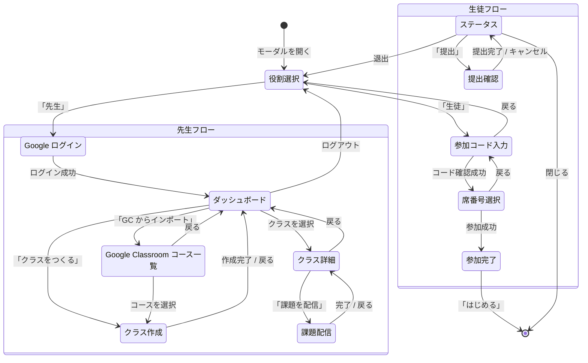

# UI/UX

## 画面遷移図

## フェーズ一覧

### 共通

| フェーズ | data-testid | 説明 |
|---------|-------------|------|
| 役割選択 | `classroom-phase-role-select` | 先生 / 生徒を選択 |

### 先生フロー

| フェーズ | data-testid | 説明 |
|---------|-------------|------|
| Google ログイン | `classroom-phase-teacher-login` | Google アカウントでサインイン |
| ダッシュボード | `classroom-phase-teacher-dashboard` | クラス一覧・作成・インポート |
| クラス作成 | `classroom-phase-teacher-create` | クラス名と人数を入力して作成 |
| クラス詳細 | `classroom-phase-teacher-detail` | メンバーグリッド + 提出管理（ワイドモーダル） |
| GC コース一覧 | `classroom-phase-teacher-google-courses` | Google Classroom のコース選択 |
| 課題配信 | `classroom-phase-teacher-post-assignment` | Google Classroom に課題を投稿 |

### 生徒フロー

| フェーズ | data-testid | 説明 |
|---------|-------------|------|
| 参加コード入力 | `classroom-phase-student-join` | 6文字の参加コードを入力 |
| 席番号選択 | `classroom-phase-student-seat` | 空いている席番号を選ぶ |
| 参加完了 | `classroom-phase-student-joined` | 参加成功メッセージ |
| ステータス | `classroom-phase-student-status` | 提出状況の確認・提出ボタン |
| 提出確認 | `classroom-phase-submit-confirm` | サムネイルプレビュー付き確認画面 |

## 各フェーズの詳細

### 役割選択

モーダルを開いたときの初期画面です。「先生」と「生徒」のボタンが表示されます。

生徒が既にクラスに参加している場合は、自動的に **ステータス** 画面が表示されます（localStorage にセッション情報が保存されているため）。

### 先生: Google ログイン

Google アカウントでサインインする画面です。「Google でログイン」ボタンを押すと Google の認証画面が開きます。

### 先生: ダッシュボード

先生のメイン画面です。作成したクラスがカード形式で一覧表示されます。

各カードに表示される情報:
- クラス名
- 参加コード
- 生徒数
- 有効期限

操作ボタン:
- 「クラスをつくる」— 新規クラス作成
- 「Google Classroom からインポート」— GC コースからインポート
- 「詳細」— クラス詳細画面へ
- 「ログアウト」— 先生セッション終了

### 先生: クラス詳細

クラスの参加状況と提出を管理する画面です。モーダルが**ワイド表示 (968px)** に広がります。

**左側: 座席グリッド**

座席番号が格子状に並び、各セルの色で状況が分かります:

| 色 | 状態 |
|----|------|
| グレー | 空席 |
| 青 | 着席（未提出） |
| 緑 | 提出済み |
| オレンジ | 返却済み |

**右側: 詳細パネル**

座席をクリックすると、右側に詳細情報が表示されます:
- 生徒の席番号・ニックネーム
- 提出されたプロジェクトのサムネイル
- スクリーンショット（スワイプ可能）
- 「Smalruby で開く」ボタン
- 「返却」ボタン + コメント入力欄

**上部: クラスコード表示**

参加コードを大きく表示する機能があります。プロジェクターで投影するときに便利です。

座席をクリックすると、右側に詳細パネルが表示されます:

### 先生: クラス作成

課題名と人数を入力してクラスを作成する画面です。人数のデフォルトは35人です。

### 生徒: 参加コード入力

6文字の参加コードを入力する画面です。入力は自動的に大文字に変換されます。

### 生徒: 席番号選択

クラスの座席がグリッド表示されます。空いている席番号をタップして選択し、「参加」ボタンを押します。

既に使われている席番号はグレーアウトされ、選択できません。

### 生徒: 参加完了

参加が成功するとクラス名と席番号が表示されます。メニューバーにもクラス情報が表示されます。

### 生徒: ステータス

参加中の生徒がモーダルを開いたときに表示される画面です。

表示情報:
- クラス名
- 席番号
- 参加日時
- 提出状況（未提出 / 提出済み / 返却済み）
- 先生からのコメント（返却時）

操作ボタン:
- 「提出」/「再提出」— 現在のプロジェクトを提出
- 「退出」— クラスから退出
- 「閉じる」— モーダルを閉じる
- 更新ボタン (↻) — 最新の状況を取得

提出後は「再提出する」ボタンに変わり、提出時刻が表示されます:

### 生徒: 提出確認

提出前の確認画面です。プロジェクトのサムネイルがプレビュー表示されます。

「提出する」を押すと:
1. プロジェクトファイル (.sb3) を保存
2. サムネイルを生成
3. ステージのスクリーンショットを撮影
4. Presigned URL 経由で S3 にアップロード

## モーダルサイズ

| フェーズ | 幅 |
|---------|------|
| 通常のフェーズ | 500px |
| クラス詳細 (teacher-detail) | 968px |

## 自動更新

先生のクラス詳細画面では、メンバーと提出情報が **30秒ごと** に自動更新されます（`CLASSROOM_REFRESH_INTERVAL_MS` で設定可能）。

## localStorage 永続化

| キー | 内容 |
|------|------|
| `smalruby:classroom` | 生徒のセッション情報 (JSON) |

生徒がクラスに参加すると、以下の情報が localStorage に保存されます:
- `role`, `classroomId`, `className`, `joinCode`
- `seatNumber`, `memberId`, `sessionToken`
- `joinedAt`, `submissionStatus`, `lastSubmittedAt`

ブラウザを閉じて再度開いても、セッションが有効であれば自動的に復帰します。

## レスポンシブ対応

現在の実装はデスクトップ向けです。タブレット (iPad) での利用も想定していますが、スマートフォンでの利用は想定外です。
