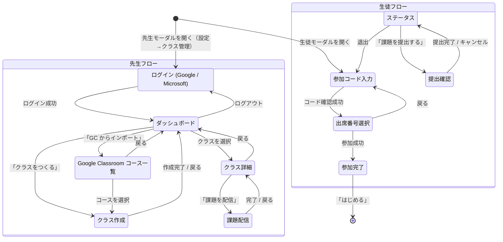
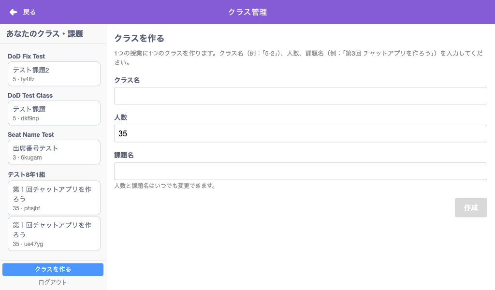

# UI/UX

## 画面遷移図

---

## メニューバー

メニューバーの右端に「クラス」ボタンが表示されます（`CLASSROOM_API_ENDPOINT` 環境変数が設定されている場合）。

**パーツ:**

| 要素 | テキスト/内容 | data-testid |
|------|-------------|-------------|
| 設定メニュー | ⚙ アイコン | `settings-menu` |
| クラス管理メニュー | 「クラス管理...」（設定メニュー内） | `settings-classroom-management` |
| クラスボタン | 「クラス」（未参加時） | `classroom-menu-button` |
| ラベル | — | `classroom-menu-label` |

生徒がクラスに参加中の場合、ボタンのテキストは固定の「クラス:出席番号NN」表記に変わります (NN は 0 埋め 2 桁):

| 要素 | テキスト/内容 | data-testid |
|------|-------------|-------------|
| ラベル全体 | 例: 「クラス:出席番号03」 | `classroom-menu-label` |
| 出席番号 (内側 span) | 例: 「03」 | `classroom-menu-seat-number` |

未参加時はラベルが「クラス」のみになる。 課題名 / クラス名はメニューに表示せず、モーダル内でのみ確認する設計。

---

## 共通: モーダル構造

すべてのフェーズは `classroom-modal` モーダル内に表示されます。

| 要素 | data-testid | 備考 |
|------|-------------|------|
| モーダル全体 | `classroom-modal` | |
| ヘッダー | — | 紫色、「クラス」タイトル |
| 閉じるボタン (×) | — | ヘッダー右端 |
| ローディング表示 | `classroom-loading` | API 通信中に表示 |
| エラー表示 | `classroom-error` | エラーメッセージ |
| エラーアクションリンク | `classroom-error-action` | セッション切れ時に「参加画面を表示」等 |
| セッション切れ Alert | — | Alert バナー（オレンジ帯）がモーダルの上に表示。「参加しなおす」ボタン付き |

---

## 1. 先生: ログイン (`teacher-login`)

Google または Microsoft アカウントでサインインする画面。先生は「設定 → クラス管理」メニューからアクセスします。

**パーツ:**

| 要素 | テキスト/内容 | data-testid | 操作 |
|------|-------------|-------------|------|
| フェーズルート | — | `classroom-phase-teacher-login` | — |
| 戻るリンク | 「< 戻る」 | `classroom-back` | → teacher-dashboard |
| 見出し | 「ログイン」 | — | — |
| 説明文 | 「アカウントでログインして、クラスを管理します。」 | — | — |
| ヒント | 「学校の Google Workspace for Education のアカウントで…」 | — | — |
| Google ログインボタン | 「Googleでログイン」 | `classroom-google-login` | Google 認証画面を開く |
| Microsoft ログインボタン | 「Microsoftでログイン」 | `classroom-microsoft-login` | Microsoft 認証ポップアップを開く |
| カルーセル | 右ペインに機能紹介画像（4枚、5秒ごと自動切替） | — | ドットクリックで手動切替 |

**レイアウト:** 左右分割レイアウト。左ペイン: ログインフォーム（Google / Microsoft の2つのログインボタン）、右ペイン: 画像カルーセル（薄いグレー背景）。1024x600 の画面でもスクロールなしで表示。

**セッション管理:** Google / Microsoft ID Token（1時間有効）。期限切れ時はプロバイダーに応じたサイレント再認証を試行し、透過的にトークンを更新。失敗時のみ Alert バナーを表示。詳細は [Microsoft 認証](microsoft-authentication.md) を参照。

---

## 2. 先生: ダッシュボード (`teacher-dashboard`)

先生のメイン画面。作成したクラスがカード形式で一覧表示されます。

**パーツ:**

| 要素 | テキスト/内容 | data-testid | 操作 |
|------|-------------|-------------|------|
| フェーズルート | — | `classroom-phase-teacher-dashboard` | — |
| 見出し | 「あなたのクラス」 | — | — |
| クラス一覧 | — | `classroom-list` | — |
| クラスなし表示 | 「まだクラスがありません」 | `classroom-empty-message` | クラスが0件時に表示 |

**クラスカード (各クラスごと):**

| 要素 | テキスト例 | data-testid | 操作 |
|------|----------|-------------|------|
| カード | — | `classroom-item-{classroomId}` | — |
| クラス名 | 「第3回 チャットアプリを作ろう」 | `classroom-item-name-{classroomId}` | — |
| 参加コード | 「3cexm5」 | `classroom-item-code-{classroomId}` | 青い等幅フォント、右上 |
| 情報行 | 「35人  2026/4/5  有効期限: 2026/4/6」 | — | 人数・作成日・有効期限 |
| 詳細ボタン | 「詳細」 | `classroom-item-details-{classroomId}` | → teacher-detail |
| 共同管理バッジ | 「共同管理」(自分が co-teacher のクラスのみ) | `classroom-item-co-managed-badge-{classroomId}` | 作成者クラスと区別 |

**フッターボタン:**

| 要素 | テキスト | data-testid | 操作 |
|------|---------|-------------|------|
| ログアウト | 「ログアウト」 | `classroom-teacher-logout` | → teacher-login |
| クラス作成 | 「クラスを作る」 | `classroom-create` | → teacher-create（青色、強調） |
| GCインポート | 「Google Classroom からインポート」 | `classroom-google-import` | → teacher-google-courses |

**レイアウト:** サイドバー（左）にクラス一覧、メインエリア（右）にクラス詳細またはプロンプト。フッターにクラス作成ボタンとログアウト。

**チュートリアル:** 初回ログイン後、ダッシュボードにチュートリアルダイアログが表示される（「まずは「クラス」を作りましょう！」）。OK クリックで非表示。

---

## 3. 先生: クラス作成 (`teacher-create`)

クラス名・人数・課題名を入力してクラスを作成する画面。

**パーツ:**

| 要素 | テキスト/内容 | data-testid | 操作 |
|------|-------------|-------------|------|
| フェーズルート | — | `classroom-phase-teacher-create` | — |
| 見出し | 「クラスを作る」 | — | — |
| 説明文 | 「1つの授業に1つのクラスを作ります。クラス名（例：「5-2」）、人数、課題名（例：「第3回 チャットアプリを作ろう」）を入力してください。」 | — | — |
| GCインポートリンク | 「Google Classroom からクラス名と人数をインポート」 | `classroom-import-from-gc` | → teacher-google-courses |
| クラス名ラベル | 「クラス名」 | — | — |
| クラス名入力 | テキスト入力 | `classroom-name-input` | — |
| 人数ラベル | 「人数」 | — | — |
| 人数入力 | 数値入力（デフォルト: 35） | `classroom-count-input` | 1〜50 |
| 課題名ラベル | 「課題名」 | — | — |
| 課題名入力 | テキスト入力 | `classroom-assignment-name-input` | — |
| ヒント | 「人数と課題名はいつでも変更できます。」 | — | — |
| 作成ボタン | 「作成」 | `classroom-create-submit` | クラス名または課題名未入力時は disabled |

**レイアウト:** フォームフィールドは縦並び。「作成」ボタンは右寄せ、灰色（disabled） or 青色。

Google Classroom からインポートした場合は「インポート元: {コース名}」が表示され、人数が自動入力されます。

---

## 4. 先生: クラス詳細 (`teacher-detail`)

クラスの参加状況と提出を管理する画面。モーダルが**ワイド表示 (968px)** に広がります。

### 空席のみの状態

### 提出があった状態（5番が緑 = 提出済み）

### メンバー詳細パネル（右側）

**左カラム パーツ:**

| 要素 | テキスト例 | data-testid | 操作 |
|------|----------|-------------|------|
| フェーズルート | — | `classroom-phase-teacher-detail` | — |
| 戻るリンク | 「< 戻る」 | `classroom-back` | → teacher-dashboard |
| クラス名 | 「第3回 チャットアプリを作ろう」 | `classroom-detail-name` | — |
| 参加コード表示 | 「参加コード: 3cexm5」 | `classroom-detail-join-code` | 大きなフォントで中央表示 |
| コード拡大ボタン | ⛶ アイコン（ツールチップ: 「全画面表示」） | `classroom-detail-expand-code` | 全画面コード表示 |
| 有効期限 | 「有効期限: 2026/4/6」 | — | — |
| メンバー見出し | 「メンバー」 | — | — |
| メンバー数 | 「1 / 35」 | `classroom-members-count` | 参加人数 / 最大人数 |
| 更新ボタン | ↻ アイコン | `classroom-refresh` | メンバー・提出を再取得 |
| 座席グリッド | — | `classroom-members-grid` | — |
| 全作品ダウンロード | 「全作品ダウンロード」 | `classroom-download-all` | 左寄せ |
| クラス削除ボタン | 「クラスを削除」 | `classroom-delete-classroom` | 赤枠ボタン、右寄せ |

**座席グリッド:**

座席番号が格子状に並び（1行 10列）、各セルの背景色で状態を表します。

| セルの色 | 状態 | テキスト |
|---------|------|---------|
| 青 (`#4c97ff`) | 空席 | 出席番号のみ (例: 「5」) |
| グレー (`#d9d9d9`) | 着席（未提出） | 出席番号（下線付き） |
| 緑 (`#0fbd8c`) | 提出済み | 「✓」+ 出席番号 (例: 「✓5」) |
| オレンジ (`#ff8c1a`) | 返却済み | 出席番号 |

色は生徒側の出席番号選択画面と統一されている: 青 = 「空き / 選択可能 (生徒視点では選べる席、先生視点では未参加)」、灰色 = 「使用中」。

セルをクリックすると右カラムに詳細パネルが表示されます。

**右カラム — メンバー詳細パネル:**

メンバー未選択時は「出席番号をクリックして生徒の詳細を見る」と表示。

| 要素 | テキスト例 | data-testid | 操作 |
|------|----------|-------------|------|
| パネル全体 | — | `classroom-member-detail` | — |
| 席番号ヘッダー | 「出席番号05」 | `classroom-member-detail-seat` | — |
| ニックネーム | 「- 」(未設定時) | `classroom-member-detail-name` | — |
| 提出時刻 | 「✓ 19:11:54」 | `classroom-member-detail-submitted` | 緑色テキスト |
| 着席状態 | 「着席中」 | `classroom-member-detail-seated` | 青色テキスト |
| 削除リンク | 「削除」 | `classroom-member-remove` | 赤色テキスト |
| サムネイル画像 | — | `classroom-member-detail-thumbnail` | プロジェクトのサムネイル |
| プロジェクト名 | 「第１回チャットアプリを作ろう」 | — | サムネイル下 |
| 「スモウルビーで開く」 | — | `classroom-member-detail-open` | 青色ボタン、全幅 |
| コメント入力 | textarea (placeholder: 「...」) | `classroom-member-detail-comment` | — |
| 返却ボタン | 「返却する」 | `classroom-member-detail-return` | オレンジ色ボタン、全幅 |

スクリーンショットが複数枚ある場合:

| 要素 | data-testid | 操作 |
|------|-------------|------|
| 画像インデックス | `classroom-member-detail-image-index` | 「1/3」等 |
| 前の画像ボタン | `classroom-member-detail-prev` | — |
| 次の画像ボタン | `classroom-member-detail-next` | — |

**共同管理者セクション (co-teachers):**

座席グリッドの下・フッター（全作品DL / クラス削除）の上に表示。owner または co-teacher が、別の先生を **email で招待**して共同管理できる（→ [architecture.md の共同管理](architecture.md#共同管理co-teacher)）。

| 要素 | テキスト例 | data-testid | 操作 |
|------|----------|-------------|------|
| セクション全体 | 見出し「Co-teachers」 | `classroom-co-teachers` | — |
| 未登録表示 | 「No co-teachers yet.」 | `classroom-co-teachers-empty` | co-teacher が0件時 |
| 一覧の各項目 | 「co@example.com」 | `classroom-co-teacher-item-{email}` | — |
| 解除ボタン | 「Remove」 | `classroom-co-teacher-remove-{email}` | 共同管理者を解除 |
| 招待入力 | email 入力 (placeholder: teacher@example.com) | `classroom-co-teacher-invite-input` | Enter でも招待 |
| 招待ボタン | 「Invite」 | `classroom-co-teacher-invite-submit` | email 未入力時は disabled |

招待された先生は次回ログイン時、ダッシュボードに該当クラスが**「共同管理」バッジ**付きで表示される（即時反映・承認不要）。

**コード表示 (全画面):**

コード拡大ボタン (⛶) をクリックすると、参加コードが全画面表示されます (Portal 使用)。タイトルは「参加コード」、フッターにクラス名・人数・課題名・日付が表示されます。

| 要素 | data-testid | 操作 |
|------|-------------|------|
| 招待リンクコピー | `classroom-code-display-copy-link` | クリップボードにコピー |
| 全画面表示 | `classroom-code-display-expand` | — |
| 全画面解除 | `classroom-code-display-shrink` | — |
| 閉じる | `classroom-code-display-close` | — |

**削除確認ダイアログ:**

「クラスを削除」ボタンを押すと確認ダイアログが表示されます。

| 要素 | テキスト | data-testid | 操作 |
|------|---------|-------------|------|
| 確認ボタン | 「削除」 | `classroom-delete-confirm` | クラス削除を実行 |
| キャンセルボタン | 「キャンセル」 | `classroom-delete-cancel` | ダイアログを閉じる |

---

## 5. 生徒: 参加コード入力 (`student-join`)

6文字の参加コードを入力する画面。生徒がモーダルを開いたときの初期画面です。

生徒が既にクラスに参加している場合（localStorage にセッション情報あり）は、この画面をスキップして**ステータス**画面に直接遷移します。

**パーツ:**

| 要素 | テキスト/内容 | data-testid | 操作 |
|------|-------------|-------------|------|
| フェーズルート | — | `classroom-phase-student-join` | — |
| 見出し | 「参加コードを入力」 | — | — |
| コード入力 | 6文字入力欄 (placeholder: ○○○○○○) | `classroom-join-code-input` | 自動大文字変換 |
| 次へボタン | 「次へ」 | `classroom-join-submit` | コード未入力/不正時は disabled |
| ヒントボックス | — | — | 青系背景のボックス |
| ヒントタイトル | 「ヒント」 | — | 青色太字 |
| ヒント1行目 | 「先生から参加コードを聞いてください。」 | — | — |
| ヒント2行目 | 「先生は「⚙ 設定 → クラス管理」から参加コードを確認できます。」 | — | — |

**レイアウト:** 入力欄は中央寄せ、幅広のテキスト入力。「次へ」ボタンは右寄せ。ヒントボックスはフォーム下部に表示。

---

## 6. 生徒: 出席番号選択 (`student-seat`)

クラスの座席がグリッド表示され、空いている出席番号を選択します。

**パーツ:**

| 要素 | テキスト/内容 | data-testid | 操作 |
|------|-------------|-------------|------|
| フェーズルート | — | `classroom-phase-student-seat` | — |
| 見出し | 「出席番号を選んでください」 | — | — |
| 座席グリッド | — | `classroom-seat-grid` | — |
| 各席番号ボタン | 「1」〜「35」等 | `classroom-seat-{n}` | クリックで選択状態に |
| 選択中の席番号 | — | `classroom-selected-seat` | hidden要素、値取得用 |
| 参加ボタン | 「参加する」 | `classroom-confirm-seat` | 席未選択時は disabled |

**座席グリッドの色:**

| ボタンの色 | 状態 |
|----------|------|
| 青 (`#4285f4`) | 空席（選択可能） |
| グレー (disabled) | 使用中（選択不可） |
| 濃い青 (selected) | 選択中 |

**レイアウト:** ボタンは1行8列のグリッド。「参加する」ボタンは右下、灰色 (disabled) or 青色。

---

## 7. 生徒: 参加完了 (`student-joined`)

参加が成功したときの確認画面。メニューバーにもクラス情報が表示されます。
プロジェクト名が課題名に自動変更されます。

**パーツ:**

| 要素 | テキスト例 | data-testid | 操作 |
|------|----------|-------------|------|
| フェーズルート | — | `classroom-phase-student-joined` | — |
| 詳細 | 「テスト8年1組 / 出席番号03」 | `classroom-joined-details` | — |
| クラス名 | 「テスト8年1組」 | `classroom-joined-class-name` | — |
| 出席番号 | 「出席番号03」（0埋め2桁） | `classroom-joined-seat-number` | — |
| 課題名 | 「第１回チャットアプリを作ろう」 | `classroom-joined-assignment` | 課題名がある場合のみ表示 |
| つぎにやること（ヒント） | 「1. この画面を閉じてプロジェクトを作ろう / 2. できたら、メニューバーの課題名を押して提出しよう」 | — | 青系背景のヒントボックス |
| はじめるボタン | 「はじめる」 | `classroom-joined-close` | モーダルを閉じる |

**レイアウト:** クラス名と出席番号は中央表示。課題名はその下にやや小さいフォントで表示。「つぎにやること」ヒントボックスが課題名の下に表示され、参加後の次のアクションを案内する。「はじめる」ボタンは青色、右寄せ。

---

## 8. 生徒: ステータス (`student-status`)

参加中の生徒がモーダルを開いたときに表示される画面。提出状況を確認し、提出/退出ができます。

### 未提出の状態

### 提出済みの状態

**情報テーブル:**

| 行ラベル | 値の例 | data-testid (値部分) |
|---------|-------|---------------------|
| 「クラス」 | 「テスト8年1組」 | `classroom-status-class-name` |
| 「出席番号」 | 「03」（0埋め2桁） | `classroom-status-seat-number` |
| 「課題」 | 「第１回チャットアプリを作ろう」 | `classroom-status-assignment` |
| 「参加日時」 | 「2026/4/8 00:07」（秒なし） | `classroom-status-joined-at` |
| 「提出状況」 | 「未提出」or「✓ 提出済み (00:08)」 | `classroom-submit-status` |

提出状況行の右端に更新ボタンがあります:

| 要素 | data-testid | 操作 |
|------|-------------|------|
| 更新ボタン (↻) | `classroom-student-refresh` | 最新の提出状況を取得 |

返却済みの場合、先生からのコメントが表示されます:

| 要素 | data-testid |
|------|-------------|
| 先生からのコメント | `classroom-status-teacher-comment` |

**未提出時ヒント:**

未提出の場合、フッターの上に以下のヒントが表示されます:

| 要素 | テキスト | 備考 |
|------|---------|------|
| 提出ヒント | 「プロジェクトが完成したら「課題を提出する」を押してください。」 | 未提出時のみ表示 |

**フッターボタン (左右に配置):**

| 要素 | テキスト (未提出時) | テキスト (提出済み) | data-testid | 操作 |
|------|-------------------|-------------------|-------------|------|
| 退出ボタン | 「退出する」 | 「退出する」 | `classroom-leave` | → student-join |
| 提出ボタン | 「課題を提出する」 | 「課題を再提出する」 | `classroom-submit-button` | → submit-confirm |

**レイアウト:** 情報テーブルは白背景のカード内。フッターは `[退出する]` が左、`[課題を提出する]` が右。

**セッション切れ時:**

セッションが無効になった場合、エラーメッセージと「参加画面を表示」リンクが表示されます。

---

## 9. 生徒: 提出確認 (`submit-confirm`)

提出前の確認画面。プロジェクトのサムネイルがプレビュー表示されます。

**パーツ:**

| 要素 | テキスト/内容 | data-testid | 操作 |
|------|-------------|-------------|------|
| フェーズルート | — | `classroom-phase-submit-confirm` | — |
| 見出し | 「作品を提出します」 | — | — |
| サムネイルプレビュー | ステージのスクリーンショット画像 | `classroom-submit-preview` | — |
| 確認メッセージ | 「現在のプロジェクトを提出してよろしいですか？」 | — | — |
| キャンセルボタン | 「キャンセル」 | `classroom-submit-cancel` | → student-status |
| 提出ボタン | 「提出する」 | `classroom-submit-confirm` | 送信中は「提出中...」に変化 |

**レイアウト:** サムネイルは中央の白枠内に表示。ボタンは横2列、右に「提出する」(青色)、左に「キャンセル」(白色ボーダー)。

「提出する」を押すと:
1. プロジェクトファイル (.sb3) を保存（ファイル名はプロジェクト名 = 課題名）
2. サムネイルを生成
3. ステージのスクリーンショットを撮影
4. Presigned URL 経由で S3 にアップロード
5. 完了後 → student-status に遷移

---

## 10. 先生: Google Classroom コース一覧 (`teacher-google-courses`)

Google Classroom のアクティブなコース一覧を表示し、インポートするコースを選択します。クラス作成画面の「Google Classroom からクラス名と人数をインポート」リンクから遷移します。

**パーツ:**

| 要素 | テキスト/内容 | data-testid | 操作 |
|------|-------------|-------------|------|
| フェーズルート | — | `classroom-phase-teacher-google-courses` | — |
| 戻るリンク | 「< 戻る」 | `classroom-back` | → teacher-create |
| 見出し | 「Google Classroom のクラス一覧」 | — | — |
| 説明文 | 「インポートするクラスを選択して「インポート」ボタンを押してください。」 | — | — |
| コースなし表示 | 「クラスが見つかりません」 | — | コースが0件時 |
| ローディング | スピナー | — | 読み込み中に表示 |
| インポートボタン | 「インポート」 | `classroom-google-import-confirm` | 未選択時は disabled。→ teacher-create（コース情報付き） |

**レイアウト:** 各コースは **タイルグリッド** (300×84px) で表示されます。クラス名とセクション名が表示されます。画面幅に応じてタイルの列数が変わります（レスポンシブ）。

**認可ヒント:** 初回インポート時、コース一覧画面上にオーバーレイで「Google Classroom からインポートする前に」チュートリアルが表示されます（チェックボックス確認の見本画像付き）。

---

## 11. 先生: 課題配信 (`teacher-post-assignment`)

Google Classroom にリンクしたクラスで、課題リンクを投稿する画面。クラス詳細の「課題を配信」ボタンから遷移します。

**パーツ:**

| 要素 | テキスト/内容 | data-testid | 操作 |
|------|-------------|-------------|------|
| フェーズルート | — | `classroom-phase-teacher-post-assignment` | — |
| 戻るリンク | 「< 戻る」 | `classroom-back` | → teacher-detail |
| ページタイトル | 「Google Classroom に課題を配信します」 | — | — |
| 対象 | 「対象: {クラス名}」 | — | — |
| タイトル入力 | テキスト入力（デフォルト: 課題名） | `classroom-post-assignment-title` | — |
| 説明入力 | テキストエリア | `classroom-post-assignment-description` | 任意 |
| ヒント | 「配信後、課題の詳細の装飾、割当先、点数などの設定は Google Classroom で行えます。…」 | — | — |
| 配信ボタン | 「Google Classroom に配信する」 | `classroom-post-assignment-submit` | — |

**配信後:** 成功すると「Google Classroom で確認する」リンクが表示されます。クラス詳細画面の「課題を配信」ボタンは「課題を確認」リンク（新しいタブで Google Classroom を開く）に変わります。二重配信を防止するため、配信済み状態は DynamoDB に永続化されます。
| 成功メッセージ | 「配信しました！」 | `classroom-post-assignment-success` | 配信成功時に表示 |

---

## モーダルサイズ

| フェーズ | 幅 |
|---------|------|
| 通常のフェーズ | 500px |
| クラス詳細 (teacher-detail) | 968px |

## 自動更新

先生のクラス詳細画面では、メンバーと提出情報が **30秒ごと** に自動更新されます（`CLASSROOM_REFRESH_INTERVAL_MS` で設定可能）。

## localStorage 永続化

| キー | 内容 |
|------|------|
| `smalruby:classroom` | 生徒のセッション情報 (JSON) |

生徒がクラスに参加すると、以下の情報が localStorage に保存されます:
- `role`, `classroomId`, `className`, `assignmentName`, `joinCode`
- `seatNumber`, `memberId`, `sessionToken`
- `joinedAt`, `submissionStatus`, `lastSubmittedAt`

ブラウザを閉じて再度開いても、セッションが有効であれば自動的に復帰します。

## classcode URL パラメータ

`?classcode=XXXXXX` で参加コード入力をスキップして自動参加フローに入ります。このパラメータは**初回のモーダルオープン時のみ有効**で、消費後はキャッシュからも削除されます。再度モーダルを開いた場合は通常のフローになります。

## レスポンシブ対応

現在の実装はデスクトップ向けです。タブレット (iPad) での利用も想定していますが、スマートフォンでの利用は想定外です。
