# UI/UX

## 画面遷移図

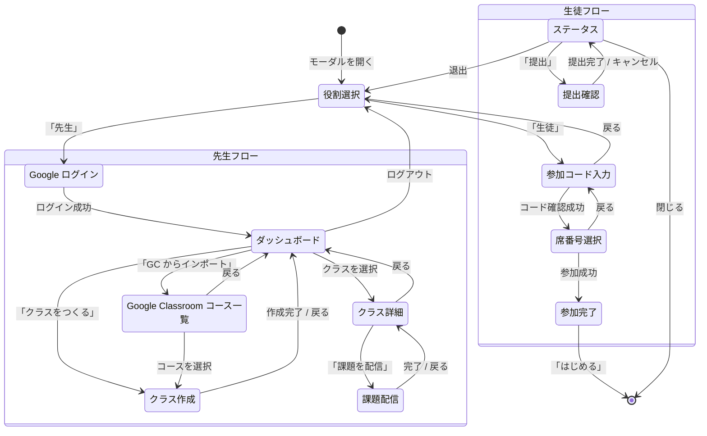

---

## メニューバー

メニューバーの右端に「クラス」ボタンが表示されます（`?features=classroom` が必要）。

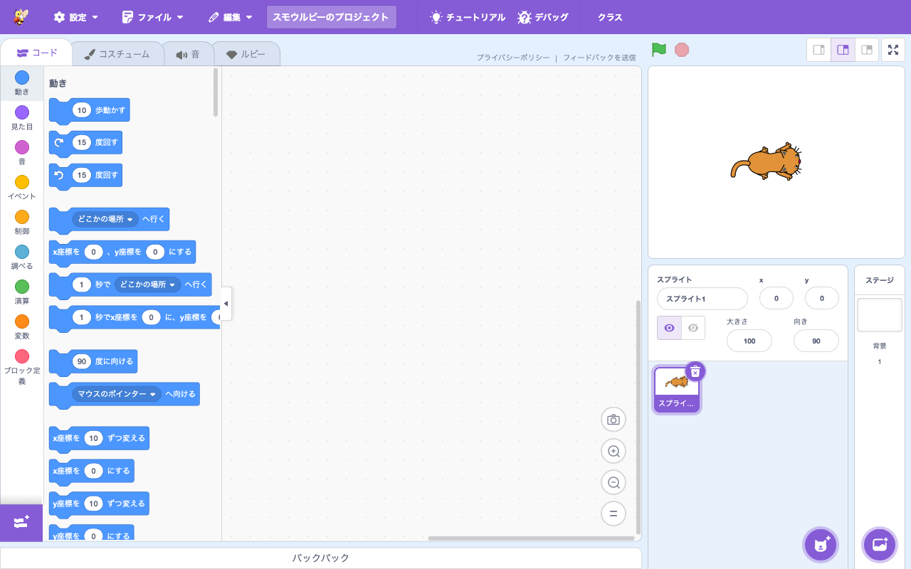

**パーツ:**

| 要素 | テキスト/内容 | data-testid |
|------|-------------|-------------|
| クラスボタン | 「クラス」（未参加時） | `classroom-menu-label` |

生徒がクラスに参加中の場合、ボタンのテキストがクラス名と席番号に変わります:

| 要素 | テキスト/内容 | data-testid |
|------|-------------|-------------|
| クラス名表示 | 例: 「第3回 チャットアプリを作ろう」 | `classroom-menu-class-name` |
| 席番号表示 | 例: 「/ 5」 | `classroom-menu-seat-number` |

---

## 共通: モーダル構造

すべてのフェーズは `classroom-modal` モーダル内に表示されます。

| 要素 | data-testid | 備考 |
|------|-------------|------|
| モーダル全体 | `classroom-modal` | |
| ヘッダー | — | 紫色、「クラス」タイトル |
| 閉じるボタン (×) | — | ヘッダー右端 |
| ローディング表示 | `classroom-loading` | API 通信中に表示 |
| エラー表示 | `classroom-error` | エラーメッセージ |

---

## 1. 役割選択 (`role-select`)

モーダルを開いたときの初期画面。先生か生徒かを選択します。

生徒が既にクラスに参加している場合（localStorage にセッション情報あり）は、この画面をスキップして**ステータス**画面に直接遷移します。

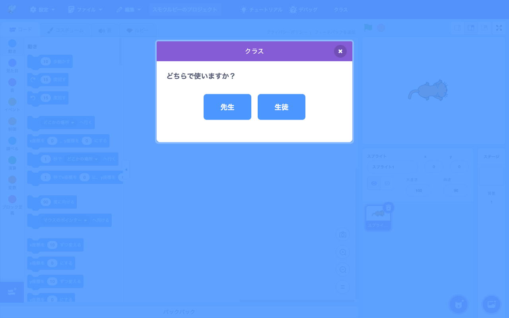

**パーツ:**

| 要素 | テキスト/内容 | data-testid | 操作 |
|------|-------------|-------------|------|
| フェーズルート | — | `classroom-phase-role-select` | — |
| プロンプト | 「どちらで使いますか？」 | — | — |
| 先生ボタン | 「先生」 | `classroom-role-teacher` | → teacher-login / teacher-dashboard |
| 生徒ボタン | 「生徒」 | `classroom-role-student` | → student-join |

**レイアウト:** 2つのボタンが横並び。青色の角丸ボタン。

---

## 2. 先生: Google ログイン (`teacher-login`)

Google アカウントでサインインする画面。

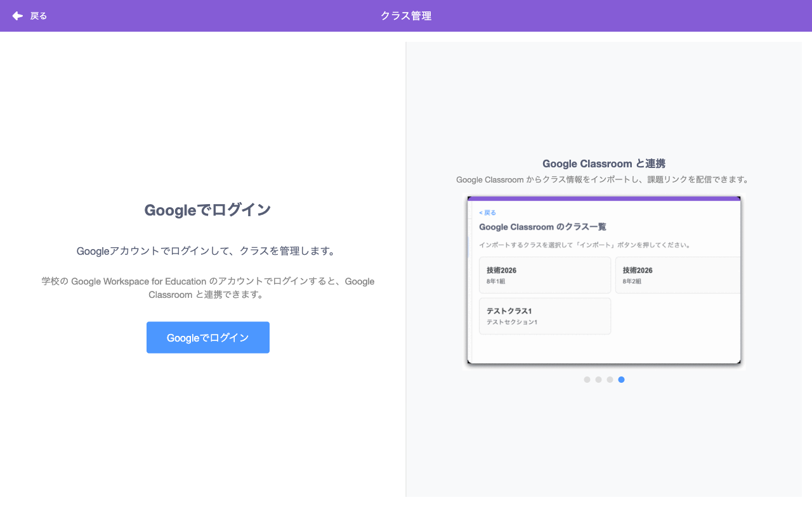

**パーツ:**

| 要素 | テキスト/内容 | data-testid | 操作 |
|------|-------------|-------------|------|
| フェーズルート | — | `classroom-phase-teacher-login` | — |
| 戻るリンク | 「< 戻る」 | `classroom-back` | → role-select |
| 見出し | 「Googleでログイン」 | — | — |
| 説明文 | 「Googleアカウントでログインして、クラスを管理します。」 | — | — |
| ログインボタン | 「Googleでログイン」 | `classroom-google-login` | Google 認証画面を開く |

**レイアウト:** ログインボタンは青色、右寄せ。

---

## 3. 先生: ダッシュボード (`teacher-dashboard`)

先生のメイン画面。作成したクラスがカード形式で一覧表示されます。

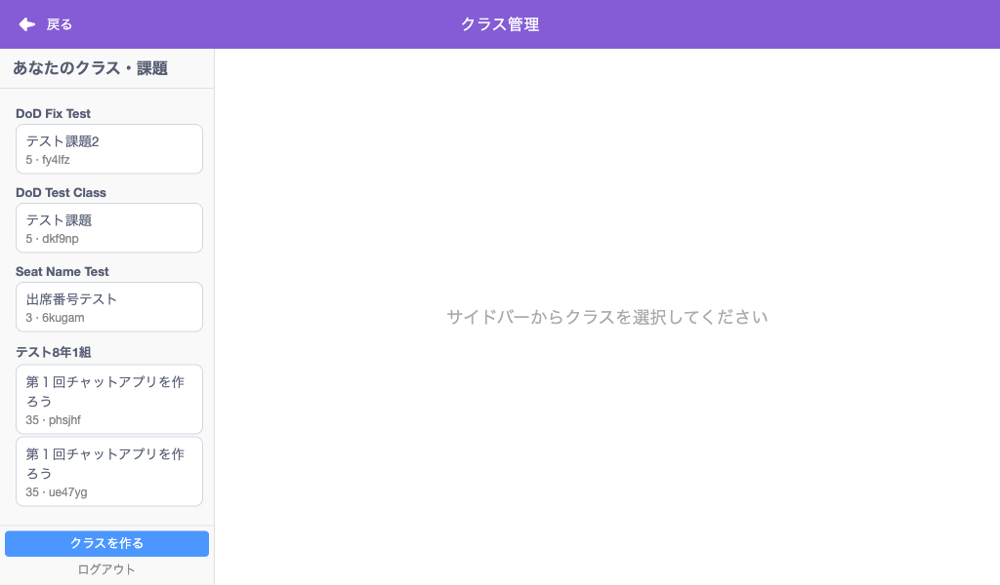

**パーツ:**

| 要素 | テキスト/内容 | data-testid | 操作 |
|------|-------------|-------------|------|
| フェーズルート | — | `classroom-phase-teacher-dashboard` | — |
| 見出し | 「あなたのクラス」 | — | — |
| クラス一覧 | — | `classroom-list` | — |
| クラスなし表示 | 「まだクラスがありません」 | `classroom-empty-message` | クラスが0件時に表示 |

**クラスカード (各クラスごと):**

| 要素 | テキスト例 | data-testid | 操作 |
|------|----------|-------------|------|
| カード | — | `classroom-item-{classroomId}` | — |
| クラス名 | 「第3回 チャットアプリを作ろう」 | `classroom-item-name-{classroomId}` | — |
| 参加コード | 「3cexm5」 | `classroom-item-code-{classroomId}` | 青い等幅フォント、右上 |
| 情報行 | 「35人  2026/4/5  有効期限: 2026/4/6」 | — | 人数・作成日・有効期限 |
| 詳細ボタン | 「詳細」 | `classroom-item-details-{classroomId}` | → teacher-detail |

**フッターボタン:**

| 要素 | テキスト | data-testid | 操作 |
|------|---------|-------------|------|
| ログアウト | 「ログアウト」 | `classroom-teacher-logout` | → role-select |
| クラス作成 | 「クラスを作る」 | `classroom-create` | → teacher-create（青色、強調） |
| GCインポート | 「Google Classroom からインポート」 | `classroom-google-import` | → teacher-google-courses |

**レイアウト:** カードは縦に並ぶ。各カードは白背景、ボーダー付き。フッターのボタンは横3列。

---

## 4. 先生: クラス作成 (`teacher-create`)

課題名と人数を入力してクラスを作成する画面。

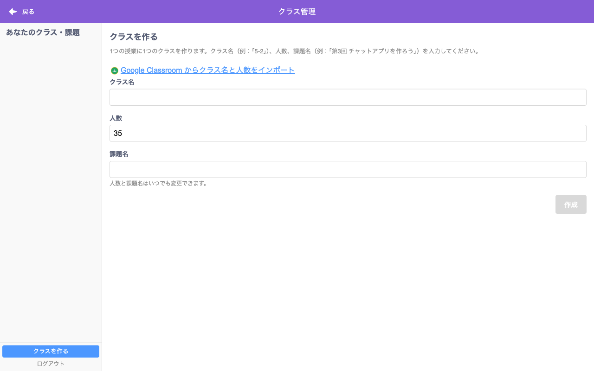

**パーツ:**

| 要素 | テキスト/内容 | data-testid | 操作 |
|------|-------------|-------------|------|
| フェーズルート | — | `classroom-phase-teacher-create` | — |
| 戻るリンク | 「< 戻る」 | `classroom-back` | → teacher-dashboard |
| 見出し | 「クラスを作る」 | — | — |
| ヒント | 「課題ごとにクラスを作成します。例:「第3回 チャットアプリを作ろう」」 | — | — |
| 課題名ラベル | 「課題名」 | — | — |
| 課題名入力 | テキスト入力 | `classroom-name-input` | — |
| 人数ラベル | 「人数」 | — | — |
| 人数入力 | 数値入力（デフォルト: 35） | `classroom-count-input` | 1〜50 |
| 作成ボタン | 「作成」 | `classroom-create-submit` | 課題名未入力時は disabled |
| フッター | 「作成後、Google Classroom に課題リンクを配信できます。」 | — | — |

**レイアウト:** フォームフィールドは縦並び。「作成」ボタンは右寄せ、灰色（disabled） or 青色。

Google Classroom からインポートした場合は「インポート元: {コース名}」が表示され、人数が自動入力されます。

---

## 5. 先生: クラス詳細 (`teacher-detail`)

クラスの参加状況と提出を管理する画面。モーダルが**ワイド表示 (968px)** に広がります。

### 空席のみの状態

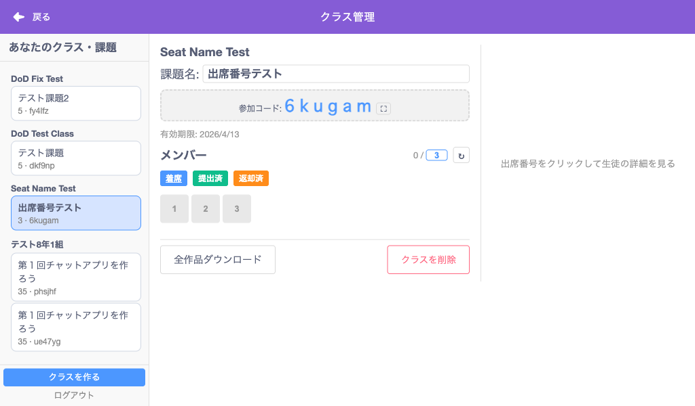

### 提出があった状態（5番が緑 = 提出済み）

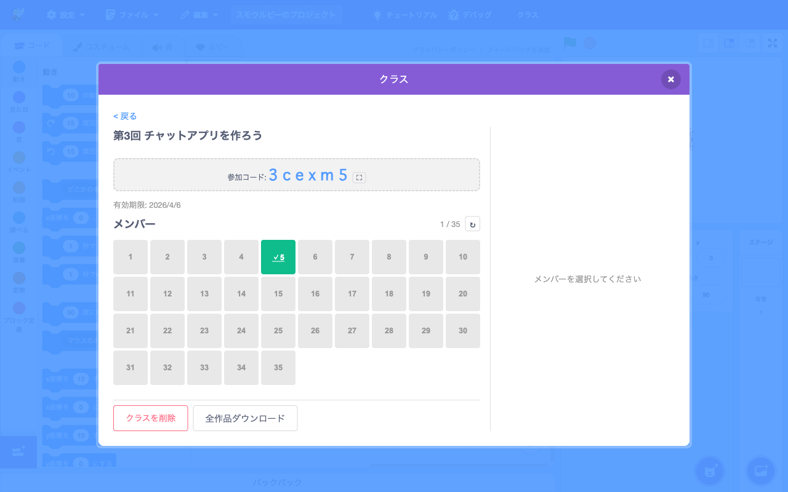

### メンバー詳細パネル（右側）

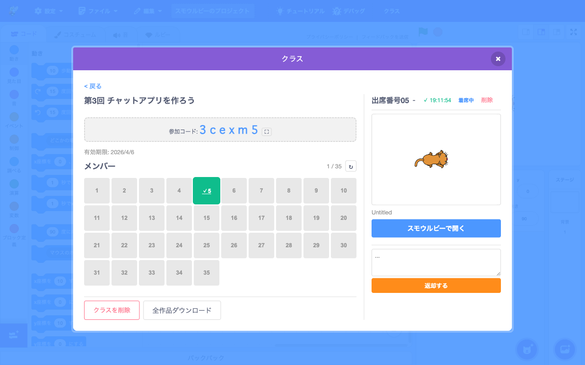

**左カラム パーツ:**

| 要素 | テキスト例 | data-testid | 操作 |
|------|----------|-------------|------|
| フェーズルート | — | `classroom-phase-teacher-detail` | — |
| 戻るリンク | 「< 戻る」 | `classroom-back` | → teacher-dashboard |
| クラス名 | 「第3回 チャットアプリを作ろう」 | `classroom-detail-name` | — |
| 参加コード表示 | 「参加コード: 3cexm5」 | `classroom-detail-join-code` | 大きなフォントで中央表示 |
| コード拡大ボタン | ⛶ アイコン | `classroom-detail-expand-code` | 全画面コード表示 |
| 有効期限 | 「有効期限: 2026/4/6」 | — | — |
| メンバー見出し | 「メンバー」 | — | — |
| メンバー数 | 「1 / 35」 | `classroom-members-count` | 参加人数 / 最大人数 |
| 更新ボタン | ↻ アイコン | `classroom-refresh` | メンバー・提出を再取得 |
| 座席グリッド | — | `classroom-members-grid` | — |
| クラス削除ボタン | 「クラスを削除」 | `classroom-delete-classroom` | 赤枠ボタン |
| 全作品ダウンロード | 「全作品ダウンロード」 | `classroom-download-all` | — |

**座席グリッド:**

座席番号が格子状に並び（1行 10列）、各セルの背景色で状態を表します。

| セルの色 | 状態 | テキスト |
|---------|------|---------|
| グレー (`#e0e0e0`) | 空席 | 席番号のみ (例: 「5」) |
| 青 (`#4285f4`) | 着席（未提出） | 席番号 |
| 緑 (`#34a853`) | 提出済み | 「✓」+ 席番号 (例: 「✓5」) |
| オレンジ (`#ff9800`) | 返却済み | 席番号 |

セルをクリックすると右カラムに詳細パネルが表示されます。

**右カラム — メンバー詳細パネル:**

メンバー未選択時は「メンバーを選択してください」と表示。

| 要素 | テキスト例 | data-testid | 操作 |
|------|----------|-------------|------|
| パネル全体 | — | `classroom-member-detail` | — |
| 席番号ヘッダー | 「出席番号05」 | `classroom-member-detail-seat` | — |
| ニックネーム | 「- 」(未設定時) | `classroom-member-detail-name` | — |
| 提出時刻 | 「✓ 19:11:54」 | `classroom-member-detail-submitted` | 緑色テキスト |
| 着席状態 | 「着席中」 | `classroom-member-detail-seated` | 青色テキスト |
| 削除リンク | 「削除」 | `classroom-member-remove` | 赤色テキスト |
| サムネイル画像 | — | `classroom-member-detail-thumbnail` | プロジェクトのサムネイル |
| プロジェクト名 | 「Untitled」 | — | サムネイル下 |
| 「スモウルビーで開く」 | — | `classroom-member-detail-open` | 青色ボタン、全幅 |
| コメント入力 | textarea (placeholder: 「...」) | `classroom-member-detail-comment` | — |
| 返却ボタン | 「返却する」 | `classroom-member-detail-return` | オレンジ色ボタン、全幅 |

スクリーンショットが複数枚ある場合:

| 要素 | data-testid | 操作 |
|------|-------------|------|
| 画像インデックス | `classroom-member-detail-image-index` | 「1/3」等 |
| 前の画像ボタン | `classroom-member-detail-prev` | — |
| 次の画像ボタン | `classroom-member-detail-next` | — |

**コード表示 (全画面):**

コード拡大ボタン (⛶) をクリックすると、参加コードが全画面表示されます (Portal 使用)。

| 要素 | data-testid | 操作 |
|------|-------------|------|
| 招待リンクコピー | `classroom-code-display-copy-link` | クリップボードにコピー |
| 全画面表示 | `classroom-code-display-expand` | — |
| 全画面解除 | `classroom-code-display-shrink` | — |
| 閉じる | `classroom-code-display-close` | — |

**削除確認ダイアログ:**

「クラスを削除」ボタンを押すと確認ダイアログが表示されます。

| 要素 | テキスト | data-testid | 操作 |
|------|---------|-------------|------|
| 確認ボタン | 「削除」 | `classroom-delete-confirm` | クラス削除を実行 |
| キャンセルボタン | 「キャンセル」 | `classroom-delete-cancel` | ダイアログを閉じる |

---

## 6. 生徒: 参加コード入力 (`student-join`)

6文字の参加コードを入力する画面。

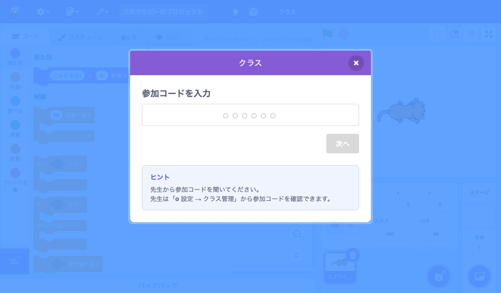

**パーツ:**

| 要素 | テキスト/内容 | data-testid | 操作 |
|------|-------------|-------------|------|
| フェーズルート | — | `classroom-phase-student-join` | — |
| 戻るリンク | 「< 戻る」 | `classroom-back` | → role-select |
| 見出し | 「参加コードを入力」 | — | — |
| コード入力 | 6文字入力欄 (placeholder: ○○○○○○) | `classroom-join-code-input` | 自動大文字変換 |
| 次へボタン | 「次へ」 | `classroom-join-submit` | コード未入力/不正時は disabled |

**レイアウト:** 入力欄は中央寄せ、幅広のテキスト入力。プレースホルダーの「○○○○○○」が6文字分表示。「次へ」ボタンは右寄せ。

---

## 7. 生徒: 席番号選択 (`student-seat`)

クラスの座席がグリッド表示され、空いている席番号を選択します。

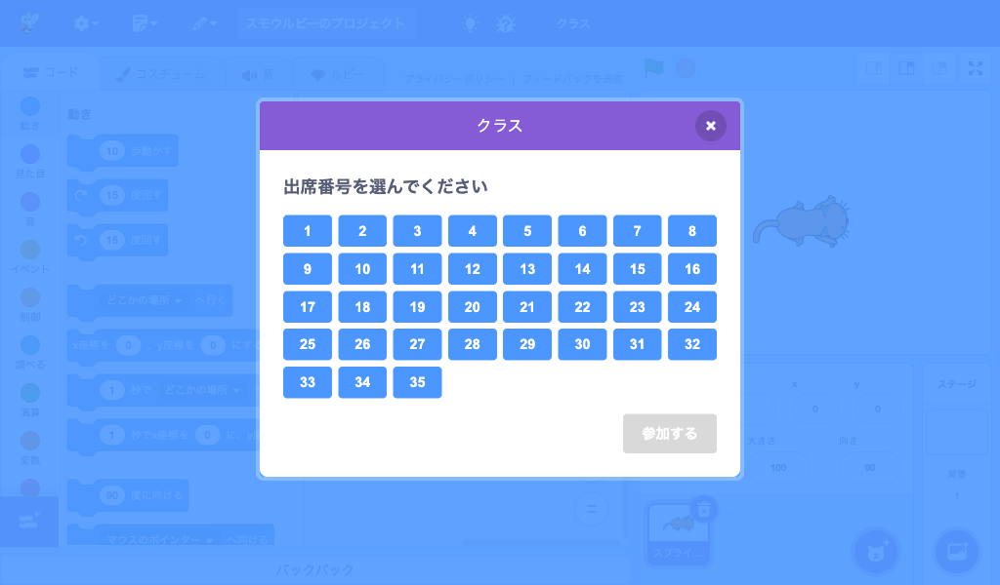

**パーツ:**

| 要素 | テキスト/内容 | data-testid | 操作 |
|------|-------------|-------------|------|
| フェーズルート | — | `classroom-phase-student-seat` | — |
| 見出し | 「席番号を選んでください」 | — | — |
| 座席グリッド | — | `classroom-seat-grid` | — |
| 各席番号ボタン | 「1」〜「35」等 | `classroom-seat-{n}` | クリックで選択状態に |
| 選択中の席番号 | — | `classroom-selected-seat` | hidden要素、値取得用 |
| 参加ボタン | 「参加する」 | `classroom-confirm-seat` | 席未選択時は disabled |

**座席グリッドの色:**

| ボタンの色 | 状態 |
|----------|------|
| 青 (`#4285f4`) | 空席（選択可能） |
| グレー (disabled) | 使用中（選択不可） |
| 濃い青 (selected) | 選択中 |

**レイアウト:** ボタンは1行8列のグリッド。「参加する」ボタンは右下、灰色 (disabled) or 青色。

---

## 8. 生徒: 参加完了 (`student-joined`)

参加が成功したときの確認画面。メニューバーにもクラス情報が表示されます。

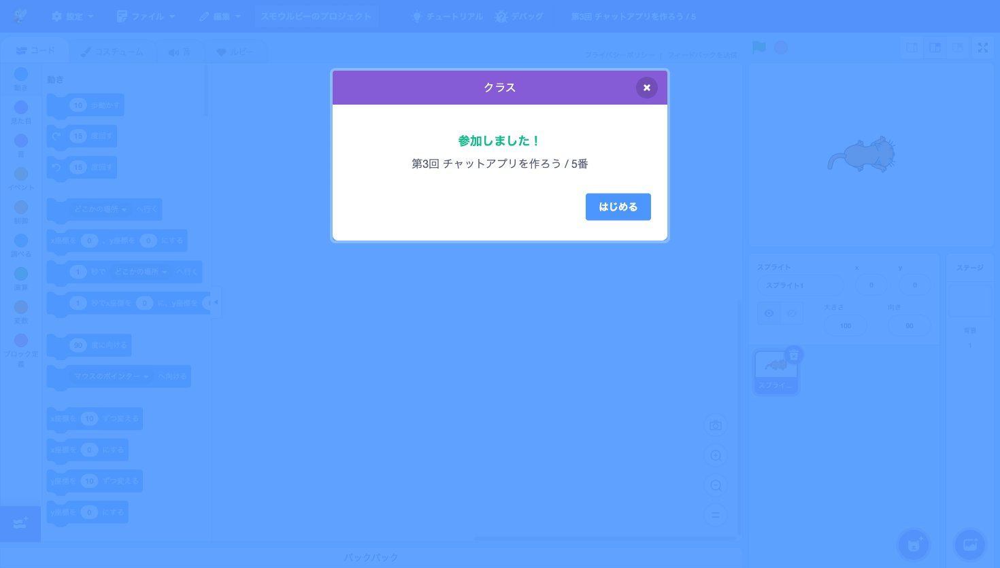

**パーツ:**

| 要素 | テキスト例 | data-testid | 操作 |
|------|----------|-------------|------|
| フェーズルート | — | `classroom-phase-student-joined` | — |
| 成功メッセージ | 「参加しました！」 | `classroom-joined-success` | 緑色テキスト、中央寄せ |
| 詳細 | 「第3回 チャットアプリを作ろう / 5番」 | `classroom-joined-details` | — |
| クラス名 | 「第3回 チャットアプリを作ろう」 | `classroom-joined-class-name` | — |
| 席番号 | 「5番」 | `classroom-joined-seat-number` | — |
| はじめるボタン | 「はじめる」 | `classroom-joined-close` | モーダルを閉じる |

**レイアウト:** 成功メッセージは緑色の太字、中央表示。「はじめる」ボタンは青色、右寄せ。

---

## 9. 生徒: ステータス (`student-status`)

参加中の生徒がモーダルを開いたときに表示される画面。提出状況を確認し、提出/退出ができます。

### 未提出の状態

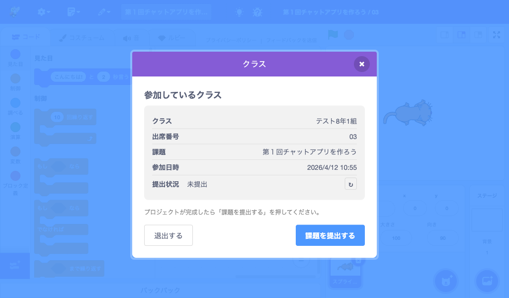

### 提出済みの状態

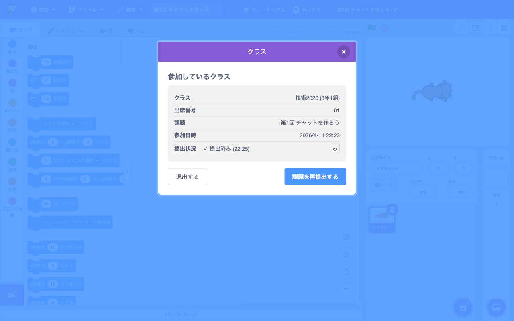

**情報テーブル:**

| 行ラベル | 値の例 | data-testid (値部分) |
|---------|-------|---------------------|
| 「クラス」 | 「第3回 チャットアプリを作ろう」 | `classroom-status-class-name` |
| 「席番号」 | 「5」 | `classroom-status-seat-number` |
| 「参加日時」 | 「2026/4/5 19:11:11」 | `classroom-status-joined-at` |
| 「提出」 | 「未提出」or「✓ 提出済み (19:11:54)」 | `classroom-submit-status` |

提出行の右端に更新ボタンがあります:

| 要素 | data-testid | 操作 |
|------|-------------|------|
| 更新ボタン (↻) | `classroom-student-refresh` | 最新の提出状況を取得 |

返却済みの場合、先生からのコメントが表示されます:

| 要素 | data-testid |
|------|-------------|
| コメント表示 | `classroom-status-teacher-comment` |

**フッターボタン (横3列):**

| 要素 | テキスト (未提出時) | テキスト (提出済み) | data-testid | 操作 |
|------|-------------------|-------------------|-------------|------|
| 提出ボタン | 「提出する」 | 「再提出する」 | `classroom-submit-button` | → submit-confirm |
| 退出ボタン | 「退出する」 | 「退出する」 | `classroom-leave` | → role-select |
| 閉じるボタン | 「閉じる」 | 「閉じる」 | `classroom-status-close` | モーダルを閉じる |

**レイアウト:** 情報テーブルは白背景のカード内。ボタンは横3列、「提出する」は青色強調、「退出する」は白、「閉じる」は青色。

---

## 10. 生徒: 提出確認 (`submit-confirm`)

提出前の確認画面。プロジェクトのサムネイルがプレビュー表示されます。

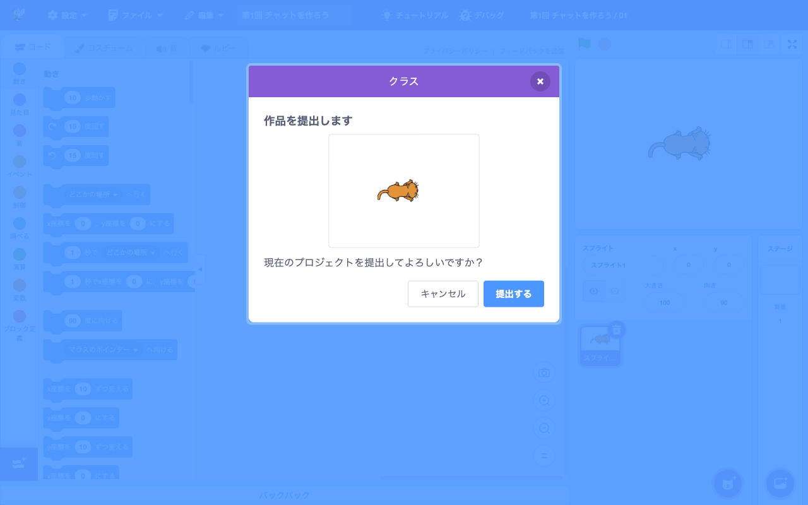

**パーツ:**

| 要素 | テキスト/内容 | data-testid | 操作 |
|------|-------------|-------------|------|
| フェーズルート | — | `classroom-phase-submit-confirm` | — |
| 見出し | 「作品を提出します」 | — | — |
| サムネイルプレビュー | ステージのスクリーンショット画像 | `classroom-submit-preview` | — |
| 確認メッセージ | 「現在のプロジェクトを提出してよろしいですか？」 | — | — |
| キャンセルボタン | 「キャンセル」 | `classroom-submit-cancel` | → student-status |
| 提出ボタン | 「提出する」 | `classroom-submit-confirm` | 送信中は「提出中...」に変化 |

**レイアウト:** サムネイルは中央の白枠内に表示。ボタンは横2列、右に「提出する」(青色)、左に「キャンセル」(白色ボーダー)。

「提出する」を押すと:
1. プロジェクトファイル (.sb3) を保存
2. サムネイルを生成
3. ステージのスクリーンショットを撮影
4. Presigned URL 経由で S3 にアップロード
5. 完了後 → student-status に遷移

---

## 11. 先生: Google Classroom コース一覧 (`teacher-google-courses`)

Google Classroom のアクティブなコース一覧を表示し、インポートするコースを選択します。

**パーツ:**

| 要素 | テキスト/内容 | data-testid | 操作 |
|------|-------------|-------------|------|
| フェーズルート | — | `classroom-phase-teacher-google-courses` | — |
| 戻るリンク | 「< 戻る」 | `classroom-back` | → teacher-dashboard |
| コースなし表示 | 「クラスが見つかりません」 | — | コースが0件時 |
| インポートボタン | 「インポート」 | `classroom-google-import-confirm` | → teacher-create（コース情報付き） |

各コースカードにはコース名・セクション・生徒数が表示されます。

---

## 12. 先生: 課題配信 (`teacher-post-assignment`)

Google Classroom にリンクしたクラスで、課題リンクを投稿する画面。

**パーツ:**

| 要素 | テキスト/内容 | data-testid | 操作 |
|------|-------------|-------------|------|
| フェーズルート | — | `classroom-phase-teacher-post-assignment` | — |
| 戻るリンク | 「< 戻る」 | `classroom-back` | → teacher-detail |
| タイトル入力 | テキスト入力 | `classroom-post-assignment-title` | — |
| 説明入力 | テキストエリア | `classroom-post-assignment-description` | 任意 |
| 配信ボタン | 「Google Classroom に配信」 | `classroom-post-assignment-submit` | — |
| 成功メッセージ | 「配信しました！」 | `classroom-post-assignment-success` | 配信成功時に表示 |

---

## モーダルサイズ

| フェーズ | 幅 |
|---------|------|
| 通常のフェーズ | 500px |
| クラス詳細 (teacher-detail) | 968px |

## 自動更新

先生のクラス詳細画面では、メンバーと提出情報が **30秒ごと** に自動更新されます（`CLASSROOM_REFRESH_INTERVAL_MS` で設定可能）。

## localStorage 永続化

| キー | 内容 |
|------|------|
| `smalruby:classroom` | 生徒のセッション情報 (JSON) |

生徒がクラスに参加すると、以下の情報が localStorage に保存されます:
- `role`, `classroomId`, `className`, `joinCode`
- `seatNumber`, `memberId`, `sessionToken`
- `joinedAt`, `submissionStatus`, `lastSubmittedAt`

ブラウザを閉じて再度開いても、セッションが有効であれば自動的に復帰します。

## レスポンシブ対応

現在の実装はデスクトップ向けです。タブレット (iPad) での利用も想定していますが、スマートフォンでの利用は想定外です。
