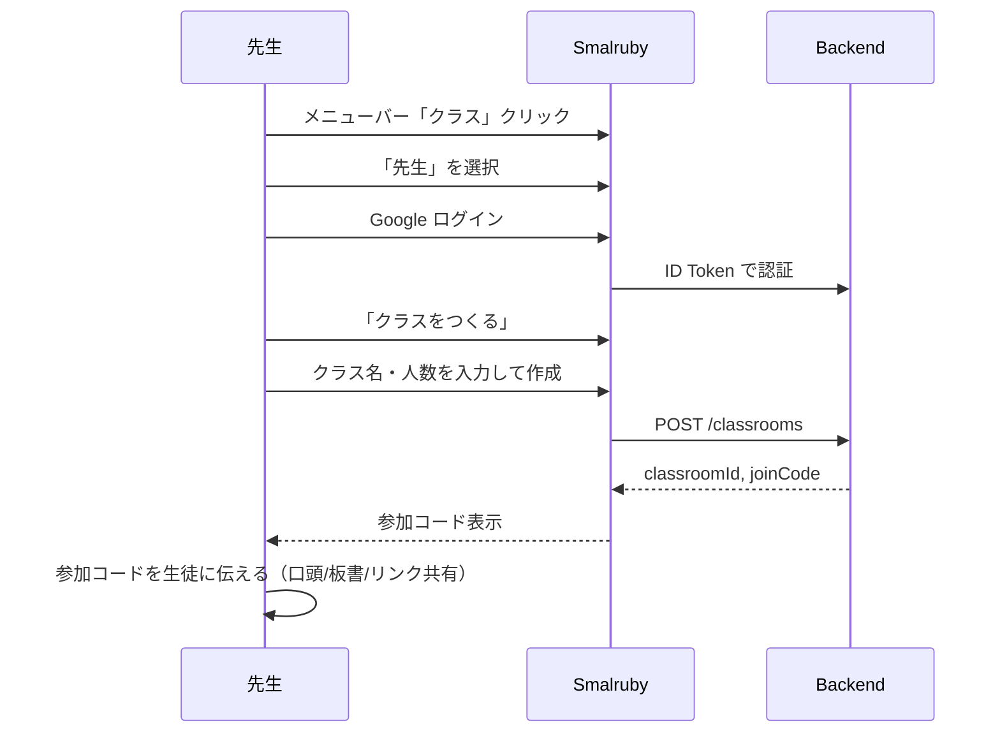
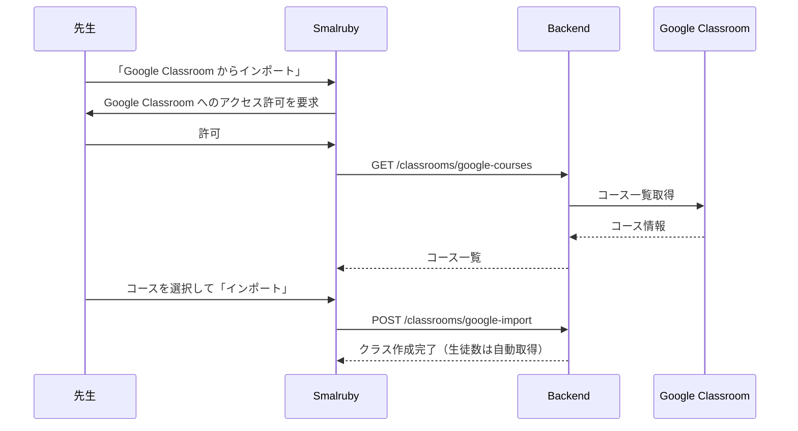
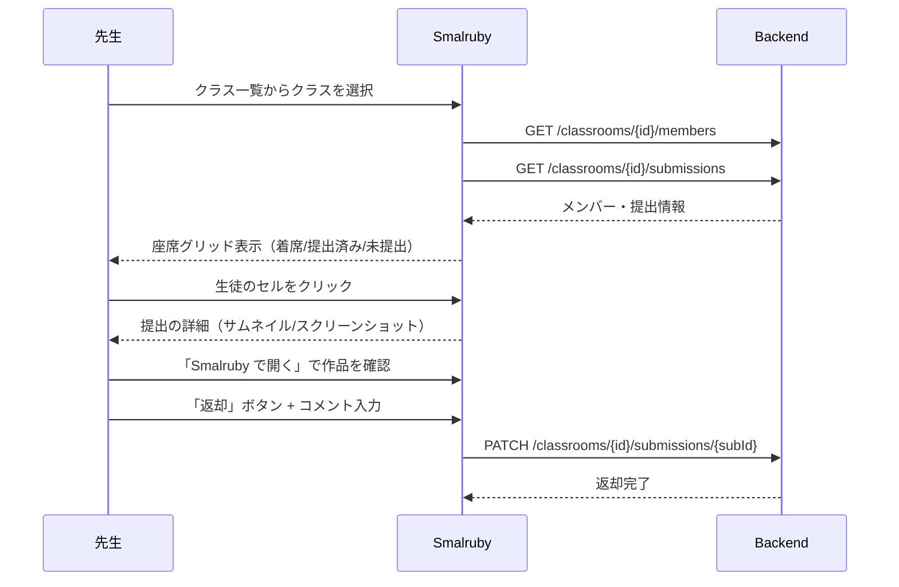
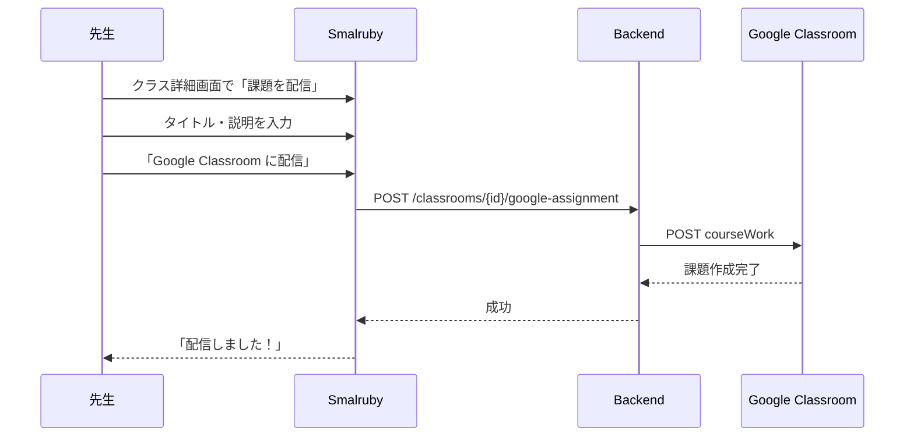
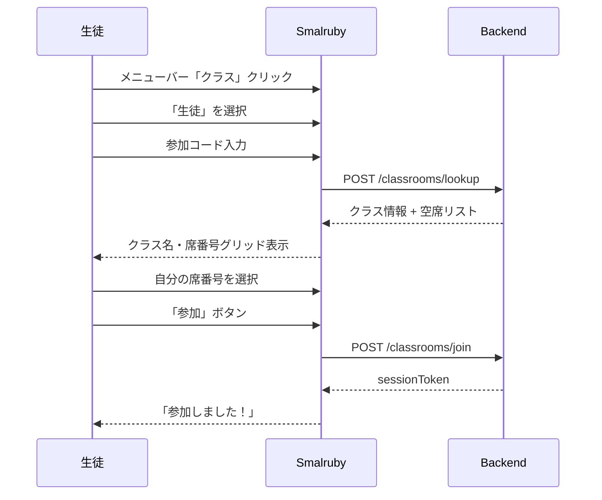
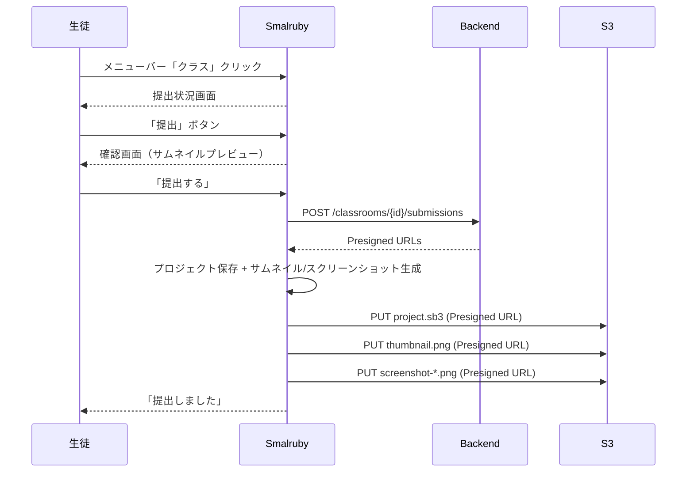

# ユーザーストーリー

## ペルソナ

### 先生ペルソナ

- **前提知識**: Google Classroom は日常的に使っている。Google アカウントでのログインや、コースの管理に慣れている
- **はじめて**: Smalruby を使うのは初めて。プログラミング教育ツールの操作経験が少ない
- **目的**: 授業でプログラミングの課題を出し、生徒の作品を確認・返却したい
- **利用シナリオ**: 授業の準備としてクラスを作成し、授業中に生徒の参加状況と提出を確認する

### 生徒ペルソナ

- **前提知識**: Smalruby でブロックプログラミングや Ruby コードを書くことには慣れている
- **はじめて**: クラス機能を使うのは初めて。参加コードやクラスの仕組みを知らない
- **目的**: 先生の指示に従ってクラスに参加し、作品を提出したい
- **利用シナリオ**: 授業の最初に参加コードを入力してクラスに参加し、授業の最後に作品を提出する

---

## 先生ロール

### 1. クラスを作成する

先生は授業の課題ごとにクラスを作成し、生徒に参加コードを伝えます。



**ポイント:**
- クラス名は**課題名**にすることを推奨（例: 「3時間目: チャットアプリをつくろう」）
- 参加コードは6文字の英数字（紛らわしい文字 I, O, 0, 1 は除外）
- 「招待リンクをコピー」で URL を共有可能

### 2. Google Classroom からインポートする

Google Classroom を使っている場合、コースをインポートして自動的にクラスを作成できます。



### 3. 提出を確認する

先生はクラス詳細画面で、生徒の参加状況と提出を一覧で確認できます。



**座席グリッド表示:**
- 空席 → グレー
- 着席（未提出）→ 青
- 提出済み → 緑
- 返却済み → オレンジ

### 4. Google Classroom に課題を配信する

Google Classroom にリンクしたクラスでは、Smalruby の課題リンクを Google Classroom に投稿できます。



### 5. クラスを削除する

授業が終わったクラスは削除（アーカイブ）できます。生徒のセッションは無効化されます。

---

## 生徒ロール

### 1. クラスに参加する

生徒は先生から教えてもらった参加コードと自分の席番号でクラスに参加します。



**ポイント:**
- アカウント作成不要（参加コード + 席番号で参加）
- 席番号は出席番号と対応させる想定
- 既に使われている席番号はグレーアウト
- セッションはブラウザに保存され、ページを閉じても有効

### 2. 作品を提出する

参加中の生徒は、現在のプロジェクトをワンクリックで提出できます。



**ポイント:**
- 提出は何度でもやり直せる（再提出で上書き）
- 先生が「返却」した場合もコメント付きで表示される
- 提出済み/返却済みのステータスはリアルタイムで更新

### 3. 参加リンクから直接参加する

先生が共有した参加リンクからアクセスすると、自動的にクラス参加フローが開始されます。

```
https://smalruby.app?classcode=ABC123
```

URL に `classcode` パラメータがあると、モーダルが自動で開き、参加コード入力をスキップして席番号選択画面に遷移します。

### 4. クラスから退出する

生徒はいつでもクラスから退出できます。退出するとセッションが無効化され、提出データは保持されます。

---

## 典型的な授業の流れ

```mermaid
graph LR
    A["先生: クラス作成"] --> B["先生: 参加コードを板書"]
    B --> C["生徒: 参加コード入力"]
    C --> D["生徒: 席番号選択"]
    D --> E["生徒: プログラミング"]
    E --> F["生徒: 作品を提出"]
    F --> G["先生: 提出を確認"]
    G --> H["先生: コメント付きで返却"]
    H --> I["生徒: コメントを確認"]
    I --> J["生徒: 修正して再提出"]

    style A fill:#4CAF50,color:#fff
    style F fill:#2196F3,color:#fff
    style G fill:#FF9800,color:#fff
    style H fill:#FF9800,color:#fff
```



1. **授業開始前**: 先生がクラスを作成（1分）
2. **授業開始時**: 参加コードを板書、生徒が参加（2-3分）
3. **授業中**: 生徒がプログラミング
4. **授業終盤**: 生徒が作品を提出（30秒）
5. **授業後**: 先生が提出を確認し、コメント付きで返却
