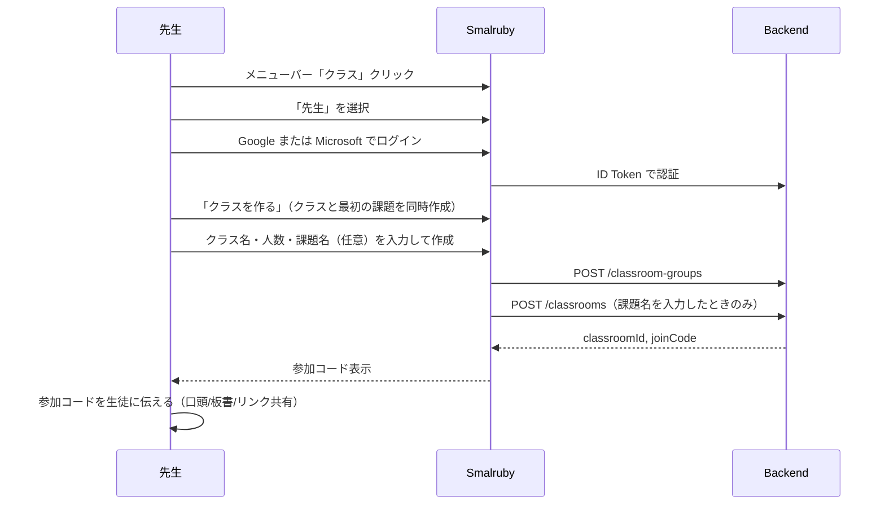
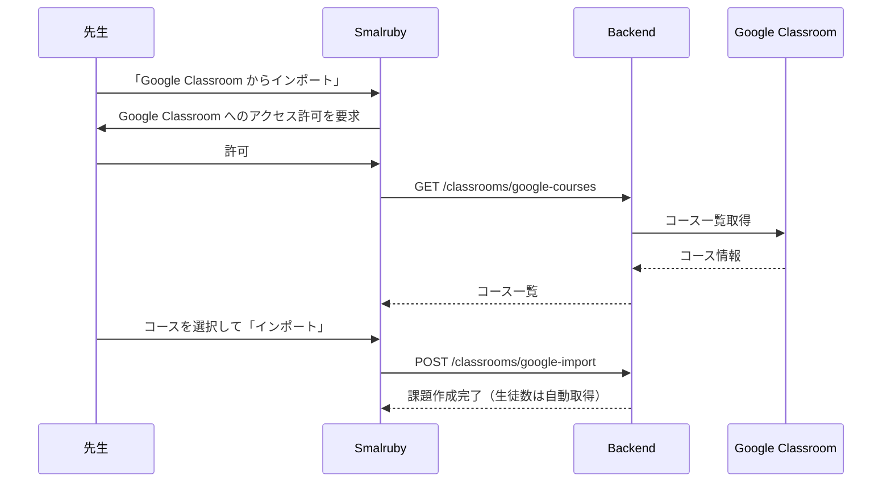
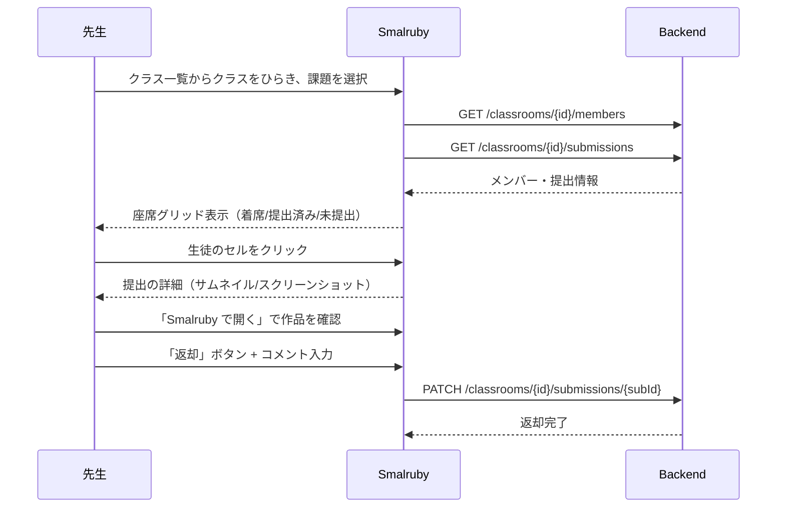
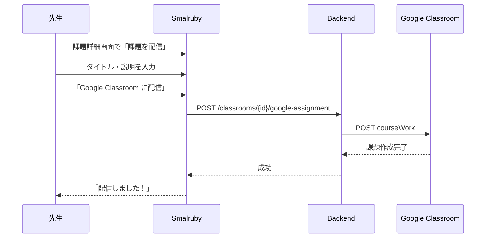
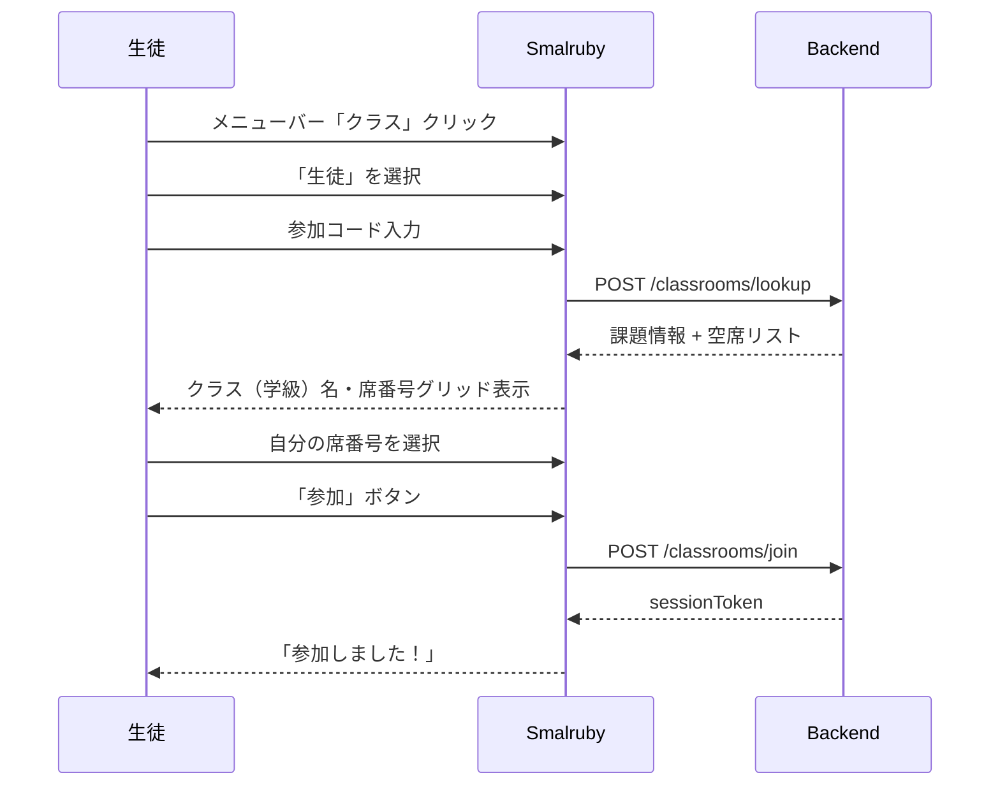
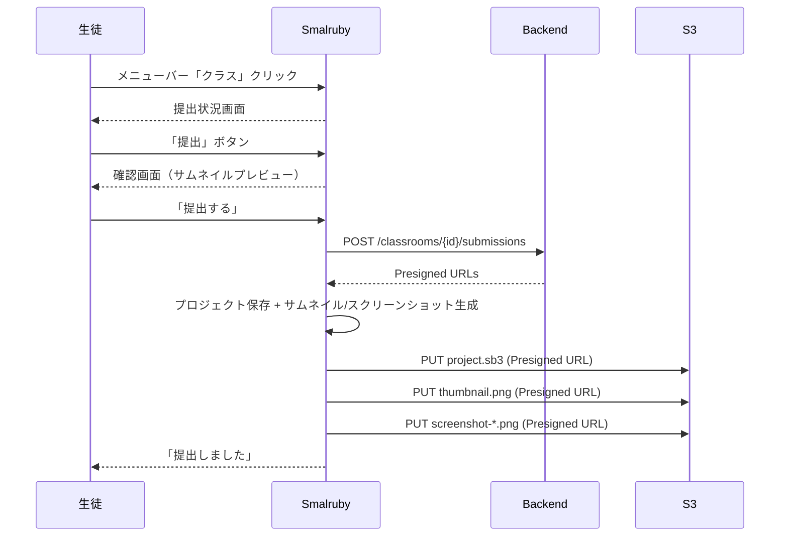

# ユーザーストーリー

## ペルソナ

### 先生ペルソナ

- **前提知識**: Google Classroom や Microsoft Teams を日常的に使っている。Google / Microsoft アカウントでのログインに慣れている
- **はじめて**: Smalruby を使うのは初めて。プログラミング教育ツールの操作経験が少ない
- **目的**: 授業でプログラミングの課題を出し、生徒の作品を確認・返却したい
- **利用シナリオ**: 授業の準備として課題（1 授業）を作成し、授業中に生徒の参加状況と提出を確認する

### 生徒ペルソナ

- **前提知識**: Smalruby でブロックプログラミングや Ruby コードを書くことには慣れている
- **はじめて**: クラス機能を使うのは初めて。参加コードや課題への参加の仕組みを知らない
- **目的**: 先生の指示に従って課題に参加し、作品を提出したい
- **利用シナリオ**: 授業の最初に参加コードを入力して課題に参加し、授業の最後に作品を提出する

---

## 先生ロール

### 1. 課題を作成する

先生は授業ごとに課題（1 授業）を作成し、生徒に参加コードを伝えます。課題はクラス（学級）に属する。



**ポイント:**
- 課題名は授業の内容がわかる名前にする（例: 「3時間目: チャットアプリをつくろう」）
- 参加コードは6文字の英数字（紛らわしい文字 I, O, 0, 1 は除外）
- 「招待リンクをコピー」で URL を共有可能

### 2. Google Classroom からインポートする

Google Classroom を使っている場合、コースをインポートして自動的に課題を作成できます。



### 3. 提出を確認する

先生は課題詳細画面で、生徒の参加状況と提出を一覧で確認できます。



**座席グリッド表示:**
- 空席 → グレー
- 着席（未提出）→ 青
- 提出済み → 緑
- 返却済み → オレンジ

### 4. Google Classroom に課題を配信する

Google Classroom にリンクしたクラスでは、Smalruby の課題リンクを Google Classroom に投稿できます。



### 5. 課題をアーカイブする

授業が終わった課題はアーカイブできます。生徒のセッションは無効化されます。

### 6. 退室リクエストに対応する (Issue #692)

生徒が「使用中の席を空けてほしい」と依頼を送ると、先生の課題詳細画面では:
- 該当席に赤い「!」バッジが表示される
- その席をクリックすると、メンバー詳細パネルに依頼一覧（生徒からのひと言付き）と「承認（この生徒を退室させる）」「却下」の 2 ボタンが現れる

「承認」を押すと、その席の生徒が退室させられ (5. と同じ kick 処理) + すべての同席依頼が一括で消える。「却下」を押すと、対象の依頼だけが消え、座っている生徒はそのまま。

### 7. クラス（学級）を複数の先生で共同管理する (Issue #704)

同じ授業を複数の先生で担当する場合、クラス（学級）を作成した先生（owner）が、**クラス一覧のカードの「設定」**から別の先生を **email** で招待できます。招待された先生はそのクラスに属するすべての課題を管理できます（課題単位の共同管理は API のみ後方互換で残っています）。

- 招待された先生は次回ログイン時、クラス一覧に該当クラスが「共同管理」バッジ付きで表示され、メンバー管理・提出返却・課題配信・課題のアーカイブ・共同管理者の追加/解除まで owner と同等に行えます。
- Google で作ったクラスに Microsoft アカウントの先生（およびその逆）も招待できます。
- 招待は即時反映（承認フローなし）。誤った email を入れた場合は「解除」で取り消せます。
- 作成者は共同管理者リストから外せません（クラスに管理者が必ず1人以上残る）。

---

## 生徒ロール

### 1. 課題に参加する

生徒は先生から教えてもらった参加コードと自分の席番号で課題に参加します。



**ポイント:**
- アカウント作成不要（参加コード + 席番号で参加）
- 席番号は出席番号と対応させる想定
- 既に使われている席番号はグレーアウト
- セッションはブラウザに保存され、ページを閉じても有効
- **課題に課題コンテンツが設定されていると、参加した瞬間にスタータープロジェクトが自動で開き、課題ページが表示される**（プログラム配付の手作業が不要になる）。編集中のプロジェクトがある場合は確認ダイアログを挟み、勝手に上書きしない。課題はステータス画面の「課題を見る」からいつでも開き直せる

### 2. 作品を提出する

参加中の生徒は、現在のプロジェクトをワンクリックで提出できます。



**ポイント:**
- 提出は何度でもやり直せる（再提出で上書き）
- 先生が「返却」した場合もコメント付きで表示される
- 提出済み/返却済みのステータスはリアルタイムで更新

### 3. 参加リンクから直接参加する

先生が共有した参加リンクからアクセスすると、自動的に課題への参加フローが開始されます。

```
https://smalruby.app?classcode=ABC123
```

URL に `classcode` パラメータがあると、モーダルが自動で開き、参加コード入力をスキップして席番号選択画面に遷移します。

### 4. 課題から退出する

生徒はいつでも課題から退出できます。退出するとセッションが無効化され、提出データは保持されます。

### 5. 間違った席の人に退室を依頼する (Issue #692)

課題に参加しようとしたら自分の出席番号がすでに他の生徒に取られていた場合、生徒は「使用中」になっている席をタップして先生に退室を依頼できます。任意で先生へひと言（最大 200 文字）も添えられます。

依頼を送ると seat 選択画面に「先生に退室を依頼中です…」バナーが表示され、5 秒ごとに席が空いたかチェックされます。先生が承認すると席が空き、生徒は再びその席を選べるようになります。先生が却下した場合は、依頼は消えますが席は埋まったままです (TTL 1h で自動消滅)。

### 6. 先生に退室させられたときの挙動 (Issue #692)

先生がクラス管理画面で生徒を Remove したり、生徒が送った退室リクエストを承認したりすると、対象の生徒は次にクラスモーダルを開いたタイミングで「先生によってクラスから退室させられました」とバナーで通知され、自動的に出席番号選択画面に戻ります。元と同じ課題がプリロードされているので、ワンクリックで席を選び直して再参加できます。

---

## 典型的な授業の流れ


1. **授業開始前**: 先生が課題を作成（1分）
2. **授業開始時**: 参加コードを板書、生徒が参加（2-3分）
3. **授業中**: 生徒がプログラミング
4. **授業終盤**: 生徒が作品を提出（30秒）
5. **授業後**: 先生が提出を確認し、コメント付きで返却
