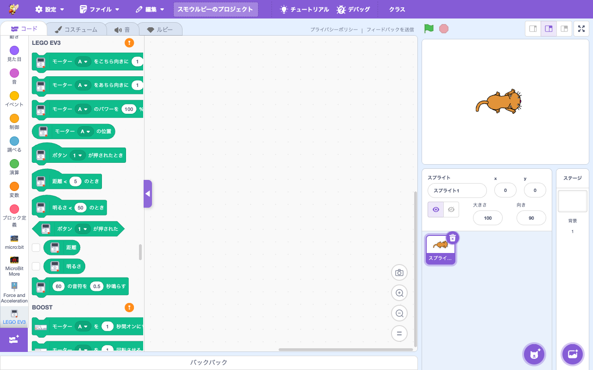

# 拡張機能: LEGO MINDSTORMS EV3

> **⬆️ upstream そのまま** — upstream の実装をほぼそのまま利用

- **Smalruby ランタイム対応**: ❌（smalruby3 gem 未対応。Web Bluetooth 経由）
- **デフォルト表示**: ❌（`defaultHidden: true`）— 拡張機能ライブラリで「見る」ボタンを押すと表示
- **collaborator**: LEGO

## 概要

[LEGO MINDSTORMS EV3](https://education.lego.com/en-us/products/lego-mindstorms-education-ev3-core-set/5003400/) を Smalruby から制御する拡張機能。EV3 のモーター・センサを Web Bluetooth 経由で操作する。upstream Scratch 標準。

## ユーザーストーリー

- **EV3 を持っている小学生・中学生**として、LEGO ロボットを Smalruby から動かしたい
- **教師**として、Scratch ベースのプログラミング教材として EV3 を使いたい

## 主要ファイル

- 拡張機能登録: `packages/scratch-gui/src/lib/libraries/extensions/index.jsx` の `extensionId: 'ev3'` (`defaultHidden: true`)
- VM 実装: `packages/scratch-vm/src/extensions/scratch3_ev3/`

## ブロックパレット

## 関連ブロック（主要 opcode）

| opcode | 説明 |
|---|---|
| `ev3_motorTurnClockwise` / `ev3_motorTurnCounterClockwise` | モーター回転 |
| `ev3_motorSetPower` | モーターパワー設定 |
| `ev3_getMotorPosition` | モーター位置取得 |
| `ev3_whenButtonPressed` | ボタン押下 Hat |
| `ev3_whenDistanceLessThan` | 距離センサが N より小さい時 |
| `ev3_getDistance` | 距離 |
| `ev3_whenBrightnessLessThan` | 明るさが N より小さい時 |
| `ev3_beep` | ビープ音 |

## 動作環境

- **対応ブラウザ**: Chrome / Edge (Web Bluetooth サポート)

## 関連ドキュメント

- 上流: [scratch-vm のドキュメント](https://github.com/scratchfoundation/scratch-vm)
