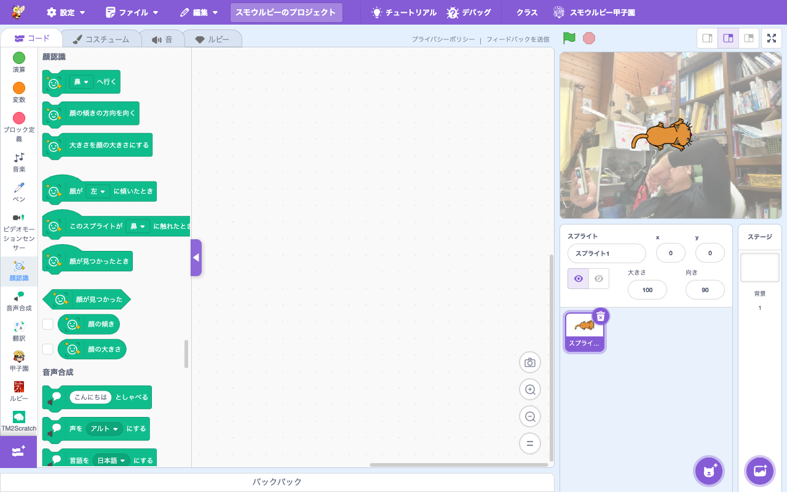

# 拡張機能: 顔センサー (Face Sensing)

> **⬆️ upstream そのまま** — upstream の実装をほぼそのまま利用

- **Smalruby ランタイム対応**: ❌（smalruby3 gem 未対応。Web カメラと TensorFlow.js を使うため）
- **デフォルト表示**: ✅（拡張機能ライブラリにデフォルトで表示される）

## 概要

Web カメラからの映像で**顔のランドマーク（目・口・鼻など）**を検出する拡張機能。顔の位置・特徴点を取得してインタラクティブな作品が作れる。upstream Scratch 標準。

## ユーザーストーリー

- **小学生**として、自分の顔の動きでスプライトを操作したい
- **教師**として、AR 風のアプリ（顔にメガネを重ねる等）を作らせたい
- **発表会の出展者**として、顔認識を使った双方向作品を作りたい

## 主要ファイル

- 拡張機能登録: `packages/scratch-gui/src/lib/libraries/extensions/index.jsx` の `extensionId: 'faceSensing'`
- VM 実装: `packages/scratch-vm/src/extensions/scratch3_face_sensing/`

## ブロックパレット

## 関連ブロック（主要 opcode）

| opcode | 説明 |
|---|---|
| `faceSensing_goToFacePart` | 顔のパーツへ移動（目、口、鼻など）|
| `faceSensing_pointInDirectionOfFace` | 顔の向きへ向く |
| `faceSensing_whenFaceDetected` | 顔検出時 Hat |

## 動作環境

- **必須**: Web カメラ + ブラウザの getUserMedia 許可

## 関連ドキュメント

- 上流: [scratch-vm のドキュメント](https://github.com/scratchfoundation/scratch-vm)
- [`docs/extension-video-sensing/`](../extension-video-sensing/) — シンプルな動き検出
