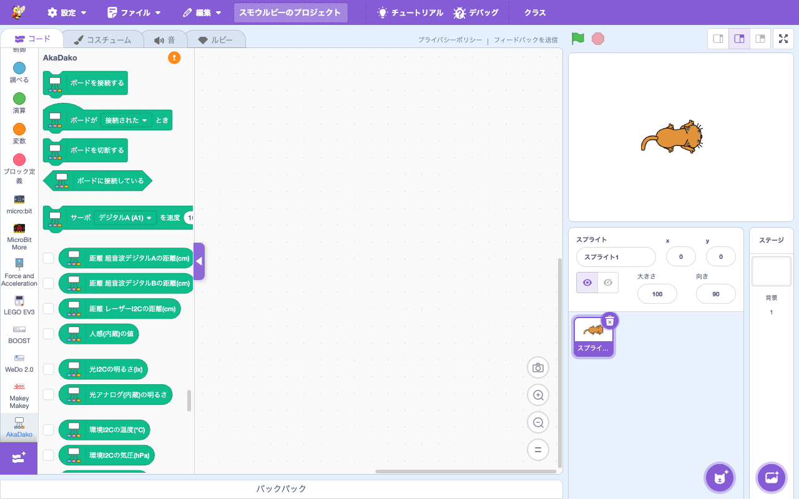

# 拡張機能: AkaDako (g2s)

> **🆕 Smalruby 独自** — upstream に存在しない、Smalruby のために新規追加された拡張機能（[microbit-more / akadako](https://akadako.com/) との連携実装）

- **Smalruby ランタイム対応**: ❌（smalruby3 gem は未対応。Web Serial / WebUSB を使うためブラウザ専用）
- **デフォルト表示**: ✅（拡張機能ライブラリにデフォルトで表示される）

## 概要

**AkaDako**（Grove 互換のセンサ・アクチュエータを USB 接続できる教育用ボード）を Smalruby から制御する拡張機能。識別子 **g2s** は "Grove to Scratch" の略。

ボード上のサーボ・センサ（超音波、光、温度、気圧、湿度、水温、加速度、ピッチ、ロール、傾き）・NeoPixel LED・デジタル/アナログ I/O などを、Scratch ブロックで操作できる。

I2C デバイスのドライバ（VL53L0X 距離センサ、ADXL345 加速度センサ、BME280 環境センサ、KXTJ3 加速度センサ、LTR303 光センサ）が組み込まれている。

## ユーザーストーリー

- **電子工作好きの中学生・高校生**として、AkaDako を Smalruby に繋いで、自分のセンサデータでゲームや作品を作りたい
- **教師（理科・技術）**として、温度・湿度・光などの環境センサを使った実験データ収集を Smalruby で扱いたい
- **メイカー**として、Web ブラウザで完結するセンサプログラミング環境が欲しい
- **発表会出展者**として、リアルなセンサ入力で動くインタラクティブ作品を作りたい

## UI / 操作フロー

1. ブロックパレットの「拡張機能を追加」から **g2s (AkaDako)** を選ぶ
2. `connectBoard` ブロックでボードに接続（Web Serial デバイス選択ダイアログ）
3. 各種センサ・アクチュエータブロックをプログラムに組み込む
4. `boardStateChanged` Hat ブロックで接続状態の変化を検知

## 主要ファイル

### scratch-gui

- `packages/scratch-gui/src/lib/libraries/extensions/g2s/` — 拡張機能登録（アイコン、descriptions）
- `packages/scratch-gui/src/lib/ruby-generator/g2s.js` — g2s ブロック → Ruby 変換

### scratch-vm

- `packages/scratch-vm/src/extensions/scratch3_g2s/index.js` — 拡張機能本体
- `packages/scratch-vm/src/extensions/scratch3_g2s/akadako-connector.js` — AkaDako ボード接続
- `packages/scratch-vm/src/extensions/scratch3_g2s/vl53l0x.js` — VL53L0X 距離センサドライバ
- `packages/scratch-vm/src/extensions/scratch3_g2s/adxl345.js` — ADXL345 加速度センサドライバ
- `packages/scratch-vm/src/extensions/scratch3_g2s/bme280.js` — BME280 環境センサドライバ
- `packages/scratch-vm/src/extensions/scratch3_g2s/kxtj3.js` — KXTJ3 加速度センサドライバ
- `packages/scratch-vm/src/extensions/scratch3_g2s/ltr303.js` — LTR303 光センサドライバ
- `packages/scratch-vm/src/extensions/scratch3_g2s/translations.json` — i18n

### infra

なし（ボードとの通信はクライアント完結）。

## ブロックパレット

## 関連ブロック（主要 opcode 抜粋）

### 接続

| opcode | 説明 |
|---|---|
| `connectBoard` | ボード接続 |
| `disconnectBoard` | ボード切断 |
| `isConnected` | 接続中か |
| `boardStateChanged` | 接続状態変化 Hat |

### サーボ・モーター

| opcode | 説明 |
|---|---|
| `servoTurn` | サーボ角度設定 |

### 距離・光・環境

| opcode | 説明 |
|---|---|
| `measureDistanceWithUltrasonicA/B` | 超音波距離センサ |
| `measureDistanceWithLight` | 光距離センサ |
| `getBrightness`, `getAnalogBrightness` | 明るさ |
| `getTemperature`, `getPressure`, `getHumidity` | 温度・気圧・湿度 (BME280) |
| `getWaterTemperatureA/B` | 水温 |

### 加速度・傾き

| opcode | 説明 |
|---|---|
| `motionSensorValue` | モーションセンサ値 |
| `getPitch`, `getRoll` | ピッチ・ロール |
| `getAccelerationX/Y/Z`, `getAccelerationAbsolute` | 加速度 |
| `whenShaken` | 揺さぶられたとき Hat |

### NeoPixel LED

| opcode | 説明 |
|---|---|
| `neoPixelConfigStrip` | LED ストリップ設定 |
| `neoPixelSetColor`, `neoPixelFillColor` | 色設定 |
| `neoPixelShiftColor` | 色シフト |
| `neoPixelColor`, `neoPixelColorMode` | 色取得・モード |
| `neoPixelShow`, `neoPixelClear` | 表示・クリア |

### デジタル/アナログ I/O

| opcode | 説明 |
|---|---|
| `analogLevelA1/A2/B1/B2` | アナログレベル取得 |
| `digitalLevelA1/A2` ほか | デジタル I/O |

> 各ブロックの Ruby 表現は [`docs/smalruby-language-spec-extensions.ja.md`](../smalruby-language-spec-extensions.ja.md) を参照。

## 設定・データ永続化

なし（接続情報は揮発的）。

## 動作環境

- **対応 OS**: Windows / macOS / ChromeOS
- **対応ブラウザ**: Chrome / Edge（Web Serial サポート）

## 関連ドキュメント

- [AkaDako 公式](https://akadako.com/)
- [`docs/device-connection/`](../device-connection/) — connection-modal 共通基盤 (準備中)

## 関連 Issue / PR

主要 PR は履歴を参照（`feat:.*g2s|akadako` で grep）。
