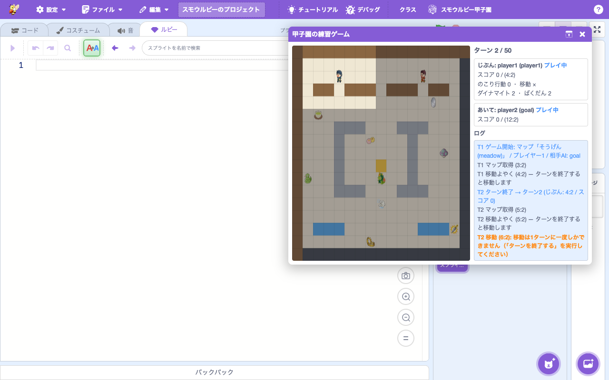
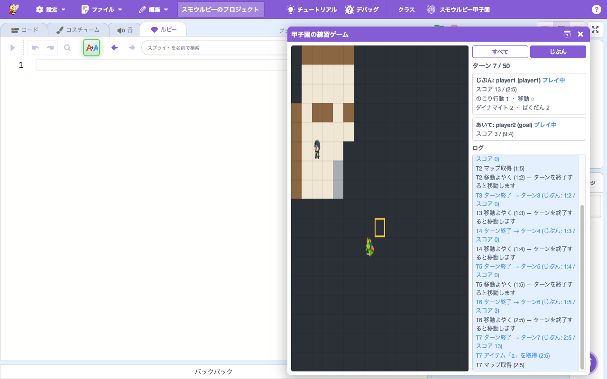
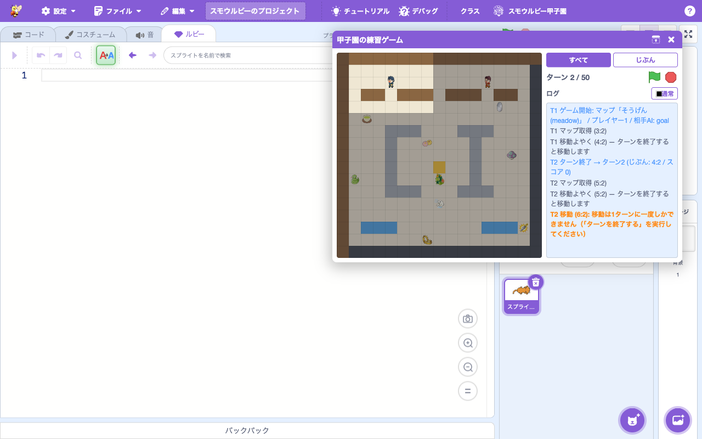
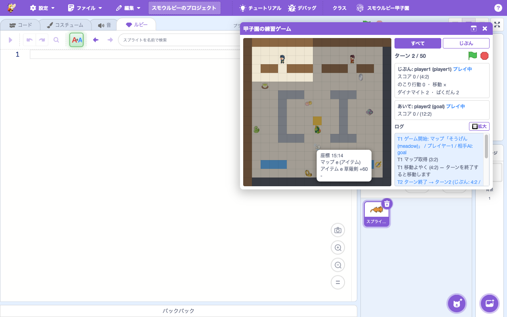
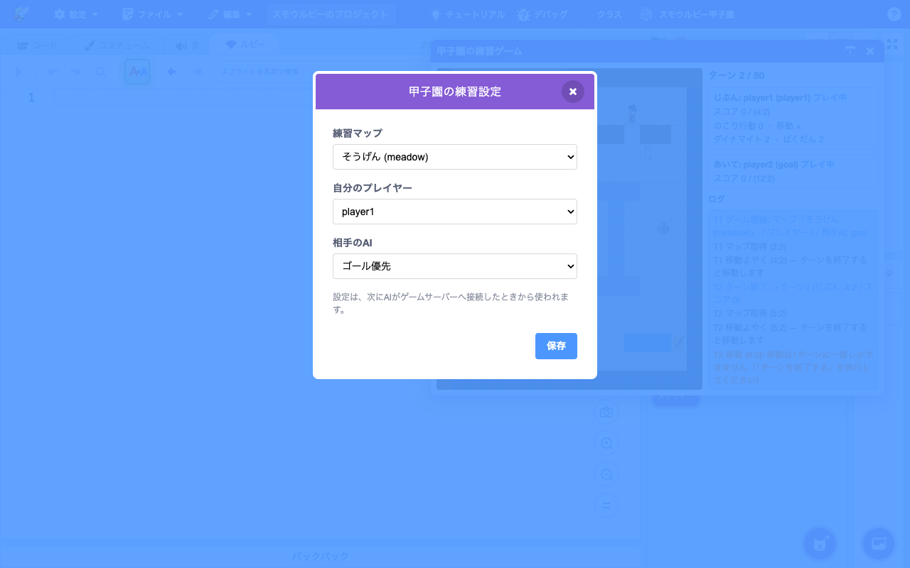

# 拡張機能: Smalruby Koshien

> **🆕 Smalruby 独自** — upstream に存在しない、Smalruby のために新規追加された拡張機能

- **Smalruby ランタイム対応**: ❌（ブラウザ専用）
- **デフォルト表示**: ✅（拡張機能ライブラリにデフォルトで表示される）

## 概要

**スモウルビー甲子園**（Smalruby Koshien）競技用の拡張機能。プレイヤー（参加者の AI プログラム）がマップ上を移動し、アイテムを集めながらゴールを目指すターン制の競技。本拡張は競技と同じルールで動く**内蔵の練習ゲーム（モック）**を持ち、マップ情報取得、移動コマンド、ルート計算などのブロックを 1 つずつ実行しながら AI をデバッグできる。

内蔵練習ゲームの特徴:

- **本番と同じルール**: 1 ターンに行動 2 回まで・移動は 1 回・移動はターン終了時に確定（予約制）・水たまり/ダイナマイト/ばくだん/妨害キャラ/歩行ボーナス/ゴールボーナス/50 ターン制限。ルール違反は本番と同じエラーメッセージで報告される
- **壁時計タイムアウトなし**: 本番の 1 ターン制限時間は再現しない。考えながら 1 命令ずつ試せる
- **相手 AI を選べる**: ゴール優先 / アイテム優先 / 停止 / ランダム（練習設定モーダル）
- **ターン間隔を調整できる**: 各ターン確定後に指定秒数（0〜5 秒・既定 0）スリープを入れ、移動の途中経路を目で追える（練習設定モーダル）
- **オリジナル練習マップを同梱**: 競技マップと同じ形式（17×17・外周壁・ゴール 1 つ・ダイナマイトなしで到達可能）の Smalruby 専用マップ

## ユーザーストーリー

- **競技参加者の小学生・中学生**として、自分の AI プログラム (Smalruby スクリプト) を競技サーバに接続して動かしたい
- **教師**として、生徒たちがチームでアルゴリズムを考えて競い合う題材として使いたい
- **大会運営**として、競技用のサーバと共通の API でやり取りできる拡張機能を提供したい
- **プログラミング学習者**として、ターン制ゲームを通じて経路探索などのアルゴリズムを学びたい

## UI / 操作フロー

1. ブロックパレットの「拡張機能を追加」から **Smalruby Koshien** を選ぶ（このとき練習ゲームパネルが開く）
2. ブロックパレットに Koshien 専用ブロックが表示される
3. `connectGame` ブロックで練習ゲームを開始（パネルが再表示される）
4. ターンごとに `getMapArea` でマップ情報を取得し、`moveTo` などで移動を予約
5. `turnOver` でターンを終了すると、移動・設置が確定し、相手 AI と妨害キャラが動く
6. パネルの盤面・スコア・ログで結果を確認しながら 4〜5 を繰り返して AI を育てる

### 練習ゲームパネル（koshien-mock-panel）



移動・最小化・閉じるができる常駐パネル。盤面全体（地形・アイテム・両プレイヤー・妨害キャラ。自分の AI が未探索のマスは暗く表示）、ターン数、スコア、残り行動・移動・ダイナマイト・ばくだん、そして**すべての行動とルールエラーのログ**を表示する。1380×600px（Chromebook）の画面でも全体が見えるサイズ。盤面のマップチップは常に 1:1（パネルサイズが変わっても縦横比が崩れない）。

- 表示タイミング: 拡張機能の追加時 / `connectGame` 実行時に自動で開く
- 閉じた後: メニューバーの「スモウルビー甲子園 > 練習ゲームパネル」から再表示
- 盤面のスプライトは公式ビューアの画像を許可を得て同梱

#### 緑の旗・停止ボタン

「ターン N / 50」の右端に**緑の旗**と**停止（赤）**のボタンがある。ステージの同名ボタンと完全に同じ挙動（`vm.greenFlag()` / `vm.stopAll()`）で、パネルがステージを隠していてもゲームを開始・停止できる。未接続（ヒント表示）のときも表示される。

**緑の旗を押すと**: モックの状態がリセットされ、スクリプトエリアの「プレイヤー名を◯◯にしてゲームサーバーへ接続する」HAT ブロックが起動して、その下につながったブロックが最初から実行される（＝マップが表示され、AI が動き出す）。VM 側は `PROJECT_START` で `startHats('koshien_connectGame')` を呼ぶ（`koshien: green flag started N connect-game thread(s)` をログ出力）。副作用は実 Runtime のテスト `test/unit/koshien_green_flag_hats.js` で担保。

#### 「すべて」/「じぶん」表示切替



盤面は 2 つの表示をボタンで切り替えられる:

- **すべて**: ゲームの真の状態（未探索マスにはうすい影）
- **じぶん**: 自分の AI が知っている情報だけ。各マスは**最後に探索した時点の値**のまま
  （アイテムを取っても、そのマスを再探索するまで残って見える）。未探索マスは暗色、
  ゴールは接続時に教えられるので金枠で表示、相手は最後に視界に入った位置にだけ表示。
  「すべて」と見比べることで「探索していないから差分が出ている」ことを確認できる

#### ログの拡大



「ログ」ラベル右端の「🔲 拡大」ボタンで、じぶん/あいてペインを隠してログを縦に広げられる（表示切替・ターン・緑の旗/停止ボタンは残る）。「🔳通常」で元に戻る。長い実行ログを追いながらデバッグするときに使う。

#### マスのツールチップ



盤面のマスにマウスを 300ms 置くと、そのマスの情報が吹き出しで表示される（マウスを動かしても 300ms は残る）:

- `座標 x:y`
- `マップ 値 (名前)` — 例: `マップ 3 (ゴール)`、`マップ e (アイテム)`
- `アイテム 値 名前 得点` — 例: `アイテム e 草薙剣 +60`、なければ `なし`
- あいて / 妨害キャラクターがそのマスにいるか（いなければ `-`）

表示中のビューに連動する: 「じぶん」ビューでは AI の `map()` が返す値そのもの（最後に探索した時点の値・未探索は -1）が表示されるので、プログラムから見えている値を直接確認できる。

### 練習設定モーダル（koshien-settings-modal）



メニューバーの「スモウルビー甲子園 > 練習設定」から開く。練習マップ・自分のプレイヤー（player1/player2）・相手 AI（ゴール優先/アイテム優先/停止/ランダム）・ターン間隔(秒)を選ぶ。ターン間隔は各ターン確定後のスリープ秒数で、0〜5 秒（既定 0＝待ち無し）。設定は localStorage（`smalruby:koshienMockConfig`）に保存され、次に `connectGame` を実行したときから使われる。

### Koshien テストモーダル

開発・デバッグ用の **Koshien テストモーダル** (`koshien-test-modal`) があり、競技サーバなしでローカルテストができる。

「AIを試す」では、編集中スプライト単体ではなく **プロジェクト全体（ステージ + すべての
スプライト）** を 1 つのプログラムとして出力する。これは「AIを保存」が書き出す `.rb` と
**同一の生成結果**であり、競技で実際に動く AI そのもの。「試す」と「保存」が同じコードに
なるよう、両者は `generateProjectCode`（`src/lib/ruby-script-preview.js`）を共有する。
編集中スプライトだけを出力すると、AI 本体が別スプライトにある場合やステージ選択中に
「中身が空の小さな AI」と誤判定され、後述のフォールバック導線も出ない（Issue #845）。
ステージを先頭に出力するので「すべてのスプライトでつかう」グローバル変数・リスト
（例: `$最短経路`）がステージの `def initialize` で初期化され、実行可能になる（v1 / v2 両対応）。
Ruby タブで編集中の未保存コードも `targetsCode` で取り込むため、ブロックへ変換する前の
状態でもそのまま試せる。

AI ソースは base64 化してビューアの `?player1=data:<base64>` クエリパラメータに渡す
（`src/lib/koshien-test-url.js` の `buildKoshienTestUrl` / `encodeAiToPlayerParam`）。
ただし複雑な AI（経路探索など）はソースが長く、URL 長制限（`MAX_KOSHIEN_TEST_URL_LENGTH`
= 8000 文字）を超えてビューアの起動に失敗しうる。そのため URL が長すぎる場合は
`buildKoshienTestPlan` が `tooLong: true` を返し、モーダルは **AI 無しの URL でビューアを
ロード**（デフォルト AI）したうえで、**AI を `.rb` ファイルとして保存する導線**
（`koshien-test-too-long-banner` / `koshien-test-download-ai`）を表示する。
ユーザーは保存した `.rb` をビューアから読み込んで試す。単純な AI の従来挙動（URL 直結）は維持される。

## 主要ファイル

### scratch-gui

#### コンポーネント

- `packages/scratch-gui/src/components/koshien-mock-panel/` — 練習ゲームパネル（canvas 盤面 + ステータス + ログ、公式スプライト画像を同梱）
- `packages/scratch-gui/src/containers/koshien-mock-panel.jsx` — パネルの VM 連携（`KOSHIEN_MOCK_STATE` / `EXTENSION_ADDED` イベント購読、自動オープン）
- `packages/scratch-gui/src/components/koshien-settings-modal/` — 練習設定モーダル
- `packages/scratch-gui/src/components/koshien-test-modal/koshien-test-modal.jsx` — テスト用モーダル
- `packages/scratch-gui/src/lib/ruby-script-preview.js` — コード生成。`generatePreviewCode`（編集中スプライトのプレビュー用）と `generateProjectCode`（プロジェクト全体。「AIを試す」「AIを保存」が共有）

#### ライブラリ

- `packages/scratch-gui/src/lib/koshien-mock-config.js` — 練習ゲーム設定（localStorage）と `runtime.getKoshienMockConfig` の配線
- `packages/scratch-gui/src/lib/libraries/extensions/koshien/` — 拡張機能登録（アイコン、descriptions）
- `packages/scratch-gui/src/lib/ruby-generator/koshien.js` — Koshien ブロック → Ruby 変換
- `packages/scratch-gui/src/lib/ruby-to-blocks-converter/koshien*` — Ruby → Koshien ブロック変換

#### Redux

- `packages/scratch-gui/src/reducers/koshien-file.js` — Koshien ファイル管理 state
- `packages/scratch-gui/src/reducers/koshien-mock-panel.js` — 練習ゲームパネルの表示状態
- AI 保存ステータス（rubytee からの自動保存と連動）

#### スニペット

- `packages/scratch-gui/src/containers/ruby-tab/koshien-snippets.json` — Monaco エディタの Koshien コード補完

### scratch-vm

- `packages/scratch-vm/src/extensions/koshien/index.js` — 拡張機能本体（ブロック定義と、練習ゲームを操作するクライアント。行動回数の抑止・ログ・状態ブロードキャスト）
- `packages/scratch-vm/src/extensions/koshien/mock-game.js` — 練習ゲームエンジン（ターン解決・採点・妨害キャラ）
- `packages/scratch-vm/src/extensions/koshien/mock-rival.js` — 内蔵の相手 AI（ゴール優先/アイテム優先/停止/ランダム）
- `packages/scratch-vm/src/extensions/koshien/mock-maps.js` — 同梱のオリジナル練習マップ
- `packages/scratch-vm/src/extensions/koshien/map-utils.js` — マップ文字列・経路計算などの共有ユーティリティ

### infra

なし（Koshien 競技サーバは別リポジトリで管理）。

## ブロックパレット


## 関連ブロック（opcode と挙動）

行動回数のルール: **1 ターンに「行動」は 2 回まで**（対象 = マップ取得・移動・ダイナマイト/ばくだん設置）。移動はさらに **1 ターンに 1 回まで**。上限を超えた呼び出しは実行されず、練習ゲームパネルのログにエラーとして表示される（失敗した行動も枠を消費する — 本番と同じ）。

| opcode | Ruby 表現 | 行動 | 挙動 |
|---|---|---|---|
| `connectGame` | `koshien.when_connect_game(name:) do ... end` (HAT) | - | ゲーム開始。緑の旗で起動し、練習ゲーム（練習設定のマップ・相手AI）が始まる。自分の位置とゴール座標が分かる |
| `getMapArea` | `koshien.get_map_area(pos)` | 1 | 指定座標の **±2（5×5）** を探索して自分のマップに記録する（端では窓が縮む）。相手はこの窓に入っていれば位置が分かる。妨害キャラは常に位置が分かる |
| `map` | `koshien.map(pos)` | - | 自分のマップの値を返す。**探索した時点の値**（未探索は -1、アイテムは `"a"`〜`"D"` の文字） |
| `mapAll` | `koshien.map_all` | - | 自分のマップ全体を「行,行,...」の文字列で返す（未探索は `-`） |
| `mapFrom` | `koshien.map_from(pos, mapstr)` | - | 変数に保存したマップ文字列から値を読む |
| `moveTo` | `koshien.move_to(pos)` | 1 | 東西南北 1 マスの**移動予約**。位置が変わるのは「ターンを終了する」の実行時。斜め・2 マス・壁は「移動できない座標です」エラー（移動権は消費）。水たまりに入ると次の移動 1 回はぬけ出すだけに使われる |
| `calcGoalRoute` | `koshien.calc_route(result: リスト)` | - | 自分→ゴールの最短経路を計算してリストに保存（`"x:y"` の列。先頭 = 現在地）。自分のマップで計算するため未知のマスは「通れる」とみなす。到達不能なら要素 1 個 |
| `calcRoute` | `koshien.calc_route(src:, dst:, except_cells:, result:)` | - | 任意 2 点間の最短経路。except_cells のマスは壁扱い。マスの重み: 空間/アイテム=1、水=2、未探索=4、ゴール=3、壁は不通 |
| `setItem` | `koshien.set_dynamite(pos)` / `koshien.set_bomb(pos)` | 1 | 設置予約（ターン終了時に反映）。基点はそのターンの移動予約先（なければ現在地）から 1 マス以内。**ダイナマイト**: 空間か水に設置可、ターン終了時に上下左右の壊せる壁を空間にする。**ばくだん**: 空間のみ、盤面に減点アイテム D(-40) として置かれ、踏んだ者（自分含む）が減点。各 2 個まで、無効な設置でも 1 個消費 |
| `locateObjects` | `koshien.locate_objects(result:, cent:, sq_size:, objects:)` | - | 自分のマップの正方形範囲から指定の値（例 `"ABCD"`）のマスを探してリストに保存 |
| `targetCoordinate` | `koshien.player` / `koshien.goal` / `koshien.other_player` / `koshien.enemy`（`_x`/`_y` 付きも） | - | 座標を返す。自分とゴールは常に分かる。相手は**最後にマップ取得の窓に入った時点**の位置（未確認なら空）。妨害キャラは最後にマップ取得した時点の位置 |
| `turnOver` | `koshien.turn_over` | - | **ターンを終了する**。移動・設置が確定し、相手 AI と妨害キャラが動き、アイテム取得・採点が行われて次のターンへ。行動回数と移動権が回復する |
| `position` / `positionOf` | `koshien.position(x, y)` / `koshien.position_of_x(pos)` 等 | - | `"x:y"` 文字列と数値の相互変換（ゲームには影響しない） |
| `object` | `koshien.object("goal")` 等 | - | 名前→マップ値の変換（空間=0, 壁=1, 蔵=2, ゴール=3, 水たまり=4, 壊せる壁=5, お茶="a" など） |
| `setMessage` | `koshien.set_message(msg)` | なし | メッセージを設定する（行動回数を消費しない） |

> 各ブロックの Ruby 表現の詳細は [`docs/smalruby-language-spec-extensions.ja.md`](../smalruby-language-spec-extensions.ja.md) を参照。

## 練習ゲームのルール（本番と同じ）

- 17×17 のマップ。50 ターン以内にゴールに着くとゴールボーナス `100 - ((ターン-1)/10)*10`（1〜10T=100点、…、41〜50T=60点）。50 ターンで未ゴールは **-70 点**
- アイテム（踏むと自動取得）: a お茶 +10 / b 和菓子 +20 / c 丁銀 +30 / d シロイルカ +40 / e 草薙剣 +60 / A 毒キノコ -10 / B 蛇 -20 / C トラバサミ -30 / D 爆弾 -40。両者が同じターンに同じマスで取ると得点は半分ずつ
- 移動 5 ターンごとに歩行ボーナス +3
- **妨害キャラクター**: ゴールから出現。近く（周囲 3 マス）のプレイヤーを追いかける（2 マス手前で止まる）。41 ターン目からは怒ってマップ全体を追跡。接触すると -10。草薙剣を取ったプレイヤーは接触で +30（撃退。復活しない）
- **本番との違いは 1 つだけ**: 1 ターンの制限時間（壁時計タイムアウト）を再現しない。考えながら 1 命令ずつ実行できる

## 練習マップ

練習設定モーダルで選べる同梱マップ（すべて Smalruby オリジナル。競技マップと同形式で、壁を壊さなくてもゴールに到達できる）:

| id | 名前 | player1 開始 | player2 開始 | ゴール | 最短歩数 (p1/p2) | 特徴 |
|---|---|---|---|---|---|---|
| `meadow` | そうげん | (3,2) | (13,2) | (8,9) | 12 / 12 | 開けた入門マップ。中央のゴールを壊せる壁が囲む |
| `canal` | すいろ | (1,1) | (15,15) | (8,8) | 18 / 14 | 水路が走る。水たまりの挙動（ぬけ出しに 1 回）を学べる |
| `vault` | くら | (8,1) | (8,15) | (7,7) | 15 / 17 | ゴールが壊せる壁の蔵の中（すき間あり）。ダイナマイトで近道できる |
| `maze` | めいろ | (1,15) | (15,1) | (8,8) | 20 / 24 | 通路が入り組む。経路計算とこまめな探索が必要 |

定義は `packages/scratch-vm/src/extensions/koshien/mock-maps.js`（17 行×17 文字の文字列。0-5 が地形、a-e/A-D がアイテム）。

## サンプルAI

「マップを見る → ゴールへの経路を計算 → 1 歩進む → ターンを終了する」を繰り返す最小の AI。ブロックで組むと次の並びになる（リスト `最短経路` は「すべてのスプライトで使う」で作る）:

1. 【HAT】プレイヤー名を `player1` にしてゲームサーバーへ接続する
2. ずっと繰り返す:
   1. 自分の位置 のまわりのマップを取得する
   2. ゴールまでの最短経路をリスト `最短経路` に保存する
   3. `最短経路` の 2 番目（= 次の 1 マス）へ移動する
   4. ターンを終了する

Ruby（v2）ではおおよそ次のコード（`$最短経路[1]` は 0 始まりで 2 番目 = 次のマス）:

```ruby
koshien.when_connect_game(name: "player1") do
  loop do
    koshien.get_map_area(koshien.player)
    koshien.calc_route(result: $最短経路)
    koshien.move_to($最短経路[1])
    koshien.turn_over
  end
end
```

緑の旗（ステージまたは練習ゲームパネル）を押すと接続 HAT から実行され、パネルの盤面で 1 ターンずつ動きを確認できる。妨害キャラを避けたい・アイテムを拾いたい場合は、`locate_objects` や `koshien.enemy` を使って経路を工夫していく。

## 設定・データ永続化

- `koshien-file` reducer で Koshien プロジェクトファイルの状態を管理
- 練習ゲーム設定は localStorage `smalruby:koshienMockConfig`（マップ / 自分のプレイヤー / 相手 AI / ターン間隔(秒)）

## テスト

- VM 単体テスト: `packages/scratch-vm/test/unit/extension_koshien.js`（ブロック/クライアント）、`koshien_mock_game.js`（ゲームエンジン）、`koshien_map_utils.js`（ユーティリティ）、`koshien_green_flag_hats.js`（緑の旗 → 接続HAT起動を実 Runtime で検証）
- GUI 単体テスト: `packages/scratch-gui/test/unit/lib/koshien-mock-config.test.js`、`test/unit/components/koshien-settings-modal.test.jsx`、`test/unit/components/koshien-mock-panel.test.jsx`、`test/unit/reducers/koshien-mock-panel-reducer.test.js`

## 関連ドキュメント

- [`docs/rubytee/`](../rubytee/) — Koshien プロジェクトの自動保存連携
- [`docs/extension-smalruby-ruby/`](../extension-smalruby-ruby/) — 競技プログラム作成時に活用される Ruby 拡張

## 関連 Issue / PR

主要 PR は履歴を参照（`feat:.*koshien` で grep）。
