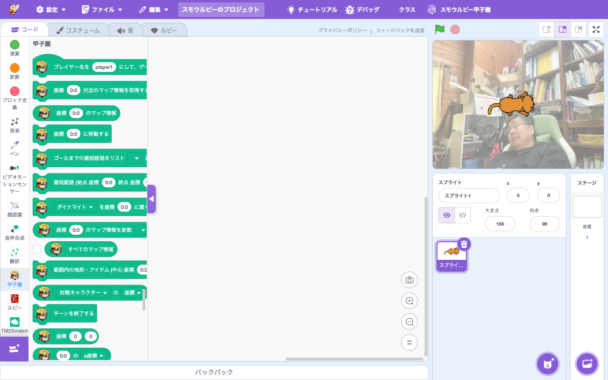

# 拡張機能: Smalruby Koshien

> **🆕 Smalruby 独自** — upstream に存在しない、Smalruby のために新規追加された拡張機能

- **Smalruby ランタイム対応**: ❌（smalruby3 gem は未対応。Koshien サーバとの通信を含むためブラウザ専用）
- **デフォルト表示**: ✅（拡張機能ライブラリにデフォルトで表示される）

## 概要

**スモウルビー甲子園**（Smalruby Koshien）競技用の拡張機能。プレイヤー（参加者の AI プログラム）がマップ上を移動し、アイテムを集めながらゴールを目指すターン制の競技。本拡張は競技ゲームへの接続、マップ情報取得、移動コマンド送信、ルート計算などのブロックを提供する。

## ユーザーストーリー

- **競技参加者の小学生・中学生**として、自分の AI プログラム (Smalruby スクリプト) を競技サーバに接続して動かしたい
- **教師**として、生徒たちがチームでアルゴリズムを考えて競い合う題材として使いたい
- **大会運営**として、競技用のサーバと共通の API でやり取りできる拡張機能を提供したい
- **プログラミング学習者**として、ターン制ゲームを通じて経路探索などのアルゴリズムを学びたい

## UI / 操作フロー

1. ブロックパレットの「拡張機能を追加」から **Smalruby Koshien** を選ぶ
2. ブロックパレットに Koshien 専用ブロックが表示される
3. `connectGame` ブロックで競技サーバに接続
4. ターンごとに `getMapArea` でマップ情報を取得し、`moveTo` などで移動
5. `setItem`, `setMessage` で行動・メッセージを送信

### Koshien テストモーダル

開発・デバッグ用の **Koshien テストモーダル** (`koshien-test-modal`) があり、競技サーバなしでローカルテストができる。

「AIを試す」では、編集中スプライト単体ではなく **プロジェクト全体（ステージ + すべての
スプライト）** を 1 つのプログラムとして出力する。これは「AIを保存」が書き出す `.rb` と
**同一の生成結果**であり、競技で実際に動く AI そのもの。「試す」と「保存」が同じコードに
なるよう、両者は `generateProjectCode`（`src/lib/ruby-script-preview.js`）を共有する。
編集中スプライトだけを出力すると、AI 本体が別スプライトにある場合やステージ選択中に
「中身が空の小さな AI」と誤判定され、後述のフォールバック導線も出ない（Issue #845）。
ステージを先頭に出力するので「すべてのスプライトでつかう」グローバル変数・リスト
（例: `$最短経路`）がステージの `def initialize` で初期化され、実行可能になる（v1 / v2 両対応）。
Ruby タブで編集中の未保存コードも `targetsCode` で取り込むため、ブロックへ変換する前の
状態でもそのまま試せる。

AI ソースは base64 化してビューアの `?player1=data:<base64>` クエリパラメータに渡す
（`src/lib/koshien-test-url.js` の `buildKoshienTestUrl` / `encodeAiToPlayerParam`）。
ただし複雑な AI（経路探索など）はソースが長く、URL 長制限（`MAX_KOSHIEN_TEST_URL_LENGTH`
= 8000 文字）を超えてビューアの起動に失敗しうる。そのため URL が長すぎる場合は
`buildKoshienTestPlan` が `tooLong: true` を返し、モーダルは **AI 無しの URL でビューアを
ロード**（デフォルト AI）したうえで、**AI を `.rb` ファイルとして保存する導線**
（`koshien-test-too-long-banner` / `koshien-test-download-ai`）を表示する。
ユーザーは保存した `.rb` をビューアから読み込んで試す。単純な AI の従来挙動（URL 直結）は維持される。

## 主要ファイル

### scratch-gui

#### コンポーネント

- `packages/scratch-gui/src/components/koshien-test-modal/koshien-test-modal.jsx` — テスト用モーダル
- `packages/scratch-gui/src/lib/ruby-script-preview.js` — コード生成。`generatePreviewCode`（編集中スプライトのプレビュー用）と `generateProjectCode`（プロジェクト全体。「AIを試す」「AIを保存」が共有）

#### ライブラリ

- `packages/scratch-gui/src/lib/libraries/extensions/koshien/` — 拡張機能登録（アイコン、descriptions）
- `packages/scratch-gui/src/lib/ruby-generator/koshien.js` — Koshien ブロック → Ruby 変換
- `packages/scratch-gui/src/lib/ruby-to-blocks-converter/koshien*` — Ruby → Koshien ブロック変換（要追加調査）

#### Redux

- `packages/scratch-gui/src/reducers/koshien-file.js` — Koshien ファイル管理 state
- AI 保存ステータス（rubytee からの自動保存と連動）

#### スニペット

- `packages/scratch-gui/src/containers/ruby-tab/koshien-snippets.json` — Monaco エディタの Koshien コード補完

### scratch-vm

- `packages/scratch-vm/src/extensions/koshien/index.js` — 拡張機能本体（競技サーバとの WebSocket 通信、コマンド処理）

### infra

なし（Koshien 競技サーバは別リポジトリで管理）。

## ブロックパレット

## 関連ブロック（主要 opcode）

| opcode | 説明 |
|---|---|
| `connectGame` | 競技サーバに接続 |
| `getMapArea`, `map`, `mapFrom`, `mapAll` | マップ情報の取得 |
| `moveTo` | 指定位置への移動 |
| `calcGoalRoute`, `calcRoute` | ゴールまでの経路計算 |
| `setItem`, `locateObjects` | アイテム配置・検出 |
| `targetCoordinate`, `position`, `positionOf` | 座標操作 |
| `turnOver` | プレイヤーの向き変更 |
| `setMessage`, `object` | メッセージ・オブジェクト送信 |

> 各ブロックの Ruby 表現は [`docs/smalruby-language-spec-extensions.ja.md`](../smalruby-language-spec-extensions.ja.md) を参照。

## 設定・データ永続化

- `koshien-file` reducer で Koshien プロジェクトファイルの状態を管理
- 競技サーバとの認証情報や接続情報は別途管理

## テスト

- VM 単体テスト: `packages/scratch-vm/test/unit/extension_koshien.js`

## 関連ドキュメント

- [`docs/rubytee/`](../rubytee/) — Koshien プロジェクトの自動保存連携
- [`docs/extension-smalruby-ruby/`](../extension-smalruby-ruby/) — 競技プログラム作成時に活用される Ruby 拡張

## 関連 Issue / PR

主要 PR は履歴を参照（`feat:.*koshien` で grep）。
