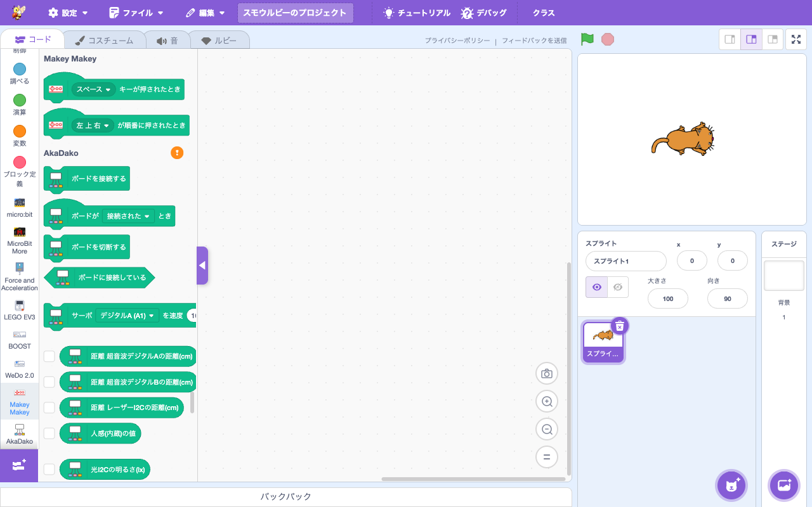

# 拡張機能: Makey Makey

> **⬆️ upstream そのまま** — upstream の実装をほぼそのまま利用

- **Smalruby ランタイム対応**: ❌（smalruby3 gem 未対応。USB HID キーボードイベント検出）
- **デフォルト表示**: ❌（`defaultHidden: true`）— 拡張機能ライブラリで「見る」ボタンを押すと表示
- **collaborator**: JoyLabz

## 概要

[Makey Makey](https://makeymakey.com/) (バナナや果物を電気的にキーとして使えるデバイス) のキー入力を検知する拡張機能。デバイス自体は USB キーボードとしてふるまうため、特別なドライバ不要。upstream Scratch 標準。

## ユーザーストーリー

- **Makey Makey 所有の小学生**として、フルーツや段ボールで自作したコントローラーで Smalruby を動かしたい
- **教師**として、フィジカル入力を伴う体感型授業をしたい

## 主要ファイル

- 拡張機能登録: `packages/scratch-gui/src/lib/libraries/extensions/index.jsx` の `extensionId: 'makeymakey'` (`defaultHidden: true`)
- VM 実装: `packages/scratch-vm/src/extensions/scratch3_makeymakey/`

## ブロックパレット

## 関連ブロック（主要 opcode）

| opcode | 説明 |
|---|---|
| `makeymakey_whenMakeyKeyPressed` | キーが押されたとき |
| `makeymakey_whenCodePressed` | キーシーケンス（コナミコマンド等）|

## 動作環境

- USB に接続した Makey Makey ボード（ドライバ不要、汎用 HID キーボードとして動作）

## 関連ドキュメント

- 上流: [scratch-vm のドキュメント](https://github.com/scratchfoundation/scratch-vm)
- [Makey Makey 公式](https://makeymakey.com/)
