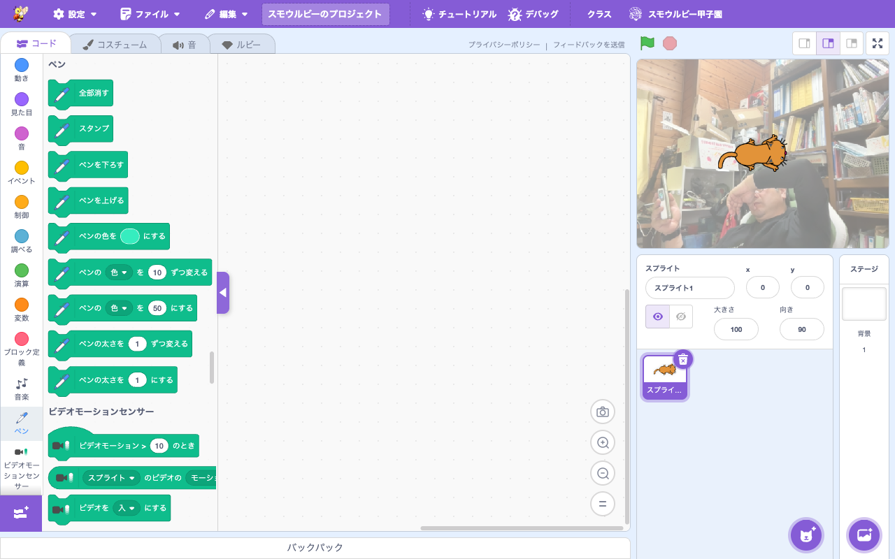

# 拡張機能: ペン (Pen)

> **⬆️ upstream そのまま** — upstream の実装をほぼそのまま利用

- **Smalruby ランタイム対応**: ✅（`ruby/smalruby3/lib/smalruby3/extension/pen.rb` あり）
- **デフォルト表示**: ✅（拡張機能ライブラリにデフォルトで表示される）

## 概要

スプライトの軌跡を線として残す**ペン**拡張機能。スタンプ機能（スプライトの形状をそのまま描画）も含む。upstream Scratch 標準。Smalruby の Ruby SDL2 デスクトップランタイムでも動作する。

## ユーザーストーリー

- **小学生**として、スプライトの動きで絵を描きたい（タートルグラフィックス）
- **算数好きな子**として、図形を描くプログラムを作りたい
- **アート好きな子**として、ランダムな模様や万華鏡のような作品を作りたい

## 主要ファイル

- 拡張機能登録: `packages/scratch-gui/src/lib/libraries/extensions/index.jsx` の `extensionId: 'pen'`
- VM 実装: `packages/scratch-vm/src/extensions/scratch3_pen/`
- Ruby Generator: `packages/scratch-gui/src/lib/ruby-generator/pen.js`
- Ruby ランタイム: `ruby/smalruby3/lib/smalruby3/extension/pen.rb`

## ブロックパレット

## 関連ブロック（主要 opcode）

| opcode | 説明 |
|---|---|
| `pen_clear` | すべてのペンを消す |
| `pen_stamp` | スタンプ（現在の見た目を描画）|
| `pen_penDown` / `pen_penUp` | ペンを下ろす / 上げる |
| `pen_setPenColorToColor` | ペンの色設定 (HSL) |
| `pen_changePenColorParamBy` / `pen_setPenColorParamTo` | ペン色パラメータ変更 |
| `pen_changePenSizeBy` / `pen_setPenSizeTo` | ペンサイズ変更 |

## 関連ドキュメント

- 上流: [scratch-vm のドキュメント](https://github.com/scratchfoundation/scratch-vm)
