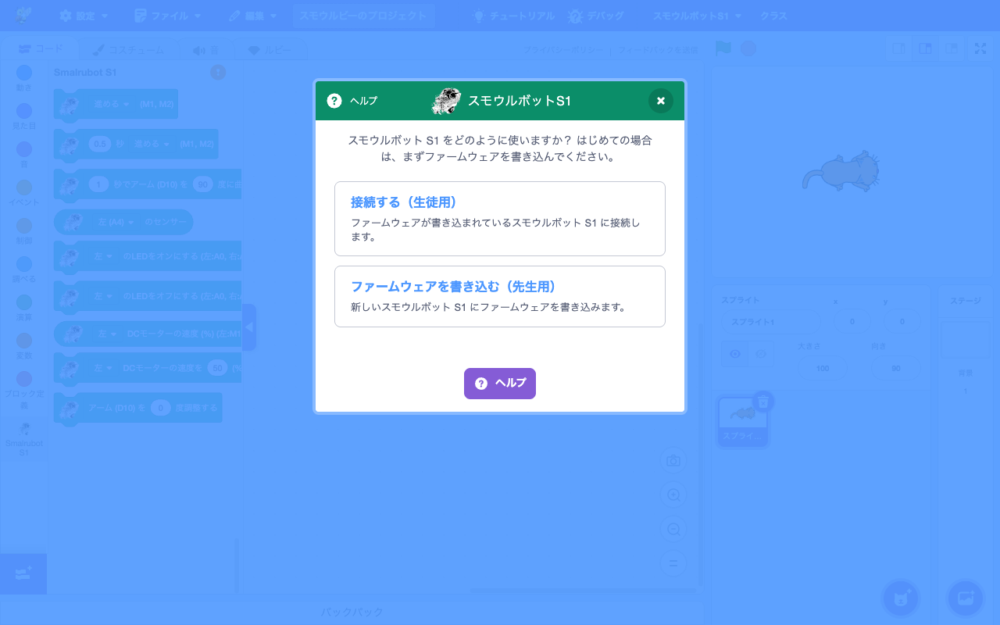
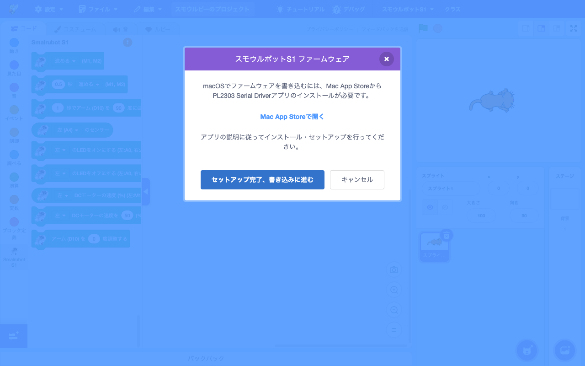
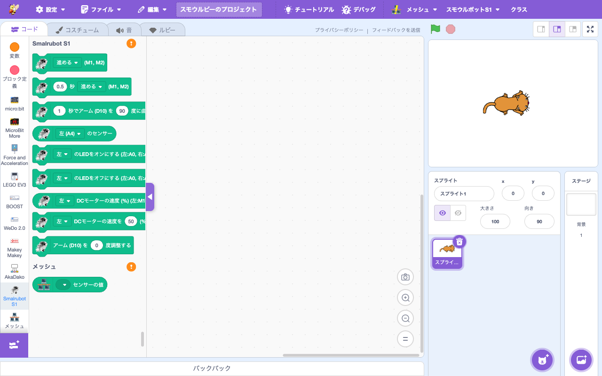

# 拡張機能: Smalrubot S1

> **🆕 Smalruby 独自** — upstream に存在しない、Smalruby のために新規追加された拡張機能

- **Smalruby ランタイム対応**: ❌（smalruby3 gem は未対応。WebSerial API 経由でハードウェアと通信するためブラウザ専用）
- **デフォルト表示**: ✅（拡張機能ライブラリにデフォルトで表示される）

## 概要

**Smalrubot S1**（Studuino ベースの教育用ロボット）を Smalruby から制御する拡張機能。Web Serial API を使ってブラウザから USB 経由でロボットと通信し、モーター・サーボ・LED・センサを操作する。

ファームウェアの書き込みも内蔵（**WebSerial STK500v1 実装**、`smalrubot-firmware-flasher.js`）しており、初回利用時にブラウザからロボットへファームウェアを転送できる（macOS は PL2303 Serial Driver が別途必要）。

## ユーザーストーリー

- **Smalrubot S1 を購入した小学生**として、Smalruby のブロックでロボットを動かしたい
- **教師**として、複数台のロボットを生徒それぞれに渡して、教室全体でロボットプログラミングをさせたい
- **保護者**として、子どもが自分のノート PC から直接ロボットを動かせる（追加アプリのインストール不要）状態にしたい
- **初めて使う子**として、自分のロボットにファームウェアを書き込む手順を Smalruby の中で完結させたい

## UI / 操作フロー

### 接続

1. ブロックパレットの「拡張機能を追加」から **Smalrubot S1** を選ぶ
2. 接続モーダルが S1 専用フローで開く（`smalrubot-s1-*-step.jsx` 系）。**生徒用 (接続) / 先生用 (ファームウェア書き込み)** のいずれかを選択

   

3. 「接続する（生徒用）」→ Web Serial のデバイス選択ダイアログ
4. ロボットを選んで承認
5. 接続完了

### ファームウェアフラッシュ

1. 接続モーダルの「ファームウェアを書き込む（先生用）」 もしくはメニューバーの「Smalrubot」メニューから起動
2. ファームウェアフラッシュモーダル (`smalrubot-firmware-modal`) が開く。**macOS では PL2303 Serial Driver アプリのインストール案内** が先に表示される

   

3. 「セットアップ完了、書き込みに進む」→ ロボットを選んで書き込み開始
4. 進捗表示の後、完了

### ブロックでの制御

接続後はブロックパレットに以下のような S1 専用ブロックが現れる：

| 操作 | 例 |
|---|---|
| 動作（前進・後退・回転） | `action(:forward, 100)` |
| アーム制御 | `bendArm(:up, 90)` |
| センサ取得 | `getSensorValue(:line)` |
| LED 点灯 | `turnLedOn(:red)` |
| モーター速度 | `setMotorSpeed(:left, 50)` |
| アームキャリブレーション | `setArmCalibration(:zero)` |

### ブロックパレット

接続後はブロックパレットの **Smalrubot S1** カテゴリに専用ブロックが表示される：

## 主要ファイル

### scratch-gui

#### コンポーネント / コンテナ

- `packages/scratch-gui/src/components/smalrubot-firmware-modal/` — ファームウェアフラッシュモーダル
- `packages/scratch-gui/src/containers/smalrubot-firmware-modal.jsx`
- `packages/scratch-gui/src/components/connection-modal/smalrubot-s1-*-step.jsx` × 5 — S1 専用接続ステップ（initial / connecting / connected / error / unsupported）

#### ライブラリ

| ファイル | 役割 |
|---|---|
| `packages/scratch-gui/src/lib/smalrubot-firmware-flasher.js` | WebSerial 経由の STK500v1 ファームウェアフラッシュ実装 |
| `packages/scratch-gui/src/lib/smalrubot-firmware.hex.js` | ファームウェアバイナリ (HEX 形式) |
| `packages/scratch-gui/src/lib/microbit-update.js` | （参考）類似の更新ロジック |

#### Redux

- `packages/scratch-gui/src/reducers/smalrubot-firmware.js` — フラッシュ進捗 state
- `packages/scratch-gui/src/reducers/modals.js` — ファームウェアモーダル開時に接続モーダルを自動で閉じる

#### Smalruby マーカー (upstream への埋め込み)

- `src/components/menu-bar/menu-bar.jsx` — Smalrubot ファームウェアメニュー
- `src/components/connection-modal/connection-modal.jsx` — S1 専用フロー振り分け
- `src/containers/connection-modal.jsx` — S1 ファームウェアフラッシュ起動
- `src/components/connection-modal/error-step.jsx` — エラーステップでのファームウェアボタン

詳細マーカー一覧: `.claude/rules/scratch-gui/smalruby-markers.md`

#### Ruby Generator / Converter

- `packages/scratch-gui/src/lib/ruby-generator/` 配下に Smalrubot 系の generator があるはず（要追加調査）

### scratch-vm

- `packages/scratch-vm/src/extensions/scratch3_smalrubot_s1/index.js` — 拡張機能本体（Web Serial 通信、コマンド送受信、センサ値ポーリング）

### infra / ruby

なし。

## 関連ブロック（主要 opcode）

| opcode | 説明 |
|---|---|
| `action`, `actionAndStopAfter` | 前進・後退・回転などの動作 |
| `bendArm` | アームの曲げ |
| `getSensorValue` | ライン・距離などのセンサ値取得 |
| `turnLedOn`, `turnLedOff` | LED の点灯・消灯 |
| `getMotorSpeed`, `setMotorSpeed` | モーター速度の取得・設定 |
| `setArmCalibration` | アームキャリブレーション |

> 各ブロックの Ruby 表現は [`docs/smalruby-language-spec-extensions.ja.md`](../smalruby-language-spec-extensions.ja.md) を参照。

## 設定・データ永続化

なし（接続情報は揮発的、リロードで切断される）。

## 動作環境

- **対応 OS**: Windows, ChromeOS, macOS（macOS は PL2303 Serial Driver 必要）
- **対応ブラウザ**: Chrome / Edge（Web Serial API サポート必要）
- **iPad / Android**: 非対応（Web Serial 未サポート）

## テスト

- 単体テスト: `packages/scratch-gui/test/unit/lib/smalrubot-firmware-flasher.test.js`
- 結合テスト: `packages/scratch-gui/test/integration/smalrubot-firmware.test.js`, `smalrubot-s1-connection-flow.test.js`
- VM 単体テスト: `packages/scratch-vm/test/unit/extension_smalrubot_s1.js`

## 関連ドキュメント

- [`docs/device-connection/`](../device-connection/) — connection-modal 共通基盤 (準備中)
- `.claude/rules/scratch-gui/smalruby-markers.md` — upstream マーカー一覧

## 関連 Issue / PR

主要 PR は履歴を参照（`feat:.*smalrubot` で grep）。
