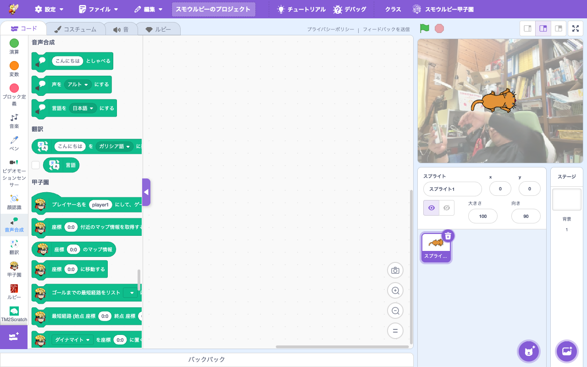

# 拡張機能: 音声合成 (Text to Speech)

> **🔧 upstream 改良** — upstream にあるが Smalruby で機能を改良・拡張している
> 改良点: 音声合成リクエストの送信先を Smalruby の CORS 回避プロキシ (`api.smalruby.app/scratch-api-proxy/synth`) に上書き。Scratch の音声合成サービスは CORS を scratch.mit.edu 限定にしたため、smalruby.app からの直叩きが CORS で失敗する。

- **Smalruby ランタイム対応**: ❌（smalruby3 gem 未対応。AWS Polly API + ブラウザ音声再生）
- **デフォルト表示**: ✅（拡張機能ライブラリにデフォルトで表示される）
- **collaborator**: Amazon Web Services

## 概要

入力したテキストを**音声で読み上げる**拡張機能。AWS Polly を使った音声合成（複数の声・言語対応）。upstream Scratch 標準。

### Smalruby 独自: CORS 回避プロキシ経由

Scratch の音声合成サービス (`synthesis-service.scratch.mit.edu`) は `Access-Control-Allow-Origin` を
`scratch.mit.edu` 限定に締めたため、`smalruby.app` から直接叩くと CORS でブロックされる。
そこで VM 実装 `scratch3_text2speech/index.js` の `SERVER_HOST` を Smalruby プロキシ
`https://api.smalruby.app/scratch-api-proxy` に上書きしている（`=== Smalruby: Start/End of synthesis CORS proxy ===`
マーカーで囲む）。拡張は `${SERVER_HOST}/synth?...` を組むため base の差し替えだけで proxy 経由になる。
プロキシはサーバ側で `synthesis-service.scratch.mit.edu` を叩き、バイナリ音声 (mp3) を Base64 で返却し
（API Gateway HTTP API v2 がクライアントへバイト列にデコード）、built-in CORS でレスポンスを返す
（`infra/smalruby-api` の `GET /scratch-api-proxy/synth`）。translate (#857) と同じ根本原因・方針。

## ユーザーストーリー

- **小学生**として、自分の作ったキャラクターに「しゃべらせたい」
- **物語作品を作る子**として、ナレーションを音声で入れたい
- **多言語学習中の子**として、英語など他言語の発音を聞きたい

## 主要ファイル

- 拡張機能登録: `packages/scratch-gui/src/lib/libraries/extensions/index.jsx` の `extensionId: 'text2speech'`
- VM 実装: `packages/scratch-vm/src/extensions/scratch3_text2speech/`

## ブロックパレット

## 関連ブロック（主要 opcode）

| opcode | 説明 |
|---|---|
| `text2speech_speakAndWait` | テキストを話して終わるまで待つ |
| `text2speech_setVoice` | 声を選ぶ（Alto, Tenor, Squeak, Giant, Kitten など）|
| `text2speech_setLanguage` | 言語を選ぶ |

## 関連ドキュメント

- 上流: [scratch-vm のドキュメント](https://github.com/scratchfoundation/scratch-vm)
- [AWS Polly](https://aws.amazon.com/polly/)
