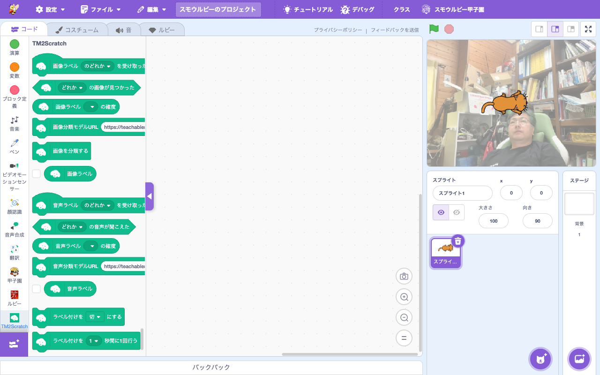

# 拡張機能: TM2Scratch（Teachable Machine）

> **🆕 Smalruby 独自** — upstream に存在しない、Smalruby のために新規追加された拡張機能（[champierre/tm2scratch](https://github.com/champierre/tm2scratch) を参考に、TensorFlow.js を直接使う形で再実装。AGPL-3.0）

- **Smalruby ランタイム対応**: ❌（smalruby3 gem は未対応。TensorFlow.js とブラウザ Camera API を使うためブラウザ専用）
- **デフォルト表示**: ✅（拡張機能ライブラリにデフォルトで表示される）

## 概要

Google の **Teachable Machine** で訓練した機械学習モデル（画像分類・音声分類）を Smalruby から使えるようにする拡張機能。Web カメラやマイクからの入力を AI モデルに通し、検出されたラベルに応じてブロックで反応できる。

機械学習を**実装ではなく利用する側**として体験させることで、子供たちが AI の仕組みを学ぶ入口になる。

## ユーザーストーリー

- **AI に興味を持った小学生**として、Teachable Machine で「自分の顔」「猫の画像」などを学習させたモデルを Scratch ブロックで使いたい
- **教師**として、機械学習を「ボタンを押したら反応する」レベルから体験させたい
- **保護者**として、子どもが AI / ML に最初に触れる教材として安全に使えるものが欲しい
- **発表会出展者**として、画像認識を組み込んだインタラクティブな作品を作りたい

## UI / 操作フロー

### 1. Teachable Machine でモデル作成

1. [Teachable Machine](https://teachablemachine.withgoogle.com/) にアクセス
2. 画像プロジェクトまたは音声プロジェクトを作成
3. 各クラスにサンプル画像/音声を追加して訓練
4. モデルをエクスポート（"Tensorflow.js" 形式）→ 共有 URL を取得

### 2. Smalruby で利用

1. ブロックパレットの「拡張機能を追加」から **TM2Scratch** を選ぶ
2. `setImageClassificationModelURL` ブロックでモデル URL を設定
3. `classifyVideoImageBlock` で Web カメラ画像を分類
4. `whenReceived [ラベル]` Hat ブロックで特定ラベル検出時に処理開始
5. `getImageLabel`, `imageLabelConfidence` で詳細取得

## 主要ファイル

### scratch-gui

- `packages/scratch-gui/src/lib/libraries/extensions/tm2scratch/` — 拡張機能登録（アイコン）
- `packages/scratch-gui/src/lib/ruby-generator/tm2scratch.js` — TM2Scratch ブロック → Ruby 変換

### scratch-vm

- `packages/scratch-vm/src/extensions/scratch3_tm2scratch/index.js` — 拡張機能本体（TensorFlow.js モデル読込、推論実行、ラベル検出イベント発火）

### infra

なし（モデル URL は Teachable Machine の Google Cloud Storage 等から直接ロード）。

## ブロックパレット

## 関連ブロック（主要 opcode）

### 画像分類

| opcode | 説明 |
|---|---|
| `setImageClassificationModelURL` | 画像分類モデルの URL を設定 |
| `classifyVideoImageBlock` | Web カメラ画像を分類 |
| `whenReceived` | 指定ラベル検出時の Hat ブロック |
| `isImageLabelDetected` | ラベル検出中かどうか |
| `getImageLabel` | 最後に検出したラベル |
| `imageLabelConfidence` | ラベルの信頼度 (0.0〜1.0) |

### 音声分類

| opcode | 説明 |
|---|---|
| `setSoundClassificationModelURL` | 音声分類モデルの URL を設定 |
| `whenReceivedSoundLabel` | 音声ラベル検出時 |
| `isSoundLabelDetected` | 音声ラベル検出中か |
| `soundLabelConfidence` | 音声ラベルの信頼度 |

> 各ブロックの Ruby 表現は [`docs/smalruby-language-spec-extensions.ja.md`](../smalruby-language-spec-extensions.ja.md) を参照。

## 設定・データ永続化

なし（モデル URL は実行中のメモリにのみ保持）。

## 動作環境

- **対応ブラウザ**: Chrome / Edge / Firefox / Safari（TensorFlow.js + getUserMedia サポート）
- **必須権限**: Web カメラ・マイクの利用許可

## ライセンス

- 本実装は **AGPL-3.0**（[champierre/tm2scratch](https://github.com/champierre/tm2scratch) の派生）
- ブロック定義・翻訳・アイコンは tm2scratch 由来
- 実装は TensorFlow.js を直接使う形で Smalruby 用に書き直されている

## 関連ドキュメント

- 上流参考: [champierre/tm2scratch](https://github.com/champierre/tm2scratch)
- [Teachable Machine](https://teachablemachine.withgoogle.com/)

## 関連 Issue / PR

主要 PR は履歴を参照（`feat:.*tm2scratch` で grep）。
