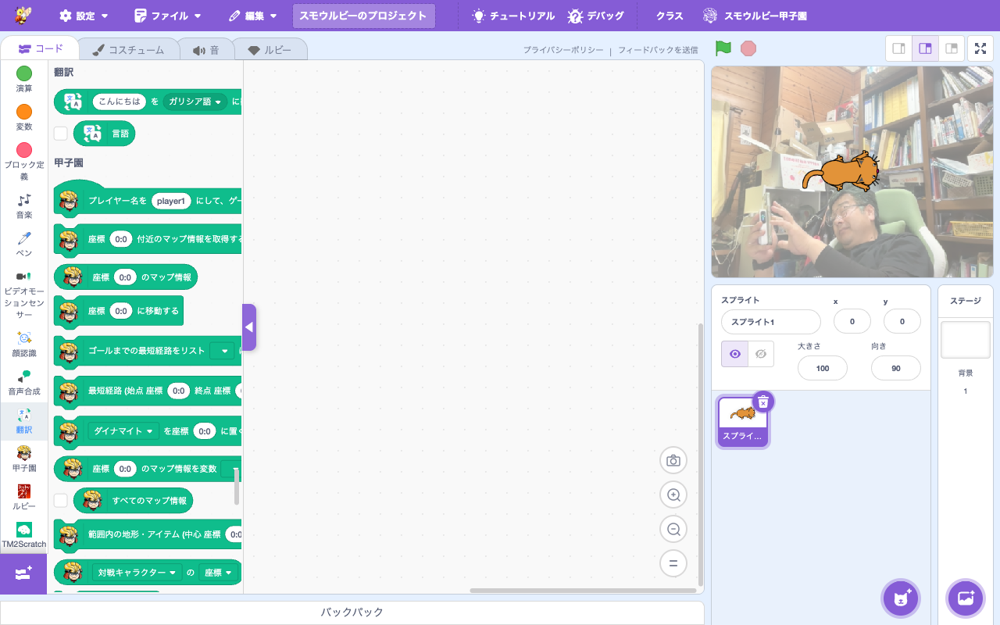

# 拡張機能: 翻訳 (Translate)

> **⬆️ upstream そのまま** — upstream の実装をほぼそのまま利用

- **Smalruby ランタイム対応**: ❌（smalruby3 gem 未対応。Google Translate API 経由）
- **デフォルト表示**: ✅（拡張機能ライブラリにデフォルトで表示される）
- **collaborator**: Google

## 概要

テキストを Google Translate 経由で**他言語に翻訳**する拡張機能。upstream Scratch 標準。

## ユーザーストーリー

- **多言語に興味がある小学生**として、自分の作品を多言語対応させたい
- **語学学習中の子**として、英語の文を入れて翻訳結果を確認したい
- **国際交流したい子**として、海外の友達向けに翻訳機能を組み込んだ作品を作りたい

## 主要ファイル

- 拡張機能登録: `packages/scratch-gui/src/lib/libraries/extensions/index.jsx` の `extensionId: 'translate'`
- VM 実装: `packages/scratch-vm/src/extensions/scratch3_translate/`

## ブロックパレット

## 関連ブロック（主要 opcode）

| opcode | 説明 |
|---|---|
| `translate_getTranslate` | テキストを指定言語に翻訳 |
| `translate_getViewerLanguage` | 閲覧者の言語を取得 |

## 関連ドキュメント

- 上流: [scratch-vm のドキュメント](https://github.com/scratchfoundation/scratch-vm)
- [Google Translate](https://translate.google.com/)
