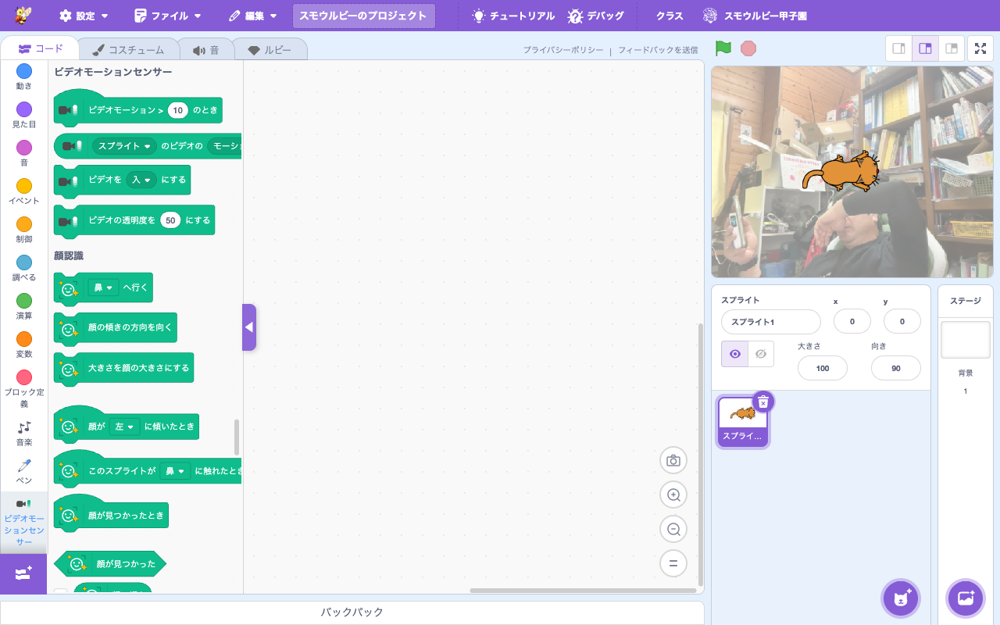

# 拡張機能: ビデオモーションセンサー (Video Sensing)

> **⬆️ upstream そのまま** — upstream の実装をほぼそのまま利用

- **Smalruby ランタイム対応**: ❌（smalruby3 gem 未対応。Web カメラとブラウザ画像処理を使うため）
- **デフォルト表示**: ✅（拡張機能ライブラリにデフォルトで表示される）

## 概要

Web カメラからの映像で**動きを検知**し、スプライト上の動き量や向きを取得する拡張機能。動きをトリガーにブロックを実行できる。upstream Scratch 標準。

## ユーザーストーリー

- **小学生**として、自分の手の動きでゲームを操作したい
- **教師**として、フィジカル入力を伴う体感型作品を作らせたい
- **発表会の出展者**として、観客が手を振ると反応する作品を作りたい

## 主要ファイル

- 拡張機能登録: `packages/scratch-gui/src/lib/libraries/extensions/index.jsx` の `extensionId: 'videoSensing'`
- VM 実装: `packages/scratch-vm/src/extensions/scratch3_video_sensing/`

## ブロックパレット

## 関連ブロック（主要 opcode）

| opcode | 説明 |
|---|---|
| `videoSensing_whenMotionGreaterThan` | 動きが N より大きいとき |
| `videoSensing_videoOn` | 動きの量・向きを取得 |
| `videoSensing_videoToggle` | カメラ表示の ON/OFF |
| `videoSensing_setVideoTransparency` | カメラ表示の透明度 |

## 動作環境

- **必須**: Web カメラ + ブラウザの getUserMedia 許可

## 関連ドキュメント

- 上流: [scratch-vm のドキュメント](https://github.com/scratchfoundation/scratch-vm)
- [`docs/extension-face-sensing/`](../extension-face-sensing/) — 顔検出（より高度なビデオ処理）
