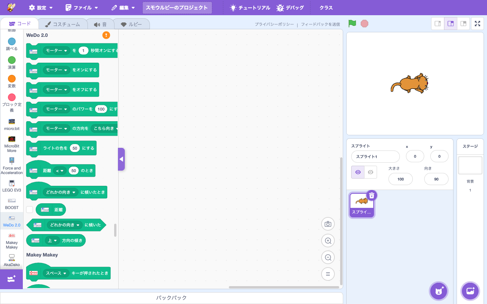

# 拡張機能: LEGO Education WeDo 2.0

> **⬆️ upstream そのまま** — upstream の実装をほぼそのまま利用

- **Smalruby ランタイム対応**: ❌（smalruby3 gem 未対応。Web Bluetooth 経由）
- **デフォルト表示**: ❌（`defaultHidden: true`）— 拡張機能ライブラリで「見る」ボタンを押すと表示
- **collaborator**: LEGO

## 概要

[LEGO Education WeDo 2.0](https://education.lego.com/en-us/products/lego-education-wedo-2-0-core-set/2000094/) を Smalruby から制御する拡張機能。低学年向けの LEGO ロボット教材。upstream Scratch 標準。

## ユーザーストーリー

- **WeDo を持っている小学校低学年**として、LEGO ロボットを Smalruby から動かしたい
- **小学校教師**として、低学年向けの簡単な LEGO ロボットプログラミングをさせたい

## 主要ファイル

- 拡張機能登録: `packages/scratch-gui/src/lib/libraries/extensions/index.jsx` の `extensionId: 'wedo2'` (`defaultHidden: true`)
- VM 実装: `packages/scratch-vm/src/extensions/scratch3_wedo2/`

## ブロックパレット

## 関連ブロック（主要 opcode）

| opcode | 説明 |
|---|---|
| `wedo2_motorOnFor` | モーター N 秒回す |
| `wedo2_motorOn` / `wedo2_motorOff` | モーター ON/OFF |
| `wedo2_startMotorPower` | モーターパワー設定 |
| `wedo2_setMotorDirection` | 方向設定 |
| `wedo2_setLightHue` | LED の色 |
| `wedo2_whenDistance` | 距離センサ |
| `wedo2_whenTilted` | 傾き検知 |
| `wedo2_getDistance` | 距離取得 |

## 動作環境

- **対応ブラウザ**: Chrome / Edge (Web Bluetooth サポート)

## 関連ドキュメント

- 上流: [scratch-vm のドキュメント](https://github.com/scratchfoundation/scratch-vm)
