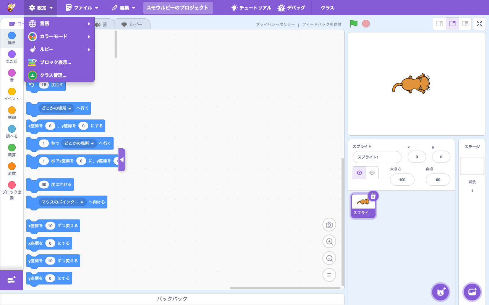

# メニューバー

> **🔧 upstream 改良** — upstream にあるが Smalruby で機能を改良・拡張している
> **改良点**: ① **Smalruby ロゴ**に置換（upstream の Scratch ロゴから）。② **クラスルーム** ボタン追加。③ **Smalrubot ファームウェア** メニュー追加。④ **バージョン更新通知** バナー追加。⑤ **設定** メニューにクラスルーム管理を追加。

## 概要

エディタ最上部の**メニューバー**。新規/開く/保存/ファイル名変更などのファイル操作、編集メニュー、設定メニュー、言語選択、アカウントメニュー、Smalruby 独自のクラスルームボタン・Smalrubot ファームウェアメニュー・バージョン更新通知などを集約する。

## ユーザーストーリー

- **小学生**として、Smalruby のロゴで自分が今何のアプリを使っているか確認したい
- **教師**として、メニューバーから直接「クラス」や「設定」にアクセスしたい
- **Smalrubot 利用者**として、ロボットのファームウェア書き込みをメニューから起動したい
- **長期間使っているユーザー**として、Smalruby に新しいバージョンが出たら通知してほしい
- **多言語ユーザー**として、画面右下の地球アイコンから言語を切り替えたい

## UI / 操作フロー

### メニューバー構成

| 要素 | 機能 |
|---|---|
| Smalruby ロゴ | アプリ識別（Smalruby 改良） |
| ファイルメニュー | 新規 / 開く / 保存 / Drive 連携 / URL ローダー |
| 編集メニュー | 元に戻す / やり直し / ターボモード切替 |
| 設定メニュー (⚙) | クラスルーム管理（Smalruby 改良） / 言語 / その他 |
| クラスボタン | クラスルームモーダルを開く（Smalruby 独自）|
| Smalrubot メニュー | ファームウェア書き込み（Smalruby 独自）|
| プロジェクトタイトル入力欄 | タイトル編集 |
| 共有 / 見る ボタン | upstream の Scratch アカウント機能（Smalruby では削減）|
| バージョン更新通知 | 新バージョン検出時にバナー表示（Smalruby 独自）|

### 設定メニュー

設定メニューには **言語 / カラーモード / ルビー (バージョン切替) / ブロック表示 / クラス管理** が並ぶ。クラス管理は Smalruby 独自追加。

### tutorial-tooltip

特定のメニュー項目に対して**チュートリアルツールチップ**を表示できる（`tutorial-tooltip`）。

## 主要ファイル

### scratch-gui

| ファイル | 役割 |
|---|---|
| `packages/scratch-gui/src/components/menu-bar/menu-bar.jsx` | メニューバー本体（Smalruby マーカー多数）|
| `packages/scratch-gui/src/components/menu-bar/menu-bar.css` | スタイル（mobile-ui 用 `max-height: 800px` 圧縮も含む）|
| `packages/scratch-gui/src/components/menu-bar/settings-menu.jsx` | 設定メニュー（Smalruby のクラスルーム管理を含む）|
| `packages/scratch-gui/src/components/menu-bar/tutorial-tooltip.jsx` | チュートリアルツールチップ |
| `packages/scratch-gui/src/lib/menu-bar-hoc.jsx` | メニューバー HOC |
| `packages/scratch-gui/src/components/language-selector/` | 言語選択 |
| `packages/scratch-gui/src/lib/version-checker.js` | バージョン更新確認（Smalruby 独自）|

#### Smalruby マーカー (upstream への埋め込み)

主な箇所（詳細は `docs/maintenance/smalruby-markers-gui.md`）：

- smalrubot firmware menu — Smalrubot ファームウェアメニュー
- classroom button — クラスルームボタン
- replace Scratch logos with Smalruby logo — ロゴ置換
- version update notification — バージョン更新通知

### scratch-vm

なし。

### infra

なし。

## 関連ブロック

なし。

## 設定・データ永続化

### Redux state

- `menus.js` — メニュー開閉状態
- `tutorial-onboarding.js` — チュートリアルツールチップの表示状態
- `locales.js` — 言語設定

## 関連ドキュメント

- [`docs/classroom/`](../classroom/) — クラスルームボタン → クラスルームモーダル
- [`docs/extension-smalrubot-s1/`](../extension-smalrubot-s1/) — Smalrubot ファームウェアメニュー
- [`docs/tutorial/`](../tutorial/) — チュートリアルツールチップ
- [`docs/mobile-ui/`](../mobile-ui/) — mobile での menu-bar 圧縮
- `docs/maintenance/smalruby-markers-gui.md` — upstream マーカー一覧

## 関連 Issue / PR

- Issue #600 — narrow-height (max-height: 800px) で menu-bar 48→40px 圧縮
