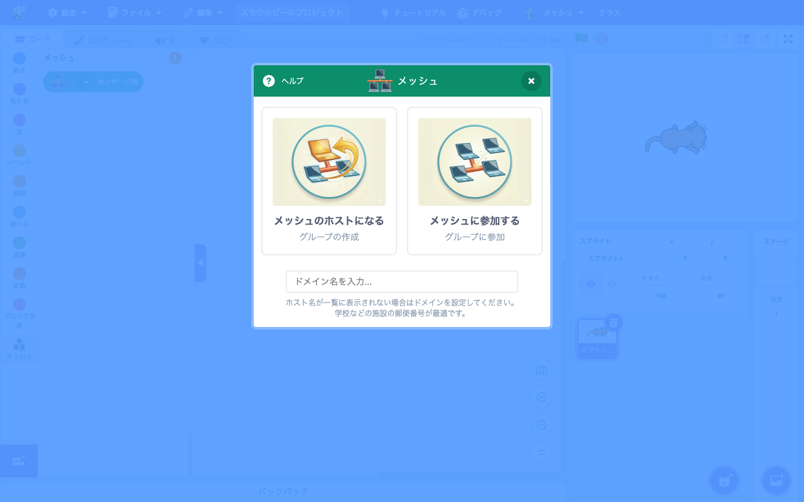
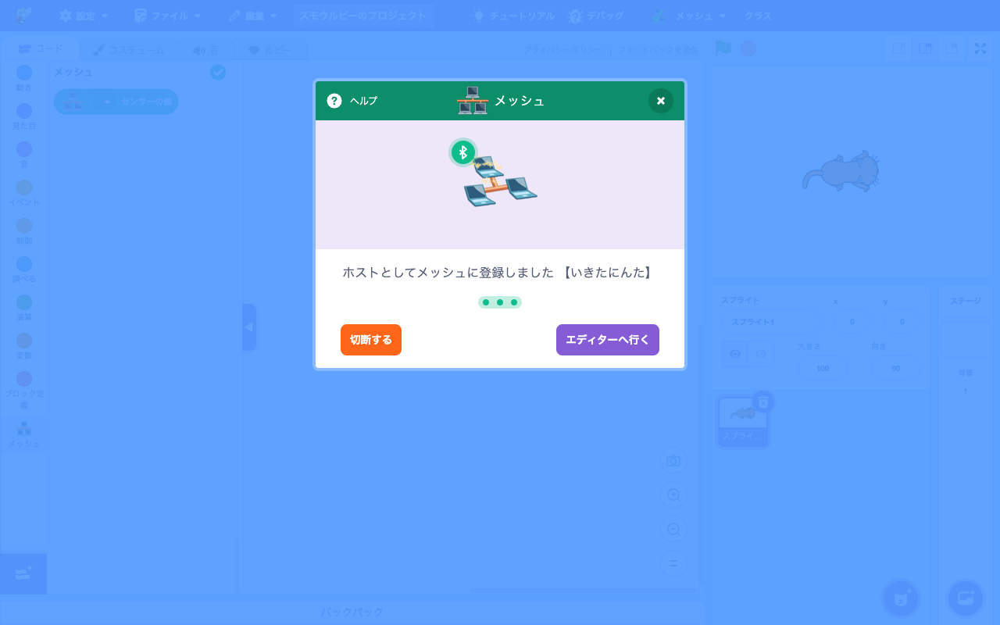
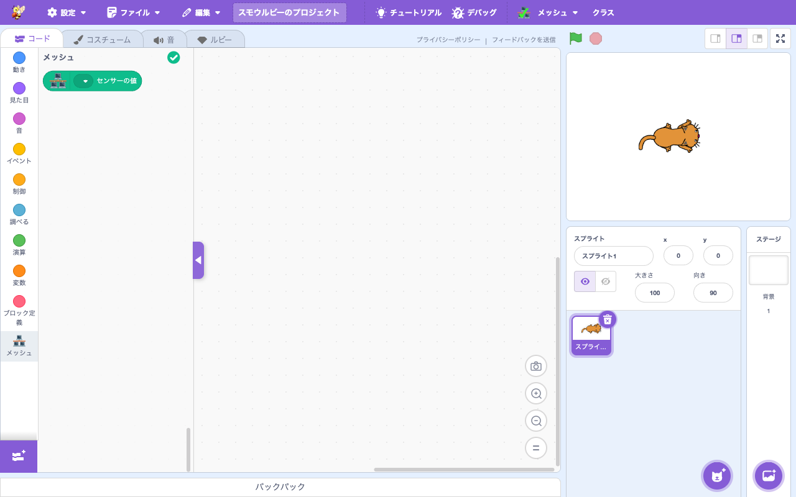
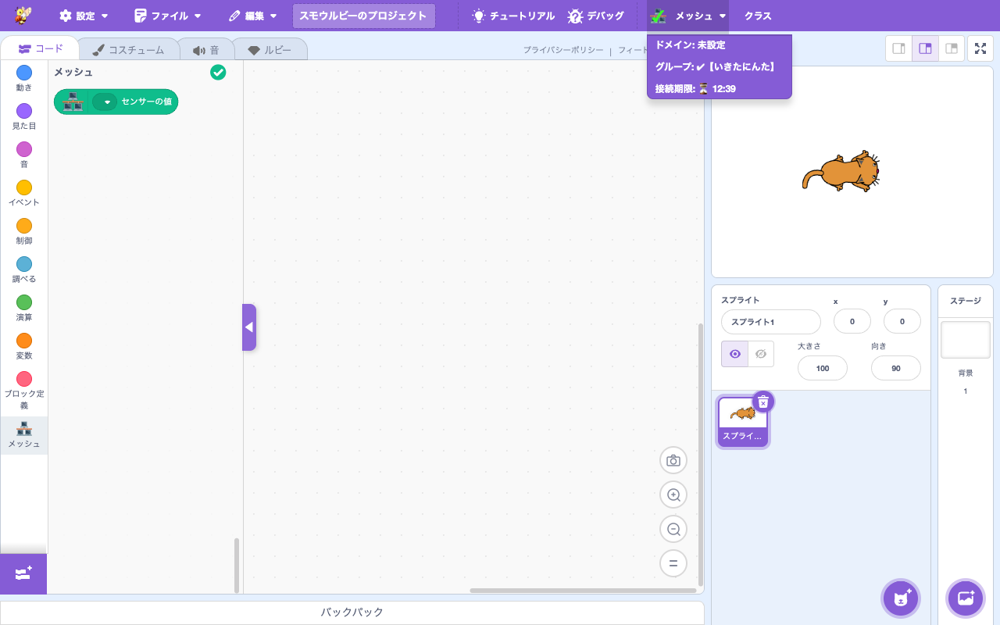
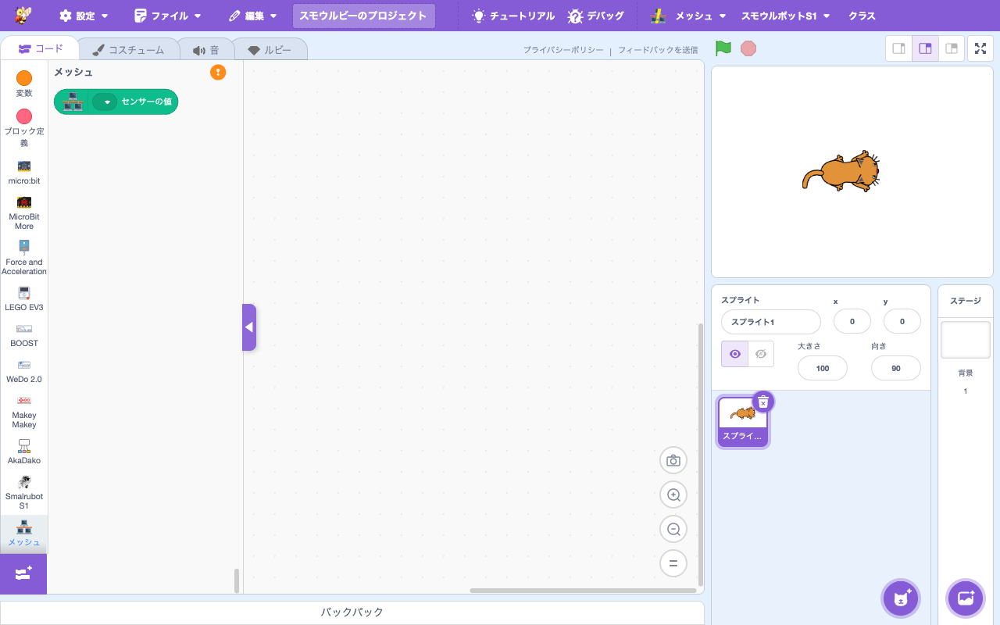

# Mesh v2

> **🆕 Smalruby 独自** — upstream に存在しない、Smalruby のために新規追加された機能

## 概要

複数の Smalruby インスタンス間で **broadcast event** と **グローバル変数** をリアルタイム共有する機能。子供たちが教室や家庭でネットワークを通じて連携した作品（複数人で協力するゲーム、リレー型のお絵描きなど）を作れるようにする。

旧 Mesh (v1) は外部サービス Skyway に依存していたが、v1 のサービス停止に伴い、AWS AppSync + DynamoDB をバックエンドに自社で再構築したのが Mesh v2。

## ユーザーストーリー

- **小学生**として、友達のスモウルビーと自分のスモウルビーで「メッセージを送る」「相手の変数を読む」をして、複数人で動くゲームを作りたい
- **教師**として、教室全員がインターネット越しに簡単な合言葉でグループに入れて、リアルタイム通信を体験させたい
- **家庭学習中の子**として、別の場所にいる家族や友達と画面を分けて協力プレイができる作品を作りたい

## UI / 操作フロー

1. ブロックパレットの「拡張機能を追加」から **Mesh** を選ぶ
2. 接続モーダル (`connection-modal`) が開く。**ホスト**として新しいグループを作るか、**メンバー**として既存グループ名で参加するかを選択

   

3. ホスト選択時：自動的にランダムグループ名（例: `【いきたにんた】`）が割り当てられて登録完了

   

4. 「エディターへ行く」でブロックパレットに戻ると、メッシュカテゴリに緑チェックが付く

   

5. メニューバーの「メッシュ」をクリックすると、ドメイン / グループ名 / **接続期限のカウントダウン** が確認できる

   

   メッシュカテゴリのブロックは少なく、`センサーの値` で他ノードのグローバル変数を読み取るのが基本。

   

6. 接続後、`broadcast` ブロックでイベント送信、グローバル変数の自動同期、`mesh.sensor_value(name)` で他ノードの値読み取りが可能に
7. グループの最大接続時間は **35 分**（`MESH_MAX_CONNECTION_TIME_SECONDS`）

通信モードは環境に応じて自動選択される：

| モード | リアルタイム配信 | 環境制約 |
|---|---|---|
| **WebSocket** | AppSync subscription | プロキシ/フィルタが WebSocket を許可 |
| **Polling** | 2 秒周期の query | フォールバック（403/503 で WebSocket 不可な環境）|

URL パラメータ `?force_polling=1` でクライアント側から強制 polling 化できる。

## 主要ファイル

### scratch-gui

- **拡張機能登録**: `packages/scratch-gui/src/lib/libraries/extensions/index.jsx` — `extensionId: 'meshV2'`
- **接続 UI（接続モーダルの mesh-v2 専用ステップ）**:
  - `packages/scratch-gui/src/components/connection-modal/mesh-v2-initial-step.jsx`
  - `packages/scratch-gui/src/components/connection-modal/mesh-v2-network-filtered-step.jsx`
  - `packages/scratch-gui/src/components/connection-modal/mesh-v2-scanning-step.jsx`
- **状態管理**: `packages/scratch-gui/src/reducers/mesh-v2.js`
- **Ruby 連携**:
  - `packages/scratch-gui/src/lib/ruby-generator/mesh_v2.js` — Ruby コード → mesh ブロック変換
  - `packages/scratch-gui/src/lib/ruby-to-blocks-converter/mesh_v2.js` — mesh ブロック → Ruby コード

### scratch-vm（拡張機能本体）

`packages/scratch-vm/src/extensions/scratch3_mesh_v2/`:

| ファイル | 責務 |
|---|---|
| `index.js` | scratch 拡張ブロック定義、UI 連携 |
| `mesh-service.js` | ファサード。各 manager mixin を集約 |
| `mesh-client.js` | Apollo Client、GraphQL endpoint URL |
| `gql-operations.js` | GraphQL queries / mutations / subscription 定義 |
| `network-filter.js` | エラー分類、503 検出、testWebSocket |
| `periodic-sync.js` | WebSocket モード時の 15 秒 fallback (`fetchAllNodesData`) |
| `polling-client.js` | Polling モードの 2 秒周期 (`pollEvents` / `POLL_GROUP_DATA`) |
| `subscription-manager.js` | WebSocket subscription 受信 |
| `heartbeat-manager.js` | host/member heartbeat と接続タイマー |
| `data-sender.js` | グローバル変数送信 (REPORT_DATA) |
| `broadcast-receiver.js` | 受信した event を順序保証して Scratch broadcast に流す |
| `event-sender.js` | `fireEvent` キューイング + バッチ送信 + orderKey 生成 |
| `group-lifecycle.js` | createDomain / createGroup / joinGroup / leaveGroup |
| `rate-limiter.js` | `sendData` の rate limit + マージ |
| `utils.js`, `name-search-utils.js` | URL パラメータ、グループ名検索 |

### infra/smalruby-mesh-v2 (CDK + AppSync + DynamoDB)

サーバー側実装。詳細は専用ドキュメントを参照：

- [`infra/smalruby-mesh-v2/docs/architecture.md`](../../infra/smalruby-mesh-v2/docs/architecture.md) — システムアーキテクチャ、データフロー、テーブル設計
- [`infra/smalruby-mesh-v2/docs/api-reference.md`](../../infra/smalruby-mesh-v2/docs/api-reference.md) — GraphQL スキーマ完全リファレンス
- [`infra/smalruby-mesh-v2/docs/deployment.md`](../../infra/smalruby-mesh-v2/docs/deployment.md) — デプロイ手順
- [`infra/smalruby-mesh-v2/docs/development.md`](../../infra/smalruby-mesh-v2/docs/development.md) — 開発ガイド
- [`infra/smalruby-mesh-v2/docs/operations.md`](../../infra/smalruby-mesh-v2/docs/operations.md) — モニタリング・コスト・スケーリング

## 関連ブロック

Mesh 拡張機能のブロックは「メッセージ送信」「他ノードの変数読み取り」が中心：

| ブロック ID | 説明 |
|---|---|
| `meshV2_broadcast` | 名前付きイベントを送信 |
| `meshV2_broadcastAndWait` | イベント送信して受信側の処理完了を待つ |
| `meshV2_whenIReceive` | イベント受信時の Hat ブロック |
| `meshV2_getSensorValue` | 他ノードのグローバル変数を読み取り |

> 各ブロックの詳細仕様は [`docs/smalruby-language-spec-extensions.ja.md`](../smalruby-language-spec-extensions.ja.md) を参照。

## 設定・データ永続化

### 環境変数（クライアント側、`.env`）

- `MESH_GRAPHQL_ENDPOINT` — AppSync GraphQL エンドポイント
- `MESH_API_KEY` — API キー
- `MESH_AWS_REGION` — リージョン (`ap-northeast-1`)

### localStorage

- `meshV2:domain` — ユーザー固有のドメイン名（CRC32 ハッシュベース）

### URL パラメータ

- `?force_polling=1` — Polling モード強制
- `?mesh_debug=1` — mesh 通信のデバッグログを表示

## コスト

詳細試算は **[`cost.md`](cost.md)** を参照。AppSync + DynamoDB の per-operation 単価と production 設定での月額試算を網羅。

## 開発・テスト

mesh は最重要機能のため、関連コードを変更したときは必ず **Playwright によるデグレ確認** を実施する。手順は `.claude/rules/scratch-gui/mesh.md` の「デグレ確認手順」を参照（heartbeat TTL の関係で 5 分以内に完了させること）。

```bash
# 単体テスト
bin/dx bash -c "cd packages/scratch-vm && npm exec tap -- test/unit/mesh_service_v2*.js"

# integration test
bin/dx bash -c "cd packages/scratch-vm && npm exec jest test/integration/extensions/mesh-v2-*.test.js"
```

## 関連ドキュメント

- [`cost.md`](cost.md) — AWS コスト試算
- [`docs/extension-mesh-v2/`](../extension-mesh-v2/) — 拡張機能としての観点 (準備中、本ページとの分担は要検討)
- `.claude/rules/scratch-gui/mesh.md` — クライアント側開発ルール、デグレ確認手順
- `.claude/rules/infra/smalruby-mesh-v2.md` — サーバー側開発ルール

## 関連 Issue / PR

- 旧 Mesh (v1) → v2 移行: 複数の関連 Issue
- Issue #554 (pollGroupData 統合) — PR #564
- Issue #555 (プロトコルロギング) — PR #557
- Issue #556 (orderKey によるイベント順序保証) — PR #563
- Issue #566 (mesh-service.js 責務分割) — PR #569
- Issue #592 (Skyway 停止対応によるバックパック自動マイグレーション)
