# Smalruby SP/iPad 対応 UI/UX

> **対象**: スマホ (横向き) と iPad (portrait/landscape)。一般 PC ブラウザでも viewport を縮めれば同じ条件で発火する
> **検証 viewport**:
> - スマホ横向き: 844×390 (iPhone 14)
> - iPad portrait: 768×1024、iPad mini portrait: 744×1133
> - iPad landscape: 1024×768
> - desktop reference: 1280×800

このドキュメントは、Smalruby を **スマホ・タブレット (iPad) で操作可能にする一連の対応** の設計意図と data-testid をまとめたもの。タイトルどおり SP (smartphone) を主目的とするが、**iPad の調整も SP 対応の一部として同じドキュメント内で扱う**（フォーム要因が同根のため）。

---

## 1. 切り替えロジック (どのモードがいつ出るか)

切り替えは **viewport ベースで自動**。URL パラメータでのオプトインは設けない。`useIsNarrowScreen` の `matchMedia` がリアルタイムに反応するので、ブラウザリサイズ・端末回転に追従する。ただし、ユーザーが表示モードを明示指定した場合はそれを優先する (下記「ユーザーによる表示モードの固定」)。

### 切り替え式

`packages/scratch-gui/src/lib/use-is-narrow-screen.js`:

```js
const NARROW_SCREEN_QUERY = '(max-width: 743px), (max-width: 950px) and (max-height: 500px)';
```

`packages/scratch-gui/src/lib/responsive-gui.jsx` がこの hook の結果で `<MobileGui>` と `<GUI>` (upstream desktop) を出し分ける。

### 結果の対応表

| Viewport (例)             | 短辺幅   | 高さ    | 出るモード                      | スクリーンショット |
| ------------------------- | -------- | ------- | ------------------------------- | ------------------ |
| iPhone 14 横 (844×390)    | 844      | 390     | **MobileGui** (幅 ≤ 950 かつ 高さ ≤ 500 で発火) | 02〜11             |
| iPhone 14 縦 (390×844)    | 390      | 844     | **MobileGui** + 縦持ち警告       | 11                 |
| Chromebook ズーム (1380×480) | 1380 | 480     | **desktop GUI** (幅 > 950 なので高さ条件は無効) | —                  |
| iPad mini portrait (744×1133) | 744 | 1133    | desktop GUI (iPad 調整)         | 23                 |
| iPad portrait (768×1024)  | 768      | 1024    | desktop GUI (iPad 調整)         | 20                 |
| iPad landscape (1024×768) | 1024     | 768     | desktop GUI (高さ調整あり)       | 21、22             |
| Desktop (1280×800)        | 1280     | 800     | desktop GUI (upstream 通常)     | 24                 |

### しきい値の根拠

- **幅 743px** は iPad mini portrait (744) を **MobileGui に落とさない** ための境界。MobileGui は横向き専用 UI なので、iPad portrait のような縦長を強制的に MobileGui で見せると逆に使いにくい。iPhone 縦持ちのように横が極端に狭い端末をスマホモードにする主条件。
- **高さ 500px は幅 950px 以下に限定する**。スマホ横持ち (390 高さ) を確実に拾いつつ、**Chromebook をズームして高さだけ縮んだ広い画面 (例 1380×480) を誤ってスマホモードにしない** ため (Issue #865)。以前は `(max-height: 500px)` を無条件で OR していたため、Chromebook のズームで高さが 500px 以下になると意図せずスマホモードに入る不具合があった。950px はスマホ横持ちの最大級 (iPhone Pro Max 系 ~932px) を含み、Chromebook / ノート PC の一般的な幅 (≥1280px) を確実に除外する。

### iPad モードでの追加調整 (744〜1023px の desktop GUI)

「desktop GUI に分岐したけど 1024px 未満」のレンジ (= iPad mini/iPad portrait と縦が低めの iPad landscape) には、upstream の固定 1024px 前提を緩めるための **CSS メディアクエリ** が当たる。これらは Smalruby マーカー付きで upstream ファイル内に置いてある。

| 場所                                            | 機能                                          | 効果                                                                     |
| ----------------------------------------------- | --------------------------------------------- | ------------------------------------------------------------------------ |
| `src/playground/index.css`                      | iPad portrait min-width relax                | `body` の `min-width: 1024px` を 744〜1023px で解除し、横スクロールを抑止 |
| `src/components/gui/gui.css`                    | iPad portrait narrow desktop layout          | `editor-wrapper` の `flex-basis` を緩めて、stage 列が 250px 程度に収まるようにする |
| `src/components/gui/gui.css`                    | iPad portrait legal links cleanup            | フィードバックリンク + セパレータを非表示にして上部メニューの幅を確保     |
| `src/components/gui/gui.jsx`                    | iPad portrait narrow desktop stage size      | `stageSize` を `'small'` に強制                                          |
| `src/components/gui/gui.css`                    | narrow-height vertical chrome compression    | `max-height: 800px` (= iPad landscape など) で `body-wrapper` を 2.5rem 圧縮、`tab-list` を 36px に下げる |
| `src/components/menu-bar/menu-bar.css`          | narrow-height menu bar compression           | `max-height: 800px` で menu-bar を 48→40px に圧縮                        |
| `src/playground/index.css`                      | narrow viewport vertical scroll lock         | 狭幅で `overflow-y: clip`、ピンチ拡大などの縦スクロール暴発を抑止        |

詳細マーカーは `docs/maintenance/smalruby-markers-gui.md` を参照。

### なぜこういう構造にしたか (設計意図)

- **upstream は 1 行も削らない**: SP/iPad 対応はすべてマーカー付きの加筆で実装。upstream 取り込み時の merge コストを最小化するため (`MEMORY.md` の feedback「upstream Scratch 追従コスト最小化」)。
- **オプトインフラグを増やさない**: ユーザーが flag を知らないと SP で見られないため、viewport 自動判定で完結させる。同様に「PC 表示が崩れている」警告バナーも置かない (リサイズ可能な PC ブラウザでの誤検知が多いため)。
- **MobileGui は別コンポーネントに分離**: desktop GUI の一部だけを CSS で隠すアプローチでは「右ペインも見えないのに React tree には残る → 余計なリスナーや HMR コスト」が累積するため、MobileGui を独立したコンポーネントにして一度差し替える方式にした。
- **iPad は desktop GUI のまま**: iPad は横幅 768〜1024px 程度あり、MobileGui の縦タブ集約より desktop の従来 UI のほうが学習コストが低い。なので iPad は desktop GUI に CSS/レイアウト調整を当てる方針。

### ユーザーによる表示モードの固定 (Issue #865)

viewport 自動判定に加えて、**ユーザーが表示モードを明示指定して固定できる**。Chromebook のズーム等で意図せずスマホモードに入ってしまったユーザーが、自力で PC モードへ抜け出すための逃げ道。

| モード | 値 | 挙動 |
| ------ | -- | ---- |
| 自動 | `auto` (既定) | viewport 自動判定 (上記の切り替え式) |
| PC モード | `desktop` | viewport に関係なく常に desktop GUI |
| スマホモード | `mobile` | viewport に関係なく常に MobileGui |

- 設定は **localStorage `smalruby:displayMode`** に保存され、そのマシンでは以後ずっと維持される (`auto` はキー削除 = 未設定と等価)。
- `persistDisplayMode()` が `smalruby:displayModeChanged` イベントを発火し、`useDisplayMode` hook 経由で `ResponsiveGui` がリアルタイムに切り替える (リロード不要)。
- **切り替え口**:
  - スマホモード中: モバイルドロワー (☰) の目立つ「PCモードに切り替える」ボタン (`mobile-drawer-switch-to-desktop`)。
  - どちらのモードでも: 設定メニュー → 「表示モード」の 自動 / PCモード / スマホモード (`settings-display-mode-{auto,desktop,mobile}`)。
- 関連ファイル: `src/lib/settings/display-mode/`、`src/lib/use-display-mode.js`、`src/lib/responsive-gui.jsx`、`src/components/mobile-drawer/mobile-drawer.jsx`、`src/components/menu-bar/settings-menu.jsx`。

> **設計原則との関係**: これは「URL オプトインフラグ」ではなく **UI から操作する永続ユーザー設定** であり、§4「オプトインフラグを増やさない」に反しない。既定はあくまで viewport 自動判定で、明示指定したユーザーだけが固定される。

---

## 2. MobileGui (スマホ横向き)

### 全体レイアウト

```
┌────┬────────────────────────────────────────┐
│ ☰  │                                        │
│ ▶  │                                        │
│ ── │                                        │
│Cd  │      Editor area                       │
│Cm  │      (full height = 100vh)             │
│Sn  │                                        │
│Rb  │                                        │
│Sp  │                                        │
└────┴────────────────────────────────────────┘
```

- **左 56px**: `MobileSideRail` (ハンバーガー + 実行/停止 + 5 タブ)
- **右側**: 各タブの編集エリア (viewport 縦 100% / 横 100vw - 56px)

`MobileGui` 自体は upstream の `<GUI>` を呼ばず、必要な機能だけを再構成して並べる薄いシェル。

### 2.1 サイドレール

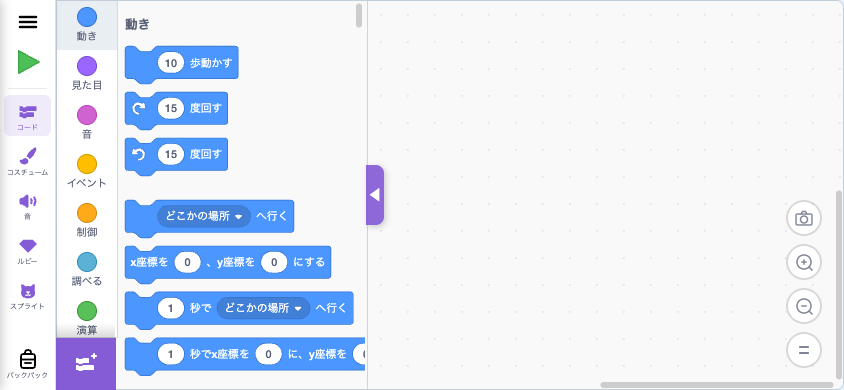
*(コードタブと一緒に写った左 56px サイドレール)*

| パーツ              | data-testid                                | 役割                                                                                              |
| ------------------- | ------------------------------------------ | ------------------------------------------------------------------------------------------------- |
| ハンバーガー (☰)    | `mobile-side-rail-menu`                    | ドロワー (`MobileDrawer`) を開く                                                                  |
| 実行/停止 (▶ / ⏹)   | `mobile-side-rail-play`                    | ▶: 全画面ステージ起動 + `vm.start()` + `vm.greenFlag()` / ⏹: `vm.stopAll()` + 全画面解除          |
| コード              | `mobile-side-rail-code`                    | upstream `BLOCKS_TAB_INDEX` に切替                                                                |
| コスチューム        | `mobile-side-rail-costume`                 | upstream `COSTUMES_TAB_INDEX` に切替                                                              |
| 音                  | `mobile-side-rail-sound`                   | upstream `SOUNDS_TAB_INDEX` に切替                                                                |
| ルビー              | `mobile-side-rail-ruby`                    | Smalruby `RUBY_TAB_INDEX` に切替                                                                  |
| スプライト          | `mobile-side-rail-sprite`                  | スプライトパネルオーバーレイを開閉 (Redux ではなく親 state)                                       |
| バックパック        | `mobile-side-rail-backpack`                | バックパックの開閉 (実装中)                                                                       |

active 状態は `data-active="true"` 属性で表現される (CSS 紫ハイライト)。

**設計意図**: PC では上部 `<MenuBar>` + `<TabList>` + 右ペインの三分割だが、横幅が狭い SP では同じ構成は破綻する。横向き 844×390 で確実に親指の届く左 56px に **すべて集約** したのが MobileSideRail。実行/停止は緑旗+赤丸の **1 ボタン統合** にして、SP では「編集中ステージは隠して必要なときだけ全画面で動かす」を基本フローにした。

### 2.2 コードタブ (パレット展開)


ブロックパレット (左カテゴリリスト + ブロック群) + ワークスペース (右の dotted area) の構成。

| パーツ                                 | data-testid / セレクタ                                          | 役割                                                          |
| -------------------------------------- | --------------------------------------------------------------- | ------------------------------------------------------------- |
| パレットトグル (`<` 紫ハンドル)        | `[class*="palette-toggle_palette-toggle-button"]`               | パレット表示/非表示。SP では紫 56×28 に拡大 (タッチ確実化)   |
| カテゴリ一覧                           | `.blocklyToolboxDiv`                                            | upstream Blockly のカテゴリ                                   |
| ブロック一覧                           | `.blocklyFlyout`                                                | upstream Blockly のフライアウト                               |
| ワークスペース                         | `.blocklySvg`                                                   | ブロック配置用                                                |
| ズーム +/-/=                           | upstream の `.blocklyZoom`                                       | ワークスペース拡大縮小                                        |
| 拡張機能追加 (左下 +)                  | `.extension-button-container`                                    | upstream のまま                                                |

**desktop 版との違い**: `gui_tab-list-container` を `display: none`、`gui_stage-and-target-wrapper` を `flex: 0 0 0` で潰し、Mobile では編集に集中した 1 ペインにする。`<MenuBar>` は MobileSideRail に置き換わる。

### 2.3 コードタブ (パレット折りたたみ)

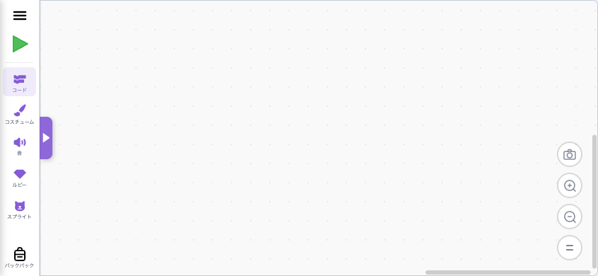

`<` ハンドルをタップしてパレットを左に隠した状態。ワークスペースが viewport 全幅に広がる。

| パーツ                          | data-testid                                       | 役割                            |
| ------------------------------- | ------------------------------------------------- | ------------------------------- |
| パレット復活ハンドル (`>` 紫)   | `[class*="palette-toggle_palette-toggle-button"]` | タップで再度パレット表示        |
| ワークスペース                  | `.blocklySvg`                                     | 全幅で広がる                    |

**設計意図**: SP の横向きでも 844px しかなく、パレット 200px + ワークスペース 644px ではブロック配置が窮屈。トグルで全幅 788px (= 844 - 56) を取り戻すことで、長いプログラムも組める。トグル位置はサイドレールの紫色と揃え、視認性を上げてある。

### 2.4 コードタブ (▶ で全画面ステージ)


▶ をタップするとステージが viewport 全画面で起動 (緑旗自動実行)。サイドレールは残るので「⏹」で戻れる。

| パーツ                       | data-testid                                | 役割                                              |
| ---------------------------- | ------------------------------------------ | ------------------------------------------------- |
| 停止ボタン (⏹ 赤)            | `mobile-side-rail-play`                    | サイドレールに残る。タップで全画面解除 + `vm.stopAll()` |
| ステージ menu の緑旗・赤丸   | upstream `.green-flag` / `.stop-all`       | 全画面でも使える                                  |
| 全画面解除トグル (右上)      | upstream `.full-screen-button`             | upstream のまま                                    |

### 2.5 コスチュームタブ (上部ツールバー表示)

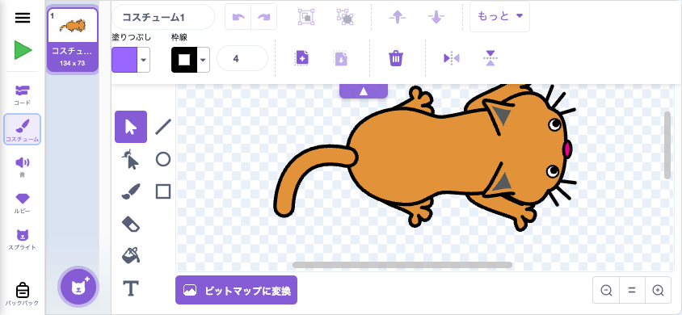

横並びの paint editor。上部にツールバー (フロート配置)、左に縦のペイントツール、右に canvas、下部に bitmap 切替 + zoom。

| パーツ                                | data-testid / セレクタ                                       | 役割                                                                                           |
| ------------------------------------- | ------------------------------------------------------------ | ---------------------------------------------------------------------------------------------- |
| 上部ツールバー (フロート)              | `[class*="paint-editor_editor-container-top"]`               | 名前 / undo/redo / 反転 / Z 順 / 色 / 線幅 / コピー / 貼付 / 削除 / 上下反転                  |
| ▲ トグル (ツールバー下端中央)         | `mobile-paint-toolbar-toggle`                                | タップでツールバーを折りたたむ                                                                |
| ペイントツール (左の縦アイコン群)     | `[class*="paint-editor_mode-selector"]` 内 `.button`         | selector / lasso / brush / eraser / fill / text / line / oval / rectangle                     |
| canvas (中央大エリア)                  | `canvas.paper-canvas_paper-canvas`                            | 描画領域                                                                                      |
| ビットマップに変換                     | upstream のボタン                                             | bitmap/vector 切替                                                                             |
| ズーム Q-/=/Q+                         | upstream `[class*="paint-editor_zoom-controls"]`             | canvas 拡大縮小                                                                                |
| コスチューム一覧 (左端列)              | upstream `[class*="selector_wrapper"]`                        | コスチューム選択 (左列 80px に縮小)                                                            |

**動作 (タップに応じて自動制御)**:

- タブ進入時: ツールバー展開状態
- canvas クリック (描画開始): 自動でツールバー折りたたみ
- ペイントツールタップ (mode-selector): 自動でツールバー展開
- ▼/▲ ハンドル: 手動切替

**設計意図**: PC は固定上部ツールバーで縦スペースを犠牲にする前提だが、SP は縦が 390px しかないので、**描画開始時は自動でツールバーを退避** して canvas を最大化する。ペイントツール (ブラシなど) を選び直すときは展開を戻すことで、操作中の指の動きと UI 表示を一致させる。

### 2.6 コスチュームタブ (上部ツールバー折りたたみ)

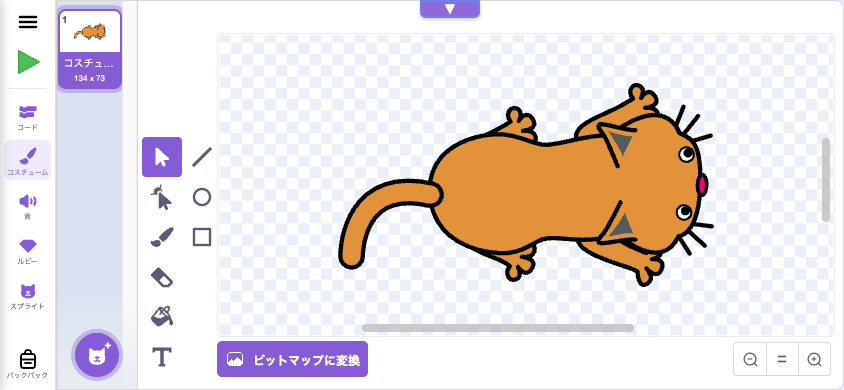

▼ ハンドルをタップした状態。ツールバー消失で canvas + ペイントツール + bitmap/zoom が縦 100% で見える。

| パーツ                  | data-testid                       | 役割                  |
| ----------------------- | --------------------------------- | --------------------- |
| ▼ トグル (上端中央)     | `mobile-paint-toolbar-toggle`     | タップで再展開        |

ペイントツールの位置はツールバー有無に関わらず固定 (= 展開時の位置)。指の下から逃げないようにするため。

### 2.7 音タブ

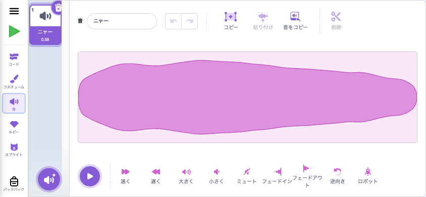

⚠️ **Playwright (Chromium headless) では `audioContext.createBuffer is not a function` で `<SoundEditor>` がクラッシュする。これは upstream `AudioBufferPlayer` の初期化問題で実機 iOS Safari / Android Chrome では正常動作する。** ドキュメントとしての構成は以下を想定。

| パーツ                                                                                  | data-testid / セレクタ                       | 役割                                            |
| --------------------------------------------------------------------------------------- | -------------------------------------------- | ----------------------------------------------- |
| 音名入力 / undo/redo                                                                    | upstream `.sound-editor`                      | サウンド名編集、操作履歴                        |
| 波形表示                                                                                | upstream `.audio-trimmer`                     | クロップ / 音量編集                             |
| エフェクトボタン (大きく / 小さく / ミュート / フェードイン / フェードアウト / 逆向き / ロボット) | upstream のボタン群                          | 音響エフェクト                                  |
| サウンド一覧 (左端列)                                                                   | upstream `[class*="selector_wrapper"]`       | サウンド選択                                    |

### 2.8 ルビータブ

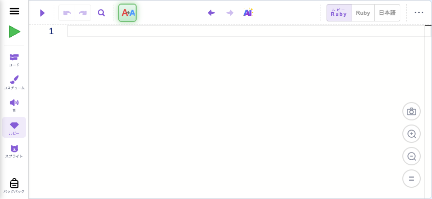

Monaco Editor + ルビーツールバー。

| パーツ                       | data-testid                                  | 役割                                                       |
| ---------------------------- | -------------------------------------------- | ---------------------------------------------------------- |
| ▶ 実行                       | `ruby-toolbar-execute`                       | 実行 (サイドレールの ▶ と機能重複)                         |
| Undo / Redo                  | `ruby-toolbar-undo` / `ruby-toolbar-redo`    | 元に戻す / やり直す                                         |
| 検索 (🔍)                    | `ruby-toolbar-search`                        | テキスト検索                                                |
| 自動置換                     | `ruby-toolbar-auto-correct`                  | 自動置換トグル                                              |
| 前/次のスプライト            | `ruby-toolbar-prev-sprite` / `-next-sprite`  | スプライト切替                                              |
| AI ルビティー                | `ruby-toolbar-rubytee`                       | Anthropic Claude による AI コード生成                       |
| ふりがな (mode tab)          | `ruby-toolbar-mode-furigana`                 | ふりがなモード                                              |
| Ruby (mode tab)              | `ruby-toolbar-mode-ruby`                     | Ruby モード                                                 |
| 日本語 (mode tab)            | `ruby-toolbar-mode-dncl`                     | 日本語(DNCL)モード                                          |
| ・・・ (もっと)              | `ruby-toolbar-more-menu`                     | 保存 / クラス挿入 / プレビュー / 自動置換設定               |

PC のルビーツールバーには「スプライトを名前で検索」入力欄があるが、SP では `display: none` で省略 (横幅不足)。スプライト切替は ← / → ボタンとスプライトタブ経由。

### 2.9 スプライトタブ

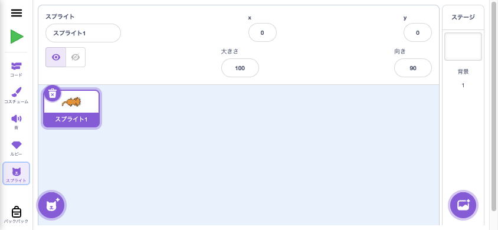

サイドレールの「スプライト」をタップすると編集エリアにオーバーレイで開く。upstream `<TargetPane>` を再利用しつつ、`<SpriteLibrary>` モーダルだけは抑止 (二重描画回避: `hideSpriteLibrary` prop を upstream `target-pane.jsx` に追加)。

| パーツ                       | data-testid                                            | 役割                                                            |
| ---------------------------- | ------------------------------------------------------ | --------------------------------------------------------------- |
| パネル全体                   | `mobile-sprite-panel`                                  | コンテナ                                                        |
| スプライト情報 (上部)        | upstream `<SpriteInfo>`                                | 名前 / x / y / 表示・非表示 / 大きさ / 向き                     |
| スプライト一覧 (左の大エリア) | upstream `<SpriteList>`                                | スプライト選択 / 削除 (× アイコン)                              |
| 「+」 FAB (左下)             | upstream `<ActionMenu>`                                | スプライト追加 (Choose / Paint / Surprise / Upload)             |
| ステージ列 (右 80px)         | upstream `<StageSelector>`                             | ステージ背景の管理 + 「+」 で背景追加                           |

`stageSize="middle"` を強制してフルセットの SpriteInfo (大きさ・向き含む) を表示。PC の右ペイン 270px 幅では `small` で名前 + x/y のみだったので、SP の方がリッチ。

### 2.10 ハンバーガードロワー

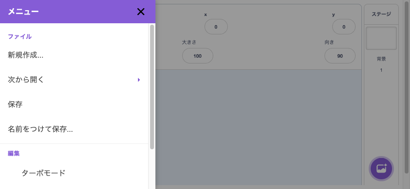

サイドレール左上の ☰ をタップすると左から slide-in。

| パーツ                                  | data-testid                                       | 役割                                                              |
| --------------------------------------- | ------------------------------------------------- | ----------------------------------------------------------------- |
| 閉じるボタン (×)                        | `mobile-drawer-close`                             | ドロワーを閉じる                                                  |
| 背景タップ                              | `mobile-drawer-backdrop`                          | ドロワーを閉じる                                                  |
| 新しいプロジェクト                      | `mobile-drawer-new`                               | `requestNewProject(false)` を dispatch                            |
| Google Drive から開く                   | `mobile-drawer-open-google-drive`                 | Google Drive 選択                                                  |
| パソコンから開く                        | `mobile-drawer-open-device`                       | upstream `SBFileUploaderHOC` 起動                                  |
| Scratch から開く                        | `mobile-drawer-open-scratch`                      | Scratch URL 入力                                                   |
| 保存                                    | `mobile-drawer-save`                              | upstream `SB3Downloader` 起動                                      |
| 名前を付けて保存                        | `mobile-drawer-save-as`                           | 別名保存                                                           |
| ターボモード                            | `mobile-drawer-turbo-mode`                        | turbo mode の on/off                                               |
| クラスルーム                            | `mobile-drawer-classroom`                         | 生徒モードでクラスルーム参加                                       |
| メッシュ                                | `mobile-drawer-mesh`                              | Mesh v2 接続                                                       |
| 言語切替                                | `mobile-drawer-locale-${code}`                    | 各 locale の選択 (`ja`, `ja-Hira`, `en` など)                      |
| Ruby バージョン切替                     | `mobile-drawer-ruby-version-${version}`           | Ruby v1 / v2                                                       |
| クラス管理                              | `mobile-drawer-classroom-management`              | 教師モード (教師が認証済みのとき)                                  |
| トグル系メニュー (アコーディオン)       | `mobile-drawer-toggle-${key}`                     | 言語 / Ruby version / その他 設定セクションの開閉                  |

**設計意図**: PC `<MenuBar>` の機能を SP では **このドロワーに集約**。アコーディオン化することで、横幅 300px 弱でも縦に伸ばさず収まる構成にしてある。

### 2.11 縦持ち警告オーバーレイ

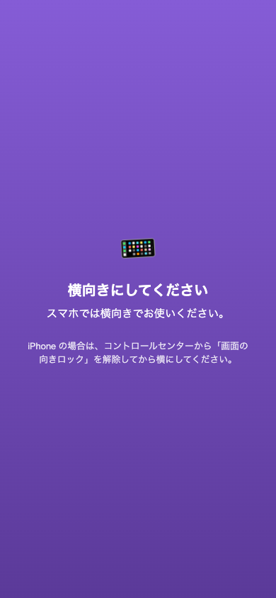

`(orientation: portrait)` を `matchMedia` で検知して全画面オーバーレイを Portal で表示。横向きにすると消える。

| パーツ              | data-testid                  | 役割                                                                    |
| ------------------- | ---------------------------- | ----------------------------------------------------------------------- |
| オーバーレイ全体    | `mobile-orientation-gate`    | 縦向き時のみ表示                                                        |
| メッセージ          | (テキストのみ)               | 「横向きにしてください」 + iOS の画面の向きロック注意書き               |

**設計意図**: SP 縦持ちは MobileGui の前提 (横レイアウト) と合わない。MobileGui の中で頑張るより、**「横にしてください」と明示的に止める** ほうが操作迷子を減らせる。iPad には出さない (iPad は portrait でも desktop GUI で見られる)。

---

## 3. iPad / 中サイズ desktop GUI

iPad は `useIsNarrowScreen` の閾値超え (短辺 ≥ 744 かつ高さ > 500) なので **upstream desktop GUI が出る**。ただし viewport が狭い (744〜1023px 幅 / もしくは 800px 以下の高さ) ので、上記 §1 の **iPad モード調整** が当たる。MobileGui には行かない。

### 3.1 iPad portrait (768×1024)

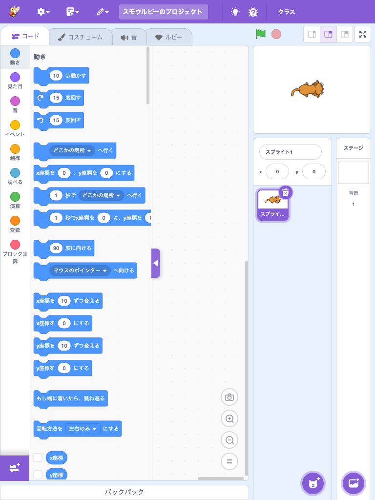

- `min-width: 1024px` の制約を解除し、横スクロール禁止
- `editor-wrapper` の flex を緩めて stage 列 (~250px) に収める
- フィードバックリンクなど狭幅で破綻するメニュー上の付帯リンクは隠す
- `stageSize` は `'small'` 強制 (gui.jsx 内の Smalruby マーカー)

→ ブロック編集 + スプライト + ステージの三分割が、横スクロールなしで成立する。

### 3.2 iPad landscape (1024×768)

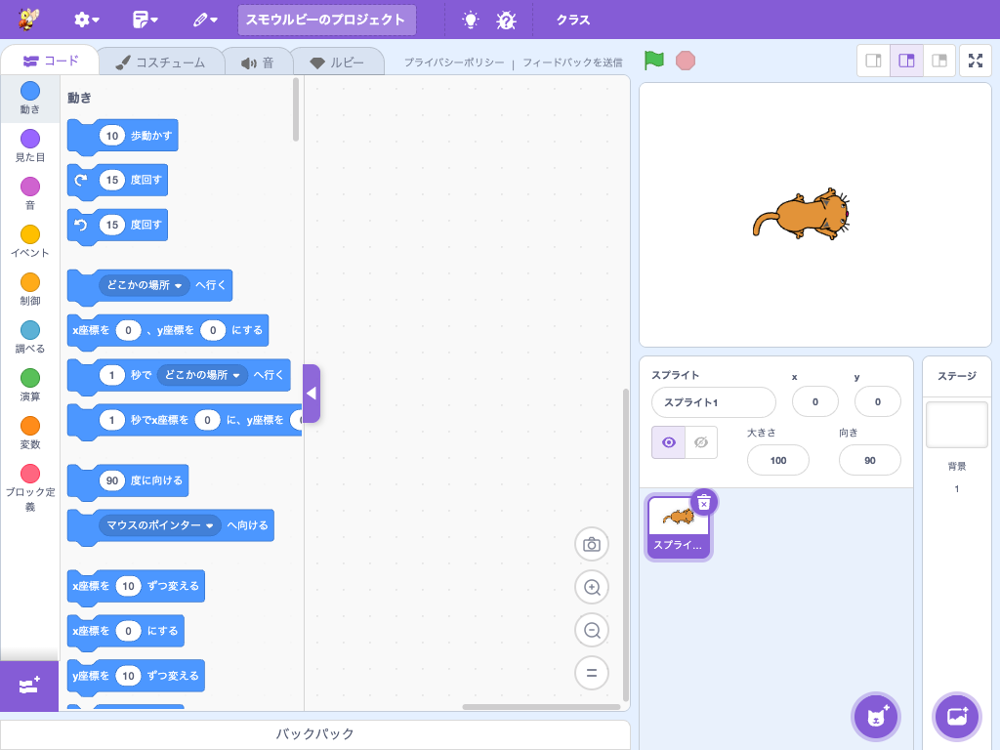

- 高さが 800px 以下なので `narrow-height vertical chrome compression` が当たる
- menu-bar 48→40px、tab-list 44→36px に圧縮
- 縦のワークスペース有効領域が +16px 増える

### 3.3 iPad landscape: ルビータブ

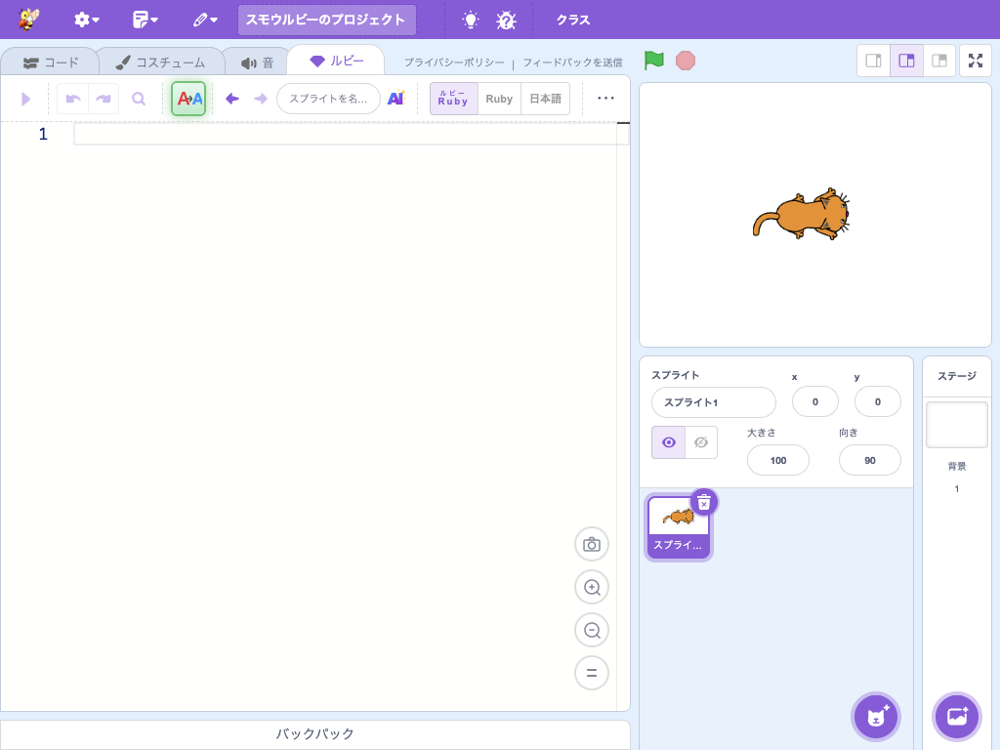

ルビータブも同じ chrome 圧縮が効く。Monaco エディタの縦が伸びる。

### 3.4 iPad mini portrait (744×1133)

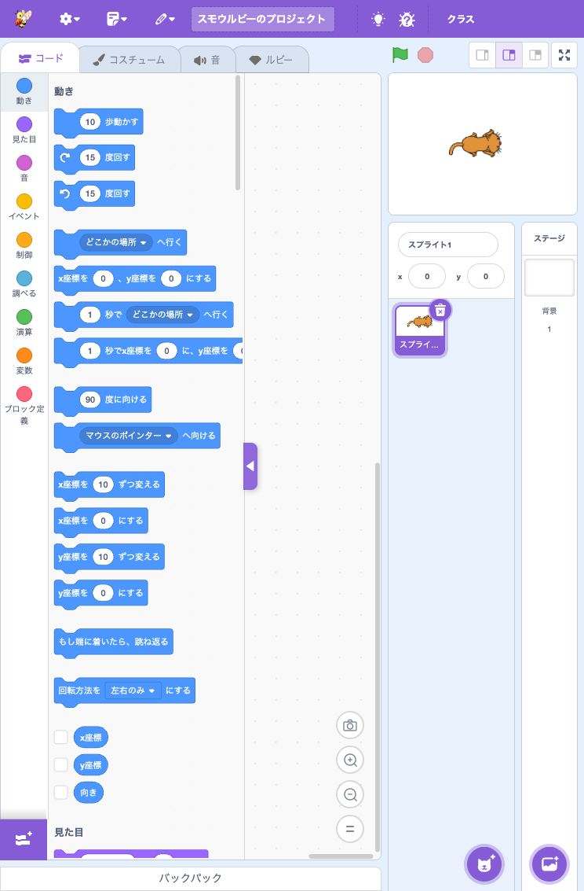

「744〜1023」レンジに iPad mini portrait (744) も含むよう閾値を引き下げてある。`min-width: 1024px` 解除と stage 列縮小がそのまま効く。

### 3.5 Desktop reference (1280×800)

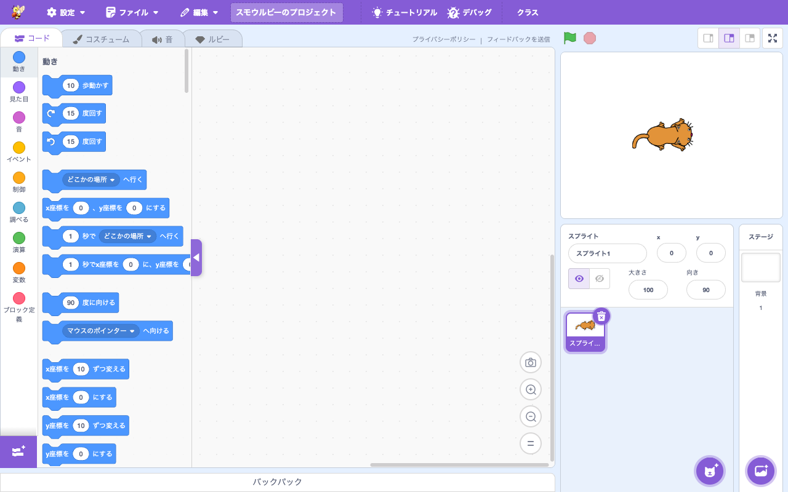

参考。1024px 以上は upstream のまま。Smalruby の追加 CSS は当たらず、見た目は通常の Smalruby/Scratch エディタと完全に一致する。

---

## 4. 設計原則 (今後の SP 関連 PR で守るべきこと)

SP/iPad 対応で確立した運用ルール。今後の改善も以下を踏襲する。

1. **upstream は触らない、加筆だけする**
   `=== Smalruby: Start of <feature> === / End ===` のマーカーで囲む。一覧は `docs/maintenance/smalruby-markers-gui.md`。SP 対応のために upstream のロジックを書き換えると後の merge で衝突する。
2. **URL パラメータでのオプトインを増やさない**
   viewport で自動判定する。flag を知らないと UI が出ない構造を作らない。
3. **「PC が崩れている」警告バナーを置かない**
   リサイズ可能な PC ブラウザでの誤検知が多い。viewport で MobileGui に切り替わるならバナー不要。
4. **MobileGui は横向き専用**
   縦は orientation gate で止める。MobileGui 内に縦レイアウトを抱え込まない。
5. **隠すより「再構成」を優先**
   `display: none` で誤魔化すと React tree が無駄に肥大する。専用コンポーネント (MobileSideRail / MobileDrawer など) に分離して、必要な機能だけ並べ直すこと。
6. **iPad は desktop GUI のまま、CSS で詰める**
   iPad ユーザーは PC 由来の操作慣れがあるので、独自 UI に変えるよりも desktop GUI を縮める方が学習コストが低い。
7. **タッチ操作のフィッツの法則を意識**
   SP/iPad のタップ要素は最低 44px × 44px を確保する。Blockly 内のような触れない要素を除き、新規追加要素は data-testid + 44px 以上で作る。
8. **`data-testid` は必ず付ける**
   Playwright 確認手順で参照される。`<component>-<element>` のケバブケース。新規要素には漏れなく付与する (`.claude/rules/scratch-gui/e2e-test.md`)。

---

## 5. 関連ドキュメント

- [`docs/mobile-ui/playwright.md`](playwright.md) — Playwright での確認手順と data-testid 一覧
- `.claude/rules/scratch-gui/mobile-ui.md` — SP / iPad 関連 PR のレビュー観点と影響範囲
- `docs/maintenance/smalruby-markers-gui.md` — upstream ファイルへのマーカー一覧
- `.claude/rules/scratch-gui/e2e-test.md` — data-testid 命名規則と URL parameter 一覧
- `.claude/rules/scratch-gui/development.md` — scratch-gui の開発フロー全般
