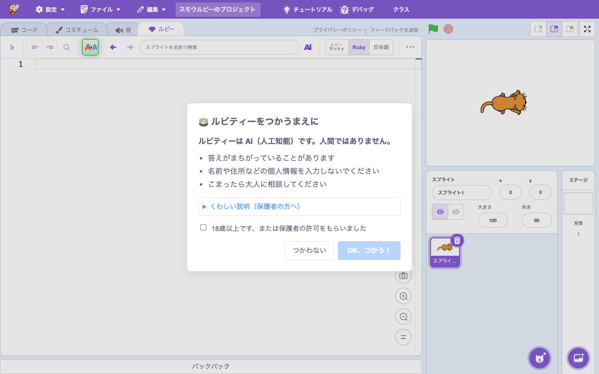
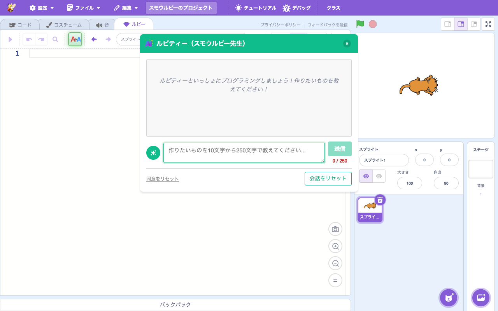
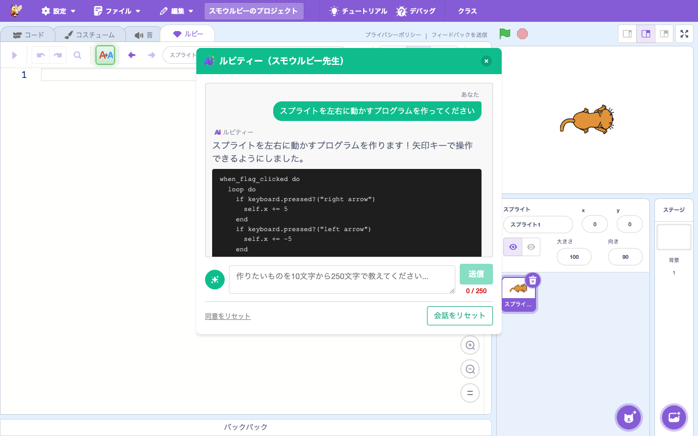

# Rubytee（ルビティー）

> **🆕 Smalruby 独自** — upstream に存在しない、Smalruby のために新規追加された機能
> Anthropic Claude API を使った AI コード生成支援機能。upstream の Scratch には AI 機能なし。

## 概要

Rubytee（ルビティー）は **Anthropic Claude API（claude-haiku-4-5）** を使って Ruby コードの生成・修正をチャット形式で支援する機能。Ruby タブの "ルビティー" ボタンから起動し、自然言語で要望を伝えると、現在のスプライト・ステージ・コードのコンテキストを踏まえたコードを生成する。

API キーをクライアントに直接持たせず、AWS Lambda の専用リレー（`infra/smalruby-rubytee-relay`）を経由することで、API キー管理・レート制限・入力検証・年齢適合チェックを集約している。

> **命名**: ルビティー = Ruby + ティー(Teacher)、また "Ruby Tea" 🍵 のニュアンス。前身の **スモウルビー先生** は Gemini API を使っていたが、Anthropic に移行する際にリブランディングした (Issue #346)。

## ユーザーストーリー

- **Ruby を書き始めた小学生**として、「キャラクターを左右に動かしたい」と日本語で頼んで、動くサンプルコードを得たい
- **教師**として、生徒が詰まったときに「どこをどう直せばよいか」を AI に聞ける環境を提供したい
- **保護者**として、子どもが AI に依存しすぎないよう、初回利用時に**同意ダイアログ**で AI の特性を説明してほしい
- **共通テスト対策中の高校生**として、自分が書いた DNCL/Ruby コードのレビューを AI に頼みたい

## 安全・コンプライアンス（重要）

このプロダクトは **未成年者向け** であり、Anthropic の利用規約に明示的に準拠する形で設計されている：

- **同意ダイアログ**: 初回利用時に `rubytee-consent` モーダルで AI の特性・利用規約を表示し、ユーザーの同意を取得（localStorage に保存）
- **年齢チェック**: 同意ダイアログにチェックボックス
- **AI 生成物であることの明示**: 出力に AI 生成のラベル
- **COPPA 対応**: 法的文書（プライバシーポリシー）でも明示
- **API キー秘匿**: クライアントは API キーを持たず、Lambda リレー経由
- **レート制限**: IP ベースで `35 分あたり 40 リクエスト`（DynamoDB の TTL で実装）
- **入力長制限**: ユーザーメッセージ 10〜250 文字、現在コード 1000 文字、履歴 20 ターン

> **背景**: Gemini/Vertex AI ToS は 18 歳未満ユーザー向けアプリでの利用を禁止していたため、Anthropic へ移行した。Anthropic は安全措置を取れば未成年向け製品での利用を明示的に許可している。

## UI / 操作フロー

1. Ruby タブの **ruby-toolbar** で「ルビティー」ボタン (`ruby-toolbar-rubytee`) をクリック
2. **初回のみ**: 同意ダイアログ (`rubytee-consent`) が表示される。チェックを入れて「OK」で `localStorage.smalruby:rubyteeConsent = 'true'` が保存される

   

3. チャットモーダル (`rubytee-modal`) が開く

   

4. 自然言語で要望を入力 → AI が現在のコンテキスト（編集中スプライト、ステージ、コード）を踏まえて Ruby コードを生成

   

5. 生成されたコードは「適用」ボタンでエディタに挿入できる
6. 「同意をリセット」で同意状態を削除可能

## 主要ファイル

### scratch-gui

#### UI コンポーネント

- `packages/scratch-gui/src/components/rubytee-modal/rubytee-modal.jsx` — チャット UI 本体
- `packages/scratch-gui/src/components/rubytee-modal/rubytee-modal.css` — スタイル
- `packages/scratch-gui/src/components/rubytee-consent/rubytee-consent.jsx` — 同意ダイアログ
- `packages/scratch-gui/src/components/ruby-toolbar/ruby-toolbar.jsx` — ルビティーボタン

#### コンテナ・ライブラリ

| ファイル | 役割 |
|---|---|
| `packages/scratch-gui/src/containers/rubytee-modal-hoc.jsx` | モーダル HOC、同意フロー、チャット履歴、API 呼び出し |
| `packages/scratch-gui/src/lib/rubytee-api.js` | Relay API クライアント (`RubyteeAPI` クラス、`RateLimitError`)|
| `packages/scratch-gui/src/lib/rubytee-context.js` | スプライト/ステージの状態コンテキスト構築 |

#### Props 配線

`RubyteeModalHOC` → `RubyTab` → `RubyToolbar` の props 伝播：

- `onOpenRubyteeModal` — ルビティーボタンのクリックハンドラ
- `onRegisterRubyteeApply` — AI 生成コードをエディタに挿入するコールバック登録

### infra/smalruby-rubytee-relay

AWS Lambda リレーサービス（API Gateway HTTP API + Lambda + DynamoDB）：

| ファイル | 役割 |
|---|---|
| `infra/smalruby-rubytee-relay/lambda/handler.ts` | Lambda 本体。リクエスト検証、レート制限、Claude API 呼び出し |
| `infra/smalruby-rubytee-relay/lib/rubytee-relay-stack.ts` | CDK スタック定義 |
| `infra/smalruby-rubytee-relay/lambda/tests/` | 単体テスト |

#### Lambda の主要ロジック

- 入力検証（メッセージ長、フィールド長、履歴ターン数の上限）
- IP ベースレート制限（DynamoDB の TTL 機能で window 管理）
- `system` プロンプト + `messages` 配列に変換して Anthropic API へ POST
- **Prompt caching** (`cache_control: ephemeral`) を有効化してコスト削減
- CORS 検証（`CORS_ALLOWED_ORIGINS` 環境変数）
- エラー時は `429 RATE_LIMIT_EXCEEDED` などの構造化エラー

### scratch-vm

なし（GUI 側で完結）。

## 設定・データ永続化

### クライアント側（webpack で `process.env` に注入、`.env` から読込）

| 環境変数 | 用途 |
|---|---|
| `RUBYTEE_RELAY_ENDPOINT` | Lambda リレーのエンドポイント URL |

ローカル開発では stg エンドポイントを使う（prod は CORS で localhost を許可しない）。

### Lambda 側（CDK で渡す）

| 環境変数 | デフォルト | 用途 |
|---|---|---|
| `ANTHROPIC_API_KEY` | - | Anthropic API キー |
| `CLAUDE_MODEL` | `claude-haiku-4-5-20251001` | 使用モデル |
| `RATE_LIMIT_WINDOW_MINUTES` | `35` | レート制限ウィンドウ |
| `RATE_LIMIT_MAX_REQUESTS` | `40` | ウィンドウ内最大リクエスト |
| `MAX_USER_MESSAGE_LENGTH` | `250` | ユーザーメッセージ最大文字数 |
| `MIN_USER_MESSAGE_LENGTH` | `10` | ユーザーメッセージ最小文字数 |
| `CORS_ALLOWED_ORIGINS` | `https://smalruby.app` | CORS 許可オリジン |
| `RATE_LIMIT_TABLE_NAME` | - | DynamoDB テーブル名（CDK で設定）|

固定の上限値:
- `MAX_FIELD_NAME_LENGTH = 100`（スプライト/コスチューム/サウンド名）
- `MAX_CURRENT_CODE_LENGTH = 1000`（現在編集中コード）
- `MAX_HISTORY_TURNS = 20`（会話履歴）
- `MAX_HISTORY_TURN_TEXT_LENGTH = 1000`（履歴 1 ターンあたり）

### localStorage

- `smalruby:rubyteeConsent` — 同意状態（`'true'` のみ ON）

## モニタリング

CloudWatch ログで利用状況を監視。Rubytee 利用パターンとコスト異常検出は `rubytee-monitor` skill を使用（`.claude/skills/rubytee-monitor/`）。

## デプロイ

詳細手順は `.claude/rules/infra/smalruby-rubytee-relay.md` を参照。

```bash
# stg
docker compose run --rm -w /app/infra/smalruby-rubytee-relay infra npx cdk deploy

# prod
cd infra/smalruby-rubytee-relay && rm .env && ln -s .env.prod .env
docker compose run --rm -w /app/infra/smalruby-rubytee-relay infra npx cdk deploy
```

## テスト

- 単体テスト（クライアント）: `packages/scratch-gui/test/unit/lib/rubytee-api.test.js`, `rubytee-context.test.js`, `containers/rubytee-modal-hoc-sanitize.test.js`
- 結合テスト（クライアント）: `packages/scratch-gui/test/integration/rubytee-consent.test.js`
- 単体テスト（Lambda）: `infra/smalruby-rubytee-relay/lambda/tests/`

## 関連ドキュメント

- [`docs/ruby-editor/`](../ruby-editor/) — Rubytee の起点となる Ruby エディタ
- `.claude/rules/infra/smalruby-rubytee-relay.md` — リレー実装・デプロイ・運用ルール
- `.claude/rules/scratch-gui/development.md` — Rubytee セクション (props 配線等)
- `.claude/skills/rubytee-monitor/SKILL.md` — CloudWatch ログ監視運用

## 関連 Issue / PR

- Issue #346 — Gemini → Claude 移行、ルビティーへのリブランディング
- 主要 PR は履歴を参照（`feat:.*rubytee` で grep）
