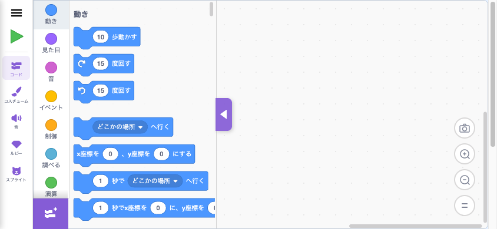
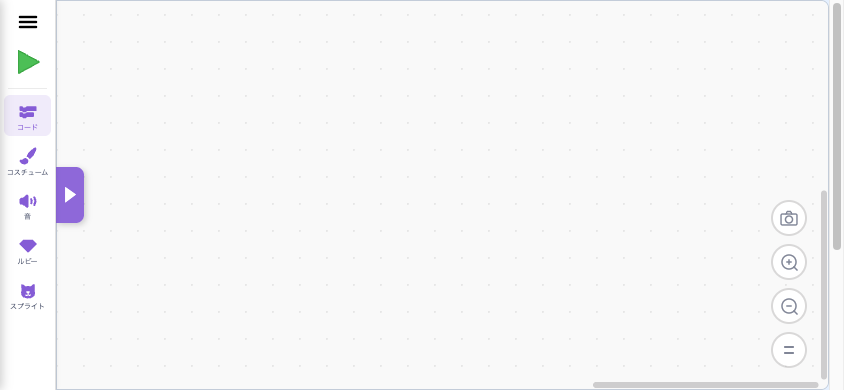
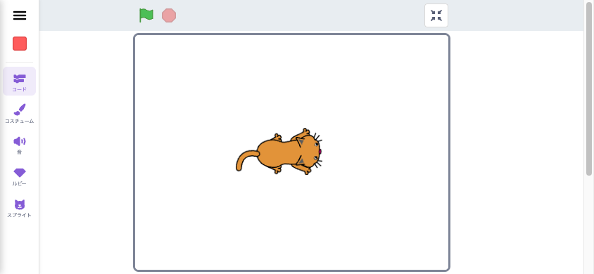
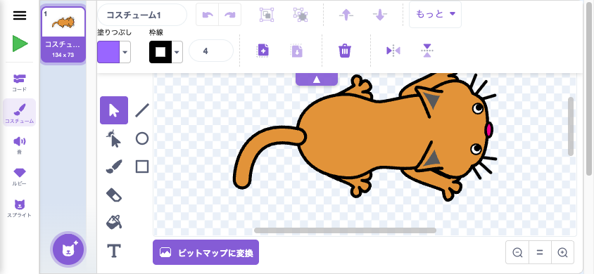
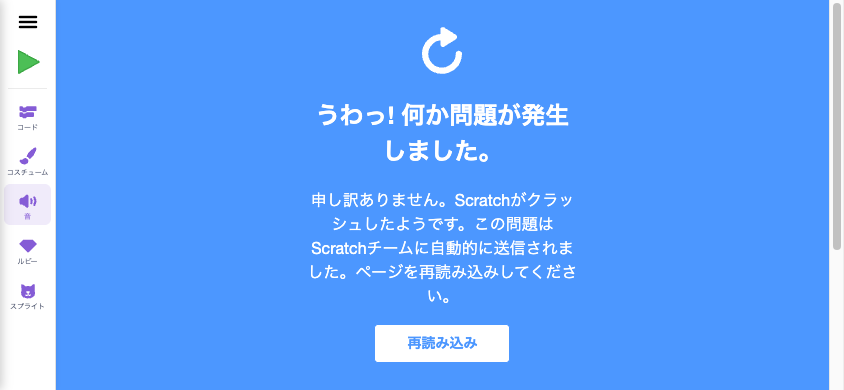
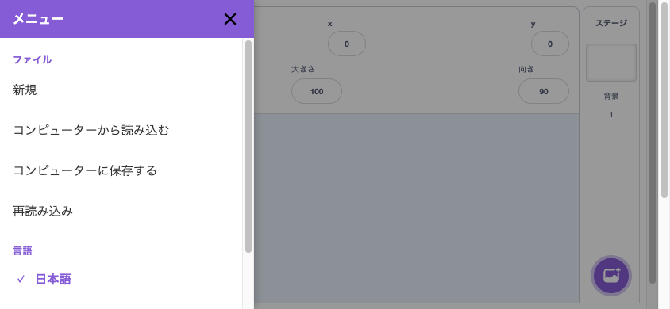
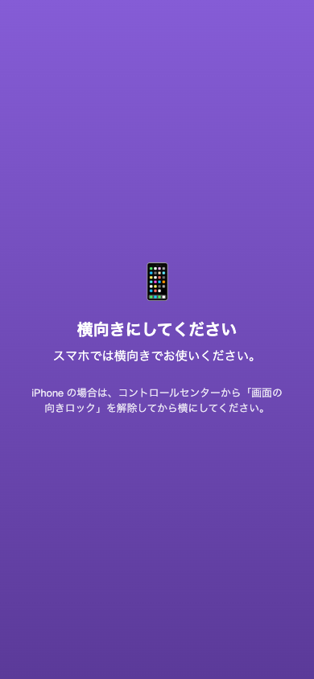

# Smalruby Mobile (横向き専用) UI/UX

> **対象**: スマホ (横向き、`viewport min(width, height) ≤ 767px or 高さ ≤ 500px`) で `?mobile_gui=1` を指定したときに有効になる **MobileGui** モード
> **元 issue**: [#572](https://github.com/smalruby/smalruby3-editor/issues/572)
> **検証 URL**: `https://smalruby.jp/smalruby3-editor/fix/issue-572-phase-2j-side-rail/?no_beforeunload=1&mobile_gui=1`
> **検証 viewport**: 844×390 (iPhone 14 横向き)

PC 版とほぼ同じ機能を、横向きスマホで操作できる UI に再構成したものです。縦持ち時は警告オーバーレイが出て横にしてもらいます。

## 全体レイアウト

```
┌────┬────────────────────────────────────────┐
│ ☰  │                                        │
│ ▶  │                                        │
│ ── │                                        │
│Cd  │      Editor area                       │
│Cm  │      (full height = 100vh)             │
│Sn  │                                        │
│Rb  │                                        │
│Sp  │                                        │
└────┴────────────────────────────────────────┘
```

- **左 56px**: `MobileSideRail` (☰ + ▶ + 5 タブ)
- **右側**: 各タブの編集エリア (viewport 縦 100% / 横 100vw - 56px)

URL パラメータ `?mobile_gui=1` 必須。`?no_beforeunload=1` を付けると beforeunload 確認ダイアログを抑止 (Playwright 推奨)。

---

## 各画面

### 1. サイドレール (常駐)


*(コードタブと一緒に写った左 56px サイドレール)*

| パーツ | data-testid | 役割 |
|---|---|---|
| ハンバーガー (☰) | `mobile-side-rail-menu` | ドロワー (`MobileDrawer`) を開く |
| 実行/停止 (▶ / ⏹) | `mobile-side-rail-play` | アイコン: ▶ → 全画面ステージ起動 + `vm.start()` + `vm.greenFlag()` / ⏹ → `vm.stopAll()` + 全画面解除 |
| コード | `mobile-side-rail-code` | upstream `BLOCKS_TAB_INDEX` に切替 |
| コスチューム | `mobile-side-rail-costume` | upstream `COSTUMES_TAB_INDEX` に切替 |
| 音 | `mobile-side-rail-sound` | upstream `SOUNDS_TAB_INDEX` に切替 |
| ルビー | `mobile-side-rail-ruby` | Smalruby `RUBY_TAB_INDEX` に切替 |
| スプライト | `mobile-side-rail-sprite` | スプライトパネルオーバーレイを開閉 (Redux ではなく親 state) |

各タブボタンは `data-active="true"` 属性で active 状態が表現される (CSS 紫ハイライト)。

**PC 版との違い:**
- PC は上部の `<MenuBar>` (ハンバーガー相当の File/Edit/言語など) + `<TabList>` (コード/コスチューム/音/ルビーの 4 タブ) + 右ペインのスプライト一覧という三分割。Mobile では全部この左サイドレールに集約
- ▶/⏹ は PC のステージ上の緑旗 + 赤丸ボタンの統合相当 (1 タップで全画面ステージ開始 + 自動実行 / もう 1 タップで停止 + 戻る)
- スプライト選択は別タブ扱い (PC は常時右ペインで一覧表示)

### 2. コードタブ (パレット展開)


ブロックパレット (左カテゴリリスト + ブロック群) + ワークスペース (右の dotted area) の構成。

| パーツ | data-testid / セレクタ | 役割 |
|---|---|---|
| パレットトグル (`<` 紫ハンドル) | `[class*="palette-toggle_palette-toggle-button"]` | パレット表示/非表示。PR-2J で紫 56×28 に拡大済み |
| カテゴリ一覧 | `.blocklyToolboxDiv` | upstream Blockly のカテゴリ。タップで該当カテゴリの先頭にスクロール |
| ブロック一覧 | `.blocklyFlyout` | upstream Blockly のフライアウト |
| ワークスペース | `.blocklySvg` | ブロックを配置する dotted area |
| カメラアイコン | (ruby-toolbar 関連) | ワークスペーススクリーンショット (Smalruby 機能) |
| ズーム +/-/= | upstream の `.blocklyZoom` 内 | ワークスペース拡大縮小 |
| 拡張機能追加 (左下 +) | `.extension-button-container` | upstream のまま |

**PC 版との違い:**
- PC では上部の Tab に「コード」「コスチューム」「音」「ルビー」が並ぶが、Mobile ではそのナビは消えサイドレールに集約 (`gui_tab-list-container` を CSS で `display: none`)
- PC の右ペイン (ステージ + スプライト) は Mobile では非表示 (`gui_stage-and-target-wrapper` を `flex: 0 0 0` で潰す)
- PC の `<MenuBar>` も Mobile では非表示
- PC の `<Backpack>` も現状非表示 ([後述の未対応 PR](#バックパック-backpack-対応) で復活予定)

### 3. コードタブ (パレット折りたたみ)



`<` ハンドルをタップしてパレットを左に隠した状態。ワークスペースが viewport 全幅 (788px) に広がる。

| パーツ | data-testid / セレクタ | 役割 |
|---|---|---|
| パレット復活ハンドル (`>` 紫) | `[class*="palette-toggle_palette-toggle-button"]` | タップで再度パレット表示 |
| ワークスペース | `.blocklySvg` | 全幅で広がる |

**PC 版との違い:** 同じ Smalruby 共通の `<PaletteToggle>` 機能だが、Mobile では handle が大きい (28×56) + 紫色で目立つ。PC は 16×48 + 白背景で目立たない。

### 4. コードタブ (▶ で全画面ステージ)



▶ をタップするとステージが viewport 全画面で起動 (緑旗自動実行)。サイドレールは残るので「⏹」で戻れる。

| パーツ | data-testid / セレクタ | 役割 |
|---|---|---|
| 停止ボタン (⏹ 赤) | `mobile-side-rail-play` | サイドレールに残る。タップで全画面解除 + `vm.stopAll()` |
| ステージ menu 内の緑旗・赤丸 | upstream `.green-flag` / `.stop-all` | 全画面でも使える |
| 全画面解除トグル (右上) | upstream `.full-screen-button` | upstream のまま |

**PC 版との違い:** PC の ▶ ボタンは ▶/⏹ が分かれている。Mobile は 1 ボタン統合。PC では全画面ステージモードはあまり使わない (ステージ常時表示) が、Mobile では編集中ステージは隠して ▶ で必要時だけ起動するのが基本フロー。

### 5. コスチュームタブ (上部ツールバー表示)



横並びの paint editor。上部にツールバー (フロート配置)、左に縦のペイントツール、右に canvas。下部に bitmap 切替 + zoom。

| パーツ | data-testid / セレクタ | 役割 |
|---|---|---|
| 上部ツールバー (フロート) | `[class*="paint-editor_editor-container-top"]` | コスチューム名 / undo/redo / 反転 / Z 順 / もっと▼ / 色 / 線幅 / コピー / 貼付 / 削除 / 上下反転 |
| ▲ トグル (ツールバー下端中央) | `mobile-paint-toolbar-toggle` | タップでツールバーを折りたたむ |
| ペイントツール (左の縦アイコン群) | `[class*="paint-editor_mode-selector"]` 内 `.button` | selector / lasso / brush / eraser / fill / text / line / oval / rectangle |
| canvas (中央大エリア) | `canvas.paper-canvas_paper-canvas` | スプライト描画領域 |
| ビットマップに変換 | upstream のボタン | bitmap/vector 切替 |
| ズーム Q-/=/Q+ | upstream `[class*="paint-editor_zoom-controls"]` 内 | canvas 拡大縮小 |
| コスチューム一覧 (左端列) | upstream `[class*="selector_wrapper"]` | コスチューム選択 (左列 80px に縮小) |

**動作:**
- **タブ進入時**: ツールバー展開状態で表示
- **canvas クリック (描画開始)**: 自動でツールバー折りたたみ
- **ペイントツールタップ (mode-selector)**: 自動でツールバー展開
- **▼/▲ ハンドル**: 手動切替

**PC 版との違い:**
- PC のツールバーは固定上部、Mobile は `position: absolute` でフロート (canvas が動かない)
- PC の上部タブ row + asset wrapper の min-width 524px は Mobile で 0 に上書き
- PC の選択リスト 150px → Mobile 80px
- PC の上部 `.editor-container-top` を `position: sticky` 状態で常時表示 → Mobile はフロート + 折りたたみ可能

### 6. コスチュームタブ (上部ツールバー折りたたみ)


▼ ハンドルをタップした状態。ツールバー消失で canvas + ペイントツール + bitmap/zoom が縦 100% で見える。

| パーツ | data-testid / セレクタ | 役割 |
|---|---|---|
| ▼ トグル (上端中央) | `mobile-paint-toolbar-toggle` | タップで再展開 |

ペイントツールの位置はツールバー有無に関わらず固定 (= 展開時の位置)。指の下から逃げないようにするため。

### 7. 音タブ



⚠️ Playwright (Chromium headless) では `audioContext.createBuffer is not a function` で `<SoundEditor>` がクラッシュする。これは upstream `AudioBufferPlayer` の初期化問題で **実機 iOS Safari / Android Chrome では正常動作する**。

予想される構成 (実機実装は未確認):

| パーツ | data-testid / セレクタ | 役割 |
|---|---|---|
| 音名入力 / undo/redo | upstream `.sound-editor` | サウンド名編集、操作履歴 |
| 波形表示 | upstream `.audio-trimmer` | クロップ / 音量編集 |
| エフェクトボタン (大きく / 小さく / ミュート / フェードイン / フェードアウト / 逆向き / ロボット) | upstream のボタン群 | 音響エフェクト |
| サウンド一覧 (左端列) | upstream `[class*="selector_wrapper"]` | サウンド選択 |

**PC 版との違い:** コスチュームと同じく `asset-panel_wrapper` の min-width 制約は Mobile で `max-width: 100%` で上書き。サウンドエディタ自体の縦長さは未対応 (paint editor のような折りたたみトグル無し) → 後続 PR で対応の可能性。

### 8. ルビータブ


Monaco Editor + ルビーツールバー。

| パーツ | data-testid / セレクタ | 役割 |
|---|---|---|
| ▶ 実行 | `ruby-toolbar-execute` | 実行 (サイドレールの ▶ と機能重複) |
| Undo | `ruby-toolbar-undo` | 元に戻す |
| Redo | `ruby-toolbar-redo` | やり直す |
| 検索 (🔍) | `ruby-toolbar-search` | テキスト検索 |
| A→A 自動置換 | `ruby-toolbar-auto-correct` | 自動置換トグル |
| ← 前のスプライト | `ruby-toolbar-prev-sprite` | スプライト切替 |
| → 次のスプライト | `ruby-toolbar-next-sprite` | スプライト切替 |
| AI ルビティー | `ruby-toolbar-rubytee` | Anthropic Claude による AI コード生成 |
| ルビー (mode tab) | `ruby-toolbar-mode-furigana` | ふりがなモード |
| Ruby (mode tab) | `ruby-toolbar-mode-ruby` | Ruby モード |
| 日本語 (mode tab) | `ruby-toolbar-mode-dncl` | 日本語(DNCL)モード |
| ・・・ (もっと) | `ruby-toolbar-more-menu` | 保存 / クラス挿入 / プレビュー / 自動置換設定 |
| Monaco editor | `monaco-editor` クラス | コード入力 |
| ズーム / 📷 | `.ruby-tab_zoomControlsWrapper` | フォントサイズ拡縮 + ワークスペーススクショ |

**PC 版との違い:**
- PC のルビーツールバーには **「スプライトを名前で検索」入力欄** があるが、Mobile では `display: none` で省略 (横幅不足)。スプライト切替は ← / → ボタンとスプライトタブ経由
- 全画面ステージ起動方法はサイドレールの ▶ (Mobile)、ルビーツールバーの ▶ (両方)

### 9. スプライトタブ


サイドレールの「スプライト」をタップすると編集エリアにオーバーレイで開く (Redux state 不使用、親 state)。upstream `<TargetPane>` を再利用しつつ、`<SpriteLibrary>` モーダルだけは抑止 (二重描画回避: `hideSpriteLibrary` prop を upstream `target-pane.jsx` に追加)。

| パーツ | data-testid / セレクタ | 役割 |
|---|---|---|
| スプライト情報 (上部) | upstream `<SpriteInfo>` | 名前 / x / y / 表示・非表示 / 大きさ / 向き |
| スプライト一覧 (左の大エリア) | upstream `<SpriteList>` | スプライト選択 / 削除 (× アイコン) |
| 「+」 FAB (左下) | upstream `<ActionMenu>` | スプライト追加 (Choose / Paint / Surprise / Upload) |
| ステージ列 (右 80px) | upstream `<StageSelector>` | ステージ背景の管理 + 「+」 で背景追加 |
| `aria-label="スプライトを選ぶ"` | sprite-add main button | スプライトライブラリモーダル |
| `data-testid="mobile-sprite-panel"` | パネル全体 | コンテナ |

**PC 版との違い:**
- PC は右ペインに常時表示。Mobile はタブ切替型 overlay (=「スプライト」をタップしたときだけ表示)
- PC の `flex-direction: row` をそのまま採用 (横向きで横幅が十分あるため Phase 2-J で復活)
- `stageSize="middle"` を強制してフルセットの SpriteInfo (大きさ・向き含む) を表示。PC 右ペインの 270px 幅では `small` で名前 + x/y のみだったので、Mobile の方がリッチ

### 10. ハンバーガードロワー



サイドレール左上の ☰ をタップすると左から slide-in。

| パーツ | data-testid | 役割 |
|---|---|---|
| 閉じるボタン (×) | `mobile-drawer-close` | ドロワーを閉じる |
| 背景タップ | `mobile-drawer-backdrop` | ドロワーを閉じる |
| 新しいプロジェクト | `mobile-drawer-new` | `requestNewProject(false)` を dispatch |
| パソコンから読み込む | `mobile-drawer-load` | upstream `SBFileUploaderHOC` 起動 |
| パソコンに保存する | `mobile-drawer-save` | upstream `SB3Downloader` 起動 |
| 再読み込み | `mobile-drawer-reload` | `window.location.reload()` (pull-to-refresh 無効化の代替) |
| 言語: 日本語 / にほんご / English | `mobile-drawer-locale-ja` / `-ja-Hira` / `-en` | `selectLocale` を dispatch |

**PC 版との違い:**
- PC の `<MenuBar>` には File / Edit / 言語 / クラスルーム / Smalrubot S1 / アカウント / 設定 など **多くのメニュー項目** があるが、Mobile drawer では **ファイル系のみ** に絞る (画面が狭くて操作しにくいので意図的に省略)
- 後続 PR で必要に応じて追加予定 (クラスルーム、Ruby version 切替、ルビティー など)

### 11. 縦持ち警告オーバーレイ



`(orientation: portrait)` を `matchMedia` で検知して全画面オーバーレイを Portal で表示。横向きにすると消える。

| パーツ | data-testid | 役割 |
|---|---|---|
| オーバーレイ全体 | `mobile-orientation-gate` | 縦向き時のみ表示 |
| メッセージ | (テキストのみ) | 「横向きにしてください」 + iOS の画面の向きロック注意書き |

**PC 版との違い:** PC では存在しない (orientation gate はモバイル専用)。

---

## 未対応 / 別 PR で対応する予定の機能

### バックパック (Backpack) 対応

現状: PR-2J までは upstream `<Backpack>` を `display: none` で完全に隠している (`mobile-gui.css` の `gui_backpack-container` 部分)。

**要件:**
- **コードタブ下部**: バックパック表示。ブロックのみを扱う
- **スプライトタブ下部**: バックパック表示。スプライトのみを扱う

**実装メモ:**
- upstream `<Backpack>` は両方を扱える単一コンポーネント。タブごとに項目をフィルタする必要がある (`itemTypes` prop または同等)
- タブごとに別位置に表示するため、upstream 1 箇所の `<Backpack>` を活かしつつ、Smalruby 側でラッパを 2 個作って各タブに portal で配置するか、CSS だけで「現在のタブに合わせて移動」させるか検討する
- 縦サイズに余裕は無いので折りたたみハンドル (mobile-paint-toolbar-toggle と同じパターン) を併用するのが現実的

**ステータス**: 未着手 — 別 PR で対応する。

### サウンドエディタの縦スクロール最適化

現状: コスチュームエディタは `position: absolute` のフロート上部ツールバー + ▲/▼ トグルで縦最低高さの問題を解消したが、サウンドエディタ (`<SoundEditor>`) は同等の対応をしていない。

**ステータス**: 後続 PR で必要に応じて対応。

### iPad portrait (768x1024) の扱い

現状: `useIsNarrowScreen` の検出条件は「短辺 ≤ 767px or 縦 ≤ 500px」。タブレット (820x1180 など) は両方とも閾値超えなので desktop UI が出る。Phase 1 で確定済みの方針通り、iPad portrait は別 Phase で扱う。

**ステータス**: スコープ外。

### Drawer メニュー項目の拡充

PC `<MenuBar>` には以下があるが、Mobile drawer では未対応:

- Ruby version 切替 (v1 / v2)
- クラスルーム (生徒モードでの参加)
- ルビティー (AI コード生成)
- Smalrubot S1 / Mesh / Microbit 接続 (WebSerial / WebBluetooth は iOS Safari で制限あり、原則モバイル省略)
- Google Drive 連携
- チュートリアル
- About / バージョン情報

**ステータス**: 必要なものから後続 PR で追加。

---

## 関連 PR (Phase 2)

| PR | 内容 |
|---|---|
| #581 (PR-2A) | MobileGui スケルトン + ResponsiveGui 切替 |
| #582 (PR-2B) | ボトムタブ × 5 (PR-2J で MobileSideRail に統合) |
| #584 (PR-2C) | ステージ全画面プレビュー (▶ ボタン) |
| #585 (PR-2D) | ブロックパレットドロワー化 (PR-2J で auto-close 部分は削除) |
| #586 (PR-2E) | ハンバーガーメニュー (`MobileDrawer`) |
| #587 (PR-2F) | スプライト管理パネル (`MobileSpritePanel`) |
| #588 (PR-2G) | コードタブ編集レイアウト (mobile-mode CSS) |
| #589 (PR-2H) | コスチューム/音タブ最適化 (Closed: PR-2I/J で抜本対応) |
| #590 (PR-2I) | モバイル横固定 + 縦向き案内 (`MobileOrientationGate`) |
| #591 (PR-2J) | 左サイドレール集約 + 上部ツールバートグル + revert/微調整 |

---

## Playwright 動作確認手順 (再現用)

```bash
# preview URL (本 PR がマージされたら本番 URL に切り替え)
URL="https://smalruby.jp/smalruby3-editor/fix/issue-572-phase-2j-side-rail/?no_beforeunload=1&mobile_gui=1"

# viewport を横向きスマホに
await page.setViewportSize({ width: 844, height: 390 });

# 各タブを順に開く
await page.goto(URL + '&tab=blocks');     // コード
await page.goto(URL + '&tab=costumes');   // コスチューム
await page.goto(URL + '&tab=sounds');     // 音 (Playwright だとクラッシュ)
await page.goto(URL + '&tab=ruby&ruby_version=2');  // ルビー

# サイドレール経由でタブ切替
await page.click('[data-testid="mobile-side-rail-code"]');
await page.click('[data-testid="mobile-side-rail-costume"]');
await page.click('[data-testid="mobile-side-rail-sprite"]');  // overlay 表示

# 全画面ステージ
await page.click('[data-testid="mobile-side-rail-play"]');
await page.click('[data-testid="mobile-side-rail-play"]');  // 戻る

# ドロワー
await page.click('[data-testid="mobile-side-rail-menu"]');
await page.click('[data-testid="mobile-drawer-close"]');

# コスチュームツールバー折りたたみ
await page.click('[data-testid="mobile-paint-toolbar-toggle"]');

# 縦持ちオーバーレイ
await page.setViewportSize({ width: 390, height: 844 });
// → mobile-orientation-gate testid が出現
```
