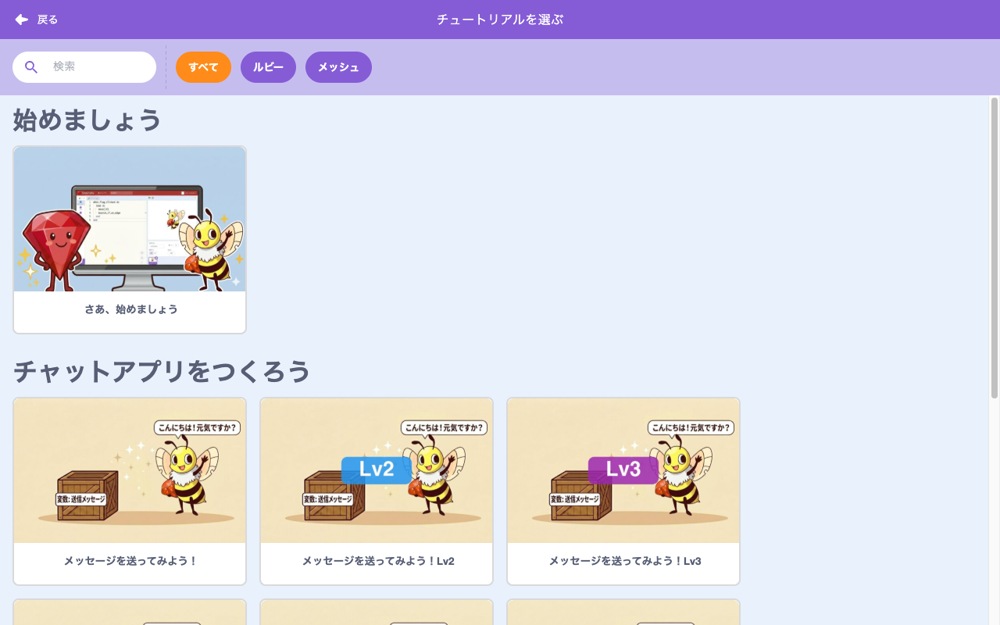

# チュートリアル

> **🔧 upstream 改良** — upstream にあるが Smalruby で機能を改良・拡張している
> **改良点**: ① **チュートリアル glow animation** をハイライト用に追加。② **Ruby タブの onboarding** を追加（初回 Ruby タブ訪問時のガイド）。③ **classroom-tutorial**（クラスルーム機能のチュートリアル）を追加。

## 概要

新しいユーザーや特定の機能を初めて使うユーザー向けの**チュートリアル**機能。upstream Scratch には基本的な「カード」形式のチュートリアル (`cards`) と「ヒント」(`tips-library`) があり、Smalruby はそれを継承しつつ Smalruby 独自のオンボーディング（Ruby タブ・クラスルーム）を追加している。

## ユーザーストーリー

- **初めて Smalruby を開いた小学生**として、簡単な作品例の作り方を順を追って教えてほしい
- **Ruby タブを初めて開いた子**として、ブロックとの違いやどう使うかを画面上で学びたい
- **Smalruby Classroom を初めて使う先生・生徒**として、操作方法をその場でガイドしてほしい
- **教師**として、生徒に既存のチュートリアル（カード）を順番に見せていきたい

## UI / 操作フロー

### カードチュートリアル (upstream 由来)

メニューバーの「チュートリアル」ボタンから `tips-library` を開き、チュートリアルを選ぶ：

1. 全画面のチュートリアルカードが表示される
2. 「次へ」「前へ」で進む
3. 完了で閉じる

Smalruby 独自のチュートリアル（「さあ、始めましょう」やメッセージ送信シリーズ）が並ぶ。タグで「ルビー」「メッシュ」フィルタが可能。

### Ruby タブオンボーディング (Smalruby 独自)

初めて Ruby タブを訪問したときに、tutorial-tooltip がメニューバー周辺に表示され、Ruby タブの使い方をガイド。`tutorial-onboarding` reducer の `MARK_RUBY_TAB_USED` で表示状態を管理。

### classroom-tutorial (Smalruby 独自)

Smalruby Classroom の各フェーズ（教師ログイン、クラス作成、生徒参加など）でツールチップ風の解説を表示。

## 主要ファイル

### scratch-gui

#### upstream 由来（Smalruby マーカー追加あり）

| ファイル | 役割 |
|---|---|
| `packages/scratch-gui/src/containers/cards.jsx` | チュートリアルカードのコンテナ（Smalruby: glow animation 追加）|
| `packages/scratch-gui/src/components/cards/` | カード UI |
| `packages/scratch-gui/src/containers/tips-library.jsx` | ヒント / チュートリアル一覧 |

#### Smalruby 独自

| ファイル | 役割 |
|---|---|
| `packages/scratch-gui/src/components/menu-bar/tutorial-tooltip.jsx` | ツールチップ UI |
| `packages/scratch-gui/src/reducers/tutorial-onboarding.js` | onboarding state（`MARK_TUTORIAL_SEEN`, `MARK_RUBY_TAB_USED`, `DISMISS_TOOLTIP`）|
| `packages/scratch-gui/src/components/classroom-tutorial/` | クラスルーム機能のチュートリアル UI |
| `packages/scratch-gui/src/reducers/classroom-tutorial.js` | クラスルームチュートリアル state |

#### Smalruby マーカー (upstream への埋め込み)

`src/containers/cards.jsx`, `src/components/cards/cards.jsx`:
- "tutorial glow animation" — チュートリアルのハイライト用アニメーション

### scratch-vm

なし。

### infra

なし。

## 関連ブロック

なし。

## 設定・データ永続化

### Redux state

- `tutorial-onboarding` — `tutorialSeen`, `rubyTabUsed`, `dismissedTooltips`
- `classroom-tutorial` — クラスルームチュートリアル状態
- `cards` — チュートリアルカードの開閉・現在ステップ

### LocalStorage

特定の onboarding 完了フラグは Redux state にあるが、永続化はプロジェクト state や `legacy-storage` 経由で扱われる場合がある。

## 関連ドキュメント

- [`docs/menu-bar/`](../menu-bar/) — `tutorial-tooltip` の表示位置
- [`docs/classroom/`](../classroom/) — `classroom-tutorial` の対象機能
- [`docs/ruby-editor/`](../ruby-editor/) — Ruby タブ onboarding の対象

## 関連 Issue / PR

主要 PR は履歴を参照（`feat:.*tutorial|feat:.*onboarding` で grep）。
