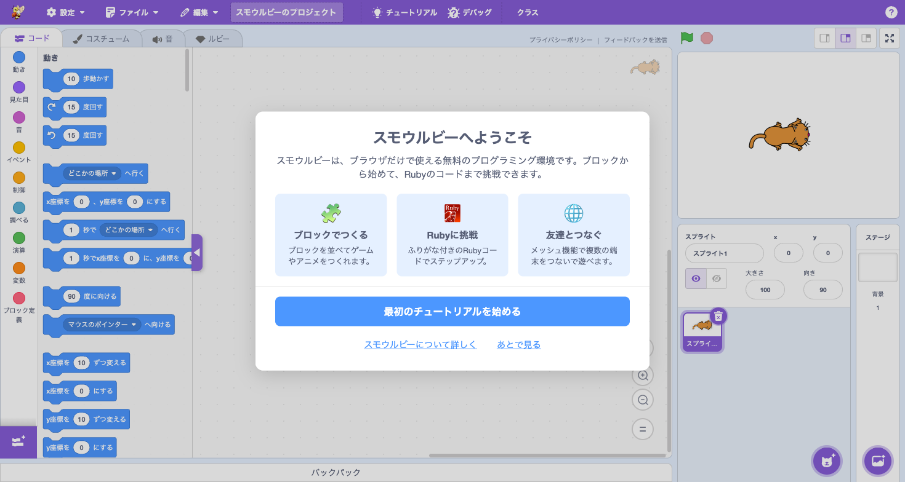
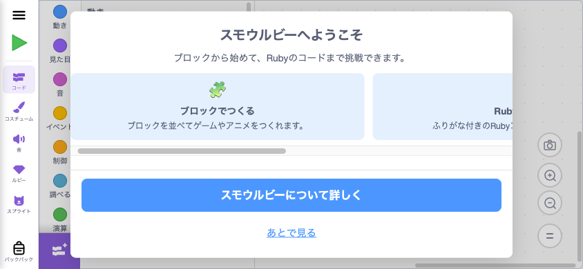
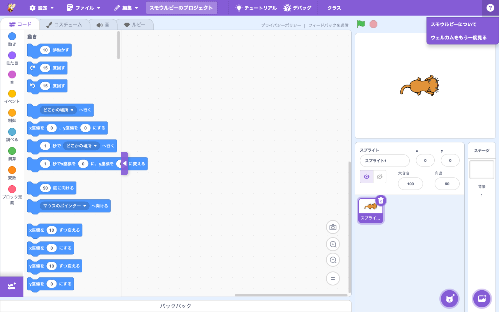
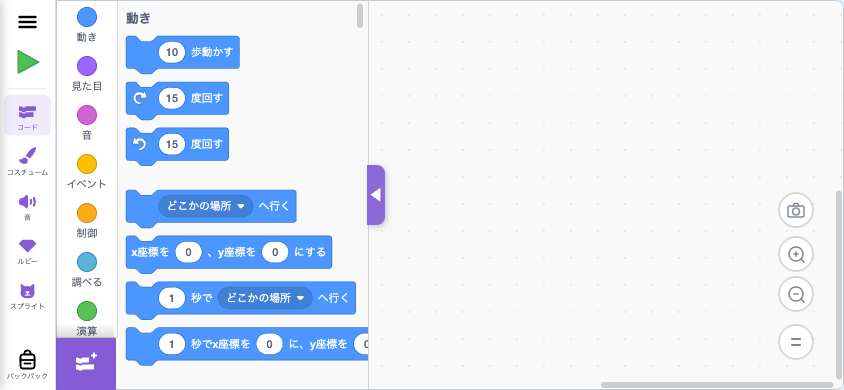

# ウェルカム / About 動線

> **🆕 Smalruby 独自** — upstream に存在しない、Smalruby のために新規追加された機能

## 概要

スモウルビーに初めて訪れたユーザーが「これは何ができるサイトか」を理解し、最初の一歩を踏み出せるようにするための導線をまとめた機能。3 つの構成要素からなる:

1. **ウェルカムモーダル** — エディタ内で「スモウルビーで何ができるか」を 3 枚のカードで紹介し、最初のチュートリアルや紹介ページへ誘導するダイアログ
2. **About ページ** (`/about.html`) — 検索流入や紙のチラシから到達する SP 完全対応の紹介ページ。SNS 共有ボタンと QR コードを備え、紹介を広めやすい
3. **About メニュー / ヘルプセクション** — エディタ内のメニューから上記 2 つに常時アクセスできる動線（PC: メニューバー About、SP: MobileDrawer のヘルプセクション）

## ユーザーストーリー

- **初めて訪れたユーザー**として、スモウルビーが何ができるサイトかを知り、最初に何をすればよいか分かりたい
- **学校の先生**として、生徒や保護者に「スモウルビーって何？」をスマホ・PC 両方で簡単に紹介できるリンク（紙チラシも含む）が欲しい
- **既存ユーザー**として、ウェルカム画面を後からもう一度見られるようにしたい

## UI / 操作フロー

### ウェルカムモーダル (PC)

3 枚のカード（ブロック / Ruby / メッシュ）で「できること」を紹介。Ruby のカードには公式 Ruby ロゴ SVG を使用。

CTA:
- **最初のチュートリアルを始める** (Primary) — 既存の tipsLibrary を開く
- **スモウルビーについて詳しく** — `/about.html` を新規タブで開く
- **あとで見る** — モーダルを閉じる

### ウェルカムモーダル (SP 横持ち)

SP では `useIsNarrowScreen` で narrow 判定し、レイアウトを切り替え:

- 3 カードを横スクロール（`scroll-snap-type: x mandatory`）にして縦領域を節約
- Primary CTA を `/about.html` に変更（tipsLibrary は SP 非対応のため）
- CTA を `position: sticky; bottom: 0` で常に画面内に表示

縦持ちスマホでは `MobileOrientationGate` が優先するため、ウェルカムモーダルは描画されない（横向きに回転すると自動的に表示される）。

### About メニュー (PC)

メニューバー右側の「ⓘ」アイコンから「スモウルビーについて」「ウェルカムをもう一度見る」にアクセスできる。

### MobileDrawer ヘルプセクション (SP)

SP ではメニューバーが表示されないため、`☰` から開く MobileDrawer のヘルプセクションに同じ 2 項目を配置。

## 起動条件

ウェルカムモーダルは **自動表示しない**（既存ユーザーに突然モーダルを出さないため）。代わりに、メニューバーの `?` ボタン横に **ウェルカムバルーン**（吹き出し）を表示し、クリックでモーダルを開く。

### バルーンの表示条件

- 初回訪問時にメニューバー上の `?`（チュートリアル）ボタンの右側に「スモウルビーへようこそ」バルーンを表示
- バルーンクリックでウェルカムモーダルが開く（同時にバルーンは永続的に非表示）
- バルーン右端の `×` でも閉じられる（モーダルは開かない）
- 初回表示から **5 日経過すると自動的に非表示**（クリックされなくても消える）

### モーダル本体の表示トリガー

- ウェルカムバルーンをクリック
- About メニュー → 「ウェルカムをもう一度見る」
- MobileDrawer → ヘルプ → 「ウェルカムをもう一度見る」
- URL パラメータ `?welcome=1` （実機検証 / Playwright 用）

`?classcode=<code>` 起動時はクラスルームフローが優先されるため、ウェルカムは表示されない。

## 主要ファイル

- **scratch-gui**:
  - `src/components/welcome-modal/welcome-modal.{jsx,css}` — モーダル本体
  - `src/components/welcome-modal/icon-ruby.svg` — Ruby カードの公式ロゴアイコン
  - `src/components/welcome-tooltip/welcome-tooltip.{jsx,css}` — `?` ボタン横のウェルカムバルーン（5 日後に自動非表示）
  - `src/components/menu-bar/menu-bar.jsx` — `WelcomeTooltip` の配置と `openWelcomeModal` の dispatch（マーカー）
  - `src/containers/welcome-modal-hoc.jsx` — Redux 接続。`isOpen` を読み、CTA で dispatch
  - `src/components/gui/gui.jsx` — About メニュー項目の構築（マーカー）と HOC のレンダリング
  - `src/containers/gui.jsx` — `onShowWelcomeModal` を `openWelcomeModal()` にマップ
  - `src/components/mobile-drawer/mobile-drawer.jsx` — ヘルプセクション（About リンク + ウェルカム再表示）
  - `src/reducers/modals.js` — `welcomeModal` open/close アクション
  - `src/lib/url-params.js` — `?welcome=1` の解釈
  - `src/locales/{ja,ja-Hira}.js` — 日本語 / ひらがなメッセージ
  - `pages/about.html` — 紹介ページ（QR コード + SNS 共有）
  - `pages/assets/smalruby-app-qr.svg` — `https://smalruby.app/` を符号化した QR コード SVG

## 設定・データ永続化

- **Redux state**: `state.scratchGui.modals.welcomeModal` (boolean) — モーダル表示状態
- **URL パラメータ**: `?welcome=1` または `?welcome=true` でモーダルを初回ロード時に自動表示
- **localStorage**:
  - `smalruby:welcomeTooltipFirstShownAt` — バルーンを最初に表示した時刻（ms）。バルーンは 5 日経過後に自動非表示
  - `smalruby:welcomeTooltipDismissed` — `'true'` でバルーンが永続的に非表示（クリック / `×` / 5 日経過のいずれかで設定）
  - 注: モーダル本体は seen フラグを持たない（初回モーダル自動表示は行わないため）

## 関連動作

| 操作 | 結果 |
|---|---|
| ウェルカムバルーン → クリック | `dispatch(openWelcomeModal())` + `localStorage.setItem('smalruby:welcomeTooltipDismissed', 'true')` |
| ウェルカムバルーン → `×` | バルーンを閉じる（モーダルは開かない） + dismissed フラグセット |
| ウェルカムバルーン初回表示 | `localStorage.setItem('smalruby:welcomeTooltipFirstShownAt', Date.now())` |
| 初回表示から 5 日経過 | バルーン自動非表示 + dismissed フラグセット |
| About メニュー → スモウルビーについて | `window.open('about.html', '_blank', 'noopener,noreferrer')` |
| About メニュー → ウェルカムをもう一度見る | `dispatch(openWelcomeModal())` |
| ウェルカムモーダル → 最初のチュートリアル (PC) | `dispatch(closeWelcomeModal())` → `dispatch(openTipsLibrary())` |
| ウェルカムモーダル → スモウルビーについて詳しく | `dispatch(closeWelcomeModal())` → `window.open('about.html', ...)` |
| ウェルカムモーダル → あとで見る | `dispatch(closeWelcomeModal())` |
| MobileDrawer → ヘルプ → 同上 2 項目 | 同様 |
| `?welcome=1` で起動 | マウント時に `dispatch(openWelcomeModal())` |
| 縦持ち SP（narrow + portrait） | `MobileOrientationGate` 優先で render しない |

## about.html の特徴

- 1525 行の単一 HTML（フォント・CSS インライン、Font Awesome を CDN 経由で読み込む）
- SEO メタ + Open Graph + Twitter Card 設定済み
- セクション構成: Hero → 機能紹介 → 統計 → CTA → **共有** → Footer
- 共有セクション: QR コード（PC: 左、SP: 上）と X / LINE / Facebook / メールの共有ボタン

## 関連ドキュメント

- `.claude/rules/scratch-gui/smalruby-markers.md` — `gui.jsx` / `containers/gui.jsx` のマーカー一覧
- `.claude/rules/scratch-gui/smalruby-prettier-files.md` — 対象ファイル一覧
- `docs/mobile-ui/` — MobileDrawer / MobileOrientationGate の設計
- Issue #658 — 機能設計の出発点
- Discussion #88 — 「どういうサイトかわからない」フィードバック（機能の発端）
